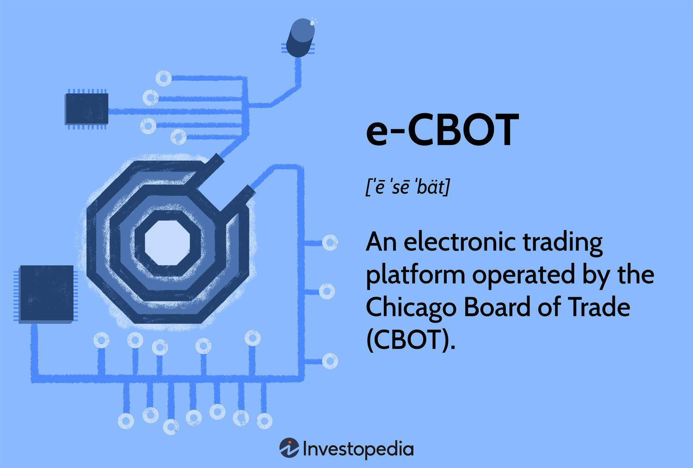

## Table of Contents

## What is E-CBOT?

E-CBOT is a company that makes software to help businesses talk to their customers better. They use something called artificial intelligence, which is like a computer that can think and learn a bit like a human. This software can answer questions, give information, and even help with buying things, all through a computer or phone.

Their main product is a chatbot, which is a program that can chat with people online. It can be used on websites, in apps, or even on social media. E-CBOT's chatbots can understand what people are saying and respond in a helpful way, making it easier for businesses to help their customers without needing a lot of people to do it.

## How does E-CBOT function as an electronic trading platform?

E-CBOT, or the Chicago Board of Trade's electronic trading platform, is a system that lets people buy and sell things like grains, oil, and other goods using computers. Instead of going to a physical place to trade, people can use the E-CBOT website or special software to make trades from anywhere. This makes trading faster and easier because you don't have to be in a specific location to do it.

The platform works by connecting buyers and sellers through the internet. When someone wants to buy or sell something, they put in an order on the E-CBOT system. The system then matches this order with someone else's order, and the trade happens automatically. This way, trading can happen 24/7, and it's all done electronically, which means fewer mistakes and quicker transactions.

## What are the main features of E-CBOT?

E-CBOT is an electronic trading platform that makes it easy for people to buy and sell things like grains, oil, and other goods. It works by connecting buyers and sellers through the internet. When someone wants to trade, they put in an order on the E-CBOT system. The system then matches this order with someone else's order, and the trade happens automatically. This means you can trade anytime, anywhere, without needing to be in a specific place.

One of the best things about E-CBOT is how fast and reliable it is. Because everything is done electronically, trades happen quickly and with fewer mistakes. The platform is also open 24/7, which means you can trade whenever you want. This makes it easier for people all over the world to use E-CBOT to buy and sell goods.

## Who can use E-CBOT and how do they get started?

E-CBOT is for anyone who wants to buy or sell things like grains, oil, and other goods. This includes farmers, traders, and big companies. If you're interested in trading these kinds of products, E-CBOT can help you do it easily and quickly.

To get started with E-CBOT, you need to sign up for an account on their website. Once you have an account, you can log in and start trading. You'll put in an order for what you want to buy or sell, and the system will match your order with someone else's. It's all done online, so you can trade from anywhere at any time.

## What types of commodities are traded on E-CBOT?

E-CBOT is a place where people trade different kinds of things, like grains and oil. The most common things traded on E-CBOT are corn, wheat, and soybeans. These are important because many people around the world use them for food and other products.

Besides grains, E-CBOT also lets people trade other stuff like ethanol, which is a type of fuel, and various kinds of oilseeds. These commodities are important for industries that make food, fuel, and other goods. Trading these things on E-CBOT helps people buy and sell them easily, no matter where they are.

## How does E-CBOT ensure the security and integrity of trades?

E-CBOT makes sure that trades are safe and fair by using strong computer security. They have special systems that keep people's information private and protect it from hackers. They also check every trade to make sure it's real and not a mistake or something bad. This helps everyone trust that their trades are safe and that no one can cheat.

Another way E-CBOT keeps trades honest is by keeping a close eye on everything that happens on the platform. They have rules that everyone has to follow, and if someone breaks these rules, they can get in trouble. This makes sure that all trades are done fairly and that everyone plays by the same rules. By doing all these things, E-CBOT helps make sure that trading is safe and trustworthy for everyone.

## What are the trading hours for E-CBOT?

E-CBOT is open for trading almost all the time. It starts at 7:00 PM Central Time on Sunday and keeps going until 2:00 PM Central Time on Friday. This means you can trade for most of the week, except for a short break on weekends.

During these hours, you can buy and sell things like corn, wheat, and soybeans whenever you want. The platform is always working, so you don't have to wait for a specific time to make a trade. This makes it easy for people all over the world to use E-CBOT.

## How does E-CBOT handle order types and executions?

E-CBOT lets you use different kinds of orders when you want to trade. You can use a market order, which means you want to buy or sell something right away at the best price available. Or, you can use a limit order, where you set a specific price you're willing to buy or sell at, and the trade only happens if someone else agrees to that price. There are also stop orders, which are like limit orders but they only start working when the price of the thing you're trading reaches a certain level.

When you put in an order on E-CBOT, the system looks for someone else's order that matches yours. If it finds a match, the trade happens right away. This is called order execution. E-CBOT makes sure that this happens quickly and fairly. The system checks all the orders to make sure they follow the rules and that the trades are honest. This way, everyone can trust that their orders will be handled correctly and that they'll get a fair deal.

## What are the fees associated with trading on E-CBOT?

Trading on E-CBOT comes with some fees that you need to know about. There's a fee for every trade you make, which is called a transaction fee. This fee can be different depending on what you're trading and how much you're trading. For example, trading corn might have a different fee than trading wheat. Also, if you're a big trader who does a lot of trades, you might get a discount on these fees.

Besides the transaction fee, there might be other costs too. You might have to pay a fee to join E-CBOT and get an account. There could also be fees for using the special software that helps you trade. It's a good idea to check all the fees before you start trading so you know exactly what you'll have to pay.

## How does E-CBOT integrate with other financial systems and platforms?

E-CBOT works well with other financial systems and platforms to make trading easier for everyone. It connects with different software that traders use, like trading apps and other electronic trading platforms. This means that traders can use E-CBOT along with their other tools without any problems. For example, if a trader uses a special app to keep track of their trades, they can connect it to E-CBOT to see all their trades in one place.

The platform also shares information with other financial systems to make sure everyone has the same data. This helps keep trading fair and transparent. E-CBOT can send and receive data about prices, trades, and other important information to and from other systems. This way, traders can trust that the information they see on E-CBOT is correct and up-to-date, no matter what other systems they are using.

## What advanced trading strategies can be implemented on E-CBOT?

E-CBOT lets traders use some smart ways to buy and sell things. One way is called spread trading. This is when you buy one thing and sell another at the same time, hoping to make money from the difference in their prices. For example, you might buy corn and sell wheat if you think corn will go up in price more than wheat. Another strategy is called [algorithmic trading](/wiki/algorithmic-trading), where you use a computer program to make trades based on rules you set. This can help you trade faster and more accurately than doing it by hand.

Another advanced strategy you can use on E-CBOT is hedging. This is when you make a trade to protect yourself from price changes. For example, if you're a farmer who grows soybeans, you might sell soybean futures on E-CBOT to make sure you get a good price, even if the market price goes down later. E-CBOT also supports options trading, which is a bit like betting on whether the price of something will go up or down. With options, you can make money if you guess right about the price movement, but you can also lose money if you're wrong.

## How does E-CBOT use technology to enhance trading efficiency and what future developments are expected?

E-CBOT uses technology to make trading faster and easier. It uses computers to match orders quickly, so trades happen almost right away. The platform also has special software that helps traders see all the information they need, like prices and how much is being traded. This makes it easier for traders to make good decisions. E-CBOT also uses strong security systems to keep everything safe and to make sure no one can cheat. This helps everyone trust that their trades are fair and honest.

In the future, E-CBOT is expected to keep getting better with new technology. They might use even smarter computer programs, called [artificial intelligence](/wiki/ai-artificial-intelligence), to help traders make better choices and find good deals. They could also add new ways to trade, like using mobile apps or virtual reality. This would make it even easier for people to trade from anywhere. E-CBOT will also keep working on making their system faster and more secure, so trading can be even smoother and safer for everyone.

## References & Further Reading

[1]: Pirrong, C. (1997). "Electronic Exchange Trading vs. Open Outcry: Efficiency and Price Discovery." The Journal of Futures Markets, 17(5), 543-572.

[2]: Hasbrouck, J., & Saar, G. (2013). "Low-Latency Trading." Journal of Financial Markets, 16(4), 646-679.

[3]: de Prado, M. L. (2018). ["Advances in Financial Machine Learning."](https://www.amazon.com/Advances-Financial-Machine-Learning-Marcos/dp/1119482089) John Wiley & Sons.

[4]: Mackintosh, P. (2005). "Automated Trading: How Algorithms Have Taken Over the Market." Financial Times.

[5]: Aldridge, I. (2013). ["High-Frequency Trading: A Practical Guide to Algorithmic Strategies and Trading Systems."](https://books.google.com/books/about/High_Frequency_Trading.html?id=6l0DDQAAQBAJ) John Wiley & Sons.

[6]: Harris, L. (2003). ["Trading and Exchanges: Market Microstructure for Practitioners."](https://www.amazon.com/Trading-Exchanges-Market-Microstructure-Practitioners/dp/0195144708) Oxford University Press.

[7]: Jones, C. M. (2013). "What Do We Know About High-Frequency Trading?" Columbia Business School Research Paper No. 13-11.