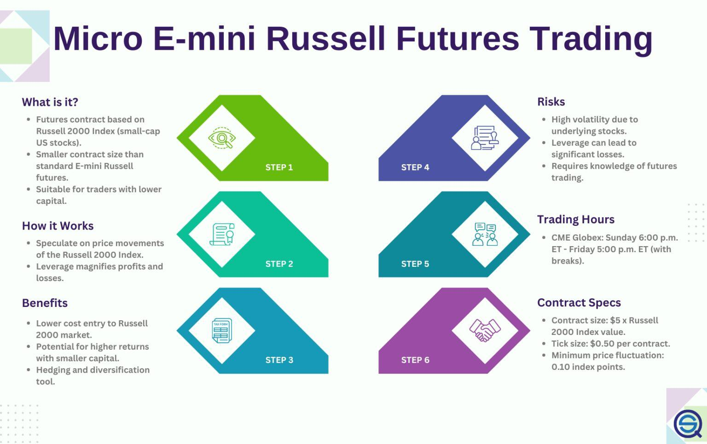

Forex trading, also known as foreign exchange trading, is the exchange of one currency for another in a decentralized market that is highly liquid and operates 24/5 worldwide. With a daily trading volume exceeding $6 trillion, it is the largest financial market in the world. Emerging financial instruments such as E-Micro Forex Futures have created new avenues for retail traders, allowing access to forex markets with reduced capital requirements and enhanced control over investments.

E-Micro Forex Futures are diminutive versions of the standard forex futures contracts, traded on platforms like CME Globex. Their reduced contract size, which is one-tenth of the conventional futures, has made them particularly attractive by lowering the financial threshold for participation. This democratization of forex trading means more individuals can engage without needing substantial capital, opening doors to a broader spectrum of market participants.



Algorithmic trading, or algo trading, plays an increasingly significant role in this domain. It utilizes computer algorithms to automate trading processes, offering the benefits of enhanced speed and precision. Algorithms can execute trades based on a predetermined set of rules derived from technical analysis or historical data, thus optimizing trading strategies by mitigating human error and emotional decision-making. This methodology is particularly useful in the volatile forex market, where rapid execution and data-driven strategies can make a substantial difference in profitability.

Understanding and effectively employing these financial instruments and technologies allows traders to better navigate the complexities of the forex market. With E-Micro Forex Futures and algo trading, traders can potentially enhance their positions in this dynamic environment, employing strategies that are both efficient and forward-thinking. By grasping the essentials of E-Micro Contracts and algorithmic trading, participants can leverage these tools to achieve a competitive edge in the constantly evolving forex landscape.

## Table of Contents

## Understanding E-Micro Forex Futures

E-Micro Forex Futures are a specialized type of currency futures contract traded predominantly on CME Globex, one of the world’s leading financial derivatives marketplaces. These contracts stand out due to their size, which is notably one-tenth that of traditional forex futures contracts. As a result, E-Micro Forex Futures are significantly more accessible to retail traders and newcomers entering the forex futures market. The reduced size enables participation with lower capital outlay, which is a considerable advantage for those seeking to speculate on currency movements without significant financial exposure.

The primary utility of E-Micro Forex Futures lies in their design, which allows traders to gain exposure to currency exchange rate fluctuations. This is achieved by enabling speculation with smaller financial commitments while mitigating risks typically associated with larger forex contracts. Traders can engage in targeted strategies designed around well-known currency pairs such as the Euro/U.S. Dollar (EUR/USD), U.S. Dollar/Japanese Yen (USD/JPY), and British Pound/U.S. Dollar (GBP/USD), among others. Each of these pairs represents substantial components of global currency trading volumes, thus providing opportunistic grounds for diverse trading strategies.

An additional advantage of E-Micro Forex Futures is the assurance of trading within a centrally regulated marketplace, such as that provided by the CME Group. This regulation offers a structured and transparent trading environment, contrasting with the often opaque over-the-counter (OTC) [forex](/wiki/forex-system) market. The regulatory framework aids in reducing counterparty risks and provides coherent rules for trading practices, thus delivering a greater sense of security to traders.

One aspect that distinguishes E-Micro Forex Futures from classic forex trading is risk management. With smaller contract sizes, traders can limit their financial exposure and avoid the pitfalls of high-leverage positions that are common in traditional forex markets. Despite the minimized risk, the potential for profit remains through strategic market positions and leveraging market trends. Hence, these futures provide a balanced approach to engaging with forex without the burden of broad financial risk.

Overall, E-Micro Forex Futures offer an accessible, secure, and versatile tool for engaging in forex trading, favoring both novice and seasoned traders seeking to optimize their involvement in currency markets within a controlled risk framework.

## Exploring Algo Trading in Forex Futures

Algorithmic trading, often abbreviated as algo trading, is a powerful tool in the domain of forex trading, characterized by the use of computer algorithms to execute trades with unmatched speed and precision. In the forex market, such algorithms can significantly enhance the execution of trading strategies by leveraging real-time data, market trends, and sophisticated mathematical models. These capabilities make algo trading an indispensable component for traders dealing in Forex Futures, especially with instruments like E-Micro Forex Futures.

In forex trading, algorithms analyze large volumes of data to identify market signals, including price trends and trading patterns. This data-driven approach allows for strategic decision-making, enabling traders to execute transactions at the most favorable prices, thereby minimizing slippage and maximizing profitability. Algorithms can be programmed to perform a wide array of functions such as detecting [arbitrage](/wiki/arbitrage) opportunities, executing [statistical arbitrage](/wiki/statistical-arbitrage) strategies, or even performing high-frequency trading ([HFT](/wiki/high-frequency-trading-strategies)) where the execution time of trades is crucial.

The efficiency of algo trading is further accentuated when trading E-Micro Forex Futures, where smaller contract sizes naturally require precision in execution to ensure profitability. By executing trades algorithmically, traders can quickly respond to market conditions, ensuring that orders are filled at optimal prices. Moreover, algo trading enhances [liquidity](/wiki/liquidity-risk-premium) in the market by facilitating a higher frequency of trades, thereby reducing bid-ask spreads and making price discovery more efficient.

Advanced data analytics play a pivotal role in optimizing [algorithmic trading](/wiki/algorithmic-trading) strategies. By analyzing historical price data and employing [machine learning](/wiki/machine-learning) models, traders can forecast market movements and identify recurring patterns that might not be apparent through manual analysis. Python's popularity for algorithmic trading stems from libraries like NumPy and pandas for data manipulation, scikit-learn for machine learning, and TA-Lib for technical analysis, which collectively enable the development of robust trading models.

```python
import numpy as np
import pandas as pd
from sklearn.ensemble import RandomForestClassifier

# Sample code for developing a basic algo trading strategy
# Load historical price data
data = pd.read_csv('forex_data.csv')

# Feature engineering: calculate moving average and volatility
data['MA_10'] = data['Close'].rolling(window=10).mean()
data['Volatility'] = data['Close'].pct_change().rolling(window=10).std()

# Define target: 1 if future return > 0, otherwise 0
data['Target'] = (data['Close'].shift(-1) > data['Close']).astype(int)

# Prepare features and target dataset
features = data[['MA_10', 'Volatility']].dropna()
target = data['Target'].dropna()

# Train a Random Forest model for predicting price movements
model = RandomForestClassifier()
model.fit(features, target)

# Predict the next price movement
prediction = model.predict(features.iloc[-1:])
print("Predicted move:", "Up" if prediction else "Down")
```

The integration of algo trading in forex futures allows not only for enhanced precision in trade execution but also for the extraction of deeper insights into market dynamics. These insights are instrumental for developing more refined trading strategies that adapt to evolving market conditions. Therefore, understanding and employing algo trading can significantly boost a trader's ability to perform in forex markets, presenting opportunities to capitalize on trends with systematic and quantitative approaches.

## Advantages and Risks of E-Micro Forex Futures

E-Micro Forex Futures present distinct advantages for both novice and seasoned traders in the forex market. Chief among these benefits is their smaller contract size, which significantly lowers the financial barrier to entry. Unlike standard forex futures, which may necessitate substantial capital commitment, E-Micro contracts are designed to be more accessible, allowing traders with limited funds to participate. This democratization of access is particularly appealing to retail investors who wish to gain exposure to forex trading without overextending their finances.

Another advantage lies in the fact that E-Micro Forex Futures are traded in centralized and regulated environments, such as those provided by the CME Group. This centralized trading ensures a higher degree of security and transparency compared to over-the-counter (OTC) forex markets. Traders can be more confident in the integrity of the market and the reliability of transaction processes, knowing that trades are subject to the oversight of regulatory bodies.

However, trading E-Micro Forex Futures is not without its risks. Like all financial instruments, these futures contracts are susceptible to the impacts of market [volatility](/wiki/volatility-trading-strategies), which can cause rapid and unpredictable changes in currency exchange rates. Economic shifts—such as fluctuations in interest rates, inflation, and changes in national economic policies—can all affect currency values. Furthermore, geopolitical influences, such as political instability or international conflicts, can introduce additional volatility into the forex markets.

Leverage is another [factor](/wiki/factor-investing) that poses both opportunities and risks for traders of E-Micro Forex Futures. While leverage allows traders to control a larger position with a smaller amount of capital, it also amplifies potential losses. In fast-moving markets, the potential for leverage-induced losses can be significant if trades do not move in the anticipated direction. Therefore, traders need to exercise caution and implement robust risk management techniques.

Effective risk management is crucial to mitigate the inherent risks associated with E-Micro Forex Futures. Traders should employ strategies such as setting stop-loss orders, diversifying their trading portfolios, and continuously monitoring market conditions. Understanding one's risk tolerance and aligning trading strategies accordingly can help in navigating the challenges presented by the forex trading landscape. Through strategic planning and disciplined execution, traders can enhance their overall trading strategy while capitalizing on the advantages offered by E-Micro Forex Futures.

## Conclusion

E-Micro Forex Futures offer a compelling opportunity for traders seeking to engage with the forex market while managing risk effectively. These smaller-sized contracts provide a more accessible entry point for a diverse range of traders, minimizing the capital required while still allowing for meaningful participation in currency speculation. The potential for substantial returns is amplified when traders leverage the capabilities of algorithmic trading. Through the understanding and application of algorithms, traders can execute strategies with precision and speed, harnessing real-time data and advanced analytics to make informed decisions.

Staying informed about market conditions is crucial for success with E-Micro Forex Futures. The forex market is highly dynamic, influenced by a multitude of factors that can shift rapidly. Traders must be vigilant, continually refining their strategies to remain aligned with current market trends. As technology advances, the tools and methodologies available for trading will evolve, providing new opportunities for those willing to adapt. This ongoing education is pivotal, enabling traders to capitalize on these developments while protecting their investments.

In summary, E-Micro Forex Futures, combined with algorithmic trading, present a robust chance for profitability, but they necessitate an informed, diligent approach. By comprehensively understanding the mechanics of these financial instruments and the role of technology, traders can position themselves to thrive amidst the complexities of the forex market. The journey requires both vigilance and strategic flexibility, ensuring that traders are not only reactive but also proactive in leveraging the full spectrum of possibilities offered by these modern trading tools.

## References & Further Reading

[1]: ["A Trader's Guide to Futures: Guide to E-Mini and Micro E-Mini Futures"](https://www.e-mini.com/trading-e-mini-and-micro-futures/) by CME Group

[2]: ["Algorithmic and High-Frequency Trading"](https://assets.cambridge.org/97811070/91146/frontmatter/9781107091146_frontmatter.pdf) by Álvaro Cartea, Sebastian Jaimungal, and José Penalva

[3]: ["FX Derivatives Trader School"](https://www.amazon.com/Derivatives-Trader-School-Wiley-Trading/dp/1118967453) by Giles Jewitt

[4]: ["Trading Systems and Methods"](https://www.amazon.com/Trading-Systems-Methods-Wiley/dp/1119605350) by Perry J. Kaufman

[5]: ["Inside the Black Box: A Simple Guide to Quantitative and High Frequency Trading"](https://www.amazon.com/Inside-Black-Box-Quantitative-Frequency/dp/1118362411) by Rishi K. Narang

[6]: ["The Microstructure of the 'Flash Crash': Flow Toxicity, Liquidity Crashes, and the Probability of Informed Trading"](https://datascienceassn.org/sites/default/files/The%20Microstructure%20of%20the%20%E2%80%98Flash%20Crash%E2%80%99%20-%20Flow%20Toxicity%2C%20Liquidity%20Crashes%20and%20the%20Probability%20of%20Informed%20Trading.pdf) by Andrei Kirilenko, Albert S. Kyle, Mehrdad Samadi, and Tugkan Tuzun