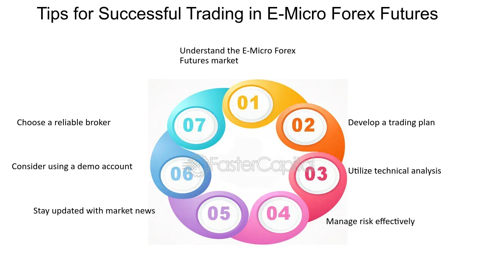

## Table of Contents

## What are E-Micro Forex Futures?

E-Micro Forex Futures are a type of financial contract that lets you trade currencies in smaller amounts than regular forex futures. They are traded on the Chicago Mercantile Exchange (CME) and are designed for people who want to trade currencies but don't want to risk a lot of money. Each E-Micro Forex Futures contract represents a smaller amount of currency, usually 1/10th the size of a standard contract. This makes them more affordable and easier to manage for smaller investors or those new to trading.

These contracts work just like regular forex futures but on a smaller scale. You can buy or sell them to speculate on the future value of currencies like the Euro, British Pound, or Japanese Yen against the US Dollar. They are settled in cash, which means you don't have to exchange actual currencies. E-Micro Forex Futures can be a good way to practice trading with less risk, or to diversify your investment portfolio without committing a large amount of money.

## How do E-Micro Forex Futures differ from standard forex futures?

E-Micro Forex Futures and standard forex futures are similar because they both let you trade currencies, but they have some key differences. The main difference is the size of the contract. An E-Micro Forex Futures contract is much smaller, usually about 1/10th the size of a standard contract. This means you can trade with less money, which is good for people who don't want to risk a lot or who are just starting out.

Because E-Micro Forex Futures are smaller, they are easier to manage and less risky than standard contracts. They are also traded on the same exchange, the Chicago Mercantile Exchange (CME), but they allow for more flexibility and lower costs. Both types of contracts are settled in cash, so you don't need to exchange actual currencies, but E-Micros make it easier for smaller investors to get into the market and practice trading without big financial commitments.

## What are the advantages of trading E-Micro Forex Futures for beginners?

Trading E-Micro Forex Futures is great for beginners because the contracts are smaller than standard ones. This means you don't need a lot of money to start trading. Instead of risking a big amount, you can start small and learn how trading works without worrying too much about losing a lot of money. This makes it easier for new traders to get into the market and practice their skills.

Another advantage is that E-Micro Forex Futures are easier to manage. Since they are smaller, you can control them better and understand how they work without getting overwhelmed. This helps beginners build confidence and learn at their own pace. Plus, because they are traded on the same exchange as standard contracts, you get to use the same tools and resources, which can help you learn and improve your trading strategies.

## Which currencies are available in E-Micro Forex Futures?

E-Micro Forex Futures let you trade different currencies against the US Dollar. Some of the currencies you can trade are the Euro, the British Pound, the Japanese Yen, the Australian Dollar, the Canadian Dollar, and the Swiss Franc. These are popular currencies that people often trade in the [forex](/wiki/forex-system) market.

Trading these currencies in E-Micro Forex Futures means you can bet on how their value might change compared to the US Dollar. For example, you might think the Euro will get stronger against the US Dollar, so you could buy an E-Micro Euro futures contract. This way, you can practice trading with smaller amounts of these currencies and learn how the market works.

## How can one start trading E-Micro Forex Futures?

To start trading E-Micro Forex Futures, you first need to open an account with a broker that offers futures trading. Look for a broker that is registered with the Chicago Mercantile Exchange (CME), where E-Micro Forex Futures are traded. Once you have chosen a broker, you will need to fill out an application, provide some personal information, and fund your account. Make sure you have enough money to cover the margin requirements for trading E-Micro Forex Futures, which are lower than standard futures but still important to consider.

After your account is set up and funded, you can start trading. You will use the broker's trading platform to buy or sell E-Micro Forex Futures contracts. These contracts let you trade currencies like the Euro, British Pound, or Japanese Yen against the US Dollar. You can place orders based on your predictions about how these currencies will move in value. Remember to keep learning and practicing, as trading can be risky, but with E-Micro Forex Futures, you can start with smaller amounts and gradually build your skills.

## What are the contract specifications for E-Micro Forex Futures?

E-Micro Forex Futures are smaller contracts that let you trade currencies like the Euro, British Pound, Japanese Yen, Australian Dollar, Canadian Dollar, and Swiss Franc against the US Dollar. Each contract is 1/10th the size of a standard forex futures contract. For example, an E-Micro Euro/USD futures contract represents 12,500 Euros, while a standard contract represents 125,000 Euros. The smaller size makes it easier for beginners or those with less money to start trading.

These contracts are traded on the Chicago Mercantile Exchange (CME) and are settled in cash, meaning you don't need to exchange actual currencies. The minimum price move, or tick size, for E-Micro Forex Futures is usually $0.0000005 per unit of the contract, which translates to $0.625 per contract for Euro/USD. Trading hours are generally from Sunday evening to Friday afternoon, following the forex market schedule. This setup allows you to practice trading with less risk and more flexibility.

## How do leverage and margin work with E-Micro Forex Futures?

Leverage and margin are important concepts when trading E-Micro Forex Futures. Leverage lets you control a bigger amount of money with less of your own. For example, if you have $1,000 and use leverage, you might be able to trade a contract worth $10,000. This can make your profits bigger if the market moves your way, but it can also make your losses bigger if the market goes against you. E-Micro Forex Futures have a smaller contract size, so the leverage you get is less than with standard contracts, but it's still there.

Margin is the money you need to put down to open a futures position. It's like a deposit to show you're serious about the trade. With E-Micro Forex Futures, the margin requirements are lower because the contracts are smaller. This means you don't need as much money to start trading. But remember, you can lose more than your margin if the trade goes badly, so always be careful and understand the risks.

## What are the key strategies for trading E-Micro Forex Futures effectively?

Trading E-Micro Forex Futures effectively involves using strategies that help you manage risk and make smart decisions. One good strategy is to use technical analysis. This means looking at charts and using tools like moving averages or support and resistance levels to figure out where the currency might go next. By studying past price movements, you can make better guesses about future trends. Another useful approach is to set clear entry and [exit](/wiki/exit-strategy) points for your trades. This helps you know when to buy and when to sell, so you don't get caught up in the excitement of the market and make rash decisions.

Another key strategy is to manage your risk carefully. Because E-Micro Forex Futures use leverage, you can lose more money than you put in, so it's important to use stop-loss orders. These are orders that automatically close your trade if the price moves against you too much, helping to limit your losses. Also, it's a good idea to only trade with money you can afford to lose. This way, you can learn and practice without worrying too much about the financial impact. By combining these strategies, you can trade E-Micro Forex Futures more effectively and increase your chances of success.

## How does the pricing and settlement of E-Micro Forex Futures work?

The pricing of E-Micro Forex Futures is based on the exchange rate of the currency pair you're trading, like the Euro against the US Dollar. Each contract has a set size, like 12,500 Euros for an E-Micro Euro/USD futures contract. The price moves in small steps called ticks. For example, the tick size for Euro/USD is $0.0000005 per unit, which means each tick is worth $0.625 for one contract. This makes the pricing clear and easy to understand, so you know exactly how much money you're dealing with when you trade.

Settlement for E-Micro Forex Futures happens in cash, not in the actual currencies. This means when your contract expires, you don't have to exchange Euros for Dollars or vice versa. Instead, the profit or loss is calculated based on the difference between the price when you opened the contract and the price at settlement. If the Euro goes up against the Dollar, and you bought a Euro/USD contract, you would make money. If it goes down, you would lose money. This cash settlement makes trading easier because you don't have to worry about handling physical currencies.

## What are the risks associated with trading E-Micro Forex Futures?

Trading E-Micro Forex Futures can be risky because of leverage. Leverage lets you control a big amount of money with just a little of your own. This can make your profits bigger if the market moves your way, but it can also make your losses bigger if the market goes against you. So, even though E-Micro contracts are smaller, you can still lose more money than you put in if things don't go as planned.

Another risk is market [volatility](/wiki/volatility-trading-strategies). The forex market can change quickly because of news, economic reports, or other events. These changes can affect the value of your E-Micro Forex Futures contracts. If the market moves a lot and you don't have a plan, you could lose money fast. That's why it's important to use tools like stop-loss orders to limit your losses and always be ready for the market to move in unexpected ways.

## How can traders manage risk when trading E-Micro Forex Futures?

Managing risk when trading E-Micro Forex Futures is really important because the market can be unpredictable. One way to do this is by using stop-loss orders. A stop-loss order is like a safety net that automatically closes your trade if the price moves against you too much. This helps you limit your losses and protect your money. Another way to manage risk is by only trading with money you can afford to lose. This means you won't get into financial trouble if a trade goes badly. It's also a good idea to keep learning about the market and practicing your trading skills, so you can make better decisions and handle the ups and downs of trading.

Another key part of managing risk is to diversify your trades. Instead of putting all your money into one currency pair, you can spread it out over different currencies. This way, if one trade doesn't go well, you might still make money on others. It's also important to keep an eye on how much leverage you're using. Leverage can make your profits bigger, but it can also make your losses bigger. So, use it carefully and make sure you understand how it works. By combining these strategies, you can trade E-Micro Forex Futures more safely and increase your chances of success.

## What advanced techniques can expert traders use to optimize their E-Micro Forex Futures trading?

Expert traders can use advanced techniques like [algorithmic trading](/wiki/algorithmic-trading) to optimize their E-Micro Forex Futures trading. This means using computer programs to make trades based on specific rules and data analysis. These programs can analyze lots of information really fast and make trades without the trader having to do it manually. This can help catch small price movements that might be hard for a person to see. Another technique is to use multiple time frame analysis, where traders look at charts with different time scales, like hourly and daily, to get a better understanding of where the market might be headed. This can help them make more informed decisions and spot trends that might not be obvious on just one chart.

Another advanced technique is to use options strategies with E-Micro Forex Futures. Options give traders the right, but not the obligation, to buy or sell a futures contract at a set price. By combining options with futures, traders can create strategies that limit their risk while still allowing them to make money if the market moves in their favor. For example, they might use a straddle, where they buy both a call and a put option at the same strike price, hoping to profit from big market moves in either direction. These advanced techniques can help expert traders fine-tune their approach and potentially increase their profits, but they also require a good understanding of the market and careful risk management.

## References & Further Reading

[1]: ["A Trader's Guide to Futures: Guide to E-Mini and Micro E-Mini Futures"](https://www.e-mini.com/trading-e-mini-and-micro-futures/) by CME Group

[2]: ["Algorithmic and High-Frequency Trading"](https://assets.cambridge.org/97811070/91146/frontmatter/9781107091146_frontmatter.pdf) by Álvaro Cartea, Sebastian Jaimungal, and José Penalva

[3]: ["FX Derivatives Trader School"](https://www.amazon.com/Derivatives-Trader-School-Wiley-Trading/dp/1118967453) by Giles Jewitt

[4]: ["Trading Systems and Methods"](https://www.amazon.com/Trading-Systems-Methods-Wiley/dp/1119605350) by Perry J. Kaufman

[5]: ["Inside the Black Box: A Simple Guide to Quantitative and High Frequency Trading"](https://www.amazon.com/Inside-Black-Box-Quantitative-Frequency/dp/1118362411) by Rishi K. Narang

[6]: ["The Microstructure of the 'Flash Crash': Flow Toxicity, Liquidity Crashes, and the Probability of Informed Trading"](https://datascienceassn.org/sites/default/files/The%20Microstructure%20of%20the%20%E2%80%98Flash%20Crash%E2%80%99%20-%20Flow%20Toxicity%2C%20Liquidity%20Crashes%20and%20the%20Probability%20of%20Informed%20Trading.pdf) by Andrei Kirilenko, Albert S. Kyle, Mehrdad Samadi, and Tugkan Tuzun