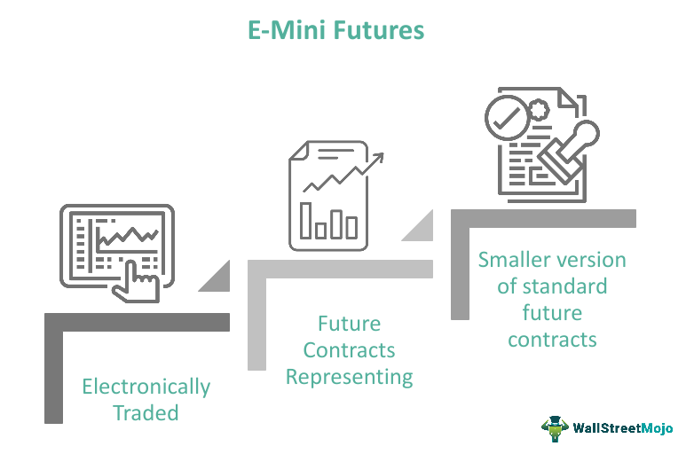

## Table of Contents

## What is an E-Mini contract in futures trading?

An E-Mini contract is a type of futures contract that is smaller in size compared to standard futures contracts. It was introduced by the Chicago Mercantile Exchange (CME) to make futures trading more accessible to individual investors and smaller institutions. E-Mini contracts are available for various financial instruments, including stock indices like the S&P 500, commodities, and currencies. The smaller size of these contracts means that traders can participate in futures markets with less capital, making it easier for them to manage risk and gain exposure to different markets.

These contracts are traded electronically, which adds to their appeal because it allows for quick and efficient trading. The E-Mini S&P 500, for example, is one of the most popular E-Mini contracts. It represents a fraction of the value of the full S&P 500 futures contract, making it more affordable for smaller investors. Trading E-Mini contracts can be a good way for traders to hedge their portfolios or speculate on the future direction of the market. Overall, E-Mini contracts have become an important tool for many traders due to their accessibility and flexibility.

## How does the E-Mini differ from standard futures contracts?

The main difference between E-Mini contracts and standard futures contracts is their size. E-Mini contracts are smaller, which means they cost less to trade. This makes them more affordable for people who don't have a lot of money to invest. For example, the E-Mini S&P 500 contract is worth about one-fifth of the standard S&P 500 futures contract. Because they are smaller, E-Mini contracts let more people get involved in futures trading.

Another big difference is how they are traded. E-Mini contracts are traded on computers, which makes trading faster and easier. Standard futures contracts can be traded in person at a trading floor or electronically, but E-Mini contracts are only traded electronically. This electronic trading makes it easier for more people to trade E-Mini contracts from anywhere, not just at a trading floor. Overall, E-Mini contracts are a good choice for people who want to trade futures but need something smaller and easier to manage.

## What are the advantages of trading E-Mini futures for beginners?

Trading E-Mini futures can be a good choice for beginners because they are smaller and cheaper than regular futures contracts. This means you don't need a lot of money to start trading. With E-Mini contracts, you can practice trading without risking a big amount of money. This can help you learn how futures markets work without feeling too much pressure.

Another advantage is that E-Mini futures are traded on computers, so you can trade them from home. This makes it easy for beginners to start trading without having to go to a trading floor. Also, because E-Mini contracts are smaller, it's easier to manage your risk. If you make a mistake, it won't cost you as much as it would with a bigger contract. This can give you more confidence as you learn how to trade.

## Which E-Mini contracts are available for trading?

E-Mini contracts are available for trading on different types of financial instruments. You can trade E-Mini contracts on stock indices like the S&P 500, the Dow Jones Industrial Average, and the Nasdaq-100. These are called E-Mini S&P 500, E-Mini Dow, and E-Mini Nasdaq-100, respectively. They let you bet on how these big stock indexes will do in the future.

There are also E-Mini contracts for commodities, like gold and [crude oil](/wiki/crude-oil). These are called E-Mini Gold and E-Mini Crude Oil. They let you trade on the future prices of these commodities without having to buy the actual physical items. Lastly, E-Mini contracts are available for currencies, like the Euro and the Japanese Yen. These are called E-Mini Euro and E-Mini Yen. They help you trade on how these currencies will change in value compared to the U.S. dollar.

## How can someone start trading E-Mini futures?

To start trading E-Mini futures, you first need to open an account with a futures broker. Look for a broker that offers trading in E-Mini contracts and has a good reputation. Once you choose a broker, you'll need to fill out an application and provide some personal information. After your account is approved, you'll need to deposit money into it. This money is called margin, and it's what you use to trade E-Mini futures.

After setting up your account and adding money, you can start trading. You'll need to use a trading platform provided by your broker. This platform lets you see the prices of E-Mini contracts and place your trades. It's a good idea to start with a practice account, if your broker offers one, to get used to how trading works without risking real money. Once you feel ready, you can start trading with real money. Always remember to manage your risk carefully, as trading futures can be risky.

## What are the margin requirements for E-Mini futures?

Margin requirements for E-Mini futures can change depending on which contract you're trading and the rules of the exchange and your broker. For example, the margin requirement for an E-Mini S&P 500 contract might be around $5,000 to $10,000. This means you need to have at least that much money in your account to start trading one contract. Your broker might ask for more money as a safety measure, so it's a good idea to check with them to know the exact amount you need.

Margin is like a down payment that lets you control a bigger contract with less money. But remember, if the price of the E-Mini contract moves against you, you might get a margin call. This means you'll need to add more money to your account to keep your position open. It's important to understand these rules and have enough money in your account to cover possible losses, so you can trade E-Mini futures safely.

## How do E-Mini futures impact portfolio diversification?

E-Mini futures can help you spread out your investments, which is called diversification. When you invest in different things, it can help lower your risk. E-Mini futures let you trade on big stock indexes, commodities like gold and oil, and even currencies. By adding E-Mini futures to your portfolio, you can invest in areas you might not have been able to before. This can help balance out your investments because if one part of your portfolio goes down, another part might go up.

For example, if you already have a lot of money in stocks, adding E-Mini futures on commodities or currencies can give you exposure to different markets. This can help protect your portfolio if the stock market has a bad day. E-Mini futures are smaller and cheaper than regular futures, so it's easier to use them to diversify without spending a lot of money. By using E-Mini futures wisely, you can make your investments more balanced and possibly safer.

## What are the key strategies for trading E-Mini futures effectively?

One key strategy for trading E-Mini futures effectively is to use technical analysis. This means looking at charts and using tools like moving averages, support and resistance levels, and other indicators to predict where the price might go next. By studying these patterns, you can make better guesses about when to buy or sell. It's also important to set clear entry and [exit](/wiki/exit-strategy) points for your trades. This helps you know when to get into a trade and when to get out, which can help you make money and avoid big losses.

Another strategy is to manage your risk carefully. This means not putting all your money into one trade and always using stop-loss orders. A stop-loss order is like a safety net that automatically sells your contract if the price goes against you by a certain amount. This can help limit your losses. It's also a good idea to only trade with money you can afford to lose, and to keep learning about the markets and how they work. By staying informed and practicing good risk management, you can trade E-Mini futures more effectively.

## How does liquidity affect E-Mini futures trading?

Liquidity is really important when you're trading E-Mini futures. It means how easy it is to buy or sell a contract without changing its price too much. If a market is very liquid, there are lots of buyers and sellers, so you can trade quickly and at a good price. E-Mini futures, like the E-Mini S&P 500, are usually very liquid. This makes it easier for traders to get in and out of trades without worrying too much about the price moving against them.

Having high [liquidity](/wiki/liquidity-risk-premium) also means smaller price gaps between buying and selling prices, which is called the bid-ask spread. A smaller spread can save you money because you don't lose as much when you buy and then sell. For beginners, trading in a liquid market like E-Mini futures can be less risky because it's easier to manage your trades and react to market changes quickly.

## What are the risks associated with E-Mini futures trading?

Trading E-Mini futures can be risky because the market can move a lot in a short time. If the price goes against you, you could lose more money than you put in. This is called leverage, which means you can control a big contract with a small amount of money. But if the market moves the wrong way, you might get a margin call, where you have to add more money to your account to keep your trade open. If you can't add more money, your broker might close your position, and you could lose a lot.

Another risk is that E-Mini futures are complex and hard to understand if you're new to trading. You need to learn about things like technical analysis, risk management, and how to use trading platforms. If you don't know what you're doing, you might make bad trades and lose money. It's also important to keep an eye on the news and events that can affect the markets, like economic reports or big world events. These can cause big price swings, and if you're not ready, you could end up losing money.

## How do economic reports and events influence E-Mini futures prices?

Economic reports and events can have a big impact on E-Mini futures prices because they give traders new information about the economy. When a report comes out, like the monthly jobs report or the GDP numbers, it can change what people think about the future of the economy. If the report is better than expected, people might think the economy is doing well, and they might buy more E-Mini futures, which can push the prices up. On the other hand, if the report is worse than expected, people might sell their E-Mini futures, and the prices can go down.

Big world events, like elections or international conflicts, can also shake up the markets. These events can make the future seem more uncertain, and traders might react by buying or selling E-Mini futures to protect their money or to bet on what might happen next. For example, if there's a war or a big political change, it can cause a lot of uncertainty, and the prices of E-Mini futures might swing a lot as traders try to figure out what's going to happen. Keeping an eye on these reports and events can help you understand why E-Mini futures prices are moving and make better trading decisions.

## What advanced techniques can expert traders use to maximize profits in E-Mini futures trading?

Expert traders can use a technique called [scalping](/wiki/gamma-scalping) to make quick, small profits from E-Mini futures. Scalping means making lots of trades in a short time, trying to take advantage of small price changes. Traders who scalp need to be really fast and good at reading the market. They use tools like real-time charts and indicators to spot tiny price movements and make their trades. This can be risky because the market can move against you quickly, but if you're good at it, you can make a lot of money from these small wins.

Another advanced technique is using [algorithmic trading](/wiki/algorithmic-trading), which means using computer programs to trade E-Mini futures automatically. These programs can look at lots of data really fast and make trades based on certain rules that the trader sets up. This can help traders make decisions without letting emotions get in the way. Algorithmic trading can be really powerful, but it needs a lot of technical know-how to set up and keep running. By using these advanced techniques, expert traders can try to make more money from E-Mini futures trading.

## References & Further Reading

[1]: ["Advances in Financial Machine Learning"](https://www.amazon.com/Advances-Financial-Machine-Learning-Marcos/dp/1119482089) by Marcos Lopez de Prado

[2]: Bergstra, J., Bardenet, R., Bengio, Y., & Kégl, B. (2011). ["Algorithms for Hyper-Parameter Optimization."](https://dl.acm.org/doi/10.5555/2986459.2986743) Advances in Neural Information Processing Systems 24.

[3]: ["Quantitative Trading: How to Build Your Own Algorithmic Trading Business"](https://www.amazon.com/Quantitative-Trading-Build-Algorithmic-Business/dp/1119800064) by Ernest P. Chan

[4]: ["Machine Learning for Algorithmic Trading"](https://github.com/stefan-jansen/machine-learning-for-trading) by Stefan Jansen

[5]: ["Trading and Exchanges: Market Microstructure for Practitioners"](https://www.amazon.com/Trading-Exchanges-Market-Microstructure-Practitioners/dp/0195144708) by Larry Harris