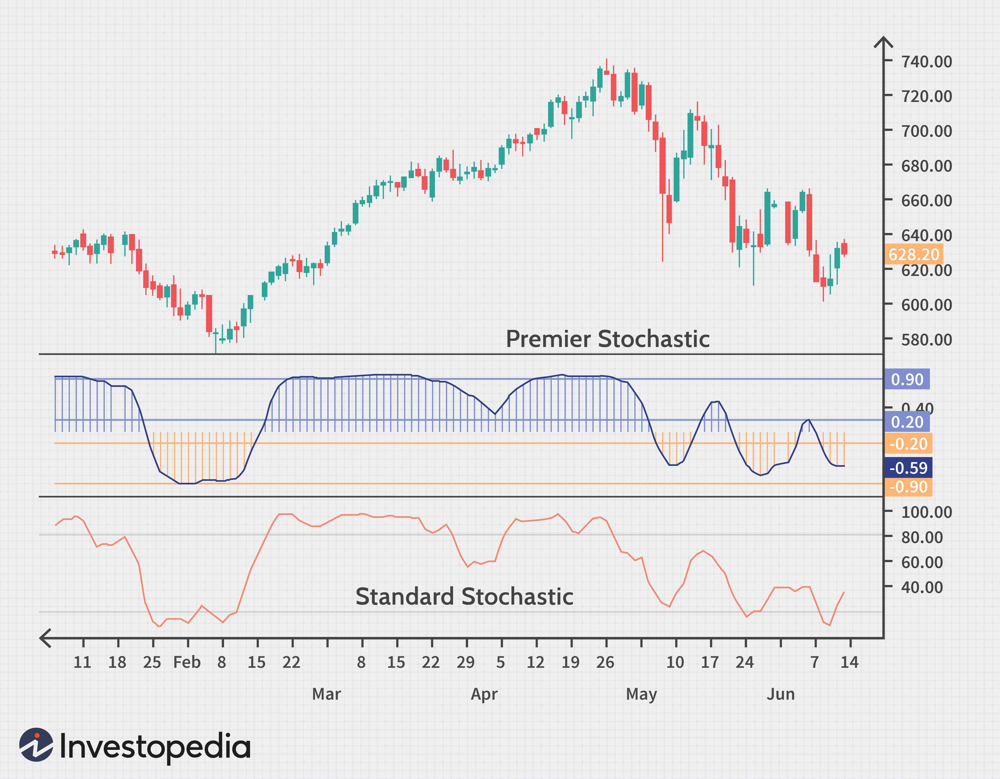

## Table of Contents

## What is the E-mini Russell 2000?

The E-mini Russell 2000 is a type of futures contract that tracks the Russell 2000 index. The Russell 2000 index is made up of 2000 small companies in the United States. When you trade the E-mini Russell 2000, you are betting on how these small companies will do in the future. It's called "E-mini" because it is an electronic and smaller version of the regular Russell 2000 futures contract.

People use the E-mini Russell 2000 to try to make money by guessing if the small companies in the index will go up or down in value. It's popular because it's easier to trade than the bigger contract and it's available to trade online. Traders can use it to protect their investments or to take a chance on making more money. It's an important tool for people who want to invest in small companies without buying the actual stocks.

## How does the E-mini Russell 2000 differ from the standard Russell 2000 index?

The E-mini Russell 2000 and the standard Russell 2000 index both focus on the same group of small companies in the U.S., but they are used in different ways. The standard Russell 2000 index is just a list that shows how well these small companies are doing overall. It's like a scoreboard that investors look at to see if small companies are going up or down in value. You can't trade the index itself, but you can buy or sell the stocks of the companies that are in the index.

The E-mini Russell 2000, on the other hand, is a futures contract that lets people bet on where they think the Russell 2000 index will go in the future. It's a way for people to trade without buying the actual stocks. The E-mini version is smaller and traded electronically, making it easier for more people to use. So, while the standard index is just a measure, the E-mini is a tool for trading and potentially making money based on that measure.

## What are the basic requirements to start trading the E-mini Russell 2000?

To start trading the E-mini Russell 2000, you need to open a futures trading account with a brokerage firm that offers futures trading. This type of account is different from a regular stock trading account, so make sure to choose a broker that supports futures. You'll need to fill out an application and provide some personal information. The broker will also check your financial situation to make sure you can handle the risks of trading futures.

Once your account is set up, you'll need to deposit money into it. This is called the initial margin, and it's the amount you need to start trading. The exact amount can change, but it's usually a few thousand dollars. After you have the money in your account, you can start placing trades on the E-mini Russell 2000 through the broker's trading platform. It's a good idea to learn about how futures work and maybe practice with a demo account before you start trading with real money.

## What are the common trading hours for the E-mini Russell 2000?

The E-mini Russell 2000 trades almost all the time during the week. The main trading hours are from 9:30 AM to 4:15 PM Eastern Time, which is the same as the regular stock market hours. This is when most of the trading happens because it's when the companies in the Russell 2000 index are open for business.

But you can also trade the E-mini Russell 2000 before and after these main hours. There's a pre-market session from 6:00 PM to 9:30 PM Eastern Time the night before, and then again from 6:00 PM to 9:30 PM Eastern Time after the main session ends. So, if you want to trade, you have a lot of time to do it, but the busiest and most important time is during the regular market hours.

## What are some basic trading strategies for beginners trading the E-mini Russell 2000?

One basic strategy for beginners trading the E-mini Russell 2000 is [trend following](/wiki/trend-following). This means you try to find out if the index is going up or down over time and then trade in that direction. You can use simple tools like moving averages to help you see the trend. If the index is going up, you might buy the E-mini Russell 2000, hoping it will keep going up so you can sell it later for more money. If it's going down, you might sell it, hoping to buy it back later at a lower price. It's important to set stop-loss orders to limit how much money you could lose if the trend changes suddenly.

Another strategy is called [breakout](/wiki/breakout-trading) trading. This involves watching the E-mini Russell 2000 to see if it moves past a certain high or low price that it hasn't gone beyond recently. If it breaks out above a high price, you might buy it, thinking it will keep going up. If it breaks out below a low price, you might sell it, thinking it will keep going down. You need to be quick with this strategy because breakouts can happen fast. Again, using stop-loss orders can help protect your money if the breakout doesn't go the way you expect.

A third simple strategy is [scalping](/wiki/gamma-scalping), where you try to make small profits from small price changes. You might buy and sell the E-mini Russell 2000 many times in a day, trying to catch little moves in the price. This can be exciting but also risky because you need to be very focused and quick. It's good to start with a small amount of money and learn as you go. Remember, no matter which strategy you use, always be careful and only trade with money you can afford to lose.

## How can technical analysis be applied to develop an E-mini Russell 2000 trading strategy?

Technical analysis can help you develop a trading strategy for the E-mini Russell 2000 by looking at charts and using tools to understand how the index might move in the future. You can use moving averages, which are lines on a chart that show the average price over a certain time, to see if the index is in an uptrend or a downtrend. If the E-mini Russell 2000 price is above the moving average, it might be a good time to buy because the trend is up. If it's below, you might want to sell because the trend is down. You can also look at support and resistance levels, which are prices where the index often stops going down or up. If the price bounces off a support level, you might buy, expecting it to go up again. If it hits a resistance level and turns back down, you might sell, expecting it to drop.

Another way to use technical analysis is by looking at chart patterns, like triangles or head and shoulders, which can give you clues about where the price might go next. For example, if you see a breakout from a triangle pattern, you might trade in the direction of the breakout. You can also use indicators like the Relative Strength Index (RSI) to see if the index is overbought or oversold. If the RSI is high, it might be a sign to sell because the price might soon drop. If it's low, it might be a sign to buy because the price might soon rise. Combining these tools and patterns can help you make better trading decisions, but always remember to use stop-loss orders to manage your risk because even the best technical analysis can't predict the market perfectly.

## What are the key indicators to watch when trading the E-mini Russell 2000?

When trading the E-mini Russell 2000, one of the key indicators to watch is the moving average. This is a line on the chart that shows the average price of the index over a certain period, like 50 days or 200 days. If the price of the E-mini Russell 2000 is above the moving average, it might be a good time to buy because it suggests the trend is going up. If the price is below the moving average, it might be a good time to sell because it suggests the trend is going down. Watching where the price is compared to the moving average can help you decide when to enter or [exit](/wiki/exit-strategy) a trade.

Another important indicator is the Relative Strength Index (RSI). The RSI measures how fast and how much the price of the E-mini Russell 2000 is changing. It gives you a number between 0 and 100. If the RSI is above 70, it means the index might be overbought, which could be a sign to sell because the price might soon drop. If the RSI is below 30, it means the index might be oversold, which could be a sign to buy because the price might soon rise. Keeping an eye on the RSI can help you spot good times to trade.

You should also pay attention to support and resistance levels. These are prices where the E-mini Russell 2000 often stops going down or up. If the price hits a support level and bounces back up, it might be a good time to buy. If it hits a resistance level and turns back down, it might be a good time to sell. Watching these levels can help you understand where the price might go next and make better trading decisions.

## How does market volatility affect E-mini Russell 2000 trading strategies?

Market [volatility](/wiki/volatility-trading-strategies) can have a big impact on how you trade the E-mini Russell 2000. When the market is very volatile, the price of the E-mini Russell 2000 can move up and down a lot in a short time. This can be good for some traders because they can make more money if they guess the right direction. But it can also be risky because if the price moves against them, they can lose money quickly. So, traders might need to change their strategies to handle the bigger price swings. For example, they might use tighter stop-loss orders to protect their money or trade smaller amounts to reduce risk.

In times of high volatility, some traders might switch to strategies that work better in these conditions. For example, they might use scalping, where they try to make small profits from small price changes. This can be more effective when the market is moving a lot. On the other hand, during less volatile times, traders might use trend-following strategies, where they try to catch longer, smoother moves in the price. Understanding how volatility affects the market can help traders pick the right strategy and adjust their trading to make the most of the situation.

## What are advanced techniques for managing risk when trading the E-mini Russell 2000?

When trading the E-mini Russell 2000, one advanced technique for managing risk is to use options strategies. Options can help you protect your trades by setting up a hedge. For example, if you're betting that the E-mini Russell 2000 will go up, you can buy a put option to limit your losses if the price goes down instead. This way, you can still make money if the price goes up, but you won't lose as much if it goes down. Another option strategy is using straddles or strangles, where you buy both a call and a put option. This can help you make money no matter which way the price moves, as long as it moves a lot. These strategies can be complex, so it's important to understand them well before using them.

Another advanced technique is to use position sizing and diversification. Instead of putting all your money into one trade, you can spread it out over several trades. This way, if one trade goes bad, you won't lose all your money. You can also adjust the size of your trades based on how much risk you're willing to take. For example, if the market is very volatile, you might trade smaller amounts to reduce your risk. Using stop-loss orders is also important, but you can make them more advanced by using trailing stops. A trailing stop moves with the price, so if the price goes up, your stop-loss moves up too, locking in more profit while still protecting you from big losses. These techniques can help you manage risk better and trade the E-mini Russell 2000 more safely.

## How can algorithmic trading be used to optimize an E-mini Russell 2000 trading strategy?

Algorithmic trading can help you trade the E-mini Russell 2000 better by using computers to make trades faster and more accurately. You can set up a computer program to follow a trading strategy that you've made. The program can watch the market all the time, even when you're not there, and make trades based on the rules you've set. For example, if you want to buy when the price goes above a certain moving average and sell when it goes below, the computer can do that for you automatically. This can help you catch more trading opportunities and make decisions without letting your emotions get in the way.

Another way [algorithmic trading](/wiki/algorithmic-trading) can help is by testing your strategy with past data, which is called [backtesting](/wiki/backtesting). You can see how your strategy would have worked in the past and make changes to make it better. This can help you find the best settings for your strategy, like the best times to trade or the best levels for your stop-loss orders. Once you've tested and improved your strategy, the computer can run it in real time, making trades based on what's happening in the market right now. This can help you make more money and manage your risk better when trading the E-mini Russell 2000.

## What are the common pitfalls and how to avoid them when trading the E-mini Russell 2000?

One common pitfall when trading the E-mini Russell 2000 is letting emotions like fear or greed control your decisions. When the market moves a lot, it's easy to get scared and sell too soon or get greedy and hold on too long. To avoid this, you can use a trading plan with clear rules for when to buy and sell. Stick to your plan and don't let your feelings make you change your mind. Another pitfall is not using stop-loss orders. Without them, you could lose a lot of money if the price moves against you. Always set stop-loss orders to limit your losses and protect your money.

Another common mistake is not understanding the risks of trading futures. The E-mini Russell 2000 can be very volatile, and you can lose more money than you put in. To avoid this, make sure you learn about futures trading before you start and only trade with money you can afford to lose. Also, some traders don't manage their money well. They might put too much money into one trade or not spread their risk out enough. To avoid this, use good money management practices like trading smaller amounts and diversifying your trades. This can help you stay in the game longer and have a better chance of making money over time.

## How do macroeconomic factors influence the E-mini Russell 2000 and what strategies can be employed to take advantage of these?

Macroeconomic factors like interest rates, inflation, and employment rates can have a big impact on the E-mini Russell 2000. Since the Russell 2000 index is made up of small companies, it's often more sensitive to changes in the economy. For example, if interest rates go up, it can be harder for small companies to borrow money, which might make their stocks go down. On the other hand, if the economy is doing well and more people are getting jobs, small companies might do better because people have more money to spend. Keeping an eye on these big economic changes can help you understand what might happen to the E-mini Russell 2000.

To take advantage of these macroeconomic factors, you can use a strategy called sector rotation. This means you watch which parts of the economy are doing well and trade the E-mini Russell 2000 based on that. For example, if you think the economy is going to grow, you might buy the E-mini Russell 2000 because small companies often do well when the economy is strong. Another strategy is to use economic indicators like the monthly jobs report or the consumer price index to guide your trades. If these reports show the economy is getting better, you might buy the E-mini Russell 2000, hoping it will go up. If they show the economy is getting worse, you might sell it, hoping to avoid losses. By paying attention to these big economic trends, you can make better trading decisions and try to make money from them.

## What is the Understanding of E-mini Russell 2000 Index Futures?

The E-mini Russell 2000 Index futures (RTY) are a type of financial derivative that enables traders to speculate on the movements of the Russell 2000 Index, a key benchmark for tracking small-cap U.S. stocks. These futures contracts are specifically designed to be more accessible to a broader range of traders, particularly those with smaller trading accounts, thanks to their reduced contract size compared to standard futures contracts.

RTY futures contracts are traded on the CME Globex platform, a leading electronic trading platform renowned for its high [liquidity](/wiki/liquidity-risk-premium) and efficiency. This facilitates smoother transactions and helps ensure tighter bid-ask spreads, giving traders a more efficient market experience. Liquidity is crucial for traders because it affects the ease with which positions can be entered and exited without significantly impacting the price.

The value of an RTY futures contract is derived by multiplying the index value by $50. Mathematically, this can be expressed as:

$$
\text{Contract Value} = \text{Index Value} \times \$50
$$

This formula determines the full contract size and the monetary value represented by each point movement in the index. For instance, if the Russell 2000 Index is valued at 2,000, the RTY futures contract value would be:

$$
2,000 \times \$50 = \$100,000
$$

This calculation is fundamental for traders to understand the leverage inherent in trading futures and the potential impact of price movements on their positions. The E-mini designation signifies that these contracts are a fraction of the size of the standard Russell 2000 futures contracts, making them more suitable for individual and smaller institutional traders seeking exposure to the U.S. small-cap equities market.

## References & Further Reading

[1]: Kempf, Alexander, Korn, Olaf, & Uhrig-Homburg, Marliese. (2016). ["Algorithmic Trading and Liquidity: A Literature Review."](https://www.semanticscholar.org/paper/The-term-structure-of-illiquidity-premia-Kempf-Korn/07c2c5019a7ccaba11730824198d6fb6726e2a89) Deutsche Börse Group.

[2]: Carol Alexander, "Market Risk Analysis, Volume IV: Value at Risk Models" (Wiley Finance, 2009). 

[3]: Hull, John C. (2017). ["Options, Futures, and Other Derivatives"](https://www.amazon.com/Options-Futures-Other-Derivatives-10th/dp/013447208X) (9th Edition). Pearson. 

[4]: Aldridge, Irene. (2010). ["High-Frequency Trading: A Practical Guide to Algorithmic Strategies and Trading Systems"](https://onlinelibrary.wiley.com/doi/pdf/10.1002/9781119203803.fmatter). Wiley.

[5]: Peterson, D. S. & Brus, F. (2008). ["E-mini Index Futures: Trading Strategies Under Financial Crisis Conditions."](https://iaap-journals.onlinelibrary.wiley.com/doi/full/10.1111/j.1464-0597.2008.00352.x) Munich Personal RePEc Archive.

[6]: Chan, Ernest P. (2013). ["Algorithmic Trading: Winning Strategies and Their Rationale"](https://github.com/ftvision/quant_trading_echan_book) Wiley. 

[7]: Murphy, John J. (1999). ["Technical Analysis of the Financial Markets"](https://www.amazon.com/Technical-Analysis-Financial-Markets-Comprehensive/dp/0735200661) (New York Institute of Finance).