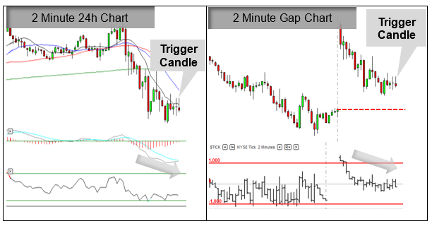

The E-mini S&P 500 futures market represents a vital segment of the financial markets, offering a streamlined, electronically traded futures contract tied to the Standard & Poor's 500 Index. Launched by the Chicago Mercantile Exchange in 1997, these contracts were designed to provide greater accessibility and flexibility for traders and investors of all sizes. The E-mini contract, with its lower margin requirements compared to the full-sized S&P 500 futures, democratizes access to futures trading. Thus, it enables a broad spectrum of participants, including individual investors, hedge funds, and institutional traders, to leverage their portfolios, hedge risks, and speculate on market movements.

The significance of the E-mini S&P 500 futures market extends beyond mere accessibility. It serves as a critical indicator of market sentiment, reflecting anticipated movements in the broader U.S. equity markets. With typically high liquidity, these futures allow traders to execute large orders with minimal impact on price, making them indispensable for both risk management and speculative purposes.



Algorithmic trading, a systematic form of trading where pre-programmed algorithms execute trades based on complex mathematical models, is rapidly becoming a dominant force in financial markets. This form of trading reduces human intervention, relying on fast, data-driven strategies to conduct trades at speeds and frequencies impossible for human traders. It encompasses a broad range of strategies, from simple execution algorithms designed to minimize market impact to complex predictive models using cutting-edge machine learning techniques.

The synergy between E-mini S&P 500 futures and algorithmic trading is profound, driven by the need for speed and efficiency in volatile markets. Algorithms can exploit minute price discrepancies and execute trades across global markets within milliseconds, providing a competitive edge to traders. This integration also allows for the handling of large datasets and real-time data analysis, elevating the precision and effectiveness of trading strategies.

The objective of this article is to explore the utilization of algorithmic trading in the E-mini S&P 500 futures market. We will examine the dynamics and significance of these futures, dissect the rise and impact of algorithmic trading, and highlight the strategies and technologies shaping this evolving landscape. Through this exploration, we aim to provide insight into the transformative role of algorithmic strategies in enhancing market opportunities within the E-mini S&P 500 futures market.

## Table of Contents

## Understanding E-mini S&P 500 Futures

E-mini S&P 500 futures are standardized futures contracts that represent one-fifth of the value of a standard S&P 500 futures contract. They were introduced in 1997 by the Chicago Mercantile Exchange (CME) to cater to individual investors and smaller institutions who found the larger S&P 500 futures contracts prohibitively expensive. The E-mini futures allow traders to speculate on the future value of the S&P 500 index, which is a major stock market index comprising 500 of the largest publicly traded companies in the United States.

Historically, the development of E-mini S&P 500 futures was a response to the growing demand for more accessible trading instruments following the widespread adoption of electronic trading systems. They enabled more flexible trading and improved [liquidity](/wiki/liquidity-risk-premium) in the futures market. E-minis quickly became one of the most popular equity index futures contracts in the world due to their affordability and the transparency provided by electronic trading platforms.

Compared to full-sized S&P 500 futures contracts, E-mini contracts offer several significant advantages. They require a lower margin, which makes them accessible to a broader range of investors. This democratization of futures trading has increased market participation, enhanced liquidity, and reduced bid-ask spreads. As a result, E-minis have become a critical tool for a wide array of market participants, including hedge funds, proprietary trading firms, and retail traders.

Key players in the E-mini S&P 500 futures market include institutional investors such as mutual funds and pension funds, as well as hedge funds, proprietary trading firms, and individual retail traders. These participants utilize E-mini contracts for various purposes, including hedging market exposure, executing speculative trades, and implementing short-term trading strategies.

The E-mini S&P 500 futures market operates nearly continuously, with trading hours commencing at 5:00 p.m. Central Time (CT) on Sunday and concluding at 4:00 p.m. CT on Friday, allowing for round-the-clock trading opportunities. The trading [volume](/wiki/volume-trading-strategy) for E-mini S&P 500 futures is robust, reflecting their widespread use and importance in financial markets. High trading volumes contribute to price discovery and provide an efficient vehicle for executing both large and small trades without significant market impact.

Due to their high liquidity and the efficiency of electronic markets, E-mini S&P 500 futures play a vital role in global financial markets, serving as a significant indicator of market sentiment and a powerful tool for risk management and speculative trading.

## The Rise of Algo Trading

Algorithmic trading, often referred to as algo trading, is the use of computer programs to automate and execute trades in financial markets. The primary components of [algorithmic trading](/wiki/algorithmic-trading) include pre-defined trading instructions, quantitative models, and the execution of trades at optimal conditions without human intervention. These algorithms determine the timing, price, and volume of orders, leveraging vast computational power to make decisions in microseconds, something humans are incapable of doing on their own.

The evolution of algorithmic trading has been closely linked to technological advancements over the past few decades. It began in the 1970s with the introduction of electronic trading systems that gradually replaced traditional face-to-face exchanges. By the 1980s, program trading emerged, where portfolios of stocks were simultaneously traded using a computer-based strategy. The proliferation of high-frequency trading ([HFT](/wiki/high-frequency-trading-strategies)) in the early 2000s marked a significant shift, allowing firms to capitalize on minute market inefficiencies using sophisticated algorithms.

There are several benefits associated with the use of algorithms in trading. Speed and accuracy are paramount; algorithmic trading can process a large number of data points and execute trades much faster than a human trader ever could, thus capturing opportunities as they arise. Furthermore, algorithmic trading reduces the risk of human error and emotional decision-making, making the trading process more consistent. Additionally, it allows traders to backtest their strategies against historical data to evaluate their performance and optimize their parameters.

Common algorithms employed in trading include statistical [arbitrage](/wiki/arbitrage), [trend following](/wiki/trend-following), and market-making strategies. Statistical arbitrage involves exploiting price inefficiencies between related financial instruments. Trend-following strategies capitalize on the [momentum](/wiki/momentum) of an asset price, while market-making involves providing liquidity by simultaneously posting buy and sell orders. 

The impact of technology on algorithmic trading is immense. The advent of [machine learning](/wiki/machine-learning) and [artificial intelligence](/wiki/ai-artificial-intelligence) has introduced more complex algorithms capable of learning and adapting to changing market conditions. These AI-driven approaches can incorporate natural language processing to analyze news or social media sentiment, providing a more nuanced view of market dynamics. Furthermore, advancements in cloud computing and data storage have made it feasible to analyze massive datasets, facilitating more informed trading strategies.

In summary, the rise of algorithmic trading has transformed the financial landscape, offering unparalleled speed, precision, and the capability to analyze and execute trades far beyond human capabilities. As technology continues to advance, the role of algorithms in financial markets is expected to grow, presenting both opportunities and challenges for traders and financial institutions.

## Algo Trading Strategies in E-mini S&P 500 Futures

In the E-mini S&P 500 futures market, various algorithmic trading strategies are employed to optimize trading performance and enhance profitability. These strategies leverage computational power and sophisticated algorithms to analyze market data and execute trades automatically. Here, we explore some of the most common algorithmic trading strategies used in this market.

### Types of Algorithms Used in E-mini S&P 500 Trading

#### Trend-Following Strategies
Trend-following strategies are designed to capitalize on the momentum of the market. These algorithms identify and track the direction of market trends and make trades based on the assumption that these trends will continue. The fundamental principle behind these strategies is to "ride the wave" of an upward or downward trend until signals indicate that the trend is reversing. 

Mathematically, trend-following can be implemented using moving averages. For instance, a moving average crossover strategy might involve buying when a short-term moving average crosses above a long-term moving average and selling when the opposite occurs. The formula for a simple moving average (SMA) at time $t$ with a window size of $n$ periods is:

$$
\text{SMA}_t = \frac{1}{n} \sum_{i=0}^{n-1} P_{t-i}
$$

where $P$ represents the price at time $t$.

#### Mean Reversion Algorithms
Mean reversion strategies are based on the premise that prices will revert to their historical average or mean over time. These algorithms identify overbought or oversold conditions and execute trades with the expectation that prices will return to a mean level. 

A common method to spot mean reversion opportunities is through the use of the Relative Strength Index (RSI) or Bollinger Bands. For instance, when the RSI indicates an overbought condition (typically above 70), a mean reversion strategy might initiate a sell order, predicting a price decline.

#### Arbitrage Strategies
Arbitrage strategies exploit the price inefficiencies between related markets. In the E-mini S&P 500 futures market, opportunities may arise due to discrepancies between futures prices and the underlying index or other correlated securities. 

Statistical arbitrage and pairs trading are examples where algorithms seek to identify and exploit these price differences. These strategies often involve high-frequency trading (HFT) for quick execution, capturing small price differentials across large volumes.

#### Machine Learning and AI-Based Algorithms
With advancements in technology, machine learning and AI have become integral to developing sophisticated trading algorithms. These models can process vast amounts of data and derive intricate patterns that are not apparent through traditional statistical methods.

For example, neural networks or [reinforcement learning](/wiki/reinforcement-learning) algorithms can predict future price movements by being trained on historical price datasets. A simple implementation might utilize a machine learning library in Python, such as Scikit-learn or TensorFlow, to train models that can classify or predict market trends based on previous data points.

```python
from sklearn.ensemble import RandomForestClassifier
import numpy as np

# Example of using Random Forest for trend prediction
# Assuming 'X_train' holds feature data and 'Y_train' holds trend labels
model = RandomForestClassifier(n_estimators=100)
model.fit(X_train, Y_train)

# Predicting future trends
future_trend = model.predict(X_test)
```

These algorithmic strategies represent a convergence of financial acumen and technological prowess, allowing traders to remain competitive in a fast-paced market environment.

## Advantages of Algo Trading in E-mini S&P 500 Futures

Algorithmic trading offers several advantages in trading E-mini S&P 500 futures. One of the primary benefits is increased speed and efficiency. Algorithms can execute trades in milliseconds, which is crucial in a market where prices can change rapidly. This speed ensures that traders can capitalize on even the smallest price movements, optimizing entry and [exit](/wiki/exit-strategy) points to maximize profits.

Another significant advantage is the reduction of human error and emotion-driven decisions. Human traders are often influenced by emotions such as fear and greed, which can lead to irrational decisions. Algorithmic trading eliminates these emotional factors, enabling trades to be executed based on pre-defined strategies and criteria. This reliability ensures consistency in executing trading plans.

The ability to backtest and optimize trading strategies is another advantage of algorithmic trading in E-mini S&P 500 futures. Traders can use historical data to test how their strategies would have performed in past market conditions. This [backtesting](/wiki/backtesting) ability helps in refining strategies, potentially improving their effectiveness. Moreover, by optimizing strategies based on past performance, traders can anticipate future market behavior more accurately.

Scalability is also a crucial benefit. Algorithms can manage and process large datasets efficiently, making it possible to monitor multiple markets and assets simultaneously. This scalability allows for the management of extensive portfolios, providing traders with the flexibility to diversify their investments and mitigate risks.

Algo trading also provides round-the-clock market opportunities. Unlike human traders, algorithms can operate continuously without fatigue, taking advantage of market openings regardless of the time of day. This continuous operation is particularly beneficial in the futures market, where opportunities can arise at any time due to global economic events or news releases.

In summary, algorithmic trading in E-mini S&P 500 futures enhances trading speed and efficiency, minimizes human error, facilitates strategy optimization, offers scalability, and provides uninterrupted market engagement, all of which contribute to more effective trading and improved financial outcomes.

## Challenges of Algo Trading in E-mini S&P 500 Futures

Algorithmic trading in E-mini S&P 500 futures presents several challenges that traders and developers must navigate to be successful. These challenges range from technical complexities to regulatory concerns, and understanding these is essential for optimizing trading strategies.

One significant challenge is the complexity involved in developing and maintaining trading algorithms. Algorithms must be designed to handle a vast amount of data and react to market signals with precision and speed. This requires not only sophisticated programming skills but also a deep understanding of market mechanics. As market conditions change, algorithms must be updated and optimized to retain their effectiveness, necessitating continuous development and testing.

Regulatory and compliance issues also play a critical role in algo trading. Different jurisdictions have distinct regulatory requirements that algorithmic traders must adhere to. For instance, the U.S. Securities and Exchange Commission (SEC) and the Commodity Futures Trading Commission (CFTC) impose rules to prevent market manipulation and ensure fair trading practices. Algorithms must be both compliant with these rules and capable of adjusting to any new regulatory changes. Failure to comply can result in severe penalties, making it essential for traders to stay updated on regulatory developments.

Market [volatility](/wiki/volatility-trading-strategies) and unexpected events can also pose significant risks to algo trading. Algorithms are typically designed based on historical data and may not always respond well to unforeseen events, such as geopolitical crises or abrupt market downturns. Such events can lead to substantial losses if the algorithms are not equipped to handle sudden spikes in volatility. It is crucial for traders to implement robust risk management strategies and include contingency plans in their algorithms to mitigate these risks.

Dependence on data accuracy and technology infrastructure is another challenge. High-frequency trading algorithms rely heavily on accurate and timely data to execute trades effectively. Any discrepancies or delays in data can lead to erroneous trading decisions and significant financial losses. Additionally, maintaining a reliable technology infrastructure, including hardware and network connectivity, is vital for minimizing latency and executing trades promptly.

Finally, the risk of algorithmic malfunctions or flash crashes cannot be overlooked. Flash crashes, typically caused by the rapid selling of large quantities by algorithms, can lead to volatile price swings and market disruption. To mitigate such risks, traders often implement circuit breakers and other fail-safe mechanisms that halt trading under specific conditions. These safeguards are essential to prevent rogue trades and ensure market stability.

Overall, while algorithmic trading offers various advantages, these challenges highlight the need for vigilance and adaptability in a fast-paced and often unpredictable market environment. Staying competitive requires a continuous effort to refine algorithms, ensure compliance, manage risks, and maintain robust technology systems.

## Future Trends in Algo Trading for E-mini S&P 500

Emerging technologies and artificial intelligence (AI) are fundamentally reshaping the landscape of algorithmic trading in E-mini S&P 500 futures. Machine learning models and AI algorithms are being increasingly employed to parse extensive data sets and generate trading signals with greater precision. AI advancements enable traders to detect patterns and relationships in the data that may not be perceptible through traditional analysis methods. For instance, algorithms can now leverage natural language processing to interpret sentiment from news articles and social media, enhancing trading decision-making processes.

Retail investors are progressively adopting algorithmic trading strategies as platforms become more accessible and user-friendly. Innovations in fintech offer retail investors algorithmic trading tools once exclusive to institutional participants. This democratization allows individual investors to compete in markets previously dominated by major financial institutions, potentially resulting in increased liquidity and market depth for E-mini S&P 500 futures.

The rise of cryptocurrencies and alternative markets presents both opportunities and challenges for algo trading in E-mini S&P 500 futures. Cryptocurrencies introduce a new asset class that is highly volatile yet lucrative, attracting speculative algo trading strategies. Furthermore, the correlation analysis between traditional futures markets and digital assets could provide diversified hedging opportunities, though the unique characteristics of cryptocurrencies necessitate careful consideration of risk management.

The integration of big data and analytics into trading strategies is becoming increasingly prevalent. Traders can now harness vast volumes of structured and unstructured data, employing sophisticated analytical techniques to gain insights and optimize trading decisions. With the deployment of cloud computing and distributed ledger technologies, processing speeds have significantly improved, facilitating real-time analysis that enhances the efficacy of algorithms.

Regulatory changes pose a significant [factor](/wiki/factor-investing) in shaping the future trajectory of algorithmic trading. As technological advancements evolve, regulators are continually reassessing their frameworks to address issues such as market fairness, data integrity, and systemic risk. Potential regulatory interventions could influence how algorithms are developed and deployed, necessitating greater transparency and accountability. Traders and firms must stay informed about regulatory trends to ensure compliance and mitigate potential impacts on their trading operations. 

The convergence of these future trends is expected to drive innovation and competitiveness in the E-mini S&P 500 futures market. Adapting to these changes can offer substantial strategic advantages to traders and investors, paving the way for enhanced profitability and market resilience.

## Conclusion

The exploration of algorithmic trading within the E-mini S&P 500 futures market underscores its transformative impact on modern trading practices. Algorithmic trading has significantly increased the speed and efficiency with which trades are executed, reducing human error and emotional biases that often hinder traditional trading methods. This transformation is characterized by the ability to backtest strategies, optimize trading decisions, and effectively manage vast amounts of data.

The advantages of algorithmic trading in the E-mini S&P 500 futures market, including its scalability and 24/7 trading capabilities, make it an indispensable tool for contemporary traders. These benefits, however, are not without challenges. Developing robust algorithms, ensuring regulatory compliance, and maintaining technological infrastructure are crucial to minimizing risks such as market volatility and algorithmic malfunctions.

Looking forward, the landscape for traders using algorithmic strategies is expected to become even more dynamic. Advancements in artificial intelligence and emerging technologies will likely further refine algorithmic trading techniques. Additionally, the increasing participation of retail investors and the integration of big data analytics will play pivotal roles in shaping future strategies. As the market evolves, regulatory frameworks may adapt, necessitating traders to stay informed about potential changes.

In conclusion, to remain competitive in an ever-evolving market, traders must adapt to technological advancements and regulatory developments. Algorithmic trading, with its myriad benefits and challenges, is set to continue playing a transformative role in the E-mini S&P 500 futures market, offering traders new opportunities and complexities as they navigate the future of financial markets.

## References & Further Reading

[1]: Bergstra, J., Bardenet, R., Bengio, Y., & Kégl, B. (2011). ["Algorithms for Hyper-Parameter Optimization."](https://papers.nips.cc/paper/4443-algorithms-for-hyper-parameter-optimization) Advances in Neural Information Processing Systems 24.

[2]: ["Advances in Financial Machine Learning"](https://www.amazon.com/Advances-Financial-Machine-Learning-Marcos/dp/1119482089) by Marcos Lopez de Prado

[3]: ["Evidence-Based Technical Analysis: Applying the Scientific Method and Statistical Inference to Trading Signals"](https://www.amazon.com/Evidence-Based-Technical-Analysis-Scientific-Statistical/dp/0470008741) by David Aronson

[4]: ["Machine Learning for Algorithmic Trading"](https://github.com/stefan-jansen/machine-learning-for-trading) by Stefan Jansen

[5]: ["Quantitative Trading: How to Build Your Own Algorithmic Trading Business"](https://www.amazon.com/Quantitative-Trading-Build-Algorithmic-Business/dp/1119800064) by Ernest P. Chan