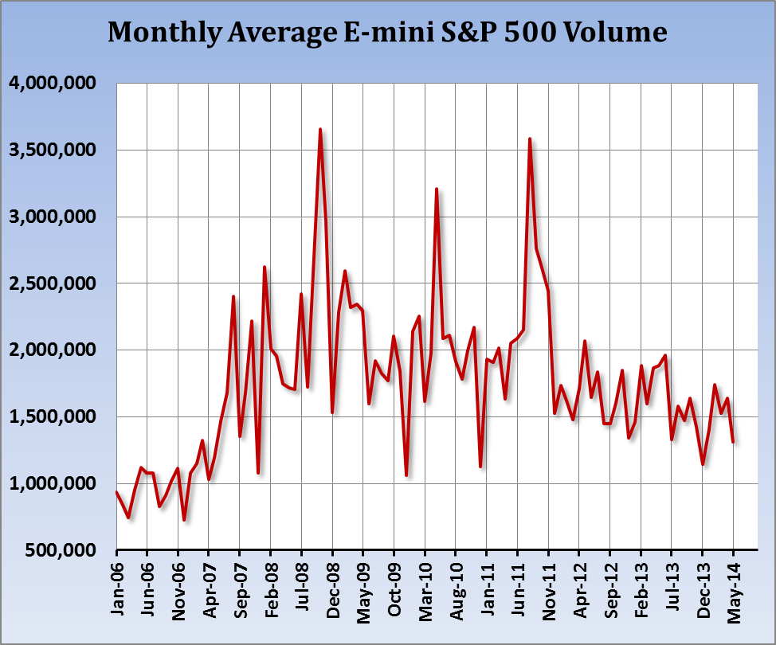

## Table of Contents

## What is an E-mini S&P 500 future?

An E-mini S&P 500 future is a type of financial contract that lets people buy or sell the value of the S&P 500 stock index at a future date. The S&P 500 is a list of 500 big companies in the U.S., and the index shows how well these companies are doing. The "E-mini" part means it's a smaller version of the regular S&P 500 future, making it easier for more people to trade.

These futures are popular because they let investors guess where the stock market might be going without having to buy all the stocks in the S&P 500. Traders can use E-mini S&P 500 futures to make money if they think the market will go up or down. They are also used by big investors to protect their other investments from big drops in the market.

## How does the E-mini S&P 500 future differ from the standard S&P 500 future?

The E-mini S&P 500 future and the standard S&P 500 future are both contracts that let people trade the value of the S&P 500 index at a future date. The main difference is their size. The E-mini is smaller, representing a value that is one-fifth of the standard S&P 500 future. This makes the E-mini more accessible to individual traders because it requires less money to trade.

Another difference is how they are traded. The E-mini S&P 500 future is traded electronically on the Chicago Mercantile Exchange (CME) Globex platform, which means traders can buy and sell it any time the market is open, even outside regular trading hours. The standard S&P 500 future, on the other hand, used to be traded on the floor of the exchange but has mostly moved to electronic trading as well. However, the E-mini remains more popular among smaller investors due to its smaller size and the flexibility of electronic trading.

## What is the contract size of an E-mini S&P 500 future?

The contract size of an E-mini S&P 500 future is $50 times the value of the S&P 500 index. This means if the S&P 500 index is at 4,000, one E-mini S&P 500 future contract would be worth $200,000.

This smaller contract size makes it easier for individual traders to participate in the market. It's much less than the standard S&P 500 future, which is worth $250 times the index value. So, the E-mini is a more affordable way for people to trade the movements of the S&P 500 index.

## How are E-mini S&P 500 futures traded?

E-mini S&P 500 futures are traded electronically on the Chicago Mercantile Exchange's Globex platform. This means that traders can buy and sell these futures using a computer, without needing to be in a physical trading location. The Globex platform is open almost all the time, so traders can trade E-mini S&P 500 futures nearly 24 hours a day, from Sunday evening to Friday afternoon. This makes it easy for people all over the world to trade whenever they want.

To trade an E-mini S&P 500 future, a trader needs to open an account with a brokerage firm that offers futures trading. Once the account is set up, the trader can place orders through the broker's trading platform. The trader decides whether they want to buy (go long) if they think the S&P 500 index will go up, or sell (go short) if they think it will go down. The price of the E-mini S&P 500 future changes based on what people are willing to pay for it at any given time, and it moves with the S&P 500 index.

## What are the trading hours for E-mini S&P 500 futures?

E-mini S&P 500 futures are traded on the Chicago Mercantile Exchange's Globex platform. The trading hours are almost 24 hours a day, from Sunday evening to Friday afternoon. This means you can trade these futures nearly all the time, except for a short break on weekends.

The trading starts at 6:00 PM Eastern Time on Sunday and goes until 5:00 PM Eastern Time on Friday. There is a small break every day from 5:00 PM to 6:00 PM Eastern Time. This schedule makes it easy for people from different parts of the world to trade whenever it's convenient for them.

## How can someone start trading E-mini S&P 500 futures?

To start trading E-mini S&P 500 futures, someone needs to open a futures trading account with a brokerage firm. This can be done online or by visiting a local office. The broker will ask for personal information and might require a minimum amount of money to open the account. Once the account is set up, the person can use the broker's trading platform to buy and sell E-mini S&P 500 futures.

After setting up the account, the person decides if they want to buy (go long) or sell (go short) the futures. If they think the S&P 500 index will go up, they buy the futures. If they think it will go down, they sell. They place their order on the trading platform, which is open nearly 24 hours a day from Sunday evening to Friday afternoon. It's important to keep an eye on the market and be ready to make changes to the trades as needed.

## What are the margin requirements for trading E-mini S&P 500 futures?

Margin requirements for trading E-mini S&P 500 futures can change, but they are usually set by the exchange and the brokerage firm. The initial margin is the amount of money you need to have in your account to open a position. For E-mini S&P 500 futures, this is often around 5% to 10% of the contract's total value. So, if the S&P 500 index is at 4,000, and one E-mini contract is worth $200,000, you might need about $10,000 to $20,000 to start trading one contract.

There's also a maintenance margin, which is the minimum amount of money you need to keep in your account to keep your position open. If the value of your account falls below this level, you'll get a margin call, and you'll need to add more money to your account or close your position. The maintenance margin for E-mini S&P 500 futures is usually lower than the initial margin, often around half of the initial margin amount. It's important to check with your broker for the exact margin requirements because they can change based on market conditions and the broker's policies.

## How do E-mini S&P 500 futures impact the broader market?

E-mini S&P 500 futures can have a big impact on the broader market because they are a way for traders to bet on where the stock market is going. When a lot of people buy E-mini S&P 500 futures, it often means they think the market will go up. This buying can push up the price of the futures, which can make other investors feel more confident about the market. They might then buy more stocks, which can help push up the S&P 500 index itself. On the other hand, if a lot of people are selling E-mini S&P 500 futures, it can mean they think the market will go down. This selling can put pressure on the futures' price, making other investors worry and possibly sell their stocks, which can drag down the S&P 500 index.

The impact of E-mini S&P 500 futures on the broader market also comes from how they are used by big investors and institutions. These big players often use E-mini S&P 500 futures to protect their other investments. For example, if they own a lot of stocks and are worried about a market drop, they might sell E-mini S&P 500 futures as a way to hedge their bets. This can help them avoid big losses if the market does go down. But if too many big investors do this at the same time, it can make the market more volatile and lead to bigger swings in the S&P 500 index. So, E-mini S&P 500 futures can both reflect and influence what's happening in the broader stock market.

## What strategies are commonly used when trading E-mini S&P 500 futures?

When trading E-mini S&P 500 futures, one common strategy is called [day trading](/wiki/day-trading-spy). Day traders buy and sell futures within the same trading day, trying to make money from small price changes. They use charts and other tools to guess where the market might go next. They need to be quick and good at making decisions because they close all their trades before the market closes for the day. This can be exciting but also risky because the market can be unpredictable.

Another strategy is called swing trading. Swing traders hold onto their futures for a few days or even weeks, trying to make money from bigger price swings. They look at longer-term trends and might use things like moving averages to help them decide when to buy or sell. Swing trading can be less stressful than day trading because you don't need to watch the market all the time, but it still needs careful planning and patience.

Some traders also use a strategy called hedging. They use E-mini S&P 500 futures to protect other investments they own. For example, if they own a lot of stocks and are worried about the market going down, they might sell E-mini S&P 500 futures. This can help them avoid big losses if the market does drop. Hedging is a way to play it safe, but it can also mean missing out on big gains if the market goes up instead.

## How do economic reports and events affect E-mini S&P 500 futures?

Economic reports and events can have a big effect on E-mini S&P 500 futures because they give traders information about how the economy is doing. When important reports like the jobs report or the GDP numbers come out, traders look at them to guess if the economy is getting better or worse. If the reports show the economy is doing well, traders might buy more E-mini S&P 500 futures because they think the stock market will go up. But if the reports are bad, traders might sell their futures because they worry the market will go down. These reports can make the price of E-mini S&P 500 futures move a lot in a short time.

Events like meetings of the Federal Reserve or big news about companies can also shake up the market. If the Federal Reserve says they might raise interest rates, traders might worry that it will slow down the economy and sell their futures. Or if a big company does something surprising, like announcing a new product or getting into trouble, it can change how traders feel about the market. All these things can make the price of E-mini S&P 500 futures go up and down as traders react to the news and try to guess what will happen next.

## What are the risks associated with trading E-mini S&P 500 futures?

Trading E-mini S&P 500 futures can be risky because the market can be very unpredictable. The price of these futures can go up and down a lot, especially when big economic reports come out or important events happen. If you guess wrong about which way the market will go, you can lose a lot of money quickly. Also, trading on margin means you're borrowing money to trade, which can make your wins bigger but also your losses. If the market moves against you and your account balance drops below the maintenance margin, you'll get a margin call and need to add more money or close your position, which can be stressful.

Another risk is that trading E-mini S&P 500 futures can be hard to understand if you're new to it. You need to know a lot about the market and how to use different trading tools and strategies. If you don't, you might make bad choices and lose money. It's also important to have a good plan and stick to it, but it can be hard not to make quick decisions based on emotions when the market is moving fast. So, while trading E-mini S&P 500 futures can be a way to make money, it's important to understand these risks and be ready for them.

## How can advanced traders use E-mini S&P 500 futures for portfolio hedging?

Advanced traders can use E-mini S&P 500 futures to hedge their portfolios by taking positions that offset potential losses in their stock investments. If a trader owns a lot of stocks and is worried that the market might go down, they can sell E-mini S&P 500 futures. This way, if the market does drop, the loss in the value of their stocks might be balanced out by gains from the futures they sold. It's like buying insurance for their portfolio, protecting it from big drops in the market.

Using E-mini S&P 500 futures for hedging requires careful planning and understanding of how the futures market works. Traders need to know the right amount of futures to sell to properly hedge their portfolio. If they sell too many futures, they might miss out on gains if the market goes up instead. But if they sell too few, the hedge might not be enough to protect them from big losses. So, it's important for traders to keep an eye on their portfolio and adjust their futures positions as needed to make sure their hedging strategy works well.

## References & Further Reading

[1]: ["Advances in Financial Machine Learning"](https://www.amazon.com/Advances-Financial-Machine-Learning-Marcos/dp/1119482089) by Marcos Lopez de Prado

[2]: ["Evidence-Based Technical Analysis: Applying the Scientific Method and Statistical Inference to Trading Signals"](https://www.amazon.com/Evidence-Based-Technical-Analysis-Scientific-Statistical/dp/0470008741) by David Aronson

[3]: ["Machine Learning for Algorithmic Trading"](https://github.com/PacktPublishing/Machine-Learning-for-Algorithmic-Trading-Second-Edition) by Stefan Jansen

[4]: ["Quantitative Trading: How to Build Your Own Algorithmic Trading Business"](https://books.google.com/books/about/Quantitative_Trading.html?id=j70yEAAAQBAJ) by Ernest P. Chan

[5]: Twomey, T. & Ott, S. (2001). ["Trading in the E-mini Age: A guide to electronic day trading of the e-mini futures markets."](https://www.semanticscholar.org/paper/The-lumbar-spine%3A-structure%2C-function%2C-age-changes-Twomey-Taylor/c175799e8fdec683742b047f4aabe27e3929d5ab)

[6]: ["Algorithmic Trading: Winning Strategies and Their Rationale"](https://www.wiley.com/en-us/Algorithmic+Trading%3A+Winning+Strategies+and+Their+Rationale-p-9781118460146) by Ernest P. Chan

[7]: Aldridge, I. (2013). ["High-Frequency Trading: A Practical Guide to Algorithmic Strategies and Trading Systems."](https://books.google.com/books/about/High_Frequency_Trading.html?id=8QpIsVUMhmEC)

[8]: Tulchinsky, M. (2019). ["Data-Driven Investing: Professional Edition 2020."](https://link.springer.com/article/10.1057/s41270-019-00056-5)