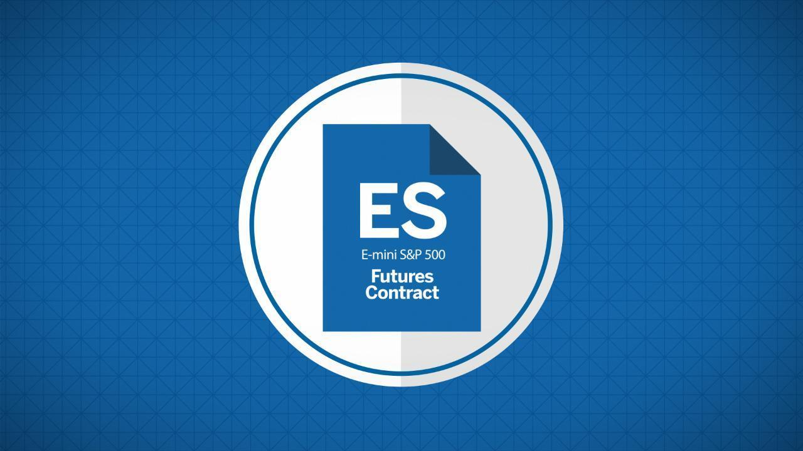

## Table of Contents

## What are E-mini S&P 500 Futures?

E-mini S&P 500 Futures are a type of financial contract that lets people bet on where they think the S&P 500 stock index will go in the future. The S&P 500 is a list of 500 big companies in the U.S., and it's used to show how well the stock market is doing. When you trade E-mini S&P 500 Futures, you're not buying the actual stocks, but you're making a deal that says you'll buy or sell the value of the S&P 500 at a certain price on a certain date.

These futures are popular because they're smaller and cheaper than the regular S&P 500 futures, making them easier for more people to trade. They're also used by investors to protect their money from big swings in the stock market. For example, if someone thinks the market will go down, they can use E-mini S&P 500 Futures to make money if it does go down, which can help balance out losses in their other investments.

## Who is the CME Group and what is their role in E-mini S&P 500 Futures?

The CME Group is a big company that runs a marketplace where people can buy and sell things like futures and options. They are like a middleman that helps people trade safely and fairly. The CME Group is really important because they make the rules and keep everything organized so that trading can happen smoothly.

When it comes to E-mini S&P 500 Futures, the CME Group is the one that created them and lets people trade them on their marketplace. They decide things like how much each contract is worth and when the contracts will end. By doing this, the CME Group makes it possible for people to use E-mini S&P 500 Futures to guess where the stock market is going and to protect their money from big changes in the market.

## How can someone start trading E-mini S&P 500 Futures?

To start trading E-mini S&P 500 Futures, the first thing someone needs to do is open an account with a futures broker. This is a company that lets people buy and sell futures. You'll need to fill out some forms and give them some information about yourself. Once your account is set up, you'll need to put some money into it, which is called margin. This money is like a deposit that shows you're serious about trading.

After you have your account ready and some money in it, you can start trading. You'll use a trading platform, which is like a computer program, to see the prices of E-mini S&P 500 Futures and to make your trades. You decide if you think the S&P 500 will go up or down, and then you buy or sell futures based on that guess. It's important to learn about how futures work and maybe even practice with a pretend account before you start using real money.

## What are the contract specifications for E-mini S&P 500 Futures?

E-mini S&P 500 Futures are contracts that track the S&P 500 index. Each contract is worth $50 times the value of the S&P 500. So, if the S&P 500 is at 4,000, one E-mini contract would be worth $200,000. But you don't need to pay the full amount to trade; you just need to put down a smaller amount called margin, which can change but is usually around $10,000 per contract.

These futures contracts have set times when they end, called expiration dates. They expire on the third Friday of March, June, September, and December. You can trade them almost all the time, from Sunday evening to Friday afternoon, with a short break each day. The smallest change in the price of an E-mini S&P 500 Future, called a tick, is 0.25 index points, which means $12.50 per contract.

## What are the trading hours for E-mini S&P 500 Futures?

E-mini S&P 500 Futures can be traded almost all the time during the week. They start trading on Sunday evening at 6:00 PM Eastern Time and keep going until Friday afternoon at 5:00 PM Eastern Time. This means you can trade them for most of the day and night, except for a short break each day from 5:00 PM to 6:00 PM Eastern Time.

The long trading hours are good because they let people from different time zones around the world trade when it's convenient for them. It also means you can react to news and events that happen outside of normal business hours, which can affect the stock market.

## How does the margin work for E-mini S&P 500 Futures?

When you trade E-mini S&P 500 Futures, you don't need to pay the full value of the contract right away. Instead, you put down a smaller amount of money called margin. This margin acts like a deposit to show that you're serious about trading. The amount of margin required can change, but it's usually around $10,000 per contract. This makes it easier for more people to trade because they don't need as much money upfront.

The margin also helps keep the trading safe. If the price of the E-mini S&P 500 Futures moves against you, the money in your margin account can cover the losses. If your losses get too big and your margin account goes below a certain level, called the maintenance margin, you'll need to add more money to your account. This is called a margin call. If you can't add more money, your broker might close your position to stop you from losing even more.

## What are the key benefits of trading E-mini S&P 500 Futures?

Trading E-mini S&P 500 Futures has some big advantages. One of the main benefits is that they let you trade the whole stock market without having to buy all the individual stocks in the S&P 500. This makes it easier and cheaper to guess where the market is going. Also, because E-mini contracts are smaller than regular S&P 500 futures, they need less money to start trading, which means more people can join in.

Another big plus is that you can trade E-mini S&P 500 Futures almost all the time during the week. This gives you more chances to make trades when it's good for you, no matter where you live. Plus, you can use these futures to protect other investments you have. If you think the market might go down, you can trade E-mini futures to make money if it does, which can help balance out losses in your other investments.

## What are the risks associated with trading E-mini S&P 500 Futures?

Trading E-mini S&P 500 Futures can be risky because the market can move a lot, and if it goes against what you thought, you could lose a lot of money. This is called market risk. Since you're using margin to trade, you only need a small amount of money to start, but this also means your losses can be bigger than the money you put in. If the market moves against you, you might get a margin call, which means you have to put in more money to keep your position open. If you can't add more money, your broker might close your position, and you could lose everything you put in.

Another risk is called leverage risk. Because you're trading with borrowed money (the margin), small changes in the market can lead to big wins or big losses. This can make trading very exciting but also very dangerous. It's easy to get carried away and take on too much risk, which could lead to big losses. It's important to understand these risks and maybe start small or practice with a pretend account before using real money.

## How do E-mini S&P 500 Futures correlate with the broader market?

E-mini S&P 500 Futures are closely tied to the S&P 500 index, which is a big list of 500 important companies in the U.S. When people trade these futures, they're basically betting on where they think the whole stock market will go. If the S&P 500 goes up, the price of E-mini S&P 500 Futures usually goes up too. If the S&P 500 goes down, the futures will likely go down as well. This close connection makes E-mini S&P 500 Futures a good way to guess what the market will do without having to buy all the stocks in the S&P 500.

Because E-mini S&P 500 Futures move with the S&P 500, they can also be used to protect other investments. If someone thinks the market might go down, they can trade these futures to make money if it does, which can help balance out losses in their other investments. This is called hedging. So, E-mini S&P 500 Futures not only let people bet on the market but also help them manage risk in their overall investment strategy.

## What advanced trading strategies can be used with E-mini S&P 500 Futures?

One advanced strategy for trading E-mini S&P 500 Futures is called scalping. This means making a lot of small trades to take advantage of tiny changes in the market. Traders who use this strategy try to make a little bit of money on each trade, but they do it many times a day. They need to be quick and good at watching the market to see when to buy and sell. Scalping can be exciting but also risky because it's hard to keep making money this way all the time.

Another strategy is called spread trading. This involves buying one futures contract and selling another at the same time. The idea is to make money from the difference in price between the two contracts. For example, you might buy an E-mini S&P 500 Future that expires in March and sell one that expires in June. If the price difference between these two contracts changes in your favor, you can make money. This strategy can be less risky than just betting on the market going up or down because it's more about the difference between the contracts.

A third strategy is trend following. This means watching the market to see if it's going up or down over time and then trading in the same direction. Traders who use this strategy might use tools like moving averages to help them see the trend. If the market is going up, they'll buy E-mini S&P 500 Futures, hoping to sell them later at a higher price. If the market is going down, they'll sell futures, hoping to buy them back later at a lower price. Trend following can be good for catching big moves in the market, but it can also be hard to know when the trend will change.

## How do economic reports and events impact E-mini S&P 500 Futures?

Economic reports and events can have a big effect on E-mini S&P 500 Futures because they give people new information about how the economy is doing. When a report comes out that shows the economy is doing well, like more people are working or companies are making more money, people might think the stock market will go up. This can make the price of E-mini S&P 500 Futures go up too, as more people want to buy them. On the other hand, if a report shows the economy is not doing so well, like fewer people are working or companies are making less money, people might think the stock market will go down. This can make the price of E-mini S&P 500 Futures go down as more people want to sell them.

Big events like changes in interest rates or big news about world events can also shake up the market. If the government says interest rates are going up, borrowing money becomes more expensive, which can slow down the economy. This might make people think the stock market will go down, and they might sell their E-mini S&P 500 Futures, pushing the price down. If there's good news about a trade deal or something else that makes people think the economy will do better, they might buy more E-mini S&P 500 Futures, pushing the price up. So, traders need to keep an eye on these reports and events to guess how they might change the market and the price of E-mini S&P 500 Futures.

## What are some common technical analysis tools used for trading E-mini S&P 500 Futures?

One common tool for trading E-mini S&P 500 Futures is the moving average. This tool helps traders see the average price of the futures over a certain time, like 50 days or 200 days. When the price of the futures goes above the moving average, it might mean the market is going up, and traders might want to buy. If the price goes below the moving average, it might mean the market is going down, and traders might want to sell. Moving averages help traders see trends and make decisions based on those trends.

Another tool is the Relative Strength Index (RSI). The RSI helps traders see if the market is overbought or oversold. If the RSI is above 70, it might mean the market is overbought, and the price might go down soon. If the RSI is below 30, it might mean the market is oversold, and the price might go up soon. Traders use the RSI to guess when the market might change direction and make trades based on that guess.

A third tool is the Bollinger Bands. These are lines drawn above and below the price of the futures that show how much the price is moving around. When the price gets close to the top Bollinger Band, it might mean the market is going to go down soon. When the price gets close to the bottom Bollinger Band, it might mean the market is going to go up soon. Traders use Bollinger Bands to see if the market is getting too high or too low and make trades based on that information.

## What is the understanding of CME Group E-mini S&P 500 Futures?

The CME Group E-mini S&P 500 Futures are smaller-scaled futures contracts derived from the Standard & Poor's 500 Index. These contracts are engineered to provide market participants with exposure to the broad U.S. equity market, making them a crucial tool for portfolio management, hedging, and speculative purposes. 

Each E-mini S&P 500 contract is quantified as $50 times the current index value of the S&P 500. For instance, if the S&P 500 Index stands at 4,000, the nominal value of one E-mini contract would be calculated as follows: 

$$
\text{Contract Value} = 50 \times 4000 = \$200,000
$$

This leverage allows traders to engage in significant market exposure without committing large capital resources, particularly when compared to the full-sized S&P 500 contracts which have a multiplier of $250.

Notably, these contracts are financially settled, eliminating the complexities involved with physical delivery of the underlying stocks. This financial settlement process is designed to simplify the transactional aspects for traders, allowing them to focus solely on price movements and trading strategies rather than logistical considerations.

E-mini S&P 500 Futures are transacted on the CME Globex platform, an electronic trading system that provides a transparent and efficient environment for market execution. The platform supports a wide range of trading strategies, from long-term investment approaches to short-term, high-frequency trading tactics. Its extensive operating hours facilitate worldwide trader participation and offer the flexibility to act on global market events almost instantaneously.

By combining a manageable contract size, financial settlement, and a robust electronic trading system, E-mini S&P 500 Futures present a versatile instrument for a diverse array of trading strategies, catering to both institutional and retail traders.

## What are the advantages of trading E-mini S&P 500 futures via algorithms?

Trading E-mini S&P 500 futures via algorithms presents several distinct advantages that make it a preferred choice among traders looking to enhance efficiency and maximize potential returns.

Leverage plays a critical role in the attractiveness of these futures contracts. Traders can control a substantial market position with a comparatively small amount of capital, thereby amplifying potential gains. This leverage is calculated as the ratio of the contract value to the margin required:

$$
\text{Leverage} = \frac{\text{Contract Value}}{\text{Initial Margin}}
$$

For example, if the contract value is $200,000 and the initial margin required is $10,000, the leverage would be 20:1. This significant leverage allows traders to enhance their exposure to the market with less capital outlay.

High liquidity is another significant advantage. The E-mini S&P 500 futures market is one of the most liquid in the world, allowing for rapid trade execution and minimizing the risk of slippage. For high-frequency trading strategies, liquidity is crucial as it ensures that large volumes can be traded without greatly influencing the market price.

The ability to backtest algorithms using historical data before deploying them live is an essential component of risk management. Backtesting provides insights into the performance of a trading strategy over a previous period and helps identify potential weaknesses. This process allows traders to refine their strategies and understand potential risks and returns. It often involves historical data analysis using Python programming, where traders can simulate different strategies:

```python
import pandas as pd
from backtesting import Backtest, Strategy

class MyStrategy(Strategy):
    def init(self):
        pass

    def next(self):
        # Define strategy logic here
        pass

data = pd.read_csv('historical_data.csv')
bt = Backtest(data, MyStrategy, cash=10000, commission=.002)
output = bt.run()
bt.plot()
```

Efficient execution is another key benefit of using algorithms in trading. Automated setups not only allow for quick reactions to market moves but also help in removing emotions from trading decisions. Emotional trading can often lead to suboptimal decision-making, but algorithms adhere strictly to predefined parameters and logic, thereby maintaining consistency and discipline.

Conclusively, trading E-mini S&P 500 futures via algorithms offers strategic advantages of leverage, liquidity, rigorous testing capabilities, and the discipline of emotion-free trading, enabling traders to focus on refining their strategies and achieving better market outcomes.

## References & Further Reading

[1]: ["Algorithmic Trading and DMA: An Introduction to Direct Access Trading Strategies"](https://archive.org/details/algorithmictradi0000john) by Barry Johnson

[2]: ["Advances in Financial Machine Learning"](https://www.amazon.com/Advances-Financial-Machine-Learning-Marcos/dp/1119482089) by Marcos Lopez de Prado

[3]: ["Evidence-Based Technical Analysis: Applying the Scientific Method and Statistical Inference to Trading Signals"](https://www.amazon.com/Evidence-Based-Technical-Analysis-Scientific-Statistical/dp/0470008741) by David Aronson

[4]: ["Machine Learning for Algorithmic Trading"](https://github.com/stefan-jansen/machine-learning-for-trading) by Stefan Jansen

[5]: ["Quantitative Trading: How to Build Your Own Algorithmic Trading Business"](https://www.amazon.com/Quantitative-Trading-Build-Algorithmic-Business/dp/1119800064) by Ernest P. Chan

[6]: ["CME Group E-mini S&P 500 Futures Contract Specifications"](https://www.cmegroup.com/markets/equities/sp/e-mini-sandp500.html) - CME Group official website

[7]: ["The Handbook of Electronic Trading"](https://www.amazon.com/Handbook-Electronic-Trading-Joe-Rosen/dp/0981464602) by Joseph Rosen

[8]: ["Trading and Exchanges: Market Microstructure for Practitioners"](https://www.amazon.com/Trading-Exchanges-Market-Microstructure-Practitioners/dp/0195144708) by Larry Harris