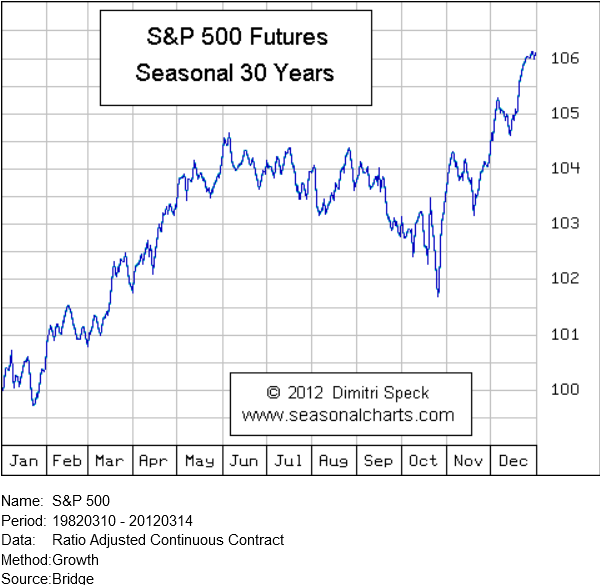

The world of trading has transformed extensively over time, with algorithmic trading emerging as a pivotal innovation. Utilizing complex algorithms and computational power, this method has allowed traders to execute strategies with precision and speed unimaginable in traditional trading environments. Within this rapidly evolving landscape, the CME Group E-mini S&P 500 stock futures have carved out a significant niche. These contracts represent a cost-effective and efficient instrument for traders who seek to automate their strategies and react promptly to fluctuating market conditions.

CME Group E-mini S&P 500 futures are one of the most traded futures globally, primarily due to their accessibility and scalability. They are designed to provide a streamlined entry into the U.S. equity markets, granting exposure to the S&P 500 index in a more manageable form. This accessibility makes them an excellent candidate for algorithmic trading, which thrives on frequent, rapid transactions and benefits from the significant liquidity the E-mini futures offer.



As trading continues to advance, understanding the nuances of the CME Group E-mini S&P 500 futures becomes crucial for traders aiming to optimize their strategies. These futures present specific opportunities in automated trading, where high-frequency and algorithmic strategies are employed to leverage market movements efficiently. Additionally, the structural elements of these contracts, such as trading hours and contract specifications, render them an attractive option for both beginner and experienced traders. By engaging with these futures, traders can better position themselves to capitalize on the constantly changing financial markets.

## Table of Contents

## Understanding CME Group E-mini S&P 500 Futures

The CME Group E-mini S&P 500 Futures are smaller-scaled futures contracts derived from the Standard & Poor's 500 Index. These contracts are engineered to provide market participants with exposure to the broad U.S. equity market, making them a crucial tool for portfolio management, hedging, and speculative purposes. 

Each E-mini S&P 500 contract is quantified as $50 times the current index value of the S&P 500. For instance, if the S&P 500 Index stands at 4,000, the nominal value of one E-mini contract would be calculated as follows: 

$$
\text{Contract Value} = 50 \times 4000 = \$200,000
$$

This leverage allows traders to engage in significant market exposure without committing large capital resources, particularly when compared to the full-sized S&P 500 contracts which have a multiplier of $250.

Notably, these contracts are financially settled, eliminating the complexities involved with physical delivery of the underlying stocks. This financial settlement process is designed to simplify the transactional aspects for traders, allowing them to focus solely on price movements and trading strategies rather than logistical considerations.

E-mini S&P 500 Futures are transacted on the CME Globex platform, an electronic trading system that provides a transparent and efficient environment for market execution. The platform supports a wide range of trading strategies, from long-term investment approaches to short-term, high-frequency trading tactics. Its extensive operating hours facilitate worldwide trader participation and offer the flexibility to act on global market events almost instantaneously.

By combining a manageable contract size, financial settlement, and a robust electronic trading system, E-mini S&P 500 Futures present a versatile instrument for a diverse array of trading strategies, catering to both institutional and retail traders.

## The Role of Algo Trading in E-mini S&P 500 Futures

Algorithmic trading, commonly known as algo trading, has revolutionized the trading landscape by automating trade execution based on predetermined criteria and market data. In the context of CME Group E-mini S&P 500 futures, this approach has become indispensable due to the contracts' [liquidity](/wiki/liquidity-risk-premium) and [volatility](/wiki/volatility-trading-strategies). The speed and precision of [algorithmic trading](/wiki/algorithmic-trading) allow participants to exploit fleeting market opportunities that are often unattainable through manual efforts.

Traders employing algorithmic strategies leverage sophisticated algorithms that sift through vast datasets to make real-time trading decisions. These decisions encompass vital aspects like entry and [exit](/wiki/exit-strategy) points, order size, and timing, often outperforming human capabilities. Algorithms are designed using mathematical models and backtested using historical data to optimize performance and reduce risk. The primary advantage is the ability to analyze multiple market conditions simultaneously, a task not feasible for a human trader working unaided.

The integration of algorithmic trading with E-mini S&P 500 futures leads to reduced transaction costs and minimal market impact. This efficiency is achieved by breaking large orders into smaller ones to execute seamlessly, thus avoiding sudden market movements. Furthermore, algo trading provides enhanced price discovery and liquidity, two critical components for robust trading environments. By offering scalable solutions, traders can manage and adjust their strategies quickly to align with evolving market dynamics.

Incorporating algo trading strategies with E-mini S&P 500 futures also democratizes access to sophisticated trading tools that were previously reserved for large institutional entities. Advanced algorithms, once developed, can be automated to function continuously, monitoring markets 24/7, and adjusting strategies in real time. This autonomy minimizes human error and emotional bias, thereby streamlining operations and enhancing potential profitability.

The profound impact of algorithmic trading within the E-mini S&P 500 futures market signifies a shift towards more data-driven trading methodologies, enabling traders to harness technology to optimize their trading performance optimally.

## Key Features of E-mini S&P 500 Futures Contracts

The E-mini S&P 500 futures contracts are specifically designed to meet the complex needs of modern traders. A standout feature is their extensive trading hours. These futures are available almost 24 hours a day, starting from Sunday evening through to Friday evening. This near-continuous trading schedule accommodates participants from multiple time zones and supports flexible trading strategy execution.

Another notable characteristic of E-mini S&P 500 futures is their quarterly listing cycle. These contracts are available for March, June, September, and December expirations, providing a systematic structure that enables traders to plan and adjust their strategies effectively. Furthermore, the CME Group enforces position limits to mitigate the risk of market manipulation, ensuring a more stable trading environment.

Price granularity in E-mini S&P 500 futures is supported by their minimum price fluctuation, which is established at 0.25 index points. This increment is equivalent to $12.50 per contract. Such granularity allows traders to fine-tune their trade adjustments with precision, catering to both short-term and long-term trading strategies.

The combined features of extensive trading hours, organized contract listings, position limits for stability, and precise price fluctuations make E-mini S&P 500 futures a versatile instrument for traders at any level. Their structure supports a range of trading needs, reinforcing their role as a crucial component in futures trading.

## Advantages of Trading E-mini S&P 500 Futures via Algorithms

Trading E-mini S&P 500 futures via algorithms presents several distinct advantages that make it a preferred choice among traders looking to enhance efficiency and maximize potential returns.

Leverage plays a critical role in the attractiveness of these futures contracts. Traders can control a substantial market position with a comparatively small amount of capital, thereby amplifying potential gains. This leverage is calculated as the ratio of the contract value to the margin required:

$$
\text{Leverage} = \frac{\text{Contract Value}}{\text{Initial Margin}}
$$

For example, if the contract value is $200,000 and the initial margin required is $10,000, the leverage would be 20:1. This significant leverage allows traders to enhance their exposure to the market with less capital outlay.

High liquidity is another significant advantage. The E-mini S&P 500 futures market is one of the most liquid in the world, allowing for rapid trade execution and minimizing the risk of slippage. For high-frequency trading strategies, liquidity is crucial as it ensures that large volumes can be traded without greatly influencing the market price.

The ability to backtest algorithms using historical data before deploying them live is an essential component of risk management. Backtesting provides insights into the performance of a trading strategy over a previous period and helps identify potential weaknesses. This process allows traders to refine their strategies and understand potential risks and returns. It often involves historical data analysis using Python programming, where traders can simulate different strategies:

```python
import pandas as pd
from backtesting import Backtest, Strategy

class MyStrategy(Strategy):
    def init(self):
        pass

    def next(self):
        # Define strategy logic here
        pass

data = pd.read_csv('historical_data.csv')
bt = Backtest(data, MyStrategy, cash=10000, commission=.002)
output = bt.run()
bt.plot()
```

Efficient execution is another key benefit of using algorithms in trading. Automated setups not only allow for quick reactions to market moves but also help in removing emotions from trading decisions. Emotional trading can often lead to suboptimal decision-making, but algorithms adhere strictly to predefined parameters and logic, thereby maintaining consistency and discipline.

Conclusively, trading E-mini S&P 500 futures via algorithms offers strategic advantages of leverage, liquidity, rigorous testing capabilities, and the discipline of emotion-free trading, enabling traders to focus on refining their strategies and achieving better market outcomes.

## Considerations and Challenges in Algo Trading

Algorithmic trading, while offering significant advantages, is not without its challenges and risks that necessitate careful consideration by traders. One of the primary hurdles is market volatility, which can significantly impact the performance of trading algorithms. Volatile markets can lead to unpredictable price movements that may trigger algorithms to execute trades prematurately or miss opportunities altogether. To mitigate these effects, traders must implement robust risk management practices and maintain real-time monitoring of trades. Effective use of mathematical models for volatility forecasting and adaptive algorithms that can adjust to changing market conditions is essential. For example, implementing a volatility-adjusted stop-loss mechanism can help manage risks during turbulent times.

The development and upkeep of trading algorithms also present significant technical complexities. Crafting an algorithm involves a deep understanding of both trading principles and coding proficiency. The process requires considerable technological investment in both time and resources. Developing efficient algorithms may require knowledge of advanced programming languages such as Python, which is favored for its extensive libraries and support for data analysis. For instance, utilizing libraries like NumPy and pandas in Python can help in processing large-scale financial data for algorithmic strategy formulation.

```python
import numpy as np
import pandas as pd

# Example of using Pandas for simple moving average calculation
def moving_average(data, window_size):
    return data.rolling(window=window_size).mean()

# Sample data
price_data = pd.Series([100, 102, 101, 104, 107, 110, 115])

# Calculate 3-day moving average
ma = moving_average(price_data, 3)
print(ma)
```

Further, trading algorithms must be adapted to ever-evolving regulatory changes and compliance requirements. Exchanges like the CME Group impose position limits and other trading regulations to prevent market manipulation and systemic risk. Traders must ensure that their algorithms adhere to these rules, which may involve incorporating regulatory compliance checks within their code.

Dynamic market conditions and regulatory landscapes underscore the necessity for traders to maintain flexibility and adaptability in their algorithmic strategies. This involves consistently updating and optimizing algorithms to align with both market movements and regulatory standards. Failure to do so can lead to significant financial losses and potential legal repercussions.

In summary, while algorithmic trading with E-mini S&P 500 futures can offer substantial opportunities, traders need to navigate the complexities of market volatility, technical development, and regulatory compliance with precision and care. Each of these factors requires not only initial preparation but ongoing attention and adaptation to sustain a competitive edge in the market.

## Conclusion

CME Group E-mini S&P 500 futures offer a compelling avenue for traders leveraging algorithmic strategies. Their structural design, coupled with high liquidity and ease of access, positions them as a preferred instrument for gaining efficient exposure to the U.S. equity markets. The continuous availability of these futures, trading nearly 24 hours a day on the CME Globex platform, ensures that traders can execute strategies without significant time zone constraints, making them particularly attractive to an international audience.

As technology advances, market participants must remain vigilant and adaptable to ensure their trading strategies remain effective in a rapidly changing environment. This vigilance involves not only updating trading algorithms but also staying informed about market conditions, regulatory changes, and technological innovations. With robust risk management and an understanding of the complexities involved, traders can refine their approaches to mitigate risks associated with market volatility and operational challenges.

For traders ready to confront these challenges, algorithmic trading with E-mini S&P 500 futures constitutes a significant opportunity for innovation and potential gains. By utilizing [backtesting](/wiki/backtesting) capabilities, traders can develop, test, and refine strategies with historical data before deploying them in live markets, thus minimizing risk. The automation of trade execution reduces emotional decision-making and enhances efficiency, allowing traders to focus on strategic developments that drive profitability. As such, E-mini S&P 500 futures not only facilitate immediate market access but also promote a sophisticated approach to trading through algorithmic methodologies.

## References & Further Reading

[1]: ["Algorithmic Trading and DMA: An Introduction to Direct Access Trading Strategies"](https://archive.org/details/algorithmictradi0000john) by Barry Johnson

[2]: ["Advances in Financial Machine Learning"](https://www.amazon.com/Advances-Financial-Machine-Learning-Marcos/dp/1119482089) by Marcos Lopez de Prado

[3]: ["Evidence-Based Technical Analysis: Applying the Scientific Method and Statistical Inference to Trading Signals"](https://www.amazon.com/Evidence-Based-Technical-Analysis-Scientific-Statistical/dp/0470008741) by David Aronson

[4]: ["Machine Learning for Algorithmic Trading"](https://github.com/stefan-jansen/machine-learning-for-trading) by Stefan Jansen

[5]: ["Quantitative Trading: How to Build Your Own Algorithmic Trading Business"](https://www.amazon.com/Quantitative-Trading-Build-Algorithmic-Business/dp/1119800064) by Ernest P. Chan

[6]: ["CME Group E-mini S&P 500 Futures Contract Specifications"](https://www.cmegroup.com/markets/equities/sp/e-mini-sandp500.html) - CME Group official website

[7]: ["The Handbook of Electronic Trading"](https://www.amazon.com/Handbook-Electronic-Trading-Joe-Rosen/dp/0981464602) by Joseph Rosen

[8]: ["Trading and Exchanges: Market Microstructure for Practitioners"](https://www.amazon.com/Trading-Exchanges-Market-Microstructure-Practitioners/dp/0195144708) by Larry Harris