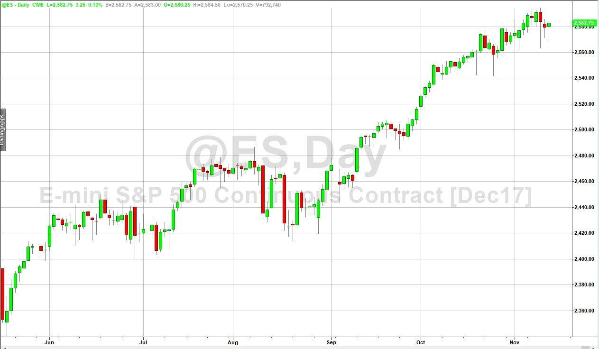

Algorithmic trading has significantly transformed futures markets, particularly in how contracts like the E-mini S&P 500—often referred to as ES futures—are traded. Introduced by the Chicago Mercantile Exchange (CME) in 1997, the E-mini S&P 500 futures contracts represent a fraction of the larger, standard S&P 500 futures contracts, thus making them more accessible to a broader range of individual traders. This democratization of access has not only widened participation but also enhanced market liquidity, a critical factor that underpins effective algorithmic trading strategies.

ES futures are integral to algorithmic trading due to their inherent liquidity, volatility, and the ease of access they offer. Liquidity ensures that market participants can buy and sell contracts with minimal price disruption, which is crucial for the fast-paced, high-volume trades typical of algorithmic strategies. Furthermore, the inherent volatility of ES futures, driven by their linkage to the S&P 500, a benchmark index for U.S. equities, provides abundant opportunities for profit generation. This volatility stems from the index's sensitivity to macroeconomic indicators, corporate earnings, and geopolitical events, thereby offering ample trading opportunities for algorithms engineered to exploit short-term pricing inefficiencies.



The accessibility of ES futures is bolstered by round-the-clock trading made possible via the Globex electronic trading platform, allowing for continuous trading options and the ability to quickly respond to new information. This accessibility is vital for executing time-sensitive algorithmic trades, which may capitalize on price movements that occur outside of regular U.S. market hours.

In this article, we explore various futures trading strategies within the ES market, examining how distinct algorithmic methodologies such as trend-following, breakout, and mean reversion strategies harness the characteristics of ES futures to achieve trading objectives. Through this examination, we aim to shed light on the essential components that contribute to successful algorithmic trading in the dynamic and highly competitive landscape of ES futures.

## Table of Contents

## Understanding ES Futures

The E-mini S&P 500 futures contract, commonly referred to as ES futures, is a derivative financial instrument traded on the Chicago Mercantile Exchange (CME). It is designed to emulate the movement of the broader S&P 500 index, providing traders with a vehicle for speculating on or hedging against changes in market conditions. Significantly smaller than the standard S&P 500 futures contract, E-mini contracts reduce the barrier to entry for retail traders, hence democratizing access to futures markets. 

Introduced in 1997, the ES futures contract quickly gained popularity due to its smaller contract size and reduced margin requirements, which made it accessible to a broader set of investors, including individual retail traders who might otherwise be unable to afford the full-sized contracts. Each ES contract represents one-fifth of the standard S&P 500 futures contract, making it a more manageable investment for smaller traders.

The [liquidity](/wiki/liquidity-risk-premium) of ES futures is a key characteristic of its trading environment. With millions of contracts traded daily, the ES futures market offers deep liquidity, which facilitates efficient price discovery and allows traders to enter and [exit](/wiki/exit-strategy) positions with minimal price impact. The high level of trading [volume](/wiki/volume-trading-strategy) also implies tighter bid-ask spreads, which reduces trading costs for participants.

Another feature of ES futures is their active trading sessions, which cover almost the entire week. These contracts are predominantly traded through the CME Globex platform, an electronic trading system that operates nearly 24 hours a day. This continuous trading window provides unparalleled flexibility, allowing traders to respond promptly to news and events that occur outside traditional market hours, including international developments that may impact U.S. market indices.

Overall, the characteristics of ES futures, such as their accessibility, liquidity, and extended trading hours, make them a popular choice for traders looking to gain exposure to the S&P 500 index through a versatile and efficient derivative instrument.

## Trading Strategies for ES Futures

Successful ES futures trading strategies often involve a well-rounded approach that integrates both technical and fundamental analyses. 

**Trend-following Strategies**

Trend-following strategies are predicated on the notion that assets in motion tend to continue moving in the same direction. These strategies capitalize on broader market trends, utilizing key technical indicators and statistical tools to identify and execute trades that align with existing market [momentum](/wiki/momentum). The moving average is a particularly vital tool in this realm. For example, a trader might employ a simple moving average (SMA), which computes the average price of a security over a specified number of periods. If the price is consistently above the average, it suggests an upward trend, whereas a price consistently below the average indicates a downward trend. A crossover of short-term moving averages above long-term averages may signal a buying opportunity, while the opposite could indicate a potential sell.

```python
# Example of calculating simple moving average in Python

import pandas as pd

# Creating a pandas DataFrame with sample price data
data = {'Date': pd.date_range(start='2023-01-01', periods=100),
        'Price': pd.Series(range(100, 200))}

df = pd.DataFrame(data)

# Calculate the 20-day simple moving average
df['20_SMA'] = df['Price'].rolling(window=20).mean()

# Determine if an uptrend or downtrend based on moving averages
df['Signal'] = 0.0
df['Signal'][20:] = np.where(df['Price'][20:] > df['20_SMA'][20:], 1.0, 0.0)  # 1 for buy signal, 0 for sell signal
```

**Breakout Strategies**

Breakout strategies aim to exploit volatile movements in the market by entering positions when prices move beyond established support and resistance levels. These levels represent the ceiling and floor of short-term price movements, and a [breakout](/wiki/breakout-trading) beyond these points often signals the beginning of a new trend. Traders might look for price consolidation followed by a breakout, often confirmed with increased volume, as an indicator to enter a trade. An established method for implementing this is to set entry points a certain percentage away from these levels and employ stop-loss orders to manage risk.

**Mean Reversion Strategies**

Mean reversion strategies operate on the principle that prices will revert to their historical averages or mean following substantial deviation. These strategies often involve statistical analysis, whereby a trader identifies periods when a security has strayed significantly from its average, anticipating a reversal back towards the mean. Indicators such as Bollinger Bands can be instrumental here; they plot standard deviations above and below a moving average to create price bands. When prices reach the outer bands, it may signal overbought or oversold conditions, suggesting a potential reversal to the mean.

```python
# Example of calculating Bollinger Bands in Python

# Calculate the 20-day simple moving average
df['20_SMA'] = df['Price'].rolling(window=20).mean()

# Calculate Bollinger Bands (with 2 standard deviations)
df['Upper Band'] = df['20_SMA'] + (2 * df['Price'].rolling(window=20).std())
df['Lower Band'] = df['20_SMA'] - (2 * df['Price'].rolling(window=20).std())

# Identifying overbought/oversold conditions
df['Position'] = np.where(df['Price'] > df['Upper Band'], 'Sell', np.where(df['Price'] < df['Lower Band'], 'Buy', 'Hold'))
```

Each strategy offers distinct advantages and potential drawbacks, necessitating thorough testing and refinement before real-world application. Precision, discipline, and the ability to adapt to evolving market conditions are crucial for the successful execution of these strategies.

## Algorithmic Trading in ES Futures

Algorithmic trading in ES futures utilizes advanced computational techniques to exploit market opportunities through speed, efficiency, and precision. By executing trades based on predefined numerical parameters, algorithmic systems significantly reduce the influence of human emotions, which often lead to impulsive decision-making. These algorithms operate on various sophisticated models including market profile analysis, which examines the volume at specific price levels to identify trading ranges and potential reversals. Additionally, order flow evaluation studies the sequence and size of orders to gauge market liquidity and potential price movements.

High-frequency trading ([HFT](/wiki/high-frequency-trading-strategies)) is one of the most prominent forms of [algorithmic trading](/wiki/algorithmic-trading) employed with ES futures. This approach benefits from the ability to execute a high volume of trades at incredibly fast speeds, often seeking to capture small profit margins over numerous trades. The technology utilized in HFT includes cutting-edge hardware and infrastructure to minimize latency, as even nanoseconds can impact trade profitability.

An essential component of successful algorithmic trading is the vast availability of datasets, which are used for [backtesting](/wiki/backtesting) and strategy optimization. By simulating a trading strategy on historical data, traders can assess its potential profitability and refine it for better performance. This involves adjusting the parameters of the algorithm to improve key performance metrics. Python, with its libraries such as NumPy and pandas, provides a versatile environment for developing and testing these algorithmic strategies.

Here is a simple Python code snippet for backtesting a moving average crossover strategy on ES futures:

```python
import pandas as pd
import numpy as np

# Load historical data
data = pd.read_csv('ES_futures_data.csv', parse_dates=['Date'])
data['SMA_50'] = data['Close'].rolling(window=50).mean()
data['SMA_200'] = data['Close'].rolling(window=200).mean()

# Determine buy and sell signals
data['Signal'] = np.where(data['SMA_50'] > data['SMA_200'], 1, 0)
data['Position'] = data['Signal'].diff()

# Calculate returns
data['Strategy_Returns'] = data['Position'].shift(1) * data['Close'].pct_change()

# Display cumulative returns
cumulative_returns = (1 + data['Strategy_Returns']).cumprod()
print(cumulative_returns)
```

In conclusion, the success of algorithmic trading in ES futures relies on cutting-edge technology, comprehensive data analysis, and continuous strategy refinement to enhance trading outcomes. By ensuring high-speed execution and reducing human bias, algorithms play a pivotal role in the sophisticated landscape of futures trading.

## Risk Management in ES Futures Trading

Risk management is a fundamental component of ES futures trading, designed to limit potential losses and maintain the sustainability of trading activities. Effective risk management involves the application of various tools and techniques, each contributing to safeguarding investments.

Stop-loss orders serve as a primary risk management tool by setting predetermined prices at which an open position is automatically closed, thereby preventing further losses beyond acceptable thresholds. For instance, if a trader enters a position anticipating a favorable price movement, a stop-loss order can be placed at a certain percentage below the entry price to limit downside risk.

Position sizing is another critical element, determining the number of contracts traded based on the trader's risk tolerance and the size of their account. Position sizing can be mathematically modeled using the formula:

$$
\text{Position Size} = \frac{\text{Account Risk ($)}}{\text{Trade Risk (points) } \times \text{Tick Value}}
$$

This formula ensures that the trader does not expose more capital than what is considered prudent, aligning the potential loss of each trade with the overall risk management strategy.

Diversification, albeit more commonly associated with equity portfolios, is applicable in the context of ES futures as well. Traders can diversify by employing a variety of strategies or trading different time frames, reducing the impact of adverse movements in any single approach.

In algorithmic trading, automated risk management systems enhance these traditional tools by dynamically adjusting positions based on real-time market conditions. These systems can incorporate complex algorithms to monitor [volatility](/wiki/volatility-trading-strategies), liquidity, and price patterns, allowing for timely adaptation without requiring manual intervention. For example, in Python, traders might use libraries such as pandas for real-time data analysis and automate risk management processes using code snippets like:

```python
import pandas as pd

def calculate_position_size(account_balance, risk_per_trade, tick_value, trade_risk):
    return (account_balance * risk_per_trade) / (trade_risk * tick_value)

# Example usage:
account_balance = 100000  # $100,000 account
risk_per_trade = 0.01     # 1% risk per trade
tick_value = 12.5         # Tick value for ES futures
trade_risk = 2            # 2-point potential loss

position_size = calculate_position_size(account_balance, risk_per_trade, tick_value, trade_risk)
print(f'Calculated Position Size: {position_size} contracts')
```

Continuous monitoring and strategy adjustments are imperative to maintaining alignment with evolving market dynamics. The introduction of new economic data, shifts in market sentiment, or sudden geopolitical events can significantly alter trading conditions. Thus, traders need to continuously refine their strategies and risk management measures to meet these changes effectively, ensuring that they can respond to volatile conditions swiftly and maintain the integrity of their trading capital.

## Evaluating ES Futures Trading Performance

Performance evaluation in ES futures trading revolves around measuring the efficiency and profitability of trading strategies, ensuring they are sound relative to market dynamics and comparable benchmarks. Key performance metrics such as Return on Investment (ROI) and the Sharpe Ratio are frequently employed to gauge trading success.

ROI is a straightforward measure calculated as:

$$
\text{ROI} = \frac{\text{Net Profit}}{\text{Total Investment}} \times 100
$$

This metric provides insight into a strategy’s capability to generate profit from an initial investment, a critical [factor](/wiki/factor-investing) in assessing strategy performance.

The Sharpe Ratio offers a risk-adjusted return analysis, calculated with the formula:

$$
\text{Sharpe Ratio} = \frac{E[R] - R_f}{\sigma_R}
$$

where $E[R]$ represents the expected return of the portfolio, $R_f$ is the risk-free rate, and $\sigma_R$ is the standard deviation of the portfolio's excess return. A higher Sharpe Ratio indicates that a trading strategy is achieving significant returns relative to the risk undertaken.

Regular analysis of these metrics allows traders to refine strategies and enhance their risk-adjusted returns. By benchmarking against major indices like the S&P 500, traders can identify relative performance trends and adjust their strategies accordingly. This comparative analysis can reveal insights into the trading strategies' effectiveness and adaptability to market changes.

Backtesting plays a crucial role in evaluating trading performance. It involves simulating a trading strategy on historical data to understand its potential efficacy. However, past performance is not always indicative of future results, making real-time performance monitoring essential. This ongoing evaluation helps traders to adapt strategies dynamically in response to current market conditions.

For robust performance assessment, implementing a programmatic approach can be advantageous. Below is a basic Python script for calculating ROI and Sharpe Ratio given historical trading returns data:

```python
import numpy as np

def calculate_roi(net_profit, total_investment):
    """ Calculate Return on Investment (ROI). """
    return (net_profit / total_investment) * 100

def calculate_sharpe_ratio(returns, risk_free_rate):
    """ Calculate Sharpe Ratio. """
    excess_returns = returns - risk_free_rate
    return np.mean(excess_returns) / np.std(excess_returns)

# Example usage:
returns = np.array([0.02, 0.03, -0.01, 0.04, 0.01])  # Daily returns
risk_free_rate = 0.01 / 252  # Daily risk-free rate
net_profit = 1000  # Example net profit
total_investment = 5000  # Example total investment

roi = calculate_roi(net_profit, total_investment)
sharpe_ratio = calculate_sharpe_ratio(returns, risk_free_rate)

print(f"ROI: {roi}%")
print(f"Sharpe Ratio: {sharpe_ratio}")
```

This script highlights the practicality of utilizing mathematical calculations and programming to evaluate ES futures trading performance. Both historical backtesting and real-time monitoring tools are necessary to ensure strategies remain viable and aligned with trading objectives, considering both profits and risks involved.

## Conclusion

The integration of algorithmic trading strategies with E-mini S&P 500 (ES) futures offers a promising and dynamic landscape for market participants. Traders can gain a significant edge through these strategies by leveraging the deep liquidity and high volatility characteristic of ES futures. Success in this environment requires a comprehensive understanding of market mechanics, alongside robust and adaptable strategies that are responsive to evolving conditions.

Key to thriving in ES futures trading is a systematic approach toward risk management, ensuring that potential losses are limited through tools like stop-loss orders and automated risk management systems. Adaptability is crucial, as market conditions can pivot rapidly, necessitating continuous innovation and strategic evolution.

Moreover, technological advancements have democratized access to powerful trading tools and data, allowing both novice and seasoned traders to design and optimize algorithms tailored to their specific trading objectives. The capacity for real-time data analysis, backtesting, and strategy refinement enhances the ability to achieve risk-adjusted returns.

Ultimately, ES futures present a fertile ground for traders committed to harnessing both market opportunities and technological capabilities. By aligning their strategies with market dynamics and technological progress, traders can effectively pursue and realize their trading goals within the ES futures market.

## References & Further Reading

[1]: Makridakis, S., & Hibon, M. (2000). ["The M3-Competition: results, conclusions and implications."](https://www.sciencedirect.com/science/article/pii/S0169207000000571) International Journal of Forecasting.

[2]: Aldridge, I. (2013). ["High-Frequency Trading: A Practical Guide to Algorithmic Strategies and Trading Systems"](https://www.wiley.com/en-us/High+Frequency+Trading%3A+A+Practical+Guide+to+Algorithmic+Strategies+and+Trading+Systems%2C+2nd+Edition-p-9781118343500). Wiley Finance.

[3]: Chan, E. (2013). ["Algorithmic Trading: Winning Strategies and Their Rationale"](https://github.com/hudson-and-thames/arbitragelab/blob/master/docs/source/cointegration_approach/cointegration_tests.rst). Wiley Trading.

[4]: Derman, E. (2004). ["My Life as a Quant: Reflections on Physics and Finance"](https://www.wiley.com/en-us/My+Life+as+a+Quant%3A+Reflections+on+Physics+and+Finance-p-9780470192733). Wiley.

[5]: Hull, J. (2017). ["Options, Futures, and Other Derivatives"](https://www.amazon.com/Options-Futures-Other-Derivatives-9th/dp/0133456315). Pearson.