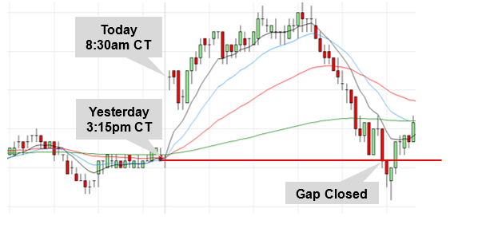

## Table of Contents

## What are E-mini futures and how do they work?

E-mini futures are smaller versions of standard futures contracts that allow traders to speculate on the future value of an asset, like the S&P 500 index. They were introduced by the Chicago Mercantile Exchange (CME) to make futures trading more accessible to individual investors who might not have the capital to trade larger, standard futures contracts. E-mini contracts are typically one-fifth the size of their standard counterparts, making them more affordable and easier to manage.

Trading E-mini futures works similarly to trading other futures contracts. When you buy an E-mini futures contract, you're agreeing to buy the underlying asset at a set price on a specific future date. However, most traders don't actually take delivery of the asset; instead, they close their positions before the contract expires, either making a profit or a loss based on the price movement of the asset. E-mini futures are traded electronically on the CME Globex platform, which allows for trading almost 24 hours a day, providing flexibility for traders around the world.

## What are the benefits of trading E-mini futures?

Trading E-mini futures has several benefits. One big advantage is that they are smaller than regular futures contracts. This means you don't need a lot of money to start trading. E-mini futures are about one-fifth the size of standard futures, so they are easier for regular people to afford. This smaller size also means you can manage your risk better because you're not putting as much money on the line.

Another benefit is that E-mini futures are very liquid. This means there are always a lot of people buying and selling them, so you can easily get in and out of trades. It also means you can usually trade at the price you want. Plus, E-mini futures are traded almost all the time on the CME Globex platform. This gives you the flexibility to trade whenever you want, even outside of regular market hours.

## How can beginners start trading E-mini futures?

To start trading E-mini futures, beginners first need to open an account with a futures broker. This broker should be reputable and offer access to the CME Globex platform, where E-mini futures are traded. Once the account is set up, beginners will need to deposit enough money to meet the broker's minimum requirements and the margin needed for trading E-mini futures. Margin is like a deposit that lets you trade with borrowed money, but it's important to understand that trading on margin can increase both your potential profits and losses.

After setting up the account and funding it, beginners should start by learning as much as they can about E-mini futures. This includes understanding how futures contracts work, the risks involved, and basic trading strategies. Many brokers offer educational resources, webinars, and demo accounts where you can practice trading without risking real money. It's wise to start small, trading with just a little bit of money until you get the hang of it. Remember, trading E-mini futures can be risky, so it's important to only trade with money you can afford to lose.

## What are the basic strategies for E-mini trading?

One basic strategy for E-mini trading is called [trend following](/wiki/trend-following). This means you watch the market to see which way prices are moving, up or down. If you see prices going up, you buy E-mini contracts hoping they will keep going up so you can sell them later for a profit. If prices are going down, you might sell E-mini contracts, betting they will keep falling so you can buy them back later at a lower price. It's all about trying to ride the trend as long as it lasts.

Another strategy is called [scalping](/wiki/gamma-scalping). This is when you make lots of small trades in a short time, trying to make a little bit of money on each trade. You might buy an E-mini contract and then sell it just a few minutes later if the price goes up a bit. Scalping works best in markets that move a lot, because you need those small price changes to make a profit. It can be exciting but also stressful because you need to watch the market closely all the time.

A third strategy is called range trading. This is when you notice that the price of an E-mini contract stays between two levels for a while. You might buy the contract near the bottom of the range and sell it near the top, then repeat this over and over. Range trading can be good when the market isn't moving a lot, but you need to be careful because the price can suddenly break out of the range and go up or down a lot, which can hurt your trades.

## How do market trends and economic indicators affect E-mini trading?

Market trends and economic indicators play a big role in E-mini trading. When the market is going up, like during a bull market, traders might feel more confident and buy more E-mini contracts, hoping to make money as prices keep rising. On the other hand, if the market is going down, like in a bear market, traders might sell E-mini contracts, expecting prices to keep falling. Trends can last for a long time, so following them can be a good way to make trading decisions.

Economic indicators, like unemployment rates, inflation, and GDP growth, also affect E-mini trading. If these indicators show the economy is doing well, traders might buy more E-mini contracts because they think the market will go up. But if the indicators show the economy is struggling, traders might sell their contracts, expecting the market to go down. Keeping an eye on these indicators can help traders guess where the market might be headed next.

## What are the common mistakes to avoid in E-mini trading?

One common mistake in E-mini trading is not having a clear plan. A lot of beginners jump into trading without really knowing what they're doing. They might trade too much, or they might not set clear goals for when to buy or sell. It's important to have a strategy and stick to it, otherwise you can end up losing money because you're making decisions based on feelings instead of a plan.

Another mistake is not managing risk properly. Trading E-mini futures can be risky, and if you don't know how to handle that risk, you can lose a lot of money. For example, some people don't use stop-loss orders, which can help limit losses if the market moves against them. It's also important to only trade with money you can afford to lose, and not to put all your money into one trade. By managing risk carefully, you can protect yourself from big losses.

Lastly, overtrading is a big problem for many new traders. They might see the market moving and feel like they need to make a trade right away, even if it doesn't fit their plan. This can lead to a lot of small losses that add up over time. It's better to wait for the right opportunities and not feel like you have to be trading all the time. Patience can be a big help in E-mini trading.

## How can one use technical analysis in E-mini trading strategies?

Technical analysis can help E-mini traders make better decisions by looking at charts and patterns. Traders use tools like moving averages, which show the average price of an E-mini contract over a certain time. If the price is above the moving average, it might mean the market is going up, and traders might want to buy. If the price is below the moving average, it could mean the market is going down, and traders might want to sell. Another tool is the Relative Strength Index (RSI), which shows if an E-mini contract is overbought or oversold. If the RSI is high, it might be a good time to sell because the price might go down soon. If it's low, it could be a good time to buy because the price might go up.

Support and resistance levels are also important in technical analysis. These are price levels where the E-mini contract tends to stop and change direction. If the price keeps bouncing off a certain level without breaking through, that level is called support if it's below the current price, and resistance if it's above. Traders might buy near support levels, hoping the price will go up, and sell near resistance levels, hoping the price will go down. By using these technical tools and watching the charts, traders can find good times to enter and [exit](/wiki/exit-strategy) trades, which can help them make money in E-mini trading.

## What are advanced E-mini trading strategies for experienced traders?

Experienced traders often use a strategy called [breakout](/wiki/breakout-trading) trading with E-mini futures. This means they watch for the price to break out of a certain range. If the price has been moving between two levels for a while and then suddenly goes above the top level, traders might buy, thinking the price will keep going up. If the price breaks below the bottom level, traders might sell, hoping it will keep going down. To make this strategy work better, experienced traders might use other tools like [volume](/wiki/volume-trading-strategy) indicators to see if a lot of people are trading when the breakout happens. This can help them feel more sure that the breakout is real and not just a fake move.

Another advanced strategy is called spread trading. This involves trading the difference between two E-mini contracts, like the E-mini S&P 500 and the E-mini Nasdaq. Traders look for times when one contract is moving differently from the other and try to make money from that difference. For example, if they think the E-mini S&P 500 will go up more than the E-mini Nasdaq, they might buy the S&P and sell the Nasdaq at the same time. This can be less risky than trading just one contract because it's about the difference between the two, not just the direction of one. Spread trading needs a good understanding of how different markets move together, so it's something experienced traders do well.

## How does risk management play a role in E-mini trading?

Risk management is really important in E-mini trading because it helps traders keep their money safe. One way to manage risk is by using stop-loss orders. These are like safety nets that automatically close a trade if the price goes against you by a certain amount. This can stop you from losing too much money on one trade. Another way is to not put all your money into one trade. Instead, you can spread your money out over different trades. This way, if one trade goes bad, you won't lose everything.

Another part of risk management is knowing how much you can afford to lose. Traders should only use money they don't need for other things, like bills or food. It's also a good idea to set a limit on how much you're willing to lose in a day or a week. If you hit that limit, you should stop trading for that time. By being careful with risk management, traders can keep trading without losing all their money.

## What are the psychological aspects of trading E-mini futures?

Trading E-mini futures can be exciting but also stressful. It's easy to let your feelings take over when you're trading. If the market goes against you, you might feel scared and want to sell quickly, even if it's not the best thing to do. On the other hand, if the market is going your way, you might feel too happy and keep the trade open too long, hoping to make more money. This can lead to big losses if the market suddenly changes direction. So, it's really important to keep your feelings in check and stick to your trading plan, no matter what the market is doing.

One way to handle the stress of trading is to have good habits. This means setting clear rules for when to buy and sell, and sticking to them. It also means taking breaks and not trading all the time. It's easy to get tired and make bad decisions if you're always watching the market. Talking to other traders or joining a trading group can also help, because it's good to share your experiences and learn from others. By staying calm and following your plan, you can make better decisions and be a better trader.

## How can algorithmic trading be applied to E-mini futures?

Algorithmic trading can be used with E-mini futures to make trading easier and faster. Traders can write computer programs, called algorithms, that look at market data and make trades automatically. These algorithms can follow rules set by the trader, like buying when the price goes above a certain level or selling when it goes below another level. This can help traders take advantage of small price changes quickly, which can be hard to do if you're trading by hand. Plus, algorithms can trade 24/7, so they can catch opportunities even when the trader is not watching the market.

Using algorithms for E-mini futures can also help with managing risk. Traders can set up their algorithms to use stop-loss orders, which automatically close a trade if it starts losing too much money. This can help limit losses and keep the trader's account safe. Algorithms can also spread trades out over time, so the trader doesn't put all their money into one trade. By using algorithms, traders can make their trading more disciplined and less affected by feelings, which can lead to better results in the long run.

## What are the latest trends and innovations in E-mini trading strategies?

One of the latest trends in E-mini trading is the use of [machine learning](/wiki/machine-learning) and [artificial intelligence](/wiki/ai-artificial-intelligence) (AI). Traders are using these technologies to create smarter algorithms that can learn from past data and make better trading decisions. These AI-driven strategies can spot patterns in the market that humans might miss and can adjust to new market conditions quickly. This makes trading more efficient and can help traders make more money. Many traders are now using these tools to get an edge in the fast-moving world of E-mini futures.

Another innovation in E-mini trading is the rise of social trading platforms. These platforms let traders share their strategies and trades with each other. New traders can follow and copy the trades of more experienced traders, which can help them learn faster and make better decisions. This trend is making trading more of a community activity, where people can learn from each other and work together to improve their results. It's also making it easier for beginners to start trading E-mini futures without needing a lot of experience right away.

## How do Risk Management and Trading Psychology impact trading decisions and outcomes?

Risk management is a fundamental aspect of trading e-mini futures, particularly when employing [algorithmic trading](/wiki/algorithmic-trading) strategies. Effective risk management helps in safeguarding capital, ensuring sustainability, and improving overall trading performance.

Setting stop-loss orders is one of the simplest yet most effective risk management strategies. A stop-loss order automatically exits a trade when the asset's price reaches a predetermined level, limiting potential losses. For example, if an e-mini futures contract is bought at $2,000, setting a stop-loss at $1,950 ensures that losses do not exceed $50 per contract. In algorithmic trading, these stop-loss levels can be dynamically calculated and adjusted based on market [volatility](/wiki/volatility-trading-strategies) or other predefined parameters.

Managing position sizes is another crucial risk management strategy. Traders can apply the concept of risk per trade, which limits the capital invested in any single trade, often expressed as a percentage of the trading account. A typical rule might be to risk no more than 1-2% of the trading account on a single trade. This ensures that even a series of losing trades do not drastically deplete trading capital. The position size can be calculated using the formula:

$$
\text{Position Size} = \frac{\text{Account Risk}}{\text{Trade Risk}}
$$

where Account Risk is the amount willing to risk on the account, and Trade Risk is the difference between the entry price and the stop-loss price.

The psychological aspects of trading are equally significant and can greatly influence trading success. Traders often confront emotions such as fear, greed, and overconfidence, which can lead to impulsive and irrational trading decisions. Maintaining discipline is essential, which can be enhanced through algorithmic trading by removing human emotion from trade execution. Algorithms follow predefined rules and strategies, minimizing the influence of emotional bias.

Furthermore, traders should develop a robust trading plan and adhere to it, even during periods of market stress or unexpected volatility. Regular performance reviews and the use of trading journals can help traders reflect on their decisions and improve their mental resilience.

In summary, meticulous risk management and disciplined trading psychology are vital components of successful e-mini futures trading. By implementing structured strategies for risk control and staying emotionally balanced, traders can enhance their potential for sustained success in the fast-paced financial markets.

## References & Further Reading

[1]: Garcia, R., & Gençay, R. (1999). "Market Dynamics Associated with the Trading of Futures on the Dow Jones Industrial Average Index." Journal of Empirical Finance, 6(4), 537-555. DOI: [10.1016/S0927-5398(99)00016-6](https://scholar.google.com/citations?user=XbQXaIoAAAAJ)00016-6)

[2]: Goodfellow, I., Bengio, Y., & Courville, A. (2016). ["Deep Learning."](https://link.springer.com/article/10.1007/s10710-017-9314-z) MIT Press.

[3]: Hull, J. C. (2014). ["Options, Futures, and Other Derivatives"](https://www.amazon.com/Options-Futures-Other-Derivatives-9th/dp/0133456315) (9th ed.). Pearson Education.

[4]: Chan, E. P. (2008). ["Quantitative Trading: How to Build Your Own Algorithmic Trading Business"](https://github.com/ftvision/quant_trading_echan_book) by Ernest P. Chan

[5]: Kissell, R. (2013). ["The Science of Algorithmic Trading and Portfolio Management"](https://www.sciencedirect.com/book/9780124016897/the-science-of-algorithmic-trading-and-portfolio-management) Academic Press.

[6]: Lopez de Prado, M. (2018). ["Advances in Financial Machine Learning"](https://www.amazon.com/Advances-Financial-Machine-Learning-Marcos/dp/1119482089) Wiley.