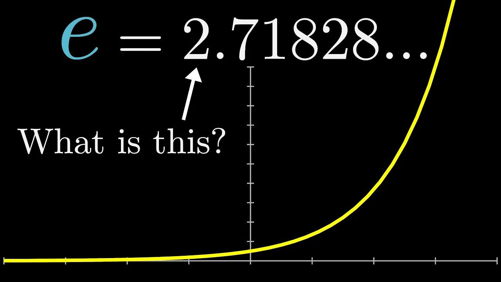

## Table of Contents

## What does the letter 'E' represent in the English alphabet?

The letter 'E' is the fifth letter in the English alphabet. It comes after 'D' and before 'F'. 'E' is a vowel, which means it's one of the letters we use to make different sounds in words.

'E' is very common in English. You can find it in many words, like 'elephant', 'easy', and 'every'. It's important because it helps us say and write a lot of things.

## How is the letter 'E' pronounced in different languages?

In English, the letter 'E' can sound different depending on the word. It can sound like 'ee' in 'see', 'eh' in 'bed', or sometimes it doesn't make a sound at all, like in 'love'. This makes 'E' a bit tricky to learn because it changes a lot.

In other languages, 'E' also changes. In Spanish, 'E' usually sounds like 'eh' in 'bed'. In French, 'E' can sound like 'uh' in 'duh' or 'ay' in 'day', depending on where it is in the word. Each language uses 'E' in its own way, so it's fun to learn how it sounds in different places.

## What is the historical origin of the letter 'E'?

The letter 'E' comes from a very old alphabet called the Phoenician alphabet. In that alphabet, there was a letter called 'he' which looked like a stick figure with arms. This 'he' sound was similar to the 'h' sound we use today. When the Greeks took the Phoenician alphabet and changed it, they turned 'he' into a letter they called 'epsilon'. Epsilon looked a bit like our 'E' but not exactly the same.

The Romans then took the Greek alphabet and made their own version, which we call the Latin alphabet. In the Latin alphabet, epsilon became the letter 'E' that we use today. The shape of 'E' got simpler over time, and it became the fifth letter in our alphabet. So, when you see an 'E', you're looking at a letter that has changed a lot over thousands of years!

## What are some common words that start with the letter 'E'?

There are many common words that start with the letter 'E'. Some of these words are 'elephant', 'easy', and 'every'. These words are used a lot in everyday talking and writing. 'Elephant' is an animal that is big and gray. 'Easy' means something that is not hard to do. 'Every' is a word we use to talk about all things in a group.

Other common 'E' words include 'eat', 'egg', and 'end'. 'Eat' is what we do when we have food. 'Egg' is something that comes from birds and we can cook it. 'End' means the last part of something. These words are simple but very useful in our language.

## How does the letter 'E' function in different parts of speech?

The letter 'E' can be found in many different parts of speech, like nouns, verbs, adjectives, and adverbs. As a noun, 'E' can start words like 'elephant' and 'egg'. These are things we can see or touch. 'E' can also be in the middle of nouns, like 'bed' and 'desk'. As a verb, 'E' can start words like 'eat' and 'end'. These are actions we do. 'E' can also be in the middle of verbs, like 'help' and 'rest'.

When 'E' is in adjectives, it can start words like 'easy' and 'every'. These words describe other things. 'E' can also be in the middle of adjectives, like 'happy' and 'pretty'. As an adverb, 'E' can start words like 'easily' and 'evenly'. These words tell us how something is done. 'E' can also be in the middle of adverbs, like 'quickly' and 'slowly'. So, 'E' is a very helpful letter that can be used in many different ways in our language.

## What are the different sounds that 'E' can make in English words?

The letter 'E' can make different sounds in English words. One common sound is like 'ee' in 'see'. Another sound is like 'eh' in 'bed'. Sometimes, 'E' can also sound like 'uh' in 'the'. It can even be silent, like in 'love' where it doesn't make any sound at all.

'E' can change its sound depending on where it is in a word. At the end of a word, like in 'cake', it can make the vowel before it say its name, so 'a' sounds like 'ay'. In the middle of words, like 'enter', it might sound like 'eh'. 'E' is a tricky letter because it can sound different in different places, but that's what makes it interesting to learn about.

## How is the letter 'E' used in scientific and mathematical notation?

In scientific notation, the letter 'E' is often used to show powers of ten. For example, if you see a number like 3E8, it means 3 times 10 to the 8th power, which is 300,000,000. This way of writing numbers is very helpful when you need to show very big or very small numbers without writing a lot of zeros. Scientists use this a lot when they talk about things like the distance between stars or the size of tiny particles.

In math, 'E' can also stand for something called Euler's number, which is about 2.71828. This number is very important in math because it shows up in many different kinds of problems, like those about growth and change. When you see 'e' in math, it usually means this special number, and it helps solve problems in a way that's easier to understand.

## What role does the letter 'E' play in coding and programming languages?

In coding and programming languages, the letter 'E' often shows up in variable names and functions. For example, you might see 'e' used as a short name for a number in a math problem, like when you're working with Euler's number. Programmers also use 'E' in names for things like error codes or events, making it easier to remember what the code is for. So, 'E' helps make the code clearer and easier to understand.

In some programming languages, 'E' can be part of special words or commands. For example, in Python, 'E' might be used in scientific notation to show very big or small numbers, just like in math. This makes it easier to write and read numbers that would be hard to write out fully. So, 'E' plays an important role in making programming more efficient and understandable.

## Can you explain the use of 'E' in phonetics and phonology?

In phonetics and phonology, the letter 'E' represents different sounds depending on the language and the position in a word. In English, 'E' can make several sounds. It can sound like 'ee' as in 'see', 'eh' as in 'bed', or 'uh' as in 'the'. Sometimes, 'E' is silent, like in 'love', where it doesn't make any sound at all. This variety of sounds makes 'E' a versatile letter in phonetics, helping to create many different words and meanings.

In phonology, 'E' is important because it can change the way other sounds around it work. For example, in English, when 'E' is at the end of a word like 'cake', it makes the vowel before it say its name, so 'a' sounds like 'ay'. This is called a 'silent E' rule. In other languages, 'E' might have different rules. For instance, in Spanish, 'E' usually sounds like 'eh' in 'bed', and it doesn't change the sounds of other letters as much as it does in English. Understanding how 'E' works in phonetics and phonology helps us learn and speak languages better.

## How has the usage of 'E' evolved in digital communication and internet slang?

In digital communication and internet slang, the letter 'E' has taken on new meanings and uses. One common way 'E' is used is in the phrase "e-" which stands for "electronic." You see this in words like "email" for electronic mail and "ebook" for electronic book. These words show how the internet and technology have changed the way we talk about things. 'E' helps make these words shorter and easier to understand.

Another way 'E' is used in internet slang is in expressions like "e-girl" or "e-boy." These terms describe people who are very active online, often on social media or gaming platforms. They might dress in a certain way or act differently online than they do in real life. 'E' in these words shows that the internet has created new kinds of identities and ways of being. So, 'E' has become a big part of how we talk about the digital world.

## What are some advanced linguistic theories about the letter 'E'?

In advanced linguistic theories, the letter 'E' is often studied for how it changes sounds in different languages. One theory is about how 'E' can affect the sounds around it. In English, when 'E' is at the end of a word, it can make the vowel before it say its name. This is called the "silent E" rule. Linguists think this happens because of how our mouths move when we say words. They study how 'E' can change the way we say other letters, which helps us understand how languages work.

Another theory looks at how 'E' is used in different languages. Some linguists believe that 'E' is one of the most common vowels because it's easy to say. It's a sound that many languages use a lot. They study how 'E' sounds different in different places, like how it sounds like 'eh' in Spanish but can sound like 'ay' in French. This helps them learn about how languages change over time and how people from different places talk to each other.

## How does the frequency of 'E' in texts affect encryption and cryptography?

In encryption and cryptography, the letter 'E' is important because it is the most common letter in many languages, like English. When people try to break codes, they often look for the letter that shows up the most. Since 'E' is used a lot, it can help them figure out the code faster. This is called frequency analysis. By seeing which letter is used the most, code-breakers can guess that it might be 'E' and start to understand the rest of the message.

To make codes harder to break, some encryption methods mix up the letters so that 'E' does not always show up the most. This is called making the text more random. By doing this, it is harder for people to use frequency analysis to crack the code. So, even though 'E' is common, good encryption tries to hide this fact to keep messages secret.

## What is Euler's Number 'e' and how can we understand it?

Euler's number 'e' is an essential mathematical constant known as the base of the natural logarithm. Its approximate value is 2.71828, but its significance extends far beyond its numerical representation. The number 'e' is integral to various mathematical fields due to its unique and fascinating properties.

One of the defining characteristics of 'e' is its representation as an infinite series. It can be expressed as the sum:

$$

e = \sum_{n=0}^{\infty} \frac{1}{n!} = 1 + \frac{1}{1} + \frac{1}{2!} + \frac{1}{3!} + \frac{1}{4!} + \cdots 
$$

This series representation highlights 'e's natural occurrence in scenarios involving growth processes and probability distributions. In financial mathematics, 'e' appears prominently in continuous compounding of interest, illustrating exponential growth and decay. The continuous compounding formula is given by:

$$

A = P \cdot e^{rt}
$$

where $A$ is the amount of money accumulated after time $t$, $P$ is the principal amount, $r$ is the rate of interest, and $t$ is the time.

Euler's number is equally important in calculus due to its role in defining exponential functions and logarithms. Functions of the form $e^x$ naturally possess the unique property where the function is equal to its derivative, making it pivotal in solving differential equations and modeling growth-related phenomena. This property is expressed as:

$$

\frac{d}{dx} e^x = e^x
$$

Euler's number is also a transcendental number, which means it is non-algebraic and cannot be the solution of any non-zero polynomial equation with rational coefficients. This characteristic makes 'e' a fundamental constant transcending basic algebraic frameworks.

In complex analysis, Euler's formula:

$$
e^{ix} = \cos(x) + i\sin(x)
$$

establishes a profound identity linking exponential functions to trigonometric functions, revealing 'e's vast application in fields requiring complex number calculations.

Overall, Euler's number 'e' is indispensable in mathematical models and further extends its utility to practical applications across various disciplines, including [algorithmic trading](/wiki/algorithmic-trading) strategies. Its foundational status in natural logarithms and exponential functions underscores its importance in understanding both mathematical theory and applied financial strategies.

## What is the role of 'e' in algorithmic trading?

In algorithmic trading, Euler's number, denoted by 'e', plays a critical role due to its intrinsic properties, enhancing various trading strategies and predictive models. The utility of 'e' is prominently seen in exponential smoothing and averaging techniques. These techniques are pivotal in developing algorithms that can efficiently filter out noise from high-frequency market data, thereby helping traders understand underlying trends more clearly.

Exponential smoothing is a crucial method in time-series forecasting, where the formula for the exponentially smoothed value at time $t$ is given by:

$$
S_t = \alpha \cdot X_t + (1 - \alpha) \cdot S_{t-1}
$$

Here, $X_t$ represents the current observation, $S_t$ is the smoothed value, the smoothing [factor](/wiki/factor-investing) $\alpha$ (0 < $\alpha$ < 1) determines the rate at which the weight for past observations decreases exponentially. This continuous decrease in weights is where Euler's number 'e' becomes essential, as it enables the decay rate in the smoothing processes.

Algorithmic models frequently incorporate 'e' to efficiently predict price movements and fluctuations in financial markets. Specifically, models such as the Black-Scholes model use Euler's number in the form of exponential functions to evaluate the expected returns and to estimate options pricing. This way, 'e' helps in calculating the present value of future cash flows in scenarios involving continuous compounding interest, enhancing the model's predictive accuracy.

Moreover, traders use functions of 'e' to construct predictive models focused on trend analysis and [momentum](/wiki/momentum) indicators. One popular example is the Exponential Moving Average (EMA), which gives more weight to recent prices and reacts more quickly to price changes than the simple moving average. The EMA is computed using the formula:

$$
EMA_t = \frac{X_t \cdot (2/(N+1)) + EMA_{t-1} \cdot (1 - (2/(N+1)))}
$$

where $N$ is the number of periods considered, and $X_t$ is the current price. This formula highlights the exponential function concept, with 'e' being the underlying driver of the weight adjustments over time. In doing so, it provides a mechanism for analyzing market sentiments and potential reversals, offering traders insights for strategic decision-making.

In summary, Euler's number 'e' serves as a fundamental constant in algorithmic trading. Its application ranges from smoothing techniques to predictive models that traders rely on to navigate financial markets. Through these mathematical constructs, 'e' enables precise and dynamic calculations necessary for algorithmic trading success.

## What are Mathematical Models and Strategies?

Exponential moving averages (EMAs) are integral to trading algorithms, leveraging the properties of Euler’s number to smooth out price data and identify trends in financial markets. The formula for calculating an EMA includes a smoothing factor, usually denoted by α, which often takes into account Euler's number. For a given period n, the smoothing factor can be expressed as:

$$
\alpha = \frac{2}{n+1}
$$

This factor determines the degree of weighting decrease, reducing the lag effect present in simple moving averages (SMA). By incorporating the value of 'e', EMAs assign exponentially greater weight to recent prices, thus making them sensitive to recent market trends.

Monte Carlo simulations are another critical area where Euler’s number plays a crucial role. These simulations utilize random sampling to predict the probability of various outcomes in financial markets. Euler's number is used in these models to accommodate the random walk hypothesis of stock prices, which posits that the movement of stock prices follows a path that maximizes entropy. The continuous compounding aspect of ‘e’ is crucial to simulate stock price movements effectively over time. This is described mathematically through the geometric Brownian motion model:

$$
S(t) = S(0) \exp\left((\mu - \frac{\sigma^2}{2}) t + \sigma W(t)\right)
$$

where $S(t)$ is the stock price at time t, $\mu$ is the drift rate, $\sigma$ is the volatility, $W(t)$ is the Wiener process, and exp represents the exponential function derived from Euler’s number.

Risk management strategies also utilize exponential functions to determine expected returns under varying market conditions. The intrinsic power of Euler's number enables the computation of expected returns via exponential growth models that account for compounding returns over time, articulated as:

$$
E(R) = R_0 \exp(rt)
$$

where $E(R)$ is the expected return, $R_0$ is the initial return, $r$ is the rate of return, and $t$ is time. This formula accounts for continuous compounding, enhancing the precision of expected returns evaluations.

Algorithmic trading systems frequently rely on continuous compounding calculations to achieve a high degree of precision in return assessments. The mathematical backbone provided by Euler’s number ensures precise and efficient execution of trades, maximizing gains by accurately predicting future price movements based on historical data. This involves running complex algorithms that model compounded returns to evaluate the effect of different trading strategies and optimize decision-making processes. Implementing such predictive models underscores the fundamental significance of Euler’s number in the architecture of modern algorithmic trading systems.

In Python, such calculations could be implemented to calculate EMAs and simulate Monte Carlo outcomes as follows:

```python
import numpy as np

def calculate_ema(prices, period):
    alpha = 2 / (period + 1)
    ema = [sum(prices[:period]) / period]  # Start with SMA
    for price in prices[period:]:
        ema.append((price - ema[-1]) * alpha + ema[-1])
    return ema

def monte_carlo_simulation(start_price, mean, sigma, num_steps, num_simulations):
    dt = 1/num_steps
    simulations = np.zeros((num_steps, num_simulations))
    simulations[0] = start_price
    for t in range(1, num_steps):
        z = np.random.standard_normal(num_simulations)
        simulations[t] = simulations[t-1] * np.exp((mean - 0.5 * sigma**2) * dt + sigma * np.sqrt(dt) * z)
    return simulations

# Example usage
prices = [1, 2, 3, 4, 5, 6, 7, 8, 9]  # Example price data
ema = calculate_ema(prices, period=3)

start_price = 100
mean = 0.001  # Daily expected return
sigma = 0.02  # Daily volatility
simulations = monte_carlo_simulation(start_price, mean, sigma, 100, 1000)
```

This code provides a practical framework for leveraging Euler's number in calculating EMAs and simulating future stock prices, showcasing the profound influence of 'e' in developing sophisticated algorithmic strategies.

## References & Further Reading

[1]: Bergstra, J., Bardenet, R., Bengio, Y., & Kégl, B. (2011). ["Algorithms for Hyper-Parameter Optimization."](https://dl.acm.org/doi/10.5555/2986459.2986743) Advances in Neural Information Processing Systems 24.

[2]: ["Advances in Financial Machine Learning"](https://www.amazon.com/Advances-Financial-Machine-Learning-Marcos/dp/1119482089) by Marcos Lopez de Prado

[3]: ["Evidence-Based Technical Analysis: Applying the Scientific Method and Statistical Inference to Trading Signals"](https://www.amazon.com/Evidence-Based-Technical-Analysis-Scientific-Statistical/dp/0470008741) by David Aronson

[4]: ["Machine Learning for Algorithmic Trading"](https://github.com/stefan-jansen/machine-learning-for-trading) by Stefan Jansen

[5]: ["Quantitative Trading: How to Build Your Own Algorithmic Trading Business"](https://www.amazon.com/Quantitative-Trading-Build-Algorithmic-Business/dp/1119800064) by Ernest P. Chan