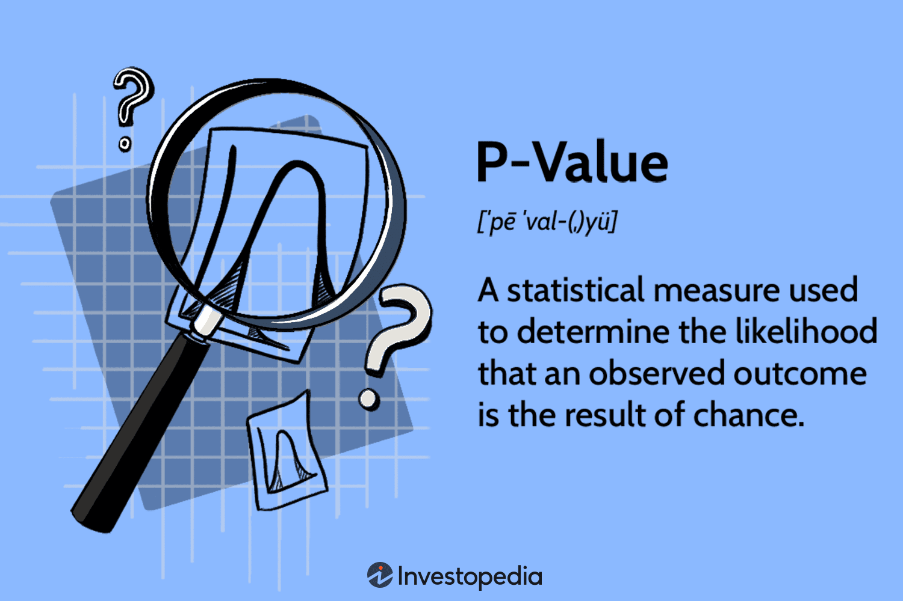

Euler's number, denoted by 'e', is an irrational and transcendental number roughly equal to 2.71828. It holds a crucial position in mathematics and various applied fields, notably calculus and complex analysis. In recent years, 'e' has also become fundamental in algorithmic trading strategies, where its properties are employed to model and predict financial market behavior.

Euler's number arises naturally in many mathematical scenarios, particularly those involving growth processes and periodic compounds in financial contexts. It is defined as the base of the natural logarithm, and its importance is underscored by the unique properties that allow it to represent continuous growth. Mathematically, 'e' can be expressed as the sum of an infinite series:



$$
e = \sum_{n=0}^{\infty} \frac{1}{n!} = 1 + \frac{1}{1} + \frac{1}{2} + \frac{1}{6} + \frac{1}{24} + \cdots
$$

In the sphere of algorithmic trading, Euler's number is pivotal, providing a foundational framework upon which many mathematical models are built. These models underpin trading algorithms that execute trades based on predefined criteria. The exponential function, with 'e' as its base, frequently appears in trading algorithms used for tasks like modeling price decay and trend analysis.

This article explores the role of Euler's number in algorithmic trading. It will examine the use of 'e' in constructing models and algorithms that enhance trading strategies by improving prediction accuracy and market analysis. By understanding how 'e' integrates into these strategies, traders and financial analysts can develop more robust and efficient trading systems. Emphasizing its applications within algorithmic trading, this discussion highlights the broader relevance of 'e' in financial mathematics.

As the landscape of algorithmic trading continues to evolve, the significance and utility of Euler's number persist, reaffirming its status as a cornerstone of financial modeling and strategy development.

## Table of Contents

## Understanding Euler's Number 'e'

Euler's number 'e' is an essential mathematical constant known as the base of the natural logarithm. Its approximate value is 2.71828, but its significance extends far beyond its numerical representation. The number 'e' is integral to various mathematical fields due to its unique and fascinating properties.

One of the defining characteristics of 'e' is its representation as an infinite series. It can be expressed as the sum:

$$

e = \sum_{n=0}^{\infty} \frac{1}{n!} = 1 + \frac{1}{1} + \frac{1}{2!} + \frac{1}{3!} + \frac{1}{4!} + \cdots 
$$

This series representation highlights 'e's natural occurrence in scenarios involving growth processes and probability distributions. In financial mathematics, 'e' appears prominently in continuous compounding of interest, illustrating exponential growth and decay. The continuous compounding formula is given by:

$$

A = P \cdot e^{rt}
$$

where $A$ is the amount of money accumulated after time $t$, $P$ is the principal amount, $r$ is the rate of interest, and $t$ is the time.

Euler's number is equally important in calculus due to its role in defining exponential functions and logarithms. Functions of the form $e^x$ naturally possess the unique property where the function is equal to its derivative, making it pivotal in solving differential equations and modeling growth-related phenomena. This property is expressed as:

$$

\frac{d}{dx} e^x = e^x
$$

Euler's number is also a transcendental number, which means it is non-algebraic and cannot be the solution of any non-zero polynomial equation with rational coefficients. This characteristic makes 'e' a fundamental constant transcending basic algebraic frameworks.

In complex analysis, Euler's formula:

$$
e^{ix} = \cos(x) + i\sin(x)
$$

establishes a profound identity linking exponential functions to trigonometric functions, revealing 'e's vast application in fields requiring complex number calculations.

Overall, Euler's number 'e' is indispensable in mathematical models and further extends its utility to practical applications across various disciplines, including [algorithmic trading](/wiki/algorithmic-trading) strategies. Its foundational status in natural logarithms and exponential functions underscores its importance in understanding both mathematical theory and applied financial strategies.

## The Role of 'e' in Algorithmic Trading

In algorithmic trading, Euler's number, denoted by 'e', plays a critical role due to its intrinsic properties, enhancing various trading strategies and predictive models. The utility of 'e' is prominently seen in exponential smoothing and averaging techniques. These techniques are pivotal in developing algorithms that can efficiently filter out noise from high-frequency market data, thereby helping traders understand underlying trends more clearly.

Exponential smoothing is a crucial method in time-series forecasting, where the formula for the exponentially smoothed value at time $t$ is given by:

$$
S_t = \alpha \cdot X_t + (1 - \alpha) \cdot S_{t-1}
$$

Here, $X_t$ represents the current observation, $S_t$ is the smoothed value, the smoothing [factor](/wiki/factor-investing) $\alpha$ (0 < $\alpha$ < 1) determines the rate at which the weight for past observations decreases exponentially. This continuous decrease in weights is where Euler's number 'e' becomes essential, as it enables the decay rate in the smoothing processes.

Algorithmic models frequently incorporate 'e' to efficiently predict price movements and fluctuations in financial markets. Specifically, models such as the Black-Scholes model use Euler's number in the form of exponential functions to evaluate the expected returns and to estimate options pricing. This way, 'e' helps in calculating the present value of future cash flows in scenarios involving continuous compounding interest, enhancing the model's predictive accuracy.

Moreover, traders use functions of 'e' to construct predictive models focused on trend analysis and [momentum](/wiki/momentum) indicators. One popular example is the Exponential Moving Average (EMA), which gives more weight to recent prices and reacts more quickly to price changes than the simple moving average. The EMA is computed using the formula:

$$
EMA_t = \frac{X_t \cdot (2/(N+1)) + EMA_{t-1} \cdot (1 - (2/(N+1)))}
$$

where $N$ is the number of periods considered, and $X_t$ is the current price. This formula highlights the exponential function concept, with 'e' being the underlying driver of the weight adjustments over time. In doing so, it provides a mechanism for analyzing market sentiments and potential reversals, offering traders insights for strategic decision-making.

In summary, Euler's number 'e' serves as a fundamental constant in algorithmic trading. Its application ranges from smoothing techniques to predictive models that traders rely on to navigate financial markets. Through these mathematical constructs, 'e' enables precise and dynamic calculations necessary for algorithmic trading success.

## Mathematical Models and Strategies

Exponential moving averages (EMAs) are integral to trading algorithms, leveraging the properties of Euler’s number to smooth out price data and identify trends in financial markets. The formula for calculating an EMA includes a smoothing factor, usually denoted by α, which often takes into account Euler's number. For a given period n, the smoothing factor can be expressed as:

$$
\alpha = \frac{2}{n+1}
$$

This factor determines the degree of weighting decrease, reducing the lag effect present in simple moving averages (SMA). By incorporating the value of 'e', EMAs assign exponentially greater weight to recent prices, thus making them sensitive to recent market trends.

Monte Carlo simulations are another critical area where Euler’s number plays a crucial role. These simulations utilize random sampling to predict the probability of various outcomes in financial markets. Euler's number is used in these models to accommodate the random walk hypothesis of stock prices, which posits that the movement of stock prices follows a path that maximizes entropy. The continuous compounding aspect of ‘e’ is crucial to simulate stock price movements effectively over time. This is described mathematically through the geometric Brownian motion model:

$$
S(t) = S(0) \exp\left((\mu - \frac{\sigma^2}{2}) t + \sigma W(t)\right)
$$

where $S(t)$ is the stock price at time t, $\mu$ is the drift rate, $\sigma$ is the volatility, $W(t)$ is the Wiener process, and exp represents the exponential function derived from Euler’s number.

Risk management strategies also utilize exponential functions to determine expected returns under varying market conditions. The intrinsic power of Euler's number enables the computation of expected returns via exponential growth models that account for compounding returns over time, articulated as:

$$
E(R) = R_0 \exp(rt)
$$

where $E(R)$ is the expected return, $R_0$ is the initial return, $r$ is the rate of return, and $t$ is time. This formula accounts for continuous compounding, enhancing the precision of expected returns evaluations.

Algorithmic trading systems frequently rely on continuous compounding calculations to achieve a high degree of precision in return assessments. The mathematical backbone provided by Euler’s number ensures precise and efficient execution of trades, maximizing gains by accurately predicting future price movements based on historical data. This involves running complex algorithms that model compounded returns to evaluate the effect of different trading strategies and optimize decision-making processes. Implementing such predictive models underscores the fundamental significance of Euler’s number in the architecture of modern algorithmic trading systems.

In Python, such calculations could be implemented to calculate EMAs and simulate Monte Carlo outcomes as follows:

```python
import numpy as np

def calculate_ema(prices, period):
    alpha = 2 / (period + 1)
    ema = [sum(prices[:period]) / period]  # Start with SMA
    for price in prices[period:]:
        ema.append((price - ema[-1]) * alpha + ema[-1])
    return ema

def monte_carlo_simulation(start_price, mean, sigma, num_steps, num_simulations):
    dt = 1/num_steps
    simulations = np.zeros((num_steps, num_simulations))
    simulations[0] = start_price
    for t in range(1, num_steps):
        z = np.random.standard_normal(num_simulations)
        simulations[t] = simulations[t-1] * np.exp((mean - 0.5 * sigma**2) * dt + sigma * np.sqrt(dt) * z)
    return simulations

# Example usage
prices = [1, 2, 3, 4, 5, 6, 7, 8, 9]  # Example price data
ema = calculate_ema(prices, period=3)

start_price = 100
mean = 0.001  # Daily expected return
sigma = 0.02  # Daily volatility
simulations = monte_carlo_simulation(start_price, mean, sigma, 100, 1000)
```

This code provides a practical framework for leveraging Euler's number in calculating EMAs and simulating future stock prices, showcasing the profound influence of 'e' in developing sophisticated algorithmic strategies.

## Conclusion

Euler's number, $e$, is indispensable in refining algorithmic trading strategies due to its unique mathematical characteristics. Its applications facilitate enhanced prediction, testing, and analysis of financial models and systems. By offering a natural basis for exponential growth and decay, $e$ allows traders to develop more accurate and reliable models for price movements and market trends.

As a constant, $e$ serves as the backbone for many complex algorithmic strategies. Its integration into mathematical models helps mitigate risk and optimize returns, a critical function in the high-stakes environment of financial trading. For instance, exponential moving averages, a staple in trading algorithms, depend on $e$ for smoothing data to better detect market trends.

The predictive power of $e$ also extends to complex computational models such as Monte Carlo simulations, which rely on its properties to estimate the probability distribution of future price movements. Additionally, continuous compounding, leveraging $e$, aids in precise calculations of potential returns, providing traders with a significant edge.

As algorithmic trading strategies evolve with technology and data analysis, the importance of Euler’s number in financial mathematics continues to be critical. It supports the creation of more sophisticated models and strategies, enabling traders to make informed decisions in dynamic market conditions. Euler’s number $e$ is thus a cornerstone in the advancement of algorithmic trading, ensuring that strategies remain robust, adaptable, and mathematically sound.

## References & Further Reading

[1]: Bergstra, J., Bardenet, R., Bengio, Y., & Kégl, B. (2011). ["Algorithms for Hyper-Parameter Optimization."](https://dl.acm.org/doi/10.5555/2986459.2986743) Advances in Neural Information Processing Systems 24.

[2]: ["Advances in Financial Machine Learning"](https://www.amazon.com/Advances-Financial-Machine-Learning-Marcos/dp/1119482089) by Marcos Lopez de Prado

[3]: ["Evidence-Based Technical Analysis: Applying the Scientific Method and Statistical Inference to Trading Signals"](https://www.amazon.com/Evidence-Based-Technical-Analysis-Scientific-Statistical/dp/0470008741) by David Aronson

[4]: ["Machine Learning for Algorithmic Trading"](https://github.com/stefan-jansen/machine-learning-for-trading) by Stefan Jansen

[5]: ["Quantitative Trading: How to Build Your Own Algorithmic Trading Business"](https://www.amazon.com/Quantitative-Trading-Build-Algorithmic-Business/dp/1119800064) by Ernest P. Chan