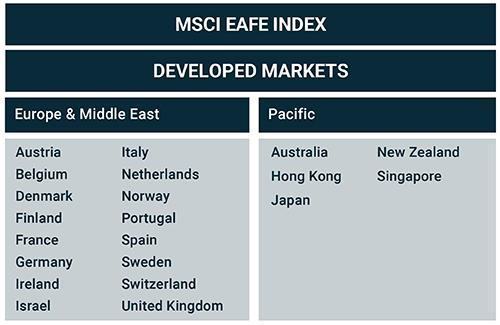

## Table of Contents

## What is the EAFE Index?

The EAFE Index is a stock market index that tracks the performance of stocks from developed countries outside of North America. It stands for Europe, Australasia, and the Far East. This index is important because it helps investors see how well companies in these regions are doing compared to companies in the U.S. and Canada.

The EAFE Index was created by Morgan Stanley Capital International (MSCI) and includes companies from countries like Japan, the United Kingdom, France, Germany, and Australia. It is used by investors who want to diversify their investments by putting money into international stocks. By looking at the EAFE Index, investors can understand trends and make better decisions about where to invest their money.

## Which countries are included in the EAFE Index?

The EAFE Index includes countries from Europe, Australasia, and the Far East. Some of the countries in Europe that are part of the index are the United Kingdom, France, Germany, Switzerland, and Italy. These countries have big economies and many companies that people can invest in.

In Australasia, the countries included are Australia and New Zealand. Australia has a lot of big companies, especially in mining and banking, which are part of the index. From the Far East, Japan is a major country in the EAFE Index. Japan has many big companies in electronics, cars, and other industries. Other countries in the Far East that are part of the index are Hong Kong and Singapore.

Overall, the EAFE Index covers a wide range of countries to give investors a good look at how stocks are doing outside of North America. It helps them see how well companies in these different places are doing and decide where to put their money.

## How is the EAFE Index calculated?

The EAFE Index is calculated by looking at the stock prices of companies from different countries in Europe, Australasia, and the Far East. Each company in the index has a certain weight, which means some companies affect the index more than others. The weight of each company depends on how big the company is, measured by its total value in the stock market. When the stock prices of these companies go up or down, the index changes to show how the whole group is doing.

The index is updated every day to show the latest stock prices. To calculate the index, you take the total value of all the companies in the index and divide it by a special number called the divisor. This divisor helps keep the index fair and accurate even when companies are added or removed, or when there are big changes like stock splits. By doing this calculation every day, the EAFE Index gives investors a clear picture of how well stocks in these regions are doing compared to other parts of the world.

## What are the main sectors represented in the EAFE Index?

The EAFE Index includes companies from many different kinds of businesses, called sectors. Some of the biggest sectors in the EAFE Index are financials, which include banks and insurance companies, and industrials, which include companies that make things like machinery and airplanes. These sectors are important because they have a lot of big companies that affect the index a lot.

Other important sectors in the EAFE Index are consumer goods, which include companies that make things people buy every day like food and clothes, and healthcare, which includes companies that make medicines and medical equipment. Technology is also a big sector, with companies that make computers, software, and other tech products. These sectors show how diverse the companies in the EAFE Index are, covering many different parts of the economy.

## How does the EAFE Index differ from other global indices?

The EAFE Index is different from other global indices because it only looks at developed countries outside of North America. This means it includes places like Europe, Australia, and Japan, but not the United States or Canada. Other global indices, like the MSCI World Index, include companies from all over the world, including North America. So, if you want to see how companies in Europe, Australia, and Japan are doing without the influence of North American companies, the EAFE Index is the right one to use.

Another way the EAFE Index is different is that it focuses on developed markets, not emerging markets. Emerging markets are countries that are still growing and developing their economies, like Brazil, China, and India. The EAFE Index leaves these countries out and only includes countries with strong, stable economies. In contrast, indices like the MSCI Emerging Markets Index focus on these growing countries. This makes the EAFE Index a good choice for investors who want to invest in stable, developed countries outside of North America.

## What are the historical performance trends of the EAFE Index?

Over the years, the EAFE Index has had ups and downs just like any other stock market index. It has generally grown over time, but there have been some big drops during tough economic times. For example, during the global financial crisis in 2008, the EAFE Index lost a lot of value, but it bounced back in the following years. The index also faced challenges during the European debt crisis around 2010-2012, but it managed to recover over time. These ups and downs show how the index can be affected by big events around the world.

In the long run, the EAFE Index has provided good returns for investors who were willing to stay invested through the tough times. For example, over the last 20 years, the index has had an average annual return of around 5-6%. This means that if you had invested in the EAFE Index 20 years ago, your money would have grown at a steady pace over that time. However, it's important to remember that past performance does not guarantee future results, and the index can still be affected by economic and political events in the countries it covers.

## How can investors use the EAFE Index to diversify their portfolios?

Investors can use the EAFE Index to diversify their portfolios by putting some of their money into stocks from countries outside of North America. When you invest in the EAFE Index, you are spreading your money across many different companies in Europe, Australia, and Japan. This can help reduce the risk because if one company or one country's economy does badly, the other companies and countries might do well and balance things out. By doing this, investors can have a more stable investment over time.

Another way the EAFE Index helps with diversification is by including different sectors like financials, industrials, consumer goods, healthcare, and technology. When you invest in the EAFE Index, you are not just putting your money into one type of business. Instead, you are investing in a wide range of businesses. This means if one sector is not doing well, other sectors might be doing better, which can help keep your investment safe. So, using the EAFE Index can make your investment portfolio stronger and more balanced.

## What are the risks associated with investing in the EAFE Index?

Investing in the EAFE Index comes with some risks that investors should know about. One big risk is that the index only includes companies from developed countries outside of North America. This means if something bad happens in Europe, Australia, or Japan, like a big economic problem or a political issue, it could make the whole index go down. For example, if there's a financial crisis in Europe, it could hurt the EAFE Index a lot because many of the companies in the index are from Europe.

Another risk is that the EAFE Index can be affected by changes in currency values. When you invest in the EAFE Index, you are buying stocks in different countries, and those stocks are priced in different currencies like the Euro, the Yen, or the Australian Dollar. If the value of these currencies goes down compared to the U.S. Dollar, it can make your investment worth less, even if the stock prices themselves stay the same. This is called currency risk, and it's something investors need to think about when they invest in the EAFE Index.

## How does currency fluctuation impact the EAFE Index?

Currency fluctuation can have a big effect on the EAFE Index. When you invest in the EAFE Index, you are buying stocks from countries like Japan, Germany, and Australia. These stocks are priced in different currencies, like the Yen, the Euro, and the Australian Dollar. If the value of these currencies goes down compared to the U.S. Dollar, the stocks you own can be worth less in U.S. Dollar terms, even if the stock prices themselves stay the same. This means that currency changes can make your investment go up or down, even if the companies in the index are doing well.

On the other hand, if the currencies in the EAFE Index countries go up in value compared to the U.S. Dollar, it can make your investment worth more. For example, if the Euro gets stronger against the U.S. Dollar, the value of European stocks in the EAFE Index will be higher when you convert them back to U.S. Dollars. This can help your investment grow, even if the stock prices in Europe stay the same. So, currency fluctuations are an important thing to think about when you invest in the EAFE Index because they can change how much your investment is worth.

## What role does the EAFE Index play in global investment strategies?

The EAFE Index is an important tool for investors who want to spread their money around the world. It helps them invest in companies from developed countries outside of North America, like Europe, Australia, and Japan. By using the EAFE Index, investors can put their money into many different kinds of businesses and countries. This can help make their investment safer because if one country or one type of business does badly, the other countries and businesses might do well and balance things out.

Another way the EAFE Index helps with global investment strategies is by showing investors how well companies in these regions are doing compared to companies in North America. This can help investors make better decisions about where to put their money. For example, if the EAFE Index is doing better than the U.S. stock market, an investor might decide to put more money into the EAFE Index to take advantage of the good performance. By using the EAFE Index, investors can have a more complete picture of the global economy and make smarter choices about their investments.

## How has the composition of the EAFE Index changed over time?

The EAFE Index has changed a lot over the years. When it started, it had fewer countries and companies. Over time, more countries and companies have been added to the index to make it more complete. For example, countries like Austria, Belgium, and Finland were added later. Also, the number of companies in the index has grown to include more businesses from different countries. This helps the index show a better picture of what's happening in the stock markets of Europe, Australia, and the Far East.

The way the EAFE Index is put together has also changed. The index used to focus more on big companies in a few countries, like Japan and the UK. Now, it tries to include a wider range of companies from more countries. This makes the index more balanced and gives investors a better look at the whole region. The changes in the EAFE Index show how it tries to keep up with the changing world and give investors the best information to make their choices.

## What advanced strategies can be employed using the EAFE Index for hedging and risk management?

Investors can use the EAFE Index for hedging and risk management by creating a balanced portfolio that includes stocks from North America and the EAFE Index. If the North American market goes down, the EAFE Index might go up, helping to protect the overall value of the portfolio. This is called diversification, and it can lower the risk of losing a lot of money all at once. Another way to hedge is by using financial tools like futures or options based on the EAFE Index. These tools can help investors lock in prices or protect against big drops in the value of their investments.

Currency hedging is another important strategy for managing risk when investing in the EAFE Index. Because the EAFE Index includes stocks from countries with different currencies, changes in these currency values can affect the investment's worth. Investors can use currency hedging to protect against these changes. This means they can use financial products to make sure that even if a currency like the Euro or Yen goes down compared to the U.S. Dollar, their investment in the EAFE Index won't lose as much value. By using these strategies, investors can manage the risks of investing in the EAFE Index and make their portfolios more stable.

## What is the EAFE Index and how can it be understood?

The EAFE Index, officially known as the MSCI EAFE Index, is structured as a market-capitalization-weighted index, meaning that the constituents of the index are weighted according to their total market value. This approach is predicated on the principle that companies with higher market capitalization receive greater influence within the index. As such, countries with larger and more liquid stock markets, such as Japan and the United Kingdom, have a significant impact on the index's performance. 

The weighting scheme of the EAFE Index is determined by the formula:

$$
\text{Weight of stock } i = \frac{\text{Market cap of stock } i}{\sum \text{Market cap of all stocks in the index}}
$$

where the market cap is calculated as the product of the stock's current share price and the total number of outstanding shares. 

The index predominantly includes midcap and large-cap companies from developed nations, which are capable of reflecting a comprehensive image of the international equity environment. Midcap stocks generally have a market capitalization between $2 billion and $10 billion, while large-cap stocks exceed $10 billion. The inclusion of these stocks ensures that the index provides extensive coverage of major developed markets, excluding North America. 

By focusing on these categories, the EAFE Index offers investors exposure to established companies that represent mature markets with stable economies. This configuration is advantageous for those seeking to mitigate risk and focus on companies with a history of resilience and potential for consistent returns. The emphasis on developed markets underscores the index's alignment with investors favoring stability over high-growth prospects typically associated with emerging markets. This structure highlights the potential of the EAFE Index to serve as a reliable benchmark for assessing international equity performance, particularly for investors, asset managers, and [algorithmic trading](/wiki/algorithmic-trading) systems seeking to diversify portfolios beyond domestic constraints.

## What are the differences between EAFE and ACWI in a comparative analysis?

The EAFE Index (Europe, Australasia, and the Far East) and the MSCI All Country World Index (ACWI) both serve as benchmarks for international equity markets, yet they differ significantly in their scope and composition. The EAFE Index is focused exclusively on developed markets, encompassing 21 countries from Europe, the Pacific region, and the Middle East, excluding North America. In contrast, the ACWI offers a more comprehensive global perspective by incorporating equities from 47 countries, including both developed and emerging markets.

The inclusion of emerging markets within the ACWI provides investors with a broader range of geographic and economic exposure. These emerging markets, such as China, India, and Brazil, often represent higher growth potential compared to many developed markets. This characteristic makes the ACWI appealing for investors seeking a more aggressive growth strategy. Moreover, while the EAFE Index is exclusively tied to developed market dynamics, the ACWI accommodates both mature and developing market influences, allowing for greater diversification in terms of economic cycles, geographical risks, and currency exposure.

Mathematically, the broader coverage of the ACWI can be represented by a set inclusion relation: 

$$
\text{EAFE} \subset \text{ACWI}
$$

This equation highlights that all the constituents of the EAFE Index are part of the ACWI, with additional inclusion of equities from emerging markets.

For investors and fund managers, these differences have practical implications. Portfolios benchmarked against the EAFE Index are often characterized by lower volatility relative to the global market spectrum offered by the ACWI. However, they may miss out on the higher returns potentially achievable by tapping into emerging markets. The choice between these indices is often informed by the investor's risk tolerance, return expectations, and investment horizon.

In conclusion, while both the EAFE Index and ACWI serve as indispensable tools for evaluating international equity performance, their differing compositions and market exposures cater to varied investment objectives. The EAFE Index offers focused exposure to developed markets, while the ACWI provides a more balanced and inclusive global outlook by integrating emerging market opportunities.

## References & Further Reading

[1]: Morgan Stanley Capital International. (n.d.). ["MSCI EAFE Index."](https://www.msci.com/documents/10199/822e3d18-16fb-4d23-9295-11bc9e07b8ba) MSCI.

[2]: ["International Indexes: The MSCI EAFE Index."](https://www.msci.com/indexes/index/990300) Investopedia.

[3]: MSCI. (n.d.). ["MSCI EAFE Background."](https://www.msci.com/indexes/index/990300) MSCI.

[4]: Malkiel, B. G., & Ellis, C. D. (2019). ["The Elements of Investing."](https://www.semanticscholar.org/paper/The-Elements-of-Investing-Malkiel-Ellis/b2fab59a01cabae6002063d87f8f4773d201ff11) Wiley.

[5]: Dimson, E., Marsh, P., & Staunton, M. (2002). ["Triumph of the Optimists: 101 Years of Global Investment Returns."](https://www.jstor.org/stable/j.ctt5hhpkq) Princeton University Press.