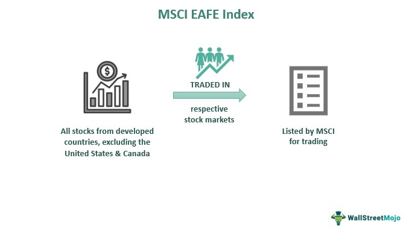

The EAFE Index, introduced by Morgan Stanley Capital International (MSCI), stands as a key performance benchmark for international stock markets. This index encompasses companies from developed nations in Europe, Australasia, and the Far East, deliberately excluding those from the U.S. and Canada. Such exclusion allows investors to focus on truly international diversification outside of North American markets.

Serving as an indispensable tool, the EAFE Index provides investors with a pathway to gain diversified exposure across various developed markets. Its structure is designed to help mitigate risk by including a balanced representation from these regions. Additionally, the index's wide adoption and sustained relevance underscore its functionality across various investment strategies, including algorithmic trading, where it aids in performance assessment and strategy development.



This article will examine the structure, benefits, and limitations of the EAFE Index while highlighting its increasing role in algorithmic trading. Through this exploration, the content aims to offer insights into how the EAFE Index can be utilized effectively by investors and traders seeking to enhance their international market exposure and strategic approaches.

## Table of Contents

## What Is the EAFE Index?

The EAFE Index, an acronym for Europe, Australasia, and the Far East, is a pivotal benchmark in international equity markets. This index was introduced by Morgan Stanley Capital International (MSCI) in 1986, establishing itself as one of the oldest international stock indices globally. Its composition includes 21 developed countries, featuring 795 stocks, thus offering a comprehensive representation of developed markets outside North America.

One of the significant attributes of the EAFE Index is its extensive market representation, which captures the economic landscapes of regions like Europe, the Pacific region, and parts of the Far East. By concentrating on developed markets, the index excludes North America—specifically the United States and Canada—focusing instead on economies that have established financial market infrastructure, regulatory frameworks, and corporate governance standards. 

Investors and financial analysts widely utilize the EAFE Index to gain insights into the performance of international developed equity markets, facilitating informed decision-making in global investment strategies. The index's structure allows it to serve as a point of comparison to other market indices and as a benchmark for various international mutual funds and exchange-traded funds (ETFs), tracking the performance of developed foreign markets.

## Understanding the EAFE Index

The EAFE Index, officially known as the MSCI EAFE Index, is structured as a market-capitalization-weighted index, meaning that the constituents of the index are weighted according to their total market value. This approach is predicated on the principle that companies with higher market capitalization receive greater influence within the index. As such, countries with larger and more liquid stock markets, such as Japan and the United Kingdom, have a significant impact on the index's performance. 

The weighting scheme of the EAFE Index is determined by the formula:

$$
\text{Weight of stock } i = \frac{\text{Market cap of stock } i}{\sum \text{Market cap of all stocks in the index}}
$$

where the market cap is calculated as the product of the stock's current share price and the total number of outstanding shares. 

The index predominantly includes midcap and large-cap companies from developed nations, which are capable of reflecting a comprehensive image of the international equity environment. Midcap stocks generally have a market capitalization between $2 billion and $10 billion, while large-cap stocks exceed $10 billion. The inclusion of these stocks ensures that the index provides extensive coverage of major developed markets, excluding North America. 

By focusing on these categories, the EAFE Index offers investors exposure to established companies that represent mature markets with stable economies. This configuration is advantageous for those seeking to mitigate risk and focus on companies with a history of resilience and potential for consistent returns. The emphasis on developed markets underscores the index's alignment with investors favoring stability over high-growth prospects typically associated with emerging markets. This structure highlights the potential of the EAFE Index to serve as a reliable benchmark for assessing international equity performance, particularly for investors, asset managers, and [algorithmic trading](/wiki/algorithmic-trading) systems seeking to diversify portfolios beyond domestic constraints.

## Countries and Composition of the EAFE Index

The EAFE Index encompasses a range of developed countries from Europe, the Pacific region, and the Middle East, showcasing a broad spectrum of international markets. Notable countries included are Japan, the United Kingdom, France, Germany, and Israel. This selection represents a significant portion of the global economy, providing substantial coverage of established markets outside North America.

The composition of the EAFE Index is not only geographically diverse but also reflects a variety of sectors. Financials, industrials, healthcare, and consumer discretionary sectors are among the prominent areas represented within the index. This sector allocation offers investors a comprehensive view of market dynamics, as these sectors are foundational to the economies of the included countries. 

The financial sector is often heavily weighted, reflecting the significance of banking and financial services industries in countries like the UK and Japan. Industrials constitute another major component, with manufacturing powerhouses such as Germany contributing significantly to the index. Healthcare and consumer discretionary sectors provide insights into consumer trends and healthcare developments, particularly in European nations and Japan.

Overall, the EAFE Index serves as a robust indicator of cross-border investment opportunities, thanks to its inclusion of multiple countries and sectors. It effectively captures the economic activities of prominent developed markets, allowing investors to gain exposure to an array of industries that drive international economic growth.

## Advantages and Disadvantages of the EAFE Index

The EAFE Index, representing Europe, Australasia, and the Far East, is renowned for its broad diversification. By encompassing 21 developed countries, it provides investors with significant international exposure, thereby reducing the specific risks associated with investing in a single market. This diversification is crucial for mitigating [volatility](/wiki/volatility-trading-strategies), as fluctuations in one country's stock market can be counterbalanced by stability or growth in another. The market-capitalization-weighted nature of the index further supports this by ensuring that larger, more stable markets have a proportional impact on the index's performance, smoothing out potential disruptions.

Another notable advantage of the EAFE Index is the cost-effectiveness associated with passive management. Investing in a portfolio that tracks the EAFE Index often incurs lower management fees compared to actively managed funds. This reduction in costs is beneficial for investors seeking to minimize their expenses while maintaining exposure to international developed markets.

However, the EAFE Index does have limitations, one of which is its exclusion of major emerging markets such as China, India, and Brazil. These countries are significant players in the global economy, and their absence from the index restricts investors' exposure to high-growth potential markets. This exclusion can limit the overall growth prospects of a portfolio based solely on the EAFE Index, especially during periods where emerging markets outperform developed ones.

In summary, while the EAFE Index offers substantial advantages in terms of diversification, reduced volatility, and cost-efficiency through passive management, its omission of key emerging markets presents a significant drawback. Investors may need to consider supplementary strategies or indices to achieve a more comprehensive global market exposure.

## EAFE Index in Algorithmic Trading

Algorithmic trading leverages advanced computational technologies to execute large numbers of trades at high speeds, often seeking to capitalize on minute price discrepancies in the market. Utilizing indices as benchmarks is a common strategy within this domain, and the EAFE Index is particularly significant for those focusing on international markets. The inclusion of the EAFE Index as a benchmark allows algorithmic trading systems to measure and improve performance against a standard rooted in developed market equities outside North America. This is crucial for traders and asset managers looking to diversify portfolios while mitigating risk associated with unforeseen market shifts.

Exchange-Traded Funds (ETFs) that track the EAFE Index, such as the iShares MSCI EAFE [ETF](/wiki/etf-trading-strategies), provide an efficient vehicle for algorithmic trading strategies. These ETFs replicate the index, offering an accessible platform for investors and traders to gain exposure to the same international equities represented in the EAFE Index without requiring direct investment in foreign stock exchanges. 

Algorithmic models can employ various trading strategies using these ETFs. For instance, they might implement mean-reversion strategies, statistical [arbitrage](/wiki/arbitrage), or trend-following approaches. A basic Python example of a simple moving average crossover strategy could be structured as follows:

```python
import pandas as pd
from trading_platform import get_price_data  # Hypothetical function to get data

# Download historical data for an ETF tracking the EAFE Index
data = get_price_data('EFA')  # EFA is the ticker for iShares MSCI EAFE ETF

# Compute short and long simple moving averages
data['SMA_short'] = data['Close'].rolling(window=50).mean()
data['SMA_long'] = data['Close'].rolling(window=200).mean()

# Generate buy/sell signals
data['Signal'] = 0
data['Signal'][50:] = np.where(data['SMA_short'][50:] > data['SMA_long'][50:], 1, 0)
data['Position'] = data['Signal'].diff()

# Print trade signals
print(data[['Close', 'SMA_short', 'SMA_long', 'Signal', 'Position']].dropna())
```

This example demonstrates the construction of a basic moving average crossover system that identifies potential buy and sell signals based on the relationship between a 50-day and 200-day moving average. Although simplified, such strategies form the backbone of many algorithmic trading operations, offering structured frameworks through which to exploit the patterns observed within indices such as the EAFE Index. Through [backtesting](/wiki/backtesting) and optimization, traders can adapt these models to refine performance and align with specific risk and return profiles.

## EAFE vs. ACWI: A Comparative Analysis

The EAFE Index (Europe, Australasia, and the Far East) and the MSCI All Country World Index (ACWI) both serve as benchmarks for international equity markets, yet they differ significantly in their scope and composition. The EAFE Index is focused exclusively on developed markets, encompassing 21 countries from Europe, the Pacific region, and the Middle East, excluding North America. In contrast, the ACWI offers a more comprehensive global perspective by incorporating equities from 47 countries, including both developed and emerging markets.

The inclusion of emerging markets within the ACWI provides investors with a broader range of geographic and economic exposure. These emerging markets, such as China, India, and Brazil, often represent higher growth potential compared to many developed markets. This characteristic makes the ACWI appealing for investors seeking a more aggressive growth strategy. Moreover, while the EAFE Index is exclusively tied to developed market dynamics, the ACWI accommodates both mature and developing market influences, allowing for greater diversification in terms of economic cycles, geographical risks, and currency exposure.

Mathematically, the broader coverage of the ACWI can be represented by a set inclusion relation: 

$$
\text{EAFE} \subset \text{ACWI}
$$

This equation highlights that all the constituents of the EAFE Index are part of the ACWI, with additional inclusion of equities from emerging markets.

For investors and fund managers, these differences have practical implications. Portfolios benchmarked against the EAFE Index are often characterized by lower volatility relative to the global market spectrum offered by the ACWI. However, they may miss out on the higher returns potentially achievable by tapping into emerging markets. The choice between these indices is often informed by the investor's risk tolerance, return expectations, and investment horizon.

In conclusion, while both the EAFE Index and ACWI serve as indispensable tools for evaluating international equity performance, their differing compositions and market exposures cater to varied investment objectives. The EAFE Index offers focused exposure to developed markets, while the ACWI provides a more balanced and inclusive global outlook by integrating emerging market opportunities.

## Conclusion

The EAFE Index remains a fundamental instrument for investors and asset managers pursuing diversified exposure to developed international markets. Its strategic importance lies in its capacity to offer a comprehensive overview of equity performance across prominent markets in Europe, Australasia, and the Far East. Despite the EAFE Index's exclusion of significant emerging markets such as China, India, and Brazil, which limits broader global exposure, it provides critical insights and benchmarking capabilities that serve as essential tools in investment analysis and decision-making.

Understanding the EAFE Index's role in the global market landscape can significantly enhance trading and investment strategies, particularly within the frameworks of algorithmic trading. By acting as a benchmark, it presents a reference point against which international market performance can be evaluated. This facilitates the development and testing of algorithmic models that aim to capitalize on market trends and variations in international equities.

Furthermore, the EAFE Index's reliability and established presence make it a preferred choice for constructing exchange-traded funds (ETFs) and other financial products that cater to investors seeking exposure to developed markets outside North America. Its application in algorithmic frameworks allows for automation in trading, enabling quicker and more efficient responses to market dynamics. Thus, the EAFE Index remains an indispensable component in the toolkit of modern investors, promoting informed decisions and enhancing portfolio diversification within developed international markets.

## References & Further Reading

[1]: Morgan Stanley Capital International. (n.d.). ["MSCI EAFE Index."](https://www.msci.com/documents/10199/822e3d18-16fb-4d23-9295-11bc9e07b8ba) MSCI.

[2]: ["International Indexes: The MSCI EAFE Index."](https://www.msci.com/indexes/index/990300) Investopedia.

[3]: MSCI. (n.d.). ["MSCI EAFE Background."](https://www.msci.com/indexes/index/990300) MSCI.

[4]: Malkiel, B. G., & Ellis, C. D. (2019). ["The Elements of Investing."](https://www.semanticscholar.org/paper/The-Elements-of-Investing-Malkiel-Ellis/b2fab59a01cabae6002063d87f8f4773d201ff11) Wiley.

[5]: Dimson, E., Marsh, P., & Staunton, M. (2002). ["Triumph of the Optimists: 101 Years of Global Investment Returns."](https://www.jstor.org/stable/j.ctt5hhpkq) Princeton University Press.