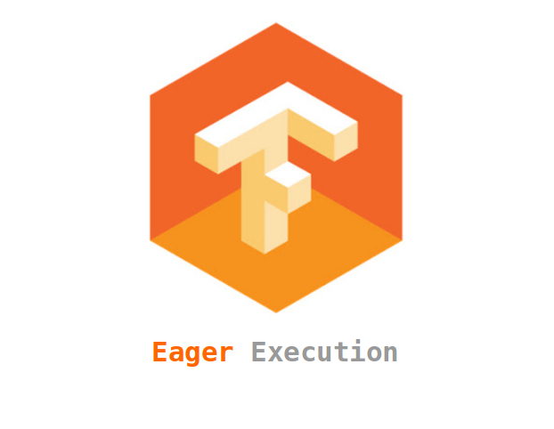

## Table of Contents

## What is Eager Execution in the context of machine learning?

Eager Execution is a way of running machine learning code where operations are performed immediately as they are called. This is different from the traditional way, where operations are first built into a graph and then run all at once. With Eager Execution, you can see the results of your operations right away, which makes it easier to understand and debug your code. It's like doing math step by step on a piece of paper, where you can see each calculation as you go.

This method is especially helpful for people who are new to machine learning because it makes the process more interactive and easier to follow. For example, if you're working with a neural network, you can check the value of a variable at any point during the training process. This immediate feedback can help you catch mistakes early and understand how your model is learning. Eager Execution is supported by popular machine learning frameworks like TensorFlow, making it a practical choice for many developers.

## How does Eager Execution differ from Graph Execution?

Eager Execution and Graph Execution are two different ways to run machine learning code. In Eager Execution, operations are executed immediately as they are written. This means you can see the results of each operation right away, making it easier to understand what's happening in your code. It's like doing math on a piece of paper, where you can see each step as you go. For example, if you want to add two numbers, you write the code and get the result instantly.

On the other hand, Graph Execution works differently. Instead of running operations right away, Graph Execution builds a complete graph of all the operations first. Then, it runs the entire graph at once. This can be faster and more efficient, especially for big models, because the system can optimize the whole process before running it. Imagine planning a whole recipe before cooking; you list all the steps and ingredients first, then do everything in one go.

Both methods have their uses. Eager Execution is great for learning and debugging because you can see what's happening step by step. Graph Execution is better for performance, especially when you're ready to run your model on a large scale. In some machine learning frameworks like TensorFlow, you can switch between these modes to get the best of both worlds.

## What are the main advantages of using Eager Execution for beginners?

Eager Execution is really helpful for beginners because it lets you see what's happening in your code right away. When you write a line of code, it runs immediately, and you can check the results instantly. This makes it easier to understand how things work. For example, if you're trying to learn how a neural network processes data, you can see the value of variables at each step. This immediate feedback helps you catch mistakes early and learn faster.

Another big advantage is that Eager Execution feels more like writing regular code. You don't need to build a whole graph before running anything. It's like doing math on a piece of paper, where you can see each calculation as you go. This makes it less confusing for beginners who are just starting to learn about machine learning. With Eager Execution, you can focus on understanding the concepts without getting lost in the complexity of graph building.

## Can you explain how to enable Eager Execution in TensorFlow?

Enabling Eager Execution in TensorFlow is easy. You just need to add one line of code at the beginning of your program. This line tells TensorFlow to use Eager Execution mode instead of the default Graph Execution mode. Here's how you do it:

```python
import tensorflow as tf
tf.compat.v1.enable_eager_execution()
```

After you add this line, all the operations you write will run immediately. This means you can see the results right away, which is really helpful for learning and debugging. Remember, you only need to add this line once at the start of your program, and then you can write your code as usual.

## What are some common use cases for Eager Execution in machine learning projects?

Eager Execution is really helpful when you're learning about machine learning. It lets you see what's happening step by step. For example, if you're trying to understand how a neural network works, you can check the values of variables at any point. This makes it easier to spot mistakes and learn faster. When you're writing code, you can see the results right away, which is like doing math on a piece of paper where you see each calculation as you go.

Another common use case for Eager Execution is debugging. When something goes wrong in your code, it's easier to find the problem if you can see the results of each operation immediately. For instance, if you're training a model and it's not working as expected, you can pause at any point and check the values to see where things might be going wrong. This immediate feedback helps you fix issues quickly and makes the whole process less frustrating.

Eager Execution is also useful for small projects or experiments where performance isn't the main concern. If you're trying out new ideas or just playing around with different parts of a model, Eager Execution lets you do this without the need to build and run a whole graph. This makes it easier to try new things and see what works best without getting bogged down in the details of graph optimization.

## How does Eager Execution impact the performance of machine learning models?

Eager Execution can make machine learning models run slower than Graph Execution. This is because in Eager Execution, each operation runs one at a time, right away. This means the computer can't plan ahead or do things more efficiently like it can with Graph Execution. For example, if you're training a big neural network, Eager Execution might take longer because it doesn't use all the tricks that Graph Execution uses to speed things up.

However, Eager Execution is really helpful for learning and trying out new ideas. When you're just starting or working on a small project, the immediate feedback you get from Eager Execution can be more important than speed. You can see what's happening step by step, which makes it easier to understand and fix problems. So, while Eager Execution might not be the fastest way to run your model, it's a great tool for learning and debugging.

## What debugging techniques are more effective with Eager Execution?

Eager Execution makes debugging easier because you can see the results of each operation right away. This means you can check the values of variables at any point in your code. For example, if you're training a neural network and something goes wrong, you can pause the training and look at the values to see where the problem is. This immediate feedback helps you find and fix mistakes quickly, without having to run the whole model again.

Another effective debugging technique with Eager Execution is using print statements or logging. Since operations run immediately, you can add print statements to see what's happening at each step. For instance, you might want to print the output of a layer in a neural network to make sure it's working as expected. This can help you understand the flow of data through your model and catch any issues early on. 

Overall, Eager Execution's step-by-step nature makes it easier to understand and debug your code. You don't have to wait for the whole model to run before you can see what's going on. This makes it a great tool for beginners and anyone who wants to quickly find and fix problems in their machine learning projects.

## How can Eager Execution be used to enhance model development and experimentation?

Eager Execution makes it easier to experiment with different parts of a machine learning model. When you're trying out new ideas or changing how your model works, you can see the results right away. This means you can quickly test different settings or layers in your neural network without having to build and run a whole graph. For example, if you want to see how changing the number of neurons in a layer affects your model, you can do that and check the results immediately. This helps you find the best way to build your model faster.

Another way Eager Execution helps with model development is by making it easier to understand what's happening inside your model. Because each operation runs as soon as you write it, you can check the values of variables at any point. This is really helpful when you're trying to figure out why your model isn't working as expected. You can pause the training and look at the data flowing through your model to see where things might be going wrong. This immediate feedback can save you a lot of time and make the whole process of building and improving your model a lot smoother.

## What are the limitations or potential drawbacks of using Eager Execution?

Eager Execution can make your machine learning models run slower than Graph Execution. This is because in Eager Execution, each operation runs one at a time, right away. This means the computer can't plan ahead or do things more efficiently like it can with Graph Execution. For example, if you're training a big neural network, Eager Execution might take longer because it doesn't use all the tricks that Graph Execution uses to speed things up. So, if you need your model to run as fast as possible, Eager Execution might not be the best choice.

Another limitation of Eager Execution is that it can use more memory. Because each operation runs immediately, the computer has to keep more things in memory at once. This can be a problem if you're working with very large datasets or complex models. For instance, if you're trying to train a model on a big dataset, you might run out of memory more easily with Eager Execution than with Graph Execution. So, if memory is a concern, you might want to think about using Graph Execution instead.

## How does Eager Execution integrate with other TensorFlow features like tf.data and tf.keras?

Eager Execution works well with tf.data, which is used to load and process data in TensorFlow. When you use Eager Execution, you can see how your data is being processed step by step. For example, if you're using tf.data to read a dataset and apply some transformations, you can check the results of each transformation right away. This makes it easier to understand and debug your data pipeline. You can use tf.data to create a dataset and then iterate over it in Eager Execution mode to see what's happening at each step.

Eager Execution also integrates smoothly with tf.keras, which is a high-level API for building and training machine learning models. When you're using tf.keras to build a model, Eager Execution lets you see the output of each layer as you go. This can be really helpful for understanding how your model is working and for debugging. For instance, if you're training a neural network, you can pause at any point and check the values of the weights or the outputs of different layers. This immediate feedback helps you make adjustments and improve your model more quickly.

## Can you discuss any advanced techniques for optimizing machine learning models using Eager Execution?

Eager Execution can be used to optimize machine learning models by allowing you to experiment with different parts of your model more easily. For example, you can try out different learning rates or change the architecture of your neural network and see the results right away. This immediate feedback helps you find the best settings for your model faster. You can also use Eager Execution to check the gradients of your model during training. By looking at the gradients, you can see if they're too big or too small and adjust your learning rate accordingly. This can help your model learn more effectively and converge to a better solution.

Another advanced technique for optimizing models with Eager Execution is to use it for debugging and fine-tuning. Since Eager Execution lets you see the values of variables at any point, you can pause your training and check the outputs of different layers. This can help you understand where your model might be going wrong and make adjustments to improve its performance. For instance, if you notice that a certain layer is not learning as expected, you can change its configuration or add more layers to help the model learn better. By using Eager Execution in this way, you can fine-tune your model to get the best results possible.

## What future developments or trends might affect the use of Eager Execution in machine learning?

In the future, Eager Execution might become even more popular as machine learning tools become more user-friendly. As more people start learning about machine learning, they'll want tools that are easy to understand and use. Eager Execution is great for this because it lets you see what's happening in your code right away. This makes it easier to learn and debug your models. As a result, we might see more machine learning frameworks and libraries focusing on making Eager Execution even better and easier to use.

Another trend that could affect Eager Execution is the growing need for faster and more efficient models. While Eager Execution is great for learning and debugging, it can be slower than Graph Execution. As machine learning models get bigger and more complex, people might start looking for ways to speed things up. This could lead to new techniques that combine the benefits of Eager Execution with the performance of Graph Execution. For example, we might see more hybrid approaches where you can switch between Eager and Graph Execution depending on what you're doing. This would let you use Eager Execution for learning and debugging, and then switch to Graph Execution when you need to run your model quickly.