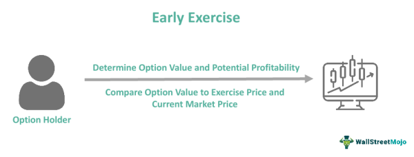

Options trading has become an integral part of modern financial markets, offering a versatile tool for hedging, speculation, and income generation. Options are financial derivatives that derive their value from an underlying asset, such as stocks, indices, or commodities. In the world of options, call options hold a significant place, playing a crucial role in various trading strategies.

A call option provides the holder the right, but not the obligation, to buy an underlying asset at a predetermined price, known as the strike price, within a specified period. This feature makes call options a popular choice for traders looking to capitalize on anticipated upward movements in asset prices. The ability to control a larger position with a relatively smaller capital outlay attracts traders seeking leverage in bullish market conditions.



The practice of selling call options, also known as writing call options, is an essential strategy within the options trading landscape. When traders sell call options, they undertake an obligation to deliver the underlying asset if the option is exercised by the buyer. This strategy allows traders to earn premiums upfront, serving as a source of income. Selling call options can be employed in various strategic scenarios, such as covered call writing, where the seller owns the underlying asset, and naked call writing, which involves selling options without owning the underlying asset. These strategies vary in risk and reward profiles, catering to different trader risk tolerances and market outlooks.

Understanding the possibility of early exercise is pivotal in options trading. Early exercise occurs when a call option holder chooses to exercise their right to purchase the underlying asset before the expiration date. This decision can be influenced by factors such as dividend payments or the deep-in-the-money status of the option. For sellers, early exercise represents a risk, as it can lead to unexpected obligations to deliver the underlying asset. Hence, comprehending the conditions that drive early exercise is vital for effectively managing these risks.

Algorithmic trading, or algo trading, is transforming how traders approach the options market. By employing sophisticated algorithms, traders can optimize options trading strategies, enhancing efficiency and execution speed. Algo trading capitalizes on mathematical models and computational power to analyze market data and execute trades with precision, reducing human errors and optimizing returns. This technological advancement is instrumental in managing the complexities and dynamics of options trading, proving to be a valuable asset for traders seeking an edge in the market.

In summary, options trading, particularly call options, plays a fundamental role in today's financial markets, offering diverse strategies for traders. Selling call options is a practice aimed at generating income through premium collection, with a thorough understanding of early exercise risks being essential. Furthermore, algorithmic trading is enhancing options trading by providing tools to efficiently manage and optimize trading strategies amidst rapidly changing market conditions.

## Table of Contents

## Understanding Call Options

A call option, in the context of financial derivatives, is a contract that gives the holder the right, but not the obligation, to purchase a specific quantity of an underlying asset at a predetermined price, known as the strike price, before or on a specified expiration date. This financial instrument enables traders to speculate on the future price movements of assets such as stocks, commodities, or indices without actually owning the asset itself.

The primary appeal of call options lies in their use within bullish market strategies. Traders often purchase call options when they anticipate that the price of the underlying asset will rise. By doing so, they can profit from an increase in the asset's price while only risking the premium paid for the option. For example, if an investor buys a call option for a stock with a strike price of $50, and the stock's price rises to $60, the investor can exercise the option to buy the stock at $50 and potentially sell it in the market at the higher price, thus capturing a profit.

Potential profits from buying call options are theoretically unlimited, as there is no ceiling to how high the price of the underlying asset can rise. However, the risk is limited to the premium paid for acquiring the option. If the underlying asset's price does not exceed the strike price by the expiration date, the option becomes worthless, and the investor incurs a loss equal to the paid premium.

Call options provide a leveraged way to participate in market movements, as they require a smaller initial outlay compared to purchasing the underlying asset outright. This leverage can magnify profits, but it also involves substantial risk since the time decay affects options. The value of an option decreases as it approaches expiration if the underlying asset remains below the strike price. Additionally, factors such as [volatility](/wiki/volatility-trading-strategies) and interest rates can impact the pricing and potential profitability of call options, making it crucial for traders to consider a wide range of variables before investing in these derivatives.

## Selling Call Options: Strategies and Benefits

Selling call options, also known as writing call options, is a strategy employed in options trading where the trader, referred to as the "writer," offers the buyer the right to purchase an underlying asset at a predetermined price, known as the strike price, within a specified period. The writer receives a premium from the buyer for taking on the obligation to sell the asset if the buyer exercises the option.

### Selling Call Options: Benefits

The primary benefit of selling call options is the ability to earn a premium. This premium acts as immediate income, providing a return on the investment regardless of the future price movements of the underlying asset. For traders with a neutral to bearish outlook on the asset, selling call options can be an attractive strategy to generate income without the need for the asset's price to rise.

Selling call options can also lower the breakeven point of the underlying asset, especially when integrated with existing equity positions. By collecting premiums over time, traders can enhance their overall portfolio returns.

### Covered Calls vs. Naked Calls

Two common strategies involving the selling of call options are covered calls and naked calls. 

**Covered Calls** involve selling call options on an asset that the trader already owns. This strategy is deemed safer since the seller holds the underlying asset and can deliver it if the option is exercised. The risk is limited to the potential opportunity cost of not benefiting from a substantial upside in the asset's price if it surpasses the strike price.

**Naked Calls**, conversely, are sold without owning the underlying asset. This approach exposes the seller to unlimited risk because if the asset's price rises significantly above the strike price, the seller must procure the asset at market value to fulfill the obligation, leading to potentially significant financial losses. Naked call writing requires careful risk management and is typically employed by more experienced traders who believe the asset's price will remain below the strike price until expiration.

### Analyzing Risk and Reward Ratios

The risk and reward dynamics of selling call options need thorough examination. The reward is limited to the premium received, which is the maximum profit attainable. In the case of covered calls, the downside risk is offset by owning the underlying asset. Nevertheless, there's an opportunity cost if the asset price increases above the strike price, as profits beyond this point are forfeited.

For naked calls, the reward remains the premium, but the risk can be substantial and theoretically limitless if the market moves unfavorably. Traders mitigate this by closely monitoring market conditions and setting predetermined [exit](/wiki/exit-strategy) points to limit potential losses.

Mathematically, the profit from selling a call option can be expressed as:

$$
\text{Profit} = \min(\text{Premium}, \text{Strike Price} - \text{Market Price}) - \text{Premium} \times \text{Quantity}
$$

For assessing risk and optimizing outcomes, algorithms and risk management frameworks can be implemented to ensure positions align with market conditions and trader risk tolerance.

## Early Exercise of Call Options

Early exercise of call options refers to the action taken by the holder of an American-style call option to exercise their right to purchase the underlying asset before the option's expiration date. This practice is unique to American-style options, as European-style options can only be exercised at maturity. Understanding the conditions under which early exercise occurs can be crucial for both option holders and sellers, particularly in managing risk and optimizing trading strategies.

**Conditions Favoring Early Exercise**

Option holders might consider early exercise mainly when the underlying asset is set to pay a dividend. Since the holder has the right but not the obligation to buy the underlying asset, they might exercise the option to capture the dividend payment. To determine if early exercise is financially advantageous, the intrinsic value gained—by exercising the option and holding the stock for the dividend—must outweigh the time value lost (the value of holding the option until expiration). This evaluation leads to the following condition favoring early exercise:

$$
C_{\text{intrinsic}} + \text{Dividend} > C_{\text{option}}
$$

where $C_{\text{intrinsic}}$ is the intrinsic value of the option, and $C_{\text{option}}$ is the current price of the call option.

**Impact on Sellers of Call Options**

When a call option is exercised early, the seller (writer) of the call is obligated to sell the underlying asset at the strike price. For covered call writers, who own the underlying asset, early exercise results in a straightforward transaction where the asset is transferred at the agreed strike price, potentially foregoing further upside. For naked call writers, who do not own the underlying asset, early exercise can necessitate the purchase of the asset at market prices, which may exceed the strike price, thus leading to potential substantial loss.

**Mitigating Risks of Early Exercise**

Traders have several methods to mitigate risks associated with early exercise:

1. **Use of Covered Calls**: Writing covered calls involves holding the underlying asset, thus reducing the risk, as the asset is ready for delivery if exercise occurs.

2. **Regular Monitoring**: Always stay informed of dividend announcements and ex-dividend dates to foresee potential early exercises.

3. **Hedging**: For naked call writers, employing other derivatives or financial instruments to hedge potential risk can be beneficial.

4. **Adjusting Positions**: Traders might roll options to another strike or expiration to manage risk better. This usually involves closing the current option position and opening a new position with different terms that are less susceptible to early exercise.

By utilizing these strategies, traders can manage the potential financial impacts of early exercises and make informed decisions that align with their trading goals. Understanding these elements of options trading not only aids in risk management but also enhances the strategic application of options in portfolios.

## Algorithmic Trading in Options Markets

Algorithmic trading, often referred to as algo trading, involves the use of computer programs to execute trades in financial markets based on predefined criteria. These algorithms can analyze vast amounts of market data in real-time and execute trades at speeds and frequencies that are impossible for human traders. In modern trading ecosystems, algorithms are extensively used to enhance efficiency, accuracy, and profitability, particularly in complex domains such as options markets.

**Optimization of Options Trading Strategies**

Algorithms optimize options trading strategies by implementing logical rules based on quantitative analysis. This optimization involves factors such as price movements, volatility, and historical patterns. Algorithms can identify [arbitrage](/wiki/arbitrage) opportunities, execute trades based on [momentum](/wiki/momentum) indicators, or engage in volatility arbitrage by capitalizing on discrepancies in implied and actual volatility. Machine learning further enhances these strategies by allowing systems to learn from past data and improve their performance over time.

**Advantages of Algorithmic Trading: Speed and Precision**

One of the primary advantages of [algorithmic trading](/wiki/algorithmic-trading) is its speed. Algorithms can process market data and execute trades in milliseconds, allowing traders to capitalize on short-lived opportunities. This rapid execution minimizes the impact of market fluctuations and reduces the likelihood of slippage, which occurs when the actual trade price is different from the expected price due to market movement. Precision is another critical benefit. Algorithms eliminate human error associated with manual trading, ensuring consistent and error-free execution of trades based on predetermined parameters.

**Examples of Popular Algorithms in Options Trading**

Several algorithms are popular in the options trading space due to their efficiency and effectiveness:

1. **Market Making Algorithms**: These use strategies that provide liquidity to the market by posting both buy and sell orders. They profit by capturing the spread between the bid and ask prices.

2. **Statistical Arbitrage Algorithms**: These exploit statistical discrepancies in price relationships between options and their underlying assets, often employing mean-reversion strategies.

3. **Execution Algorithms**: These aim to minimize the market impact of large trades by executing them incrementally or at times when market conditions are favorable (e.g., VWAP - Volume Weighted Average Price strategies).

4. **Delta-Hedging Algorithms**: Used for risk management, these maintain a neutral delta position by adjusting the underlying asset position in response to changes in the option's delta, stabilizing the portfolio's exposure to price movements.

Algorithmic trading plays a pivotal role in modern options markets, providing tools for traders to enhance their strategies with unprecedented speed and accuracy. As technology continues to evolve, the adoption of sophisticated algorithms in options trading is expected to increase, driving innovation and efficiency in financial markets.

## Combining Call Option Selling and Algo Trading

Integrating algorithmic trading with call option selling presents traders with significant opportunities to enhance their strategies through improved risk management and optimization of returns. This fusion leverages the precision and speed of algorithms, offering a systematic approach to executing trades and managing positions.

### Integration of Algo Trading with Call Option Selling

Algorithmic trading (algo trading) can efficiently automate the process of selling call options by analyzing vast data sets to identify optimal entry and exit points. Traders can use algorithmic models to continuously monitor market conditions and adjust their positions accordingly. For instance, an algorithm might track volatility indicators and automatically execute a call option selling strategy when the volatility reaches a pre-defined threshold, potentially increasing premium income for the trader.

Python code can be used to implement a basic algorithm for selling call options, which integrates real-time market data to make decisions. For example:

```python
import numpy as np
import pandas as pd
from datetime import datetime
from alpha_vantage.timeseries import TimeSeries

# Function to fetch market data
def fetch_data(symbol):
    ts = TimeSeries(key='YOUR_API_KEY')
    data, meta_data = ts.get_intraday(symbol=symbol, interval='1min', outputsize='full')
    return pd.DataFrame.from_dict(data).transpose()

# Placeholder for a basic option selling strategy
def option_selling_strategy(data):
    # Calculate simple moving average
    data['SMA'] = data['4. close'].rolling(window=20).mean()
    # Implement simple threshold logic for selling
    sell_signals = data[data['4. close'] > data['SMA']]
    return sell_signals

# Fetch data
market_data = fetch_data('AAPL')
# Apply strategy
signals = option_selling_strategy(market_data)
print(signals)
```

### Risk Management and Return Optimization

The capability of algorithms to manage risk and optimize returns is a major advantage in options trading. Algorithms facilitate real-time monitoring and adjustment of open positions to better manage exposure. Through the use of volatility modeling and forecasting, algorithms can dynamically adjust the delta, gamma, and other Greek parameters, ensuring the option portfolio remains within the desired risk profile.

### Case Studies and Successful Implementations

A notable example of integrating algo trading with call option selling is the deployment of [machine learning](/wiki/machine-learning) algorithms that predict price movements based on historical data and real-time market signals. These algorithms allow traders to automate decision-making processes to consistently exploit small pricing inefficiencies, which, although individually minor, can cumulatively result in substantial gains.

### Key Considerations and Challenges

While this integration offers multiple advantages, it comes with challenges that require careful consideration. The most significant are:

1. **Complexity in Model Design**: Developing robust algorithms that can accurately predict market movements and adapt to ever-changing conditions requires advanced knowledge in both trading and quantitative fields.

2. **Overfitting Issues**: Algorithms may perform well on historical data but fail in live trading due to overfitting, where the model learns noise rather than the signal.

3. **System Reliability and Latency**: The infrastructure to support algo trading must be reliable and fast enough to execute trades promptly in response to market changes. Even minor delays can impact the performance of high-frequency trading strategies.

4. **Risk of Black Swan Events**: While algorithms can manage known risks, they might not be able to react to unexpected major market changes, leading to significant losses.

In conclusion, by combining the precision of algorithmic systems with the strategic advantages of call option selling, traders are equipped to enhance their profitability and efficiency. However, success hinges on the careful development, testing, and deployment of these systems, alongside vigilant risk management to navigate the complexities of today's financial markets.

## Conclusion

The article has outlined the key aspects of options trading, particularly focusing on the role and intricacies of call options. Understanding the complexities of options trading is essential for any investor or trader aiming to utilize these financial instruments effectively. It involves recognizing the market conditions and strategic uses of call options, both in purchasing and selling scenarios, and grasping the concept of early exercise to mitigate risks and optimize gains.

Algorithmic trading is a powerful tool that can enhance options strategies significantly. By using algorithms, traders can optimize their strategies to capitalize on market opportunities more efficiently, managing risks while potentially increasing returns. The integration of automated systems allows for precise and swift execution, outpacing traditional trading methods and enabling traders to handle complex strategies with ease.

Looking ahead, the future of options trading is intertwined with technological advancements. As technology continues to evolve, it is likely that the application of sophisticated algorithms will become increasingly prevalent in the trading landscape. The ability to process vast amounts of data and execute trades instantly provides a substantial advantage, suggesting that traders and investors should embrace algorithmic methods to stay competitive. Exploring and adapting these technological tools can open new possibilities for enhancing trading strategies in an ever-changing financial market.

## References & Further Reading

[1]: Hull, J. C. (2018). ["Options, Futures, and Other Derivatives"](https://www.semanticscholar.org/paper/Options%2C-Futures%2C-and-Other-Derivatives-Hull/89bdee500c8623864fc9eb7a471546aa713acc44) (9th ed.). Pearson.

[2]: Natenberg, S. (1994). ["Option Volatility and Pricing: Advanced Trading Strategies and Techniques"](https://archive.org/details/optionvolatility00shel). McGraw-Hill Education.

[3]: Kissell, R. (2014). ["The Science of Algorithmic Trading and Portfolio Management"](https://www.sciencedirect.com/book/9780124016897/the-science-of-algorithmic-trading-and-portfolio-management). Academic Press.

[4]: McMillan, L. G. (2004). ["Options as a Strategic Investment"](https://www.amazon.com/Options-Strategic-Investment-Lawrence-McMillan/dp/0735201978) (5th ed.). New York: New York Institute of Finance.

[5]: Chan, E. P. (2008). ["Quantitative Trading: How to Build Your Own Algorithmic Trading Business"](https://github.com/ftvision/quant_trading_echan_book). Wiley.