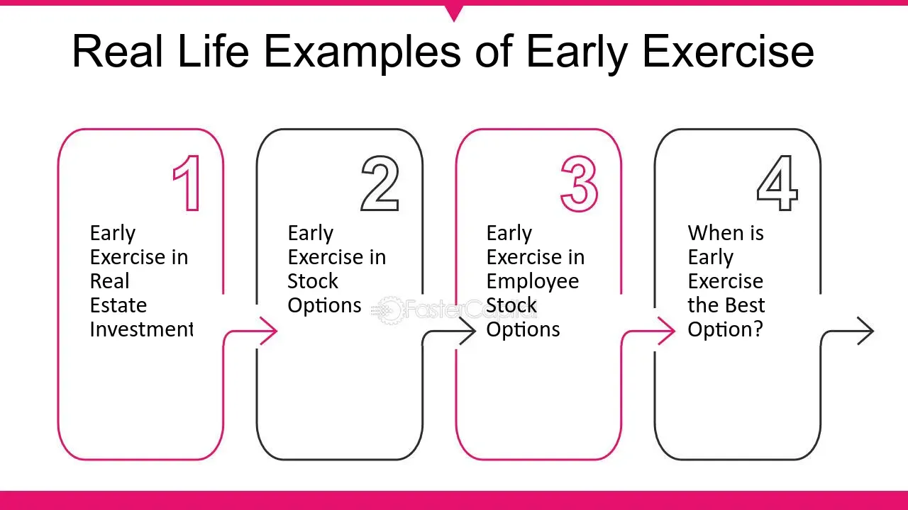

## Table of Contents

## What is an early exercise of a call option?

An early exercise of a call option happens when the buyer decides to use the option before its expiration date. When someone buys a call option, they get the right to buy a stock at a certain price, called the strike price, before the option expires. If the stock's price goes up a lot, the buyer might want to exercise the option early to buy the stock at the lower strike price and then sell it at the higher market price.

However, exercising a call option early is not usually a good idea. This is because the option still has time value, which is the extra worth it has because it can still be used in the future. By exercising early, the buyer loses this time value. It's often better to sell the option instead of exercising it, because selling it can capture both the stock's price increase and the remaining time value. Only in rare cases, like when a big dividend is coming up, might it make sense to exercise early.

## Why might someone choose to exercise a call option early?

Someone might choose to exercise a call option early if they want to get the stock right away. If the stock's price is much higher than the strike price, they could buy the stock at the lower strike price and then sell it at the higher market price to make a quick profit. This can be tempting if they think the stock price won't go up much more before the option expires.

Another reason to exercise early is if a big dividend is coming up. If the stock is going to pay a dividend soon, and the dividend amount is more than the time value left in the option, it might make sense to exercise the option early. This way, the buyer can get the stock and receive the dividend, which could be worth more than keeping the option until it expires.

## What are the potential benefits of selling a call option early?

Selling a call option early can be a good idea because it lets you make money from the option's value before it expires. If the stock price has gone up a lot, the call option becomes more valuable. By selling the option early, you can get cash right away instead of waiting until the option expires. This can be helpful if you need money now or if you think the stock price might not keep going up.

Another benefit is that you can capture the time value of the option. Time value is the extra worth an option has because it still has time left before it expires. When you sell the option early, you get to keep this time value, which you would lose if you exercised the option instead. This can add a lot to the amount of money you make from the option.

## How does early exercise affect the option's time value?

When you exercise a call option early, you lose the time value of the option. Time value is the extra worth that an option has because it can still be used before it expires. If you exercise the option early, you give up this extra worth because you are using the option right away instead of waiting.

This can be a big deal because time value can be a large part of an option's total value, especially if there is still a lot of time left before the option expires. By selling the option instead of exercising it early, you can keep this time value and get more money from the option. Only in rare cases, like when a big dividend is coming up, might it make sense to give up the time value and exercise the option early.

## What are the tax implications of exercising a call option early?

When you exercise a call option early, you might have to pay taxes on any profit you make right away. If you buy the stock at the strike price and then sell it at a higher market price, the difference is considered a capital gain. Depending on how long you hold the stock after exercising the option, this gain could be taxed as a short-term or long-term capital gain. Short-term gains, which are from assets held for one year or less, are taxed at your regular income tax rate, which can be higher than the rate for long-term gains.

On the other hand, if you just sell the call option without exercising it, you might be able to delay paying taxes until you actually sell the option. The profit from selling the option is also considered a capital gain, but you won't have to pay taxes on it until you sell the option. This can be a good way to manage your taxes, especially if you think you might be in a lower tax bracket in the future or if you want to hold onto the option for a longer time to get a lower long-term capital gains tax rate.

## Can you explain the concept of 'dividend capture' in relation to early exercise?

Dividend capture is a strategy where someone tries to get a stock's dividend by buying the stock just before the dividend is paid and then selling it soon after. When it comes to call options, this strategy can lead to early exercise. If a big dividend is coming up, the person who owns the call option might decide to exercise it early to buy the stock and get the dividend. This makes sense if the dividend is bigger than the time value left in the option.

The idea is to make money from the dividend without holding onto the stock for a long time. But, there are risks. The stock price might drop by the amount of the dividend after it's paid, which could mean a loss if the stock is sold right away. Also, exercising the option early means giving up the time value, which could be worth more than the dividend. So, people need to think carefully about whether the dividend is really worth exercising the option early.

## What are the risks associated with early exercise of call options?

Exercising a call option early can be risky. One big risk is that you lose the time value of the option. Time value is the extra worth the option has because it can still be used before it expires. By exercising early, you give up this extra worth, which can be a lot of money, especially if there's still a lot of time left before the option expires. Instead of exercising early, selling the option could be a better choice because you can keep the time value and make more money.

Another risk is that the stock price might drop right after you exercise the option. If you exercise early to buy the stock and then sell it, the stock price could go down, and you could lose money. This can happen if the stock pays a dividend and the price drops by the amount of the dividend after it's paid. Also, exercising early means you have to pay for the stock right away, which could be a problem if you don't have enough money. It's important to think about these risks before deciding to exercise a call option early.

## How does the intrinsic value influence the decision to exercise early?

The intrinsic value of a call option is how much the stock's current price is above the strike price. If the stock price is higher than the strike price, the option has intrinsic value. When deciding whether to exercise a call option early, the intrinsic value is important because it shows how much money you could make right away by exercising the option. If the intrinsic value is high, it might seem like a good idea to exercise early to buy the stock at the lower strike price and sell it at the higher market price.

However, even if the intrinsic value is high, it's not always the best choice to exercise early. This is because the option also has time value, which is the extra worth it has because it can still be used before it expires. If you exercise the option early, you lose this time value. So, even if the intrinsic value is high, it might be better to sell the option instead of exercising it, because selling it can capture both the intrinsic value and the time value. Only in special cases, like when a big dividend is coming up, might it make sense to exercise early despite losing the time value.

## What role does the option's moneyness play in deciding to sell early?

The moneyness of an option tells you if it's worth exercising right now. For a call option, if the stock price is higher than the strike price, it's "in the money." If the stock price is lower than the strike price, it's "out of the money." If the stock price is the same as the strike price, it's "at the money." When you're thinking about selling a call option early, the moneyness is really important because it shows how much money you could make if you sold the option now.

If your call option is deep in the money, meaning the stock price is a lot higher than the strike price, selling it early could be a good idea. This is because the option is worth a lot, and you can get cash right away. But if the option is out of the money or only slightly in the money, it might be better to wait. The option might not be worth much now, but if the stock price goes up before the option expires, you could make more money by selling it later. So, the moneyness helps you decide if selling early is the best choice.

## How do market conditions affect the strategy of early exercise?

Market conditions can really change how you decide to exercise a call option early. If the stock market is going up a lot and the stock price is much higher than the strike price, you might want to exercise early to buy the stock at the lower price and sell it at the higher price. But, if the market is going down or staying the same, it might not be a good idea to exercise early because the stock price might not be high enough to make a profit right away. Also, if everyone is expecting a big change in the market, like a big event or news that could affect stock prices, you might want to wait and see what happens before deciding to exercise early.

Another thing to think about is how much the stock moves up and down, which is called volatility. If the stock price is moving a lot, the option might be worth more because there's a bigger chance it could go in the money before it expires. In this case, it's usually better to sell the option instead of exercising it early, because you can get more money by selling it. But if the stock isn't moving much, and you think it won't go up much more before the option expires, exercising early might make sense if the stock price is already high enough to make a profit. So, market conditions like stock prices and volatility are important when deciding whether to exercise a call option early.

## What are some advanced strategies that involve early exercise of call options?

One advanced strategy that involves early exercise of call options is called the "dividend capture strategy." If a stock is about to pay a big dividend, someone might exercise their call option early to buy the stock and get the dividend. The idea is to make money from the dividend without holding the stock for a long time. But, this strategy can be risky. After the dividend is paid, the stock price might drop by the amount of the dividend, which could mean a loss if the stock is sold right away. Also, exercising early means giving up the time value of the option, which might be worth more than the dividend.

Another strategy is called "covered call writing with early exercise." In this strategy, someone who owns a stock might sell call options against it to make extra money. If the stock price goes up a lot and the call option is in the money, the person who bought the call option might exercise it early. The person who sold the call option then has to sell their stock at the strike price. This can be a good thing if the stock price was going to drop soon, because they get to sell it at a higher price than they would have if they waited. But, if they think the stock price will keep going up, they might lose out on more profits by having to sell early.

These strategies show that early exercise of call options can be part of bigger plans to make money from stocks and options. But, they also show that there are risks and things to think about, like the time value of the option, the stock price, and any upcoming dividends. It's important to understand these things before deciding to use early exercise in an advanced strategy.

## How can one use financial models to determine the optimal time for early exercise?

Financial models can help you figure out the best time to exercise a call option early by looking at things like the stock price, how much the stock moves up and down, and how much time is left before the option expires. One popular model is the Black-Scholes model, which can tell you the value of an option at any time. By using this model, you can see if the option's value is mostly from the stock price being higher than the strike price (intrinsic value) or if it's still worth a lot because there's time left before it expires (time value). If the time value is small compared to the intrinsic value, it might be a good time to exercise the option early.

Another way to use financial models is to look at what might happen in the future. For example, if a big dividend is coming up, you can use a model to see if the dividend is worth more than the time value left in the option. If it is, exercising early to get the dividend might be a good idea. Also, if you think the stock price might drop soon, you can use the model to see if exercising early and selling the stock at the current high price would be better than waiting. These models help you make smart choices by showing you the possible outcomes of exercising early or waiting.

## What are the strategies and benefits of selling call options?

Selling call options, also known as writing call options, is a strategy employed in options trading where the trader, referred to as the "writer," offers the buyer the right to purchase an underlying asset at a predetermined price, known as the strike price, within a specified period. The writer receives a premium from the buyer for taking on the obligation to sell the asset if the buyer exercises the option.

### Selling Call Options: Benefits

The primary benefit of selling call options is the ability to earn a premium. This premium acts as immediate income, providing a return on the investment regardless of the future price movements of the underlying asset. For traders with a neutral to bearish outlook on the asset, selling call options can be an attractive strategy to generate income without the need for the asset's price to rise.

Selling call options can also lower the breakeven point of the underlying asset, especially when integrated with existing equity positions. By collecting premiums over time, traders can enhance their overall portfolio returns.

### Covered Calls vs. Naked Calls

Two common strategies involving the selling of call options are covered calls and naked calls. 

**Covered Calls** involve selling call options on an asset that the trader already owns. This strategy is deemed safer since the seller holds the underlying asset and can deliver it if the option is exercised. The risk is limited to the potential opportunity cost of not benefiting from a substantial upside in the asset's price if it surpasses the strike price.

**Naked Calls**, conversely, are sold without owning the underlying asset. This approach exposes the seller to unlimited risk because if the asset's price rises significantly above the strike price, the seller must procure the asset at market value to fulfill the obligation, leading to potentially significant financial losses. Naked call writing requires careful risk management and is typically employed by more experienced traders who believe the asset's price will remain below the strike price until expiration.

### Analyzing Risk and Reward Ratios

The risk and reward dynamics of selling call options need thorough examination. The reward is limited to the premium received, which is the maximum profit attainable. In the case of covered calls, the downside risk is offset by owning the underlying asset. Nevertheless, there's an opportunity cost if the asset price increases above the strike price, as profits beyond this point are forfeited.

For naked calls, the reward remains the premium, but the risk can be substantial and theoretically limitless if the market moves unfavorably. Traders mitigate this by closely monitoring market conditions and setting predetermined [exit](/wiki/exit-strategy) points to limit potential losses.

Mathematically, the profit from selling a call option can be expressed as:

$$
\text{Profit} = \min(\text{Premium}, \text{Strike Price} - \text{Market Price}) - \text{Premium} \times \text{Quantity}
$$

For assessing risk and optimizing outcomes, algorithms and risk management frameworks can be implemented to ensure positions align with market conditions and trader risk tolerance.

## What is the Early Exercise of Call Options?

Early exercise of call options refers to the action taken by the holder of an American-style call option to exercise their right to purchase the underlying asset before the option's expiration date. This practice is unique to American-style options, as European-style options can only be exercised at maturity. Understanding the conditions under which early exercise occurs can be crucial for both option holders and sellers, particularly in managing risk and optimizing trading strategies.

**Conditions Favoring Early Exercise**

Option holders might consider early exercise mainly when the underlying asset is set to pay a dividend. Since the holder has the right but not the obligation to buy the underlying asset, they might exercise the option to capture the dividend payment. To determine if early exercise is financially advantageous, the intrinsic value gained—by exercising the option and holding the stock for the dividend—must outweigh the time value lost (the value of holding the option until expiration). This evaluation leads to the following condition favoring early exercise:

$$
C_{\text{intrinsic}} + \text{Dividend} > C_{\text{option}}
$$

where $C_{\text{intrinsic}}$ is the intrinsic value of the option, and $C_{\text{option}}$ is the current price of the call option.

**Impact on Sellers of Call Options**

When a call option is exercised early, the seller (writer) of the call is obligated to sell the underlying asset at the strike price. For covered call writers, who own the underlying asset, early exercise results in a straightforward transaction where the asset is transferred at the agreed strike price, potentially foregoing further upside. For naked call writers, who do not own the underlying asset, early exercise can necessitate the purchase of the asset at market prices, which may exceed the strike price, thus leading to potential substantial loss.

**Mitigating Risks of Early Exercise**

Traders have several methods to mitigate risks associated with early exercise:

1. **Use of Covered Calls**: Writing covered calls involves holding the underlying asset, thus reducing the risk, as the asset is ready for delivery if exercise occurs.

2. **Regular Monitoring**: Always stay informed of dividend announcements and ex-dividend dates to foresee potential early exercises.

3. **Hedging**: For naked call writers, employing other derivatives or financial instruments to hedge potential risk can be beneficial.

4. **Adjusting Positions**: Traders might roll options to another strike or expiration to manage risk better. This usually involves closing the current option position and opening a new position with different terms that are less susceptible to early exercise.

By utilizing these strategies, traders can manage the potential financial impacts of early exercises and make informed decisions that align with their trading goals. Understanding these elements of options trading not only aids in risk management but also enhances the strategic application of options in portfolios.

## References & Further Reading

[1]: Hull, J. C. (2018). ["Options, Futures, and Other Derivatives"](https://www.semanticscholar.org/paper/Options%2C-Futures%2C-and-Other-Derivatives-Hull/89bdee500c8623864fc9eb7a471546aa713acc44) (9th ed.). Pearson.

[2]: Natenberg, S. (1994). ["Option Volatility and Pricing: Advanced Trading Strategies and Techniques"](https://archive.org/details/optionvolatility00shel). McGraw-Hill Education.

[3]: Kissell, R. (2014). ["The Science of Algorithmic Trading and Portfolio Management"](https://www.sciencedirect.com/book/9780124016897/the-science-of-algorithmic-trading-and-portfolio-management). Academic Press.

[4]: McMillan, L. G. (2004). ["Options as a Strategic Investment"](https://www.amazon.com/Options-Strategic-Investment-Lawrence-McMillan/dp/0735201978) (5th ed.). New York: New York Institute of Finance.

[5]: Chan, E. P. (2008). ["Quantitative Trading: How to Build Your Own Algorithmic Trading Business"](https://github.com/ftvision/quant_trading_echan_book). Wiley.