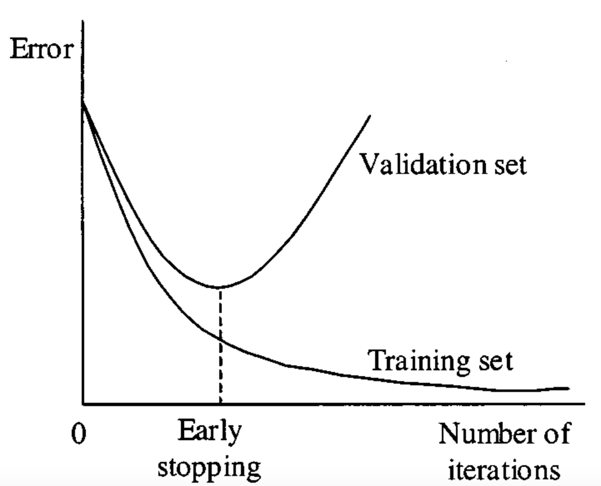

## Table of Contents

## What is early stopping in machine learning?

Early stopping is a technique used in machine learning to prevent overfitting. Overfitting happens when a model learns the training data too well, including its noise and errors, and performs poorly on new, unseen data. To avoid this, early stopping monitors the model's performance on a validation set during training. If the performance on the validation set starts to get worse, even though the performance on the training set might still be improving, the training is stopped early. This helps the model generalize better to new data.

The way early stopping works is by keeping track of a performance metric, like accuracy or loss, on the validation set. At the start of training, the model's performance on the validation set usually improves. But after a while, if the model begins to overfit, the performance on the validation set will start to decline. When this decline is detected, the training is stopped, and the model with the best performance on the validation set is used. This simple technique can significantly improve a model's ability to work well on new data.

## Why is early stopping important for training machine learning models?

Early stopping is important because it helps stop a machine learning model from learning too much about the training data, which is called overfitting. When a model overfits, it does really well on the training data but not so well on new data it hasn't seen before. By watching how the model does on a separate set of data called the validation set, early stopping can tell when the model starts to get worse at predicting on new data. At that point, training is stopped to keep the model from getting too specialized to the training data.

This technique makes the model better at working with new, unseen data. It does this by saving the best version of the model, based on how it does on the validation set, and using that version instead of one that has been trained for too long. In simple terms, early stopping helps find the right balance between learning enough from the training data and still being able to make good guesses on new data. This balance is key for making sure the model is useful in real-world situations where it will see data it hasn't trained on.

## How does early stopping help prevent overfitting?

Early stopping helps prevent overfitting by keeping an eye on how well the model is doing on a special set of data called the validation set. When you train a model, it learns from the training data. But if it learns too much, it might start to remember every little detail and mistake in the training data instead of learning the general patterns. This is called overfitting. Early stopping stops the training before this happens. It does this by checking the model's performance on the validation set. If the performance on the validation set starts to get worse, even though the model might still be doing better on the training data, early stopping says, "Stop training now!" This helps the model keep its ability to make good guesses on new data it hasn't seen before.

By using early stopping, you make sure that the model you end up with is the one that did the best on the validation set. This means you're using the version of the model that has learned the right amount from the training data - not too little, and not too much. So, when you use this model on new data, it's more likely to do a good job because it hasn't overfit to the training data. Early stopping is like a safety net that catches the model before it falls into the trap of overfitting, helping it to be more useful and accurate in real-life situations.

## What are the key components needed to implement early stopping?

To use early stopping, you need a few important things. First, you need a training set and a separate validation set. The training set is what the model learns from, and the validation set is used to check how well the model is doing. You also need a way to measure how good the model is, like accuracy or loss. This measure is used to see if the model's performance on the validation set is getting better or worse. Finally, you need to set a rule for when to stop training, like stopping if the performance on the validation set doesn't improve for a certain number of rounds, called patience.

Once you have these parts, you can start using early stopping. As the model trains, you keep track of its performance on the validation set. If the performance starts to get worse, you stop the training. This means you save the best version of the model, which is the one that did the best on the validation set. By doing this, you help make sure the model doesn't overfit to the training data and can work well on new data it hasn't seen before. Early stopping is a simple but powerful way to make your [machine learning](/wiki/machine-learning) models more useful in real life.

## Can you explain the process of monitoring validation loss for early stopping?

Monitoring validation loss for early stopping is a way to keep an eye on how well your model is doing as it trains. When you train a model, you use a training set to teach it, and a validation set to check its performance. The validation loss is a number that shows how bad the model's guesses are on the validation set. You want this number to go down as the model gets better. If the validation loss starts to go up instead, it means the model might be learning too much about the training data and not doing well on new data. This is when early stopping comes in. You set a rule to stop training if the validation loss doesn't get better for a certain number of rounds, called patience.

To use early stopping, you need to keep track of the validation loss after each round of training. You save the best version of the model based on the lowest validation loss you've seen so far. If the validation loss starts to go up and stays higher for as many rounds as your patience setting, you stop the training. This way, you end up with a model that has learned just the right amount from the training data and can still make good guesses on new data. Early stopping helps make sure your model doesn't overfit, which means it won't just memorize the training data but will be useful for real-life situations.

## What are common metrics used to determine when to stop training?

When deciding when to stop training a machine learning model, common metrics used are validation loss and validation accuracy. Validation loss measures how bad the model's predictions are on the validation set. If the validation loss starts to increase, it might mean the model is overfitting, and it's time to stop training. On the other hand, validation accuracy shows how often the model's predictions are correct on the validation set. If the validation accuracy stops improving or starts to decrease, that's another sign that training should be stopped to prevent overfitting.

Another useful metric is the difference between training loss and validation loss. If the gap between these two losses starts to grow, it suggests that the model is getting better at the training data but worse at the validation data, which is a sign of overfitting. Early stopping can be set up to monitor these metrics and stop training when they indicate the model's performance on new data is no longer improving. By using these metrics, you can find the right balance and make sure your model generalizes well to new, unseen data.

## How do you choose the patience parameter in early stopping?

Choosing the patience parameter in early stopping means deciding how many rounds of training you'll wait before stopping if the model's performance on the validation set doesn't get better. The patience parameter is like a timer that gives the model a few more chances to improve before you stop training. If you set the patience too low, you might stop training too soon, and the model might not learn enough. If you set it too high, the model might overfit because it keeps training even when it's not getting better on the validation set.

A good way to choose the patience parameter is to start with a small number, like 5 or 10 rounds, and see how the model does. If the model stops training too early and doesn't perform well on new data, you can try increasing the patience a bit. On the other hand, if the model is overfitting even with early stopping, you might want to lower the patience. It's all about finding the right balance so the model learns enough without learning too much. You might need to try different patience values to see what works best for your specific model and data.

## What are the potential drawbacks of using early stopping?

One potential drawback of using early stopping is that it might stop training too soon. If the patience parameter is set too low, the model might not get enough time to learn all the important patterns in the data. This can lead to a model that doesn't perform well on new data because it hasn't learned enough. It's like pulling a cake out of the oven before it's fully baked - it might look okay on the outside, but it's not ready on the inside.

Another issue is that early stopping might not work well with all types of data and models. Some models need more time to learn complex patterns, and stopping too early can hurt their performance. Also, if the validation set is not a good representation of the real-world data the model will see, early stopping might make the model stop at the wrong time. This can lead to a model that doesn't generalize well to new situations. Finding the right balance with early stopping can be tricky and might require trying different settings to see what works best.

## How does early stopping interact with other regularization techniques?

Early stopping works well with other ways to stop a model from overfitting, like adding a bit of noise to the data or making the model simpler. When you use early stopping along with these other methods, it helps make sure the model doesn't learn too much from the training data. For example, if you add a bit of noise to the data, it can help the model learn the main patterns instead of the small details. Early stopping then stops the training before the model starts to overfit, even with the noise. This makes the model better at guessing on new data it hasn't seen before.

Using early stopping with other ways to keep the model simple can also help. For example, if you use a method called L2 regularization, which adds a small penalty to the model's weights to keep them from getting too big, early stopping can still help. The L2 regularization keeps the model from getting too complicated, and early stopping makes sure it stops learning before it starts to overfit. Together, these methods can make the model more accurate and useful for new data.

## Can early stopping be used with all types of machine learning models?

Early stopping can be used with many types of machine learning models, but it works best with models that are trained over many rounds, like neural networks. These models learn a little bit at a time, and early stopping can watch their progress and stop them from learning too much about the training data. For example, if you're training a [neural network](/wiki/neural-network) to recognize pictures, early stopping can help make sure it learns the right features of the pictures without memorizing every little detail.

However, early stopping might not be as useful for models that don't train over many rounds, like some decision trees or simple linear models. These models learn all at once, so there's no way to stop them partway through to check if they're overfitting. Still, even with these models, you can use a similar idea by trying different versions of the model and [picking](/wiki/asset-class-picking) the one that does best on a validation set. So, while early stopping is very helpful for some models, it's not a perfect fit for all types of machine learning.

## What are advanced strategies for optimizing early stopping?

To make early stopping work even better, you can try different ways to fine-tune how it decides when to stop training. One way is to change how you measure if the model is getting better. Instead of just looking at how the model does on the validation set, you can use a mix of different measures like accuracy, loss, and even how the model does on a special test set. This can give you a better idea of when the model is really starting to overfit. Another trick is to use something called "learning rate scheduling," where you slowly make the model learn less and less over time. This can help the model get closer to the best point without going too far, making early stopping more effective.

Another advanced strategy is to use a technique called "cross-validation" to help decide when to stop training. Cross-validation means splitting your data into different parts and training the model many times, each time using a different part as the validation set. By doing this, you can get a more reliable idea of when the model starts to overfit because you're looking at how it does on many different validation sets. This can help you set the patience parameter better, so you don't stop training too soon or too late. Combining early stopping with these advanced methods can make your model even better at working with new data it hasn't seen before.

## How can early stopping be implemented in popular machine learning frameworks like TensorFlow or PyTorch?

In TensorFlow, you can use early stopping by adding a special callback to your model's training process. A callback is a way to tell the model to do something special while it's training. You can set up early stopping to watch the validation loss and stop training if it doesn't get better for a certain number of rounds. Here's how you might do it in TensorFlow:

```python
from tensorflow.keras.callbacks import EarlyStopping

early_stopping = EarlyStopping(monitor='val_loss', patience=10, restore_best_weights=True)
model.fit(X_train, y_train, validation_data=(X_val, y_val), epochs=100, callbacks=[early_stopping])
```

In this code, `EarlyStopping` is set up to watch the validation loss (`val_loss`). If the validation loss doesn't improve for 10 rounds (`patience=10`), the training will stop. The `restore_best_weights=True` part makes sure the model uses the best version it found, not the last one it tried. This way, you can make sure your model doesn't overfit and works well on new data.

In PyTorch, you can use early stopping by writing your own loop to train the model and check the validation loss. You'll need to keep track of the best validation loss you've seen so far and stop training if it doesn't get better for a certain number of rounds. Here's an example of how you might do it in PyTorch:

```python
import torch

best_val_loss = float('inf')
patience = 10
counter = 0

for epoch in range(100):
    # Train your model
    model.train()
    # ... training code ...

    # Evaluate on validation set
    model.eval()
    val_loss = 0
    with torch.no_grad():
        # ... validation code ...
        val_loss = validation_loss  # Calculate validation loss

    if val_loss < best_val_loss:
        best_val_loss = val_loss
        counter = 0
        # Save the model
        torch.save(model.state_dict(), 'best_model.pth')
    else:
        counter += 1
        if counter >= patience:
            print(f'Early stopping at epoch {epoch}')
            break
```

In this PyTorch code, you train the model for a certain number of epochs. After each epoch, you check the validation loss. If it's better than the best loss you've seen so far, you save the model and reset a counter. If the validation loss doesn't improve for 10 rounds (`patience=10`), you stop training. This helps make sure your model doesn't overfit and can work well on new data.

## References & Further Reading

[1]: Goodfellow, I., Bengio, Y., & Courville, A. (2016). ["Deep Learning."](https://link.springer.com/article/10.1007/s10710-017-9314-z) MIT Press.

[2]: Prechelt, L. (1998). ["Early Stopping - But When?"](https://link.springer.com/chapter/10.1007/978-3-642-35289-8_5) Lecture Notes in Computer Science, 1398, 55-69.

[3]: Yao, Y., Rosasco, L., & Caponnetto, A. (2007). ["On Early Stopping in Gradient Descent Learning."](https://link.springer.com/article/10.1007/s00365-006-0663-2) Journal of Machine Learning Research, 11, 1083-1107.

[4]: Géron, A. (2019). ["Hands-On Machine Learning with Scikit-Learn, Keras, and TensorFlow: Concepts, Tools, and Techniques to Build Intelligent Systems,"](https://www.academia.edu/43840124/Hands_On_Machine_Learning_with_Scikit_Learn_Keras_and_TensorFlow_SECOND_EDITION_Concepts_Tools_and_Techniques_to_Build_Intelligent_Systems) O'Reilly Media.

[5]: Srivastava, N., Hinton, G., Krizhevsky, A., Sutskever, I., & Salakhutdinov, R. (2014). ["Dropout: A Simple Way to Prevent Neural Networks from Overfitting."](https://jmlr.org/papers/v15/srivastava14a.html) Journal of Machine Learning Research, 15, 1929-1958.