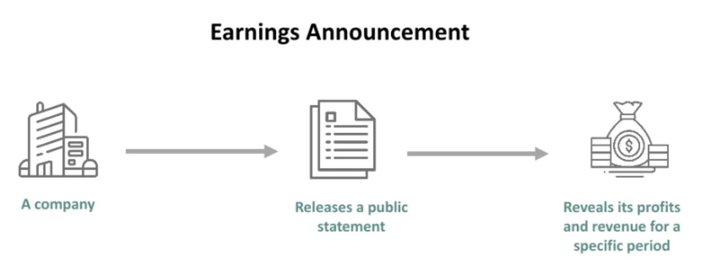

In the complex world of trading, earnings announcements are crucial events that can significantly influence stock prices. These announcements contain vital information about a company’s financial performance, providing insights that can sway investor sentiment and market dynamics. For traders, especially those using algorithmic trading, the speed and precision with which they react to these announcements are essential in making informed decision-making processes.



Algorithmic trading has transformed the landscape of financial markets by enabling trades to be executed at speeds and frequencies far beyond human capabilities. It relies on predefined strategies that can quickly analyze and interpret vast amounts of data, including earnings reports. As these reports are published, algorithms can swiftly assess whether the results surpass or miss market expectations, thus identifying potential opportunities or risks. This capability is critical during earnings season when stock prices exhibit heightened volatility based on how earnings compare to analyst predictions.

Understanding the intricate relationship between earnings announcements and algorithmic trading strategies is vital for traders aiming to capitalize on these data-driven opportunities. By effectively leveraging the insights drawn from earnings reports, traders can optimize their strategies to enhance profitability and gain a competitive edge in fast-paced markets.


## Table of Contents


## What Is an Earnings Announcement?

An [earning](/wiki/earning-announcement)s announcement is a company's official public statement outlining its profitability over a specific period, usually on a quarterly or annual basis. These announcements are pivotal in providing insights into a company’s financial health by revealing key data such as revenue, net income, earnings per share (EPS), and forward-looking guidance. Such data are essential for investors and analysts as they assess company performance against market expectations.

Earnings announcements are highly anticipated events that can significantly impact a company's stock price. Companies typically release earnings reports during "earnings season," a period when most publicly traded companies disclose their financial results. The stock market's reaction to these announcements can be swift, often leading to increased [volatility](/wiki/volatility-trading-strategies). This volatility arises from the comparison of reported earnings with analysts' estimates and market expectations. Positive surprises, where a company exceeds expected results, can drive stock prices up, while negative surprises can have a detrimental price impact.

The period leading up to an earnings announcement is characterized by speculative trading. Analysts release forecasts based on various models, informing investors who adjust their positions accordingly. Such speculative behavior is driven by anticipatory strategies, as investors aim to capitalize on predicted outcomes. This results in increased trading [volume](/wiki/volume-trading-strategy)s and price movements as the announcement date approaches, reflecting the market's attempt to price in expected earnings outcomes.

Understanding the dynamics of earnings announcements and their implications on stock prices is crucial for traders and investors in making informed decisions. This knowledge enables them to navigate potential market fluctuations and exploit trading opportunities during these pivotal periods.


## Impact of Earnings Announcements on Share Prices

Earnings announcements play a critical role in influencing share prices, often triggering substantial price movements. These fluctuations predominantly hinge on the difference between the reported earnings and the prevailing analyst expectations. When a company's earnings surpass expectations, it typically results in a positive market reaction, leading to a rise in the share price. Conversely, if the earnings fall short, the market often responds negatively, causing the share price to decline.

This phenomenon is largely driven by market psychology and the inherent bias in investor expectations. The greater the deviation from the expected figures, the more pronounced the price movement tends to be. For instance, if a tech giant reports earnings 20% above the analysts’ consensus, the share price could see an immediate and substantial uptick. Conversely, a 20% shortfall might result in a swift drop in share value.

The volatility that arises from these announcements presents significant opportunities for [algorithmic trading](/wiki/algorithmic-trading). Algorithms are adept at processing information at speeds far beyond human capability, enabling them to react instantaneously to such earnings surprises. This ability to capitalize on rapid market movements is a cornerstone of many algorithmic trading strategies. Traders can program algorithms to execute trades based on predefined criteria related to earnings figures and market reactions, allowing them to exploit these momentary mispricings swiftly.

Here's an example of how a simple algorithm might be structured in Python to act on earnings surprises:

```python
def trading_action(actual_earnings, expected_earnings, current_stock_price):
    threshold = 0.05 #  5% surprise threshold
    earnings_surprise = (actual_earnings - expected_earnings) / expected_earnings

    if earnings_surprise > threshold:
        return f"Buy: Current Price is ${current_stock_price}, anticipating an upward move."
    elif earnings_surprise < -threshold:
        return f"Sell: Current Price is ${current_stock_price}, anticipating a downward move."
    else:
        return "Hold: No significant earnings surprise detected."

# Example usage
print(trading_action(1.20, 1.00, 150))
```

In this code snippet, the algorithm is set to evaluate the earnings surprise by comparing actual earnings against expected earnings. If the surprise exceeds a set threshold, it suggests a trade action—either buying or selling—based on whether the earnings were above or below expectations. By identifying and reacting to these earnings-driven price movements, algorithmic trading systems can capture opportunities that might be missed by slower, manual trading processes.


## Understanding Analyst Estimates

Analyst estimates are essential for setting market expectations before an earnings announcement. These figures provide insights into a company's economic performance and are often the benchmark against which actual results are compared. Analysts use several financial models, with the Discounted Cash Flow (DCF) analysis being one of the most common.

The DCF model determines the value of an investment based on its expected future cash flows. This involves projecting a company's free cash flows over time and discounting them back to the present value using a discount rate, often represented by the company's weighted average cost of capital (WACC). The formula for DCF is:

$$
DCF = \sum \left( \frac{FCF_t}{(1 + r)^t} \right) 
$$

where $FCF_t$ is the free cash flow for a given period $t$, and $r$ is the discount rate. This method allows analysts to estimate the intrinsic value of a company, which is critical in forming earnings expectations.

However, traders leveraging algorithmic models must recognize the potential biases and inaccuracies in these estimates. Factors like overly optimistic growth assumptions, incorrect cost projections, and failure to account for macroeconomic changes can skew estimates. Additionally, analyst estimates can be influenced by systematic biases, such as herd behavior, where analysts' forecasts converge due to social influences or cognitive biases.

For algorithmic traders, thoroughly understanding these potential inaccuracies is crucial. Algorithms can be designed to incorporate confidence intervals around analyst estimates or use alternative predictions methods, such as [machine learning](/wiki/machine-learning) models that weigh a more extensive range of historical data and economic indicators. By acknowledging these estimate limitations, traders can fine-tune their algorithms to better anticipate market reactions during earnings announcements, enhancing their decision-making processes and strategic positioning.


## The Role of Algorithmic Trading in Earnings Seasons

Algorithmic trading systems are highly effective during earnings seasons due to their ability to process immense volumes of data at unparalleled speeds. These systems are programmed with predefined strategies that quickly analyze earnings announcements and historical data, allowing them to execute trades faster than human traders could ever manage. This speed is critical, as earnings releases often provoke significant, rapid market movements.

One of the strengths of algorithmic trading during earnings seasons is its capacity to handle both anticipated and unanticipated outcomes effectively. Algorithms can incorporate a variety of data inputs—such as company financials, market sentiment, and analyst projections—to make informed trading decisions in real-time. For example, when an earnings report is released, an algorithm might assess whether the reported earnings per share (EPS) surpass market expectations. If they do, the algorithm could instantly execute buy orders to capitalize on the likely stock price surge.

Moreover, these systems utilize historical data to gauge potential price reactions based on past earnings announcements. By examining prior earnings seasons, algorithms identify patterns that inform their trading strategies. For instance, a Python-based algorithm could be deployed to backtest a trading strategy using historical stock price data around past earnings releases. This helps refine the strategy parameters for optimal future performance.

```python
import pandas as pd
import numpy as np

# Example of loading historical stock price data
data = pd.read_csv('stock_prices.csv')

# Calculate percentage change in stock price around earnings announcements
data['Pct_Change'] = data['Close'].pct_change(periods=1)

# Simple trading strategy: Buy if the EPS beat was significant
def trading_strategy(eps_actual, eps_estimate):
    if eps_actual > eps_estimate * 1.05:  # 5% EPS beat threshold
        return "Buy"
    else:
        return "Hold"

# Apply the trading strategy to historical data
data['Strategy'] = data.apply(lambda row: trading_strategy(row['EPS_Actual'], row['EPS_Estimate']), axis=1)
```

Algorithmic trading's speed and efficiency not only allow for a rapid response to earnings announcements but also enhance the precision of trading actions. By leveraging algorithms, traders are able to adjust their positions in real-time, aligning with market movements to maximize their advantage.


## Optimizing Algo Trading Strategies Around Earnings

To effectively leverage earnings announcements, traders need to refine their algorithmic strategies to capitalize on both potential risks and opportunities inherent in these events. A comprehensive approach to strategy optimization involves integrating several components: historical earnings data, analyst estimates, and market sentiment analysis.

Incorporating historical earnings data is crucial for identifying patterns and trends that could inform future price movements. Algorithms can analyze past earnings surprises, looking for instances where actual earnings significantly exceeded or fell short of expectations. This historical context helps in building predictive models that can signal how similar deviations might impact stock prices in upcoming announcements.

Analyst estimates provide another layer of nuance. By incorporating these projections into trading algorithms, traders can better gauge market expectations leading up to an earnings release. Analysts use financial models like Discounted Cash Flow (DCF) analyses to project a company's free cash flows. These projections, when included in trading algorithms, help anticipate how an earnings report might diverge from consensus expectations, guiding decision-making processes.

Additionally, incorporating market sentiment analysis strengthens the algorithms. By using natural language processing (NLP) techniques, traders can evaluate the tone and sentiment of news articles, earnings call transcripts, and social media commentary related to a particular stock. Positive or negative sentiment trends can serve as signals for bullish or bearish market reactions shortly before and after an earnings announcement.

Moreover, considering the macroeconomic climate and industry-specific trends is essential for building robust algorithmic models. For example, if a global economic downturn affects consumer spending, this might disproportionately impact certain sectors such as retail or luxury goods. By [factor](/wiki/factor-investing)ing in these broader economic and industry-specific variables, traders can tailor their algorithms to account for these influences and develop a more comprehensive risk management approach.

Python can be utilized to implement these aspects effectively. Here's a simplified example of how one might integrate historical earnings data and sentiment analysis:

```python
import pandas as pd
from sklearn.linear_model import LinearRegression
from textblob import TextBlob

# Load historical earnings data
earnings_data = pd.read_csv('earnings_data.csv')

# Analyze historical earnings surprises
earnings_data['surprise'] = (earnings_data['actual'] - earnings_data['expected']) / earnings_data['expected']

# Train a predictive model
X = earnings_data[['expected', 'previous_surprise']].values
y = earnings_data['surprise'].values

model = LinearRegression()
model.fit(X, y)

# Incorporate sentiment analysis
def get_sentiment(text):
    analysis = TextBlob(text)
    return analysis.sentiment.polarity

news_sentiments = [
    get_sentiment("Company XYZ is seeing a lot of growth this quarter.")
    for _ in range(len(earnings_data))
]

earnings_data['sentiment'] = news_sentiments

# Refine the model with sentiment data
X = earnings_data[['expected', 'previous_surprise', 'sentiment']].values
model.fit(X, y)

# Predictions incorporating sentiment
predictions = model.predict(X)

print(predictions)
```

This code snippet demonstrates how historical data and sentiment analysis can be combined to enhance the predictive capabilities of a trading algorithm. By continuously updating these models with new data and refining them based on real-world market conditions, traders can maintain a competitive edge during earnings announcements.


## Conclusion

Earnings announcements hold significant sway over market dynamics, offering a wealth of information that can dramatically influence stock prices. For algorithmic traders, effectively utilizing these announcements is crucial for obtaining a competitive edge. By leveraging sophisticated algorithms, traders can swiftly interpret vast datasets and adjust their strategies in real time to capitalize on new information released during earnings seasons.

Accurate data interpretation is essential in navigating the uncertainties that come with earnings announcements. Traders need to integrate various data sources, including historical earnings, analyst forecasts, and market sentiment, into their algorithms. These algorithms can assess the variance between reported earnings and market expectations, allowing traders to react promptly to unexpected results and align their trading positions accordingly.

Combining advanced algorithmic models with precise data analysis enables traders to manage the intricacies of market fluctuations. Incorporating factors such as macroeconomic trends and industry-specific dynamics enhances the robustness of trading strategies. As a result, traders are better positioned to seize lucrative opportunities that arise from the volatile environment of earnings seasons, paving the way for sustained profitability in the dynamic world of stock trading.


