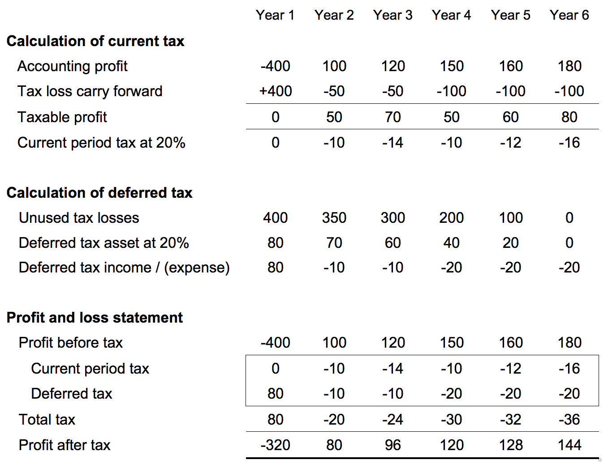

## Table of Contents

## What are earning assets?

Earning assets are things that make money for a person or a business. They can be things like savings accounts, stocks, or rental properties. When someone owns these assets, they get money from them regularly, like interest from a savings account or rent from a property.

These assets are important because they help increase the money someone has over time. For example, if you put money in a savings account, the interest you earn adds to your total money. Businesses also use earning assets to grow and make more profit. By investing in earning assets, people and businesses can build wealth and have a more secure financial future.

## What are some common examples of earning assets?

Earning assets are things that make money for you. Some common examples are savings accounts, where you earn interest on the money you keep in the bank. Another example is stocks, which are shares in a company. When the company does well, the value of the stocks can go up, and you might get dividends, which are like little payments from the company.

Rental properties are also [earning](/wiki/earning-announcement) assets. If you own a house or an apartment and rent it out, the rent money you get each month is income from that asset. Bonds are another type of earning asset. When you buy a bond, you're lending money to a government or a company, and they pay you back with interest over time.

Other examples include mutual funds, which are a mix of different investments like stocks and bonds, and peer-to-peer lending, where you lend money to other people and they pay you back with interest. All these assets help you earn money without having to work for it directly.

## How do earning assets generate income?

Earning assets make money for you in different ways. For example, if you have a savings account, the bank pays you interest on the money you keep there. The interest is like a little reward for letting the bank use your money. Stocks are another kind of earning asset. When you buy stocks, you own a small part of a company. If the company does well, the value of your stocks can go up, and sometimes the company gives you dividends, which are like small payments.

Rental properties also generate income by earning you rent money. If you own a house or an apartment and someone pays you to live there, that rent money is your income from the property. Bonds work a bit like a loan. When you buy a bond, you're lending money to a government or a company, and they pay you back with interest over time. So, even though you're not working, these assets are working for you and bringing in money regularly.

## What is the difference between earning assets and non-earning assets?

Earning assets are things that make money for you without you having to work. They can be savings accounts, where the bank pays you interest, stocks that might go up in value or give you dividends, or rental properties where you get rent money. These assets help you earn money over time, which can make you richer and give you more financial security.

Non-earning assets, on the other hand, don't make money for you. They might have value, but they don't bring in any income. Examples include your personal car, which you use to get around but doesn't pay you anything, or your furniture, which makes your home nice but doesn't earn you money. While non-earning assets can be useful or enjoyable, they don't help you build wealth the way earning assets do.

## How are earning assets taxed?

Earning assets can be taxed in different ways, depending on what kind of asset it is and how you earn money from it. For example, if you have a savings account, the interest you earn is usually taxed as regular income. This means you have to pay taxes on that interest at the same rate as your salary or wages. If you own stocks and get dividends, those dividends are also taxed as income, but sometimes at a special, lower rate called the qualified dividend rate.

If you sell an earning asset, like stocks or a rental property, and make a profit, that profit is called a capital gain. Capital gains can be taxed at a different rate than regular income. If you've owned the asset for a long time, usually more than a year, it's called a long-term capital gain and is often taxed at a lower rate. If you've owned it for a shorter time, it's a short-term capital gain and is taxed like regular income. It's important to know these rules because they can affect how much money you keep from your earning assets.

## What are the tax implications of interest income from earning assets?

When you earn interest from earning assets like savings accounts or bonds, that interest is usually taxed as regular income. This means it's added to your other income, like your salary, and you pay taxes on it at the same rate. So, if you earn $100 in interest from your savings account, you have to pay taxes on that $100 just like you do on your paycheck.

The tax rate you pay on interest income depends on your total income for the year. If you're in a higher tax bracket, you'll pay more in taxes on your interest. It's important to keep track of how much interest you earn because you need to report it on your tax return. If you don't report it, you might get in trouble with the tax authorities.

## How does depreciation affect the tax treatment of earning assets?

Depreciation can affect the tax treatment of earning assets like rental properties or business equipment. When you own these kinds of assets, you can claim depreciation on your taxes. This means you can deduct a part of the cost of the asset each year, which lowers your taxable income. So, if you have a rental property, you can deduct the wear and tear on the building over time, reducing how much tax you have to pay on the rent money you earn.

This tax benefit helps balance out the fact that earning assets like buildings or machines lose value over time. By claiming depreciation, you're recognizing that the asset isn't worth as much as it used to be. It's important to follow the rules about how much depreciation you can claim each year, because if you claim too much, you might have to pay more taxes later. But if you do it right, depreciation can help you save money on taxes while still earning income from your assets.

## What are the tax benefits of investing in certain types of earning assets?

Investing in certain types of earning assets can give you some nice tax benefits. For example, if you invest in retirement accounts like a 401(k) or an IRA, you can put money in without paying taxes on it right away. This means you can save more money now and let it grow without the tax man taking a cut until you take the money out later. Another tax benefit comes from investing in municipal bonds. The interest you earn from these bonds is often tax-free at the federal level, and sometimes at the state level too, which can save you a lot of money on taxes.

Another way to get tax benefits is by investing in real estate. If you own a rental property, you can claim depreciation on your taxes. This lets you deduct a part of the cost of the property each year, which lowers your taxable income. This can save you money on taxes while you're earning rent money from the property. Also, if you sell an investment property and use the money to buy another one, you might be able to do a 1031 exchange. This lets you delay paying taxes on any profit you made, which can help you keep more money to invest in new properties.

## How can the tax treatment of earning assets vary by jurisdiction?

The way earning assets are taxed can be different depending on where you live. In the United States, for example, interest from savings accounts is taxed as regular income, but in some countries, it might be taxed at a different rate or not taxed at all. Also, some places have special tax rules for certain types of earning assets. For instance, in the U.S., you can get tax breaks for investing in retirement accounts like a 401(k) or an IRA, but these rules might not apply in other countries.

Different countries also have their own rules about how to handle things like capital gains and depreciation. In the U.S., if you sell an earning asset like a stock or a rental property and make a profit, you have to pay taxes on that profit, but the tax rate can be different depending on how long you owned the asset. In other places, the rules might be different, and you might pay more or less in taxes. It's important to know the tax laws where you live so you can plan how to invest in earning assets and save money on taxes.

## What strategies can be used to minimize taxes on earning assets?

One way to minimize taxes on earning assets is to use tax-advantaged accounts like a 401(k) or an IRA. When you put money into these accounts, you don't have to pay taxes on it right away. This means you can save more money now and let it grow without taxes until you take it out later. Another strategy is to invest in municipal bonds. The interest you earn from these bonds is often tax-free at the federal level, and sometimes at the state level too, which can save you a lot of money on taxes.

Another good strategy is to use depreciation if you own rental properties. You can deduct a part of the cost of the property each year, which lowers your taxable income. This can save you money on taxes while you're earning rent money from the property. If you sell an investment property and want to buy another one, you might be able to do a 1031 exchange. This lets you delay paying taxes on any profit you made, which can help you keep more money to invest in new properties.

## How do changes in tax laws impact the management of earning assets?

Changes in tax laws can really shake things up when you're managing earning assets. If the rules about how much tax you have to pay on interest or dividends change, it might make some investments better or worse than before. For example, if the tax on interest from savings accounts goes up, you might decide to put your money into something else that's taxed less. Also, if the government changes the rules about how you can claim depreciation on rental properties, it could affect how much money you make from them after taxes.

Keeping up with these changes is important because they can change how you plan to grow your wealth. If a new law makes it easier to save on taxes by investing in retirement accounts, you might want to put more money into those. On the other hand, if the tax benefits for certain types of bonds go away, you might need to rethink your investment strategy. Staying informed about tax law changes helps you make smart choices about where to put your money so you can keep as much of it as possible.

## What advanced tax planning techniques can optimize the returns from earning assets?

One advanced tax planning technique to optimize returns from earning assets is using tax loss harvesting. This means selling some investments that have lost value to offset the taxes you owe on the gains from other investments. For example, if you made a profit from selling some stocks, you could sell other stocks that have gone down in value to reduce how much tax you have to pay. This can help you keep more of your earnings from your investments.

Another technique is setting up a trust. Trusts can help you pass on your earning assets to your family while reducing the taxes they have to pay. For example, if you put your rental properties into a trust, your family might pay less in taxes when they inherit them. Trusts can be complicated, so it's important to work with a tax professional to make sure you're doing it right. By using these advanced strategies, you can make your earning assets work harder for you and your family, helping you keep more of your money.

## References & Further Reading

[1]: Bergstra, J., Bardenet, R., Bengio, Y., & Kégl, B. (2011). ["Algorithms for Hyper-Parameter Optimization."](https://dl.acm.org/doi/10.5555/2986459.2986743) Advances in Neural Information Processing Systems 24.

[2]: ["Advances in Financial Machine Learning"](https://www.amazon.com/Advances-Financial-Machine-Learning-Marcos/dp/1119482089) by Marcos Lopez de Prado

[3]: ["Evidence-Based Technical Analysis: Applying the Scientific Method and Statistical Inference to Trading Signals"](https://www.amazon.com/Evidence-Based-Technical-Analysis-Scientific-Statistical/dp/0470008741) by David Aronson

[4]: ["Machine Learning for Algorithmic Trading"](https://github.com/stefan-jansen/machine-learning-for-trading) by Stefan Jansen

[5]: ["Quantitative Trading: How to Build Your Own Algorithmic Trading Business"](https://www.amazon.com/Quantitative-Trading-Build-Algorithmic-Business/dp/1119800064) by Ernest P. Chan