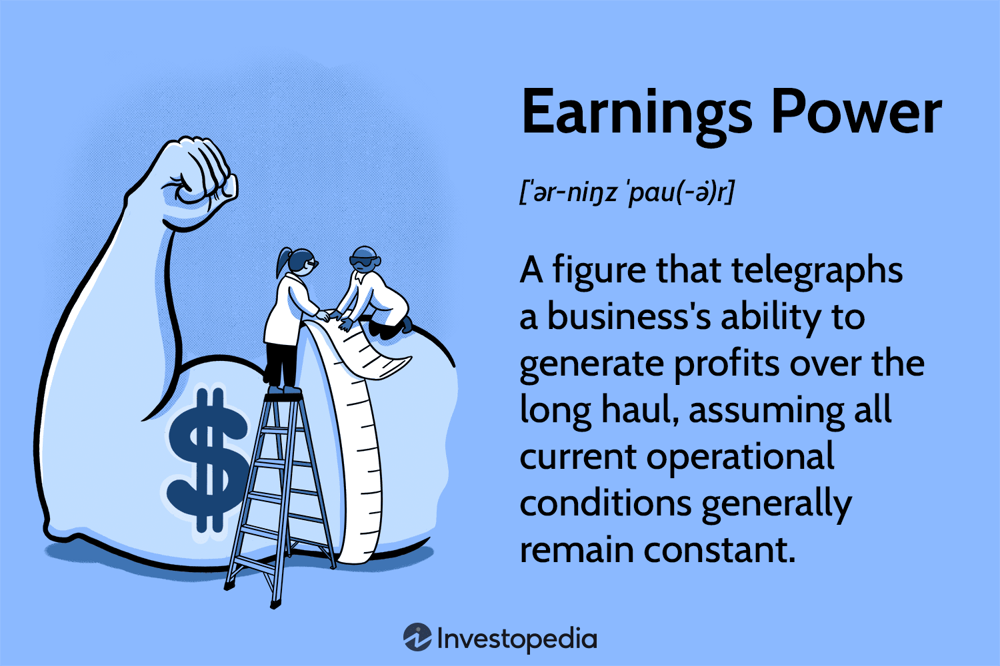

## Table of Contents

## What is earning power?

Earning power is how much money a person or a business can make over time. It shows how good they are at making money from what they do or sell. For a person, it might mean how much they can earn from their job or business. For a company, it's about how much profit they can make from their products or services.

To figure out earning power, you look at things like how much money is coming in, how much is being spent, and what's left over as profit. It's important because it helps people and businesses plan for the future. If they know their earning power, they can make better choices about saving, investing, or growing their business.

## Why is earning power important in financial analysis?

Earning power is important in financial analysis because it helps us understand how much money a company or a person can make over time. When we know the earning power, we can see if a business is doing well or if it needs to make changes. For example, if a company's earning power is high, it means they are good at making money from what they sell. This can make investors feel more confident about putting money into the company.

On the other hand, if the [earning](/wiki/earning-announcement) power is low, it might mean the company is not doing so well and could be at risk. Financial analysts use earning power to predict future earnings and to help decide if a company is a good investment. By looking at earning power, analysts can also suggest ways for a company to improve its profits, like cutting costs or finding new ways to make money.

## How does earning power differ from earning potential?

Earning power and earning potential are similar but they mean different things. Earning power is about how much money someone or a business is actually making right now. It's like looking at a report card that shows how well they are doing at making money from what they do or sell. For example, if a business is making a lot of profit from selling its products, that's its earning power.

Earning potential, on the other hand, is about how much money someone or a business could make in the future. It's more like a guess or a hope for what might happen if everything goes well. For instance, if a person goes back to school to learn new skills, their earning potential might go up because they could get a better job later.

Both earning power and earning potential are important. Earning power helps us understand the current financial health of a person or a business, while earning potential helps us think about what might be possible in the future.

## What are the key components that contribute to earning power?

Earning power is made up of a few important parts. One big part is revenue, which is the money that comes in from selling things or providing services. If a business sells a lot of products or if a person has a good job, their revenue will be high. Another part is the costs, which are the things you have to pay for to keep the business running or to do your job. If you can keep your costs low while still making a lot of money, your earning power will be strong.

Another key part of earning power is efficiency. This means how well you use your time and resources to make money. If a business can make a lot of products quickly and cheaply, or if a person can do their job well without wasting time, their earning power goes up. The last part is the market conditions. This includes things like how much people want to buy what you're selling and how much competition you have. If people really want what you're offering and there aren't many others selling the same thing, your earning power will be higher.

## Can you explain the basic formula used to calculate earning power?

The basic formula for calculating earning power is pretty simple. You take the total revenue, which is all the money you make from selling things or providing services, and then you subtract all the costs. Costs can include things like the price of materials, salaries, rent, and other expenses you need to pay to keep your business running. What you're left with after subtracting the costs from the revenue is your profit. This profit is what we call the earning power because it shows how much money you're actually making.

Sometimes, people also look at how well the business is using its assets to make money. They do this by dividing the profit by the total value of the assets the business owns. This gives you the earning power per unit of asset, which can help you see how efficient the business is. So, earning power can be seen in two ways: the straight profit you make, or how much profit you make for each dollar of assets you have.

## What are common constraints that limit earning power?

There are several things that can stop someone or a business from making as much money as they could. One big thing is the cost of doing business. If it costs a lot to make or sell something, there might not be much money left over after paying for everything. Another thing is competition. If there are a lot of other people or businesses selling the same thing, it can be hard to make a lot of money because everyone is trying to get the same customers.

Market demand is also important. If not many people want to buy what you're selling, it's tough to make a lot of money. Sometimes, rules and laws can limit earning power too. For example, if the government says you can't charge more than a certain amount for something, that can stop you from making as much money as you might want. All these things together can make it hard for someone or a business to have a high earning power.

## How can an individual or a business improve their earning power?

One way to improve earning power is by increasing revenue. This can be done by finding more customers or selling more to the ones you already have. For a business, this might mean advertising more or coming up with new products. For a person, it could mean getting better at their job or finding a job that pays more. Another way is to cut down on costs. If you can find cheaper ways to do things, like buying materials for less or using less energy, you'll have more money left over at the end of the day.

It's also important to be efficient. This means doing things in a way that saves time and money. A business might use new technology to make things faster, while a person might learn new skills to do their job better. Lastly, understanding the market can help. If you know what people want and can give it to them before anyone else does, you can make more money. By focusing on these things, both individuals and businesses can work on making their earning power stronger.

## What role do economic conditions play in affecting earning power?

Economic conditions have a big impact on earning power. When the economy is doing well, people have more money to spend, which means businesses can sell more and make more profit. This is good for both businesses and individuals because it can lead to higher salaries and more job opportunities. On the other hand, when the economy is not doing so well, people might not have as much money to spend. This can make it harder for businesses to sell their products and for individuals to find good-paying jobs, which can lower earning power.

Another way economic conditions affect earning power is through interest rates and inflation. If interest rates are low, it's cheaper for businesses to borrow money to grow, which can help them increase their earning power. But if inflation is high, the cost of everything goes up, which can eat into profits and make it harder for both businesses and individuals to keep their earning power strong. So, keeping an eye on the economy can help people and businesses plan better and try to keep their earning power as high as possible.

## How do industry-specific factors influence earning power?

Industry-specific factors can have a big impact on earning power. Different industries have their own rules and ways of doing things that can make it easier or harder to make money. For example, in the tech industry, having new and cool technology can help a company make more money because people are always looking for the latest gadgets. But in the farming industry, things like the weather and the cost of seeds can affect how much money a farmer makes. If there's a drought or if seed prices go up, it can be harder for farmers to make a profit.

Another way industry-specific factors influence earning power is through competition. In some industries, like fast food, there are a lot of companies all trying to sell similar things. This can make it hard for any one company to make a lot of money because they have to keep their prices low to attract customers. On the other hand, in industries like pharmaceuticals, where it's hard to get into the market because of high costs and strict rules, companies that are already there can make a lot of money because they don't have as much competition. So, understanding the specific factors in your industry can help you figure out how to improve your earning power.

## What advanced metrics can be used to assess earning power more accurately?

To assess earning power more accurately, we can use advanced metrics like EBITDA (Earnings Before Interest, Taxes, Depreciation, and Amortization). EBITDA shows how much money a business is making before taking out some big costs. It helps us see how well the business is doing at making money from its main activities, without being affected by things like how much they owe or how old their equipment is. Another useful metric is Return on Assets (ROA), which tells us how much profit a business is making for every dollar of assets it has. This can show how efficiently a business is using its stuff to make money.

We can also look at the Gross Margin, which is the money left over after paying for the cost of goods sold. A high gross margin means a business is good at making money from what it sells, which is a big part of earning power. Operating Margin is another important metric, as it shows the profit after paying for all the costs of running the business, but before interest and taxes. This can tell us how well a business is managing its day-to-day operations to make money. By using these advanced metrics, we can get a better picture of a business's earning power and see where they might be able to improve.

## How does earning power relate to sustainable growth models?

Earning power is really important when we talk about sustainable growth models. Sustainable growth means a business can keep growing without running into big problems. If a business has a strong earning power, it means they are making good money from what they do. This money can be used to grow the business in a way that lasts. For example, they might use the money to buy new equipment or to open new stores. But if their earning power is not strong, they might not have enough money to keep growing without taking on too much debt or cutting corners, which can cause problems later.

Earning power also helps a business plan for the future. If they know how much money they can make, they can set realistic goals for growth. They can look at their earning power and decide if they can afford to hire more people, start new projects, or expand into new markets. This helps them grow in a way that is steady and safe. By keeping an eye on their earning power, a business can make sure they are growing in a way that will last, instead of growing too fast and then running into trouble.

## Can you discuss case studies where earning power significantly impacted business decisions?

One good example where earning power changed a business decision is the story of Netflix. Back in the early 2000s, Netflix was making money by mailing DVDs to people's homes. But they saw that their earning power could be even better if they moved to streaming movies and TV shows online. They knew that if they could get more people to watch things online, they could make a lot more money. So, they spent a lot of money to build a streaming service. It was a big risk, but because they understood their earning power, they made the right choice. Now, Netflix is a huge company because they used their earning power to grow in a smart way.

Another case is about a small bakery called "Sweet Treats." The owners saw that their earning power was good because people loved their cakes and cookies. But they also saw that they could make even more money if they opened a second location in a busy part of town. They used their earning power to decide if they could afford to do this. They looked at how much money they were making and how much it would cost to open the new store. In the end, they decided to go for it because their earning power showed them it was a good move. Now, "Sweet Treats" has two stores and is making even more money than before.

## What is the Calculation Formula being introduced?

The calculation formula for financial limits is a pivotal tool in establishing a structured trading framework, allowing traders to manage and mitigate their risk exposure effectively. This formula employs a range of mathematical equations to establish boundaries for permissible risk levels in trades, crucial for maintaining financial stability and achieving trading objectives.

One fundamental component of the calculation formula is the Value at Risk (VaR) model, which estimates the potential loss in the value of an asset or portfolio over a specified time period given normal market conditions. The VaR model can be expressed as:

$$
\text{VaR} = V \cdot \sigma \cdot \sqrt{t}
$$

where $V$ represents the value of the portfolio, $\sigma$ denotes the volatility of returns, and $t$ is the time period.

The formula adapts to account for various factors critical in determining financial limits:

1. **Available Capital**: Constraint based on the total capital available for trading. Traders often leverage the Kelly Criterion, a formula used to determine the optimal size of a series of bets. It is defined as:

   \[ f^* = \frac{bp - q}{b}
$$

   where $b$ is the odds received on the wager, $p$ is the probability of winning, and $q$ (or $1 - p$) is the probability of losing.

2. **Historical Volatility**: Monitoring historical price fluctuations helps in assessing potential risk. Calculations might integrate historical data to adjust expectations of future volatility, impacting the permissible risk levels.

3. **Market Conditions**: Current market dynamics, including liquidity and market sentiment, influence the calculations. Implementing models such as the Capital Asset Pricing Model (CAPM) assists in evaluating expected returns against market risks:

   \[ E(R_i) = R_f + \beta_i \cdot (E(R_m) - R_f)
$$

   where $E(R_i)$ is the expected return on the investment, $R_f$ is the risk-free rate, $\beta_i$ is the beta of the investment, and $E(R_m)$ is the expected return of the market.

Traders have the flexibility to adjust these formulas to align with their individual strategies and risk appetites. Customization allows for a personalized approach to risk management, enhancing a trader's ability to respond to diverse market conditions.

In practical applications, the calculation formula aids traders in making informed decisions by providing quantitative insights into risk management. For instance, using Python, traders can automate the calculation of financial limits and adjustments based on real-time data feeds, thus optimizing their trading strategies. Here is a simple example of a Python function calculating VaR:

```python
import numpy as np

def calculate_var(portfolio_value, volatility, time_horizon):
    return portfolio_value * volatility * np.sqrt(time_horizon)

# Example usage
portfolio_value = 1000000  # Portfolio value in dollars
volatility = 0.05         # Annual volatility
time_horizon = 1/252      # One trading day

var = calculate_var(portfolio_value, volatility, time_horizon)
print(f"Value at Risk: ${var}")
```

This integration of mathematical rigor and computational tools epitomizes the efficient calculation of financial limits, a cornerstone for any sophisticated trading strategy.

## References & Further Reading

[1]: Bergstra, J., Bardenet, R., Bengio, Y., & Kégl, B. (2011). ["Algorithms for Hyper-Parameter Optimization."](https://papers.nips.cc/paper/4443-algorithms-for-hyper-parameter-optimization) Advances in Neural Information Processing Systems 24.

[2]: ["Advances in Financial Machine Learning"](https://www.amazon.com/Advances-Financial-Machine-Learning-Marcos/dp/1119482089) by Marcos Lopez de Prado

[3]: ["Evidence-Based Technical Analysis: Applying the Scientific Method and Statistical Inference to Trading Signals"](https://www.amazon.com/Evidence-Based-Technical-Analysis-Scientific-Statistical/dp/0470008741) by David Aronson

[4]: ["Machine Learning for Algorithmic Trading"](https://github.com/stefan-jansen/machine-learning-for-trading) by Stefan Jansen

[5]: ["Quantitative Trading: How to Build Your Own Algorithmic Trading Business"](https://www.amazon.com/Quantitative-Trading-Build-Algorithmic-Business/dp/1119800064) by Ernest P. Chan