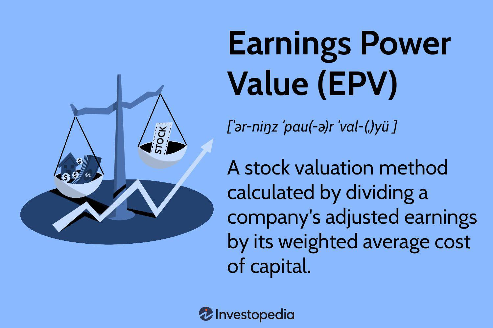

In the rapidly evolving world of finance, understanding and utilizing financial limits is crucial for both individual and institutional investors. These limits help in managing risk and maximizing potential returns by defining the constraints within which trades are executed. As technology continues to advance, algorithmic trading has emerged as an indispensable tool for enhancing earning power. This form of trading uses computer algorithms to automatically make trading decisions that are consistent with predefined rules and strategies.

Algorithmic trading is particularly significant in the context of financial limits, as it allows for precise and high-frequency trading actions that humans cannot perform manually. By leveraging sophisticated algorithms, traders can analyze market trends, detect patterns, and execute trades with remarkable speed and accuracy, thereby optimizing their earning potential. The use of algorithmic trading increases the efficiency of financial markets by providing liquidity and narrowing bid-ask spreads.



This article explores the financial limits calculation formula and its importance in maximizing earning power through algorithmic trading. The calculation formula is central to establishing a trading framework, which incorporates factors such as margin requirements, leverage ratios, and risk parameters. It provides the mathematical basis for determining the maximum permissible risks in trading activities. This formula helps traders customize their strategies to align with specific goals and risk tolerance levels.

The interplay between financial limits and algorithmic trading strategies creates the potential for successful trading outcomes. By understanding and applying these concepts, traders can develop robust strategies that are both profitable and sustainable. Throughout this article, we will examine how these elements work together to create efficient and effective trading strategies. By the end of this article, readers will gain a comprehensive understanding of how to leverage financial calculations to optimize trading outcomes, ensuring a more informed approach to navigating the complexities of today's financial markets.

## Table of Contents

## Understanding Financial Limits

Financial limits are a crucial aspect of trading, as they define the constraints and boundaries within which trades can be conducted. These limits are essential for managing risks and ensuring sustained profitability. Several key factors contribute to the establishment of financial limits, including margin requirements, leverage ratios, and asset allocations.

Margin requirements are the minimum amounts that traders must have in their accounts before engaging in certain transactions. This acts as a buffer against adverse market movements and helps traders avoid positions they cannot support financially. For example, in a margin account with a requirement of 50%, a trader must have at least half the value of the securities they wish to purchase in their account. This effectively limits the amount of leverage a trader can use, reducing the risk of significant losses.

Leverage ratios, meanwhile, determine the extent to which borrowed funds can be used to increase potential returns on investment. While leverage can amplify gains, it also increases the risk of substantial losses. Financial limits help traders balance these risks by setting maximum leverage ratios that align with their risk tolerance and capital base. For instance, if the leverage ratio is set at 1:2, a trader can borrow up to twice the amount of their initial investment.

Asset allocation is the distribution of investments across various asset classes, such as stocks, bonds, and commodities. Diversification through asset allocation is a fundamental technique for managing risk. By setting financial limits on the proportion of assets allocated to different classes, traders can mitigate the impact of adverse market conditions on their overall portfolio. A well-diversified portfolio might include a 60/40 split between equities and fixed income, reducing vulnerability to sector-specific downturns.

Understanding these constraints allows traders to make informed decisions and maintain a healthy trading portfolio. By adhering to predefined financial limits, traders can prevent overexposure to volatile markets, preserve capital, and enhance long-term profitability. In essence, financial limits act as a guiding framework, aiding traders in navigating the complexities of the financial markets while maintaining control over their trading activities.

## Introducing the Calculation Formula

The calculation formula for financial limits is a pivotal tool in establishing a structured trading framework, allowing traders to manage and mitigate their risk exposure effectively. This formula employs a range of mathematical equations to establish boundaries for permissible risk levels in trades, crucial for maintaining financial stability and achieving trading objectives.

One fundamental component of the calculation formula is the Value at Risk (VaR) model, which estimates the potential loss in the value of an asset or portfolio over a specified time period given normal market conditions. The VaR model can be expressed as:

$$
\text{VaR} = V \cdot \sigma \cdot \sqrt{t}
$$

where $V$ represents the value of the portfolio, $\sigma$ denotes the volatility of returns, and $t$ is the time period.

The formula adapts to account for various factors critical in determining financial limits:

1. **Available Capital**: Constraint based on the total capital available for trading. Traders often leverage the Kelly Criterion, a formula used to determine the optimal size of a series of bets. It is defined as:

   \[ f^* = \frac{bp - q}{b}
$$

   where $b$ is the odds received on the wager, $p$ is the probability of winning, and $q$ (or $1 - p$) is the probability of losing.

2. **Historical Volatility**: Monitoring historical price fluctuations helps in assessing potential risk. Calculations might integrate historical data to adjust expectations of future volatility, impacting the permissible risk levels.

3. **Market Conditions**: Current market dynamics, including liquidity and market sentiment, influence the calculations. Implementing models such as the Capital Asset Pricing Model (CAPM) assists in evaluating expected returns against market risks:

   \[ E(R_i) = R_f + \beta_i \cdot (E(R_m) - R_f)
$$

   where $E(R_i)$ is the expected return on the investment, $R_f$ is the risk-free rate, $\beta_i$ is the beta of the investment, and $E(R_m)$ is the expected return of the market.

Traders have the flexibility to adjust these formulas to align with their individual strategies and risk appetites. Customization allows for a personalized approach to risk management, enhancing a trader's ability to respond to diverse market conditions.

In practical applications, the calculation formula aids traders in making informed decisions by providing quantitative insights into risk management. For instance, using Python, traders can automate the calculation of financial limits and adjustments based on real-time data feeds, thus optimizing their trading strategies. Here is a simple example of a Python function calculating VaR:

```python
import numpy as np

def calculate_var(portfolio_value, volatility, time_horizon):
    return portfolio_value * volatility * np.sqrt(time_horizon)

# Example usage
portfolio_value = 1000000  # Portfolio value in dollars
volatility = 0.05         # Annual volatility
time_horizon = 1/252      # One trading day

var = calculate_var(portfolio_value, volatility, time_horizon)
print(f"Value at Risk: ${var}")
```

This integration of mathematical rigor and computational tools epitomizes the efficient calculation of financial limits, a cornerstone for any sophisticated trading strategy.

## Algorithmic Trading and Earning Power

Algorithmic trading, the deployment of computer algorithms to execute trades, is instrumental in augmenting [earning](/wiki/earning-announcement) potential in contemporary markets. This form of trading is characterized by its ability to conduct high-frequency transactions and make instantaneous decisions, a feat unreachable through manual trading methods. It capitalizes on the advancements in computational technology and data analytics, enabling traders to process and interpret significant volumes of market data in real-time. As a result, trades are executed with a level of speed and precision that minimizes human error.

A key advantage of [algorithmic trading](/wiki/algorithmic-trading) is its capacity to leverage complex financial calculations to enhance decision-making processes. Algorithms can integrate financial limits into their trading strategies effectively, ensuring that trades adhere to pre-defined risk levels and capital allocation constraints. These financial limits are calculated based on the variables such as available capital, market [volatility](/wiki/volatility-trading-strategies), and predefined risk tolerance levels. By setting these parameters within the trading algorithms, traders can optimize their strategies to navigate volatile markets profitably and securely.

Incorporating financial calculations within trading algorithms can be exemplified in Python as follows:

```python
import numpy as np

def calculate_financial_limit(capital, volatility, risk_tolerance):
    return capital * (1 - np.exp(-volatility * risk_tolerance))

# Example values
capital = 100000  # Available capital
volatility = 0.05  # Historical volatility
risk_tolerance = 0.02  # Risk tolerance level

financial_limit = calculate_financial_limit(capital, volatility, risk_tolerance)
print(f"Calculated Financial Limit: {financial_limit}")
```

In this hypothetical function, `calculate_financial_limit`, the financial limit is derived by considering the available capital, market volatility, and a trader's risk tolerance. The result aids in ensuring that any executed trade adheres to the calculated financial restrictions, thus preserving capital and sustaining profitability.

The integration of algorithmic trading with financial limits establishes a framework for optimized trading strategies. Algorithms can adapt to market shifts by recalibrating in real-time, maintaining adherence to financial calculations while seizing profitable opportunities. This adaptability is facilitated by the algorithms' ability to evaluate and react to new information swiftly, a process inherently constrained in traditional trading methods.

By marrying algorithmic trading with robust financial calculations, traders establish a powerful synergy that maximizes earning power while mitigating risks. This amalgamation of speed, precision, and carefully calculated financial constraints underpins the success of modern trading strategies and sets the groundwork for future innovations in the financial markets.

## Implementing the Strategy

Successful implementation of a trading strategy in modern financial markets requires a strategic integration of financial limits with algorithmic trading. This integration enables traders to adapt to dynamic market conditions, ensuring that they capitalize on opportunities while managing potential risks effectively.

Continuous monitoring and adjustment of trading strategies are essential due to the ever-changing nature of financial markets. Traders should employ a variety of analytical tools and data-driven insights to remain responsive to fluctuations in market trends. This involves setting financial limits that align with current market conditions and reassessing these limits regularly to accommodate changes in market volatility, interest rates, and other economic indicators.

Backtesting and scenario analysis constitute crucial steps in validating the efficacy of trading algorithms. These processes involve using historical data to simulate trading strategies, allowing traders to evaluate the potential performance of algorithms under different market conditions. By examining past performance, traders can identify patterns, optimize parameters, and minimize potential risks. The insights gained from [backtesting](/wiki/backtesting) help in refining strategies before actual deployment in live trading environments.

For effective implementation, traders can follow these practical tips and best practices:

1. **Risk Management Protocols**: Define clear risk management protocols, such as stop-loss and take-profit points, to safeguard against significant losses. This ensures that trades align with predetermined financial limits.

2. **Diversification**: Implement diversification strategies across various asset classes to mitigate concentration risks. Diversification can stabilize returns by spreading exposure across multiple financial instruments.

3. **Algorithm Calibration**: Regularly recalibrate algorithms to ensure they are responsive to market changes. Adjust algorithmic parameters based on the latest data analysis to enhance precision in trade executions.

4. **Utilizing Technological Tools**: Leverage advanced analytics and machine learning tools for real-time data analysis. These tools can identify profitable trading opportunities and patterns that human traders might overlook.

5. **Scenario Planning**: Conduct extensive scenario planning to anticipate potential market disruptions. Developing contingency plans can prepare traders for unexpected events, such as geopolitical tensions or economic crises.

6. **Compliance and Ethical Standards**: Ensure that all trading activities comply with regulatory requirements and ethical standards. This includes maintaining transparency in algorithmic trading actions to build trust with stakeholders.

By integrating these best practices, traders can implement algorithmic trading strategies that effectively maximize earning potential. Continuous learning and adaptation are key to maintaining a competitive edge in rapidly evolving financial markets.

## Challenges and Considerations

Despite the advancements algorithmic trading and financial limits have brought to modern trading, there remain significant challenges and considerations that traders must address to ensure effective and secure trading operations.

One of the primary challenges is market volatility, which can greatly impact algorithmic trading strategies. Sudden market movements can lead to unexpected losses, particularly when algorithms are programmed to follow certain market trends. To mitigate this risk, traders should implement robust risk management strategies. Utilizing stop-loss orders and dynamically adjusting trading parameters based on real-time market conditions can help manage potential losses. For example, a simple Python function to adjust stop-loss levels based on volatility could be:

```python
def adjust_stop_loss(current_price, volatility_index, base_stop_loss_percentage=0.02):
    """Adjust stop loss level based on current volatility."""
    adjusted_stop_loss = current_price * (1 - (base_stop_loss_percentage * volatility_index))
    return adjusted_stop_loss
```

Technological failures present another significant challenge. System crashes, latency issues, and data-feed errors can disrupt algorithmic trading operations. To address these, traders should invest in reliable infrastructure, ensure redundancy in their systems, and regularly test their algorithms under various scenarios. Implementing fail-safes and fallback mechanisms can minimize disruptions caused by technical glitches.

Cybersecurity threats are an ever-present concern in trading environments, as the financial data used and generated is sensitive and valuable. Protecting trading algorithms and data from cyberattacks requires implementing strong security measures. These include encrypting sensitive data, using two-[factor](/wiki/factor-investing) authentication, and performing regular security audits. Traders should establish protocols for responding to security breaches, ensuring quick identification and mitigation of threats.

Regulatory compliance is also a critical consideration. Regulations governing trading practices vary across jurisdictions and can impact algorithmic trading in several ways. Ensuring compliance not only mitigates the risk of legal consequences but also promotes ethical trading practices. Traders should stay informed about regulatory changes and adapt their strategies accordingly. Consulting with legal experts and regularly reviewing compliance policies are recommended strategies to navigate the regulatory landscape.

In summary, while the integration of financial limits and algorithmic trading can enhance trading efficiency and profitability, addressing challenges like market volatility, technological failures, cybersecurity threats, and regulatory compliance is crucial. By proactively managing these risks, traders can safeguard their operations and ensure sustainable trading practices.

## Conclusion

Calculating financial limits and utilizing algorithmic trading are key components in the toolkit of modern trading strategies. These methodologies, when applied judiciously, not only enhance earning power but also improve overall trading efficiency. Financial limits act as a safeguard, delineating the boundaries within which traders operate. By establishing clear cutoffs, traders can manage risk more effectively, ensuring long-term sustainability.

Algorithmic trading, meanwhile, leverages technological advancements to process vast datasets and execute trades virtually instantaneously. This capability minimizes human error and allows traders to capitalize on fleeting market opportunities. The marriage of financial limits and algorithmic trading forms a strategic alignment that is essential for maximizing returns.

As advances in technology continue to unfold, staying abreast of the latest innovations in financial calculations and trading algorithms becomes increasingly important. By integrating contemporary insights and practices into their operations, traders can confidently navigate the complexities of financial markets. This proactive approach not only mitigates risks but also positions traders to take full advantage of the dynamism that characterizes modern trading environments.

Going forward, the synergy between financial limits and algorithmic trading will remain a decisive factor, influencing how financial markets evolve. Traders who effectively harness these tools will likely lead the way, shaping the trading landscape of the future.

## References & Further Reading

[1]: Bergstra, J., Bardenet, R., Bengio, Y., & Kégl, B. (2011). ["Algorithms for Hyper-Parameter Optimization."](https://papers.nips.cc/paper/4443-algorithms-for-hyper-parameter-optimization) Advances in Neural Information Processing Systems 24.

[2]: ["Advances in Financial Machine Learning"](https://www.amazon.com/Advances-Financial-Machine-Learning-Marcos/dp/1119482089) by Marcos Lopez de Prado

[3]: ["Evidence-Based Technical Analysis: Applying the Scientific Method and Statistical Inference to Trading Signals"](https://www.amazon.com/Evidence-Based-Technical-Analysis-Scientific-Statistical/dp/0470008741) by David Aronson

[4]: ["Machine Learning for Algorithmic Trading"](https://github.com/stefan-jansen/machine-learning-for-trading) by Stefan Jansen

[5]: ["Quantitative Trading: How to Build Your Own Algorithmic Trading Business"](https://www.amazon.com/Quantitative-Trading-Build-Algorithmic-Business/dp/1119800064) by Ernest P. Chan