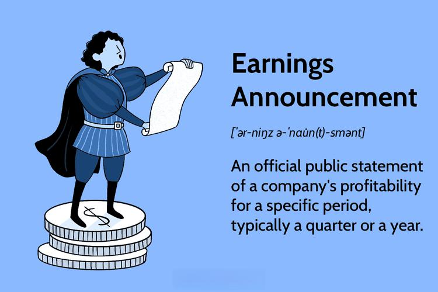

Earnings announcements are pivotal events in the financial calendar, providing crucial insights into a company's financial health and future prospects. They are essential for traders, investors, and financial analysts because they contain valuable information such as revenue figures, net income, and earnings per share (EPS), which can significantly influence market dynamics and stock prices.

Traditionally, investors and analysts relied on manual analysis to interpret these detailed reports, a process that could be both time-consuming and prone to human error. However, with the advent of algorithmic trading, the approach to earnings announcements has fundamentally transformed. Algorithms, powered by advanced computational techniques, have revolutionized how financial reports are analyzed and leveraged for trading purposes.



Algorithmic trading employs sophisticated mathematical models and computational resources to process earnings data at a speed and accuracy unattainable by human traders. By automating the assessment of financial reports, these algorithms can make informed and timely trading decisions. They evaluate market reactions, price momentum, and volatility induced by earnings announcements to exploit patterns and trends, aiming to achieve optimized trading outcomes.

The integration of machine learning and artificial intelligence further enhances algorithmic trading strategies, enabling them to learn from historic data and adapt to evolving market conditions. This capability allows traders to anticipate market movements and position themselves advantageously in anticipation of and reaction to earnings announcements.

In this article, we will explore how algorithmic trading employs financial reports to enhance trading strategies, examining the methodologies and technologies that enable traders to capitalize on the information contained within earnings announcements. This discussion will provide insights into the mechanisms by which algorithms process financial data, offering a detailed understanding of their impact on trading performance during key financial events.

## Table of Contents

## What is Earnings Report Trading in Algo Trading?

Earnings report trading in algorithmic trading involves analyzing detailed financial documents that represent a company's performance over a specified period. These earnings reports provide crucial financial metrics such as revenue, net income, and earnings per share (EPS), which are essential for assessing the economic health and performance trajectory of a company.

Algorithmic trading utilizes these earnings reports by employing complex algorithms that can rapidly analyze and interpret financial data input. This technological approach allows traders to make timely and informed trading decisions based on the financial outcomes presented in the reports. The primary objective is to detect and exploit patterns and trends within these documents to achieve optimized trading outcomes, often in fractions of a second that are unachievable through human trading.

The process starts with parsing the earnings reports to extract key financial metrics. Algorithms deploy natural language processing (NLP) techniques to scan text content and discern sentiment or implications of the reports that could affect stock prices. Machine learning models may also be employed to identify historical patterns: supervised learning models, for instance, can be trained on past earnings data and market movements to predict future stock behavior following earnings announcements.

These algorithmic systems typically look for specific indicators. For instance, a sudden increase in revenue or EPS exceeding market expectations may suggest upward price [momentum](/wiki/momentum). Conversely, lower-than-expected net income might lead to negative market reactions. Algorithms are designed to capture such movements quickly and adjust trading strategies to capitalize on them, aiming to enter or [exit](/wiki/exit-strategy) positions at optimal points.

The mathematical algorithms often employed in these systems range from basic statistical techniques to more advanced models. For instance:

1. **Mean Reversion**: Algorithms might assert that stocks tend to return to an average value over time. This can be expressed mathematically by identifying deviations from a moving average and generating trading signals accordingly.

2. **Volatility Analysis**: Mathematically assessing the variance or standard deviation of stock prices following earnings releases can provide insights into expected price fluctuations, informing trading decisions.

Through these methodologies, [algorithmic trading](/wiki/algorithmic-trading) of earnings reports seeks to utilize constant data feed and precise calculations to effectively navigate the complex financial information landscape and execute trading strategies better optimized for the nuances of earnings influences.

## Benefits of Algorithmic Trading for Earnings Reports

Algorithmic trading brings several advantages to handling earnings reports, primarily through its ability to process and analyze vast quantities of data with remarkable speed and precision. During earnings announcements, the market is often characterized by heightened [volatility](/wiki/volatility-trading-strategies), creating short-lived trading opportunities that algorithmic systems can efficiently exploit. These algorithms can process large datasets, encompassing both historical and real-time market information, delivering insights in milliseconds that human traders could not match.

Algorithms employ advanced analytics to discern underlying patterns and predict market movements following earnings announcements. By integrating techniques such as natural language processing (NLP) to analyze the sentiment of earnings call transcripts and [machine learning](/wiki/machine-learning) models to identify historical patterns, algorithms anticipate how stock prices might react to new earnings information. This capacity to predict allows traders to position themselves advantageously before the rest of the market has fully digested the news.

Structured trading strategies enabled by algorithmic systems contribute to consistent performance and effective risk management. Algorithms can systematically implement strategies like moving average crossovers or Bollinger Bands tailored to react specifically to earnings report dynamics. These strategies ensure that trades are conducted under a pre-defined set of rules, enhancing consistency and reducing emotional decision-making.

Additionally, algorithmic trading enhances risk management by incorporating safeguards within trading strategies. Features such as stop-loss orders, position sizing algorithms, and volatility filters help manage the potential downside risks associated with the unpredictable nature of earnings reports. By programming these elements into trading strategies, algorithms help maintain a balanced risk-reward ratio.

In essence, algorithmic trading not only accelerates the processing of financial data related to earnings reports but also leverages sophisticated analytics to inform strategic decisions, thereby enabling traders to navigate and capitalize on the fast-paced dynamics of earnings announcements.

## Developing an Earnings Report Trading Strategy

Developing a robust earnings report trading strategy is a meticulous process that involves several critical components which ensure its effectiveness and adaptability in ever-changing market conditions. One of the foundational steps in this process is [backtesting](/wiki/backtesting), which evaluates the potential success of a trading strategy using historical data. By simulating trades based on historical earnings reports, traders can identify patterns of profitability, assess risk, and refine their approach before deploying strategies in live environments.

Utilizing accurate datasets is crucial when backtesting earnings report trading strategies. Historical data accuracy ensures the analysis reflects real market conditions experienced during past earnings seasons. This requires comprehensive datasets that include not only earnings figures but also stock price movements, [volume](/wiki/volume-trading-strategy) indicators, and market sentiment data around those announcements. Access to accurate, granular data enables traders to simulate various scenarios and assess how their strategies would have performed under different conditions.

Common indicators used in earnings report trading strategies are mean reversion and volatility analysis. Mean reversion is based on the principle that asset prices tend to return to a long-term average. By identifying instances where a stock's price deviates significantly from its historical average following earnings announcements, traders can exploit potential reversals. Volatility analysis, on the other hand, focuses on measuring and predicting the price swings that occur around earnings reports. High volatility can present substantial risks and opportunities, and strategies that incorporate volatility metrics can better prepare traders to manage these fluctuations.

Customization and adaptation of strategies to current market dynamics are vital for ongoing success. Market conditions evolve, driven by factors such as economic shifts, regulatory changes, and technological advancements. As such, a trading strategy that was successful in the past may not be effective in the present or future without adjustments. Traders need to continuously refine their models, incorporating new data and insights to remain competitive. Customizing algorithms to respond to specific conditions, such as shifts in macroeconomic indicators or changes in sector performance, can enhance the resilience and effectiveness of an earnings report trading strategy.

To illustrate, consider a simplified Python code snippet to demonstrate the backtesting of an earnings report trading strategy using mean reversion:

```python
import pandas as pd

# Load historical stock data with earnings dates
data = pd.read_csv('historical_stock_data.csv', parse_dates=True, index_col='Date')

# Parameters for mean reversion strategy
window = 20 # 20 day moving average
threshold = 0.05 # 5% deviation from moving average

# Calculate moving average
data['MovingAvg'] = data['Close'].rolling(window=window).mean()

# Identify buy/sell signals based on mean reversion
data['Signal'] = 0
data.loc[(data['Close'] < data['MovingAvg'] * (1 - threshold)), 'Signal'] = 1 # Buy
data.loc[(data['Close'] > data['MovingAvg'] * (1 + threshold)), 'Signal'] = -1 # Sell

# Calculate strategy returns
data['StrategyReturns'] = data['Signal'].shift(1) * (data['Close'].pct_change())

# Summarize performance
total_return = data['StrategyReturns'].sum()
print(f'Total Strategy Return: {total_return:.2%}')
```

This example outlines a basic mean reversion strategy where buy signals are generated when the stock price falls below 95% of its 20-day moving average, and sell signals occur when it exceeds 105%. While this is overly simplistic, it highlights the process of using historical data to test a strategy's assumptions and potential profitability.

In conclusion, the development of an earnings report trading strategy hinges on the application of precise backtesting with reliable historical datasets, utilization of pertinent indicators like mean reversion and volatility analysis, and the ongoing customization of strategies to align with present market dynamics.

## Examples of Trading Strategies for Earnings Season

Earnings season presents unique opportunities for algorithmic trading strategies that capitalize on the volatility and momentum driven by corporate financial disclosures. Several strategies can be effectively employed to make the most of these market conditions.

### Trend Following Strategy

The [trend following](/wiki/trend-following) strategy capitalizes on the continuation of price movements that occur after earnings announcements. The core idea is that positive earnings surprises often lead to a sustained increase in stock prices, while negative surprises may cause prolonged downward trends. Traders set up algorithms to detect these momentum shifts and enter trades in the direction of the trend. 

Mathematically, the strategy can be implemented by calculating the moving average of the stock price over a short period (e.g., 5 days) and a longer period (e.g., 20 days). When the short-term moving average crosses above the long-term moving average, a buy signal is generated, while crossing below suggests a sell signal. This approach can be implemented in Python using libraries such as Pandas and NumPy:

```python
import pandas as pd
import numpy as np

def moving_average_strategy(prices, short_window=5, long_window=20):
    data = pd.DataFrame(prices, columns=['Close'])
    data['Short_MA'] = data['Close'].rolling(window=short_window).mean()
    data['Long_MA'] = data['Close'].rolling(window=long_window).mean()

    data.dropna(inplace=True)
    buy_signals = data[data['Short_MA'] > data['Long_MA']]
    sell_signals = data[data['Short_MA'] < data['Long_MA']]

    return buy_signals, sell_signals
```

### Contra-Trend Strategy

The contra-trend strategy, or mean reversion, exploits the overreactions to earnings surprises. It operates on the principle that sharp price movements are often followed by corrections, or reversals, towards the mean. Traders using this approach look for stocks that have deviated significantly from their historical average post-earnings, anticipating a reversion.

Key indicators may include Bollinger Bands, which measure the volatility and standard deviation of a stock's price, providing signals when the price moves beyond the standard deviation from the mean. A typical setup would involve entering a trade when the stock price crosses above or below the bands, expecting a reversal.

### Real-World Applications

Deploying these strategies in real-world trading environments involves considering varying market conditions that can impact performance. For instance, macroeconomic factors, investor sentiment, and unexpected news events can influence the effectiveness of both trend-following and contra-trend strategies. Traders must analyze historical market responses to similar earnings announcements to refine their approaches.

### Customization and Adaptation

Successful algorithmic trading during earnings season demands continual adaptation to changing market landscapes. Customizing strategies to account for sector-specific behaviors and individual stock characteristics can enhance performance. Incorporating machine learning techniques, such as [reinforcement learning](/wiki/reinforcement-learning), allows algorithms to adapt dynamically by learning from market interactions and adjusting parameters in real-time to improve outcomes. 

In conclusion, traders can leverage these algorithms to strategically navigate the complexities of earnings seasons, maximizing the probability of profitable trading activities. Accurate backtesting and adaptive learning techniques further reinforce the robustness and sustainability of these strategies.

## Backtesting Earnings-Based Algo Strategies

Backtesting is a fundamental process in the development of algorithmic trading strategies, particularly those focused on earnings reports. By simulating a trading strategy using historical data, traders can evaluate whether their approach can withstand the market volatility often induced by earnings announcements. The goal is to test the strategy's effectiveness, robustness, and ability to yield consistent returns without succumbing to market fluctuations.

One of the primary benefits of backtesting is establishing a strategy's capacity to endure volatility. Earnings reports can lead to sharp and often unpredictable market reactions. By testing strategies against historical data, traders can assess how their algorithms might perform under similar conditions in the future. However, replicating real-world trading scenarios faces numerous challenges.

Data accuracy is critical to ensuring reliable backtesting results. Market data must be precise and comprehensive, reflecting all the pertinent details that could impact trading decisions. Noise, which includes random market fluctuations and anomalies not representative of actual trends, can also skew results. Filtering out noise to focus on genuine market patterns is crucial.

Liquidity issues present another challenge. A backtested strategy might look promising on paper but could falter in real-world trading due to insufficient [liquidity](/wiki/liquidity-risk-premium). An illiquid market can lead to slippage, where trades are executed at a price less favorable than expected, ultimately impacting profitability. This necessitates meticulous consideration of liquidity constraints when evaluating a strategy's potential real-world application.

Transaction costs play a significant role in determining the final profitability of a trading strategy. Backtesting must incorporate realistic transaction costs, including commissions, spreads, and taxes, to provide an accurate representation of potential returns. Ignoring these factors can lead to overestimating a strategy's effectiveness.

Avoiding overfitting is another critical concern. An overfitted model is one that has been excessively tailored to historical data, capturing noise instead of underlying trends. This can result in a strategy that performs exceptionally on past data but fails to generalize to new data, thus proving ineffective in real trading environments. Strategies should be tested for robustness by evaluating their performance across different market conditions and time frames.

In Python, implementing a basic backtesting framework might involve libraries such as `pandas` for data manipulation and `numpy` for numerical operations. Here's a simple snippet demonstrating how one might set up such a backtesting environment:

```python
import pandas as pd
import numpy as np

def backtest(strategy, data, initial_capital=10000):
    # Initialize variables
    portfolio_value = initial_capital
    holdings = 0

    for index, row in data.iterrows():
        signal = strategy(row)

        if signal == "buy":
            holdings = portfolio_value / row['price']
            portfolio_value = 0
        elif signal == "sell":
            portfolio_value = holdings * row['price']
            holdings = 0

    return portfolio_value

def sample_strategy(row):
    if row['earnings_surprise'] > 0.05:
        return "buy"
    elif row['earnings_surprise'] < -0.05:
        return "sell"
    return "hold"

# Load historical data
data = pd.DataFrame({'price': [100, 105, 102, 108, 101],
                     'earnings_surprise': [0.01, 0.06, -0.04, 0.06, -0.08]})

# Backtest the strategy
final_value = backtest(sample_strategy, data)
print(f"Final portfolio value: {final_value}")
```

In conclusion, backtesting is a powerful tool for refining earnings-based algorithmic trading strategies. By meticulously simulating scenarios and addressing challenges such as data accuracy, noise, liquidity, transaction costs, and overfitting, traders can enhance their strategies' robustness and anticipate potential pitfalls in real-world applications.

## Risks and Considerations in Earnings Algo Trading

Earnings algo trading presents unique risks and considerations due to the inherent volatility surrounding earnings reports. This volatility can create both trading opportunities and significant challenges.

**Volatility and Execution Challenges**

The release of earnings reports typically leads to increased market volatility as investors react to new financial information. This environment can offer opportunities for profit but also poses the risk of unpredictable price movements. Traders must be prepared for the rapid changes in stock prices that result from market reactions, often driven by heightened investor sentiment and speculation.

**Liquidity Concerns**

During earnings announcements, liquidity can become a critical concern. In times of high volatility, increased trading volumes might lead to liquidity crunches, where the ability to execute large trades without significant price impact is diminished. Such circumstances can escalate transaction costs and impede optimal trade execution. Traders need to [factor](/wiki/factor-investing) in the potential for slippage and the varying bid-ask spreads that can occur during these periods.

**Risk Management Strategies**

Effective risk management is essential in managing the heightened risk profile of earnings algo trading. Implementing volatility filters, such as the Average True Range (ATR) to assess market volatility, or employing volatility-adjusted position sizing techniques can help mitigate risks. For example, traders might use:

$$
\text{Position Size} = \frac{\text{Risk Capital}}{\text{ATR} \times \text{Volatility Constant}}
$$

Here $\text{Risk Capital}$ is the portion of the portfolio allocated to the trade, and $\text{Volatility Constant}$ is a parameter set by the trader based on their risk tolerance and trading strategy.

Additionally, algorithms can be designed to set stop-loss and take-profit points dynamically, adjusting to the volatility levels observed post-earnings announcements. This approach helps in containing potential losses and securing profits as the market adjusts to the new information.

**Diversification**

Diversification remains a fundamental principle to mitigate risks associated with earnings-based trading strategies. By spreading investments across multiple stocks and sectors, traders can reduce the impact of adverse earnings surprises from any single entity. Allocating assets in a manner that balances exposure across different financial instruments and market segments can potentially smooth the equity curve and provide a buffer against unexpected market gyrations.

In conclusion, while earnings algo trading can offer substantial benefits, the accompanying risks necessitate comprehensive strategies to manage volatility, liquidity challenges, and position sizing. Employing robust risk management practices and portfolio diversification are pivotal in navigating the complexities of earnings announcement periods effectively.

## Conclusion

Algorithmic trading has become a transformative tool during earnings seasons, providing traders with significant advantages through enhanced speed and precision in executing trades. The development of in-depth strategies tailored to interpret financial reports and market conditions is crucial. Rigorous risk management must accompany these strategies to preserve capital and minimize potential losses. The dynamic nature of markets necessitates continual assessment and adjustment of trading algorithms.

Backtesting is a critical component of this process. By simulating a trading strategy using historical data, traders can evaluate potential performance and identify weaknesses or threats. This process helps in refining strategies to adapt to various market scenarios induced by earnings announcements, ensuring a more robust approach to trading. The insights gained from backtesting bolster the trader's ability to anticipate and respond to market movements driven by earnings data.

Traders who leverage algorithmic tools are well-positioned to handle the complex and fast-paced environment of earnings season. The automation of trading decisions allows for the rapid processing of information and execution of trades, reducing the latency that human decision-making processes typically involve. The strategic use of algorithms thus enables traders to exploit short-lived market opportunities effectively while maintaining a calculated approach to risk management.

In conclusion, algorithmic trading not only optimizes the decision-making process during earnings seasons but also equips traders with the necessary tools to navigate the challenges posed by volatile and unpredictable market conditions. By combining meticulous strategy development, comprehensive risk management practices, and rigorous backtesting, traders can enhance their performance and achieve more consistent trading outcomes.

## References & Further Reading

Zhang, X., et al. (2020). "Algorithmic Trading with Reinforcement Learning: A Review." This paper provides a comprehensive review of reinforcement learning applications in algorithmic trading, emphasizing how reinforcement learning has become an effective tool for developing trading strategies. The authors discuss various methodologies and frameworks, highlighting the potential and challenges associated with these techniques. Key insights include the development of adaptive trading models that can respond to dynamic market environments, making them particularly valuable during earnings announcements when market conditions can shift rapidly.

Fama, E. F., & French, K. R. (1993). "Common Risk Factors in the Returns on Stocks and Bonds." This seminal work introduces a three-factor model to explain stock returns, considering market risk, company size, and book-to-market value as primary factors. For those interested in earnings report trading, this framework underscores the importance of understanding systemic risk factors that might influence stock movements during earnings seasons. By integrating these factors into algorithmic models, traders can better anticipate potential risks and returns associated with earnings announcements.

Li, X., et al. (2021). "Applied Machine Learning for Algorithmic Trading." The authors explore machine learning applications tailored to algorithmic trading, detailing specific techniques such as supervised learning, unsupervised learning, and reinforcement learning. The paper emphasizes the importance of training algorithms on historical market data, including past earnings reports, to predict future market responses effectively. Practical examples demonstrate how machine learning algorithms can be customized to optimize trading strategies, making them more robust against the market volatility typical during earnings seasons.

