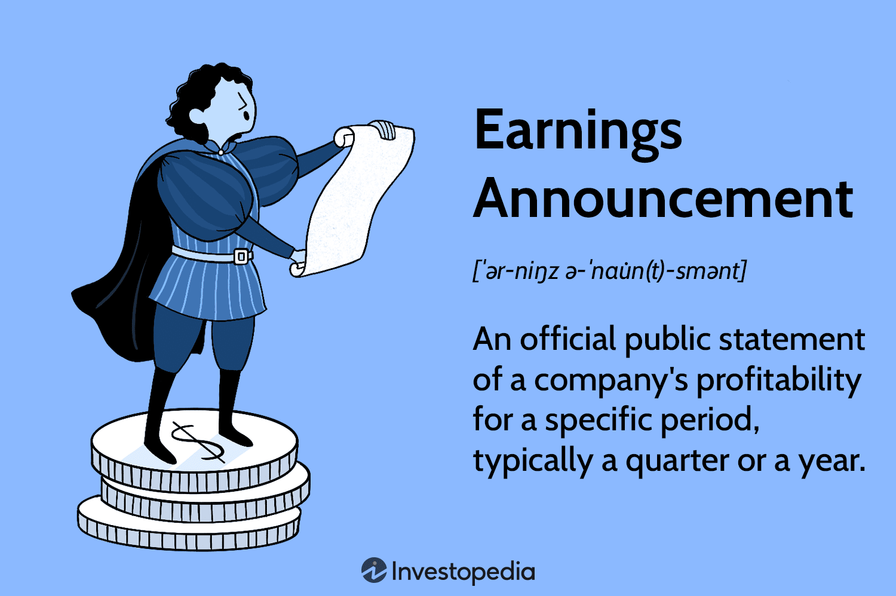

## Table of Contents

## What is an earnings announcement?

An earnings announcement is when a company tells everyone how much money it made or lost in a certain time, usually every three months. This is important because it shows if the company is doing well or not. People who own parts of the company, called shareholders, and people who might want to buy or sell those parts, pay close attention to these announcements.

When a company makes an earnings announcement, it shares a report that includes how much money it made from selling things, how much it spent, and if it made a profit or a loss. This information can make the price of the company's stock go up or down. If the company did better than people expected, the stock price might go up. If it did worse, the stock price might go down.

## Why are earnings announcements important to investors?

Earnings announcements are important to investors because they show how well a company is doing. When a company shares its earnings, investors can see if it made more money than expected or if it lost money. This information helps investors decide if they want to buy more of the company's stock, sell what they have, or keep things the same. If a company does better than people thought, its stock price might go up, which is good for investors who own that stock.

Investors also use earnings announcements to compare different companies. They can see which companies are making more money and which ones are struggling. This helps them choose where to put their money for the best chance to make more. By looking at these announcements over time, investors can also spot trends and make smarter decisions about their investments.

## How often do companies release earnings announcements?

Most companies release earnings announcements every three months, which is called a quarter. This means they tell everyone how much money they made or lost four times a year. These announcements usually come out around the same time each quarter, so people know when to expect them.

Sometimes, companies might also give a yearly earnings announcement at the end of their fiscal year. This is a summary of how they did over the whole year. But the quarterly announcements are the ones that investors watch closely because they give more frequent updates on the company's performance.

## What information is typically included in an earnings announcement?

An earnings announcement usually tells you how much money a company made from selling things, which is called revenue. It also tells you how much the company spent on making those things, paying workers, and other costs. This helps you figure out if the company made a profit, which means they made more money than they spent, or if they had a loss, which means they spent more than they made.

The announcement also includes something called earnings per share (EPS). This is how much money the company made for each little part of the company, called a share. If the EPS is higher than what people thought it would be, it's good news for people who own shares. The announcement might also have a part where the company's leaders talk about how the company is doing and what they think will happen next. This can give investors a better idea of what to expect in the future.

## How can earnings announcements affect stock prices?

Earnings announcements can make stock prices go up or down. If a company's earnings are better than what people expected, it's good news. People who own the company's stock might want to keep it or buy more because they think the company is doing well. This can make more people want to buy the stock, which can push the price up. On the other hand, if the earnings are worse than expected, it's bad news. People might want to sell their stock because they think the company is not doing as well as they hoped. When a lot of people want to sell, the stock price can go down.

Sometimes, the stock price can move a lot right after an earnings announcement. This is because the information is new and important, and people are trying to figure out what it means for the company. If the earnings are much better or much worse than what people thought, the stock price can change a lot in a short time. But the stock price can also keep changing in the days or weeks after the announcement as people keep thinking about the news and what it means for the company's future.

## What is the difference between actual earnings and expected earnings?

Actual earnings are the real numbers that a company reports about how much money it made or lost during a certain time. This is the true amount of money the company earned, and it's what they tell everyone in their earnings announcement. Expected earnings, on the other hand, are what people like financial experts and investors think the company will earn before the announcement comes out. These guesses are based on things like how the company has done in the past, what's happening in the economy, and any news about the company.

When a company releases its earnings announcement, people compare the actual earnings to the expected earnings. If the actual earnings are higher than what was expected, it's good news because it means the company did better than people thought. This can make the company's stock price go up because investors are happy and might want to buy more of the stock. If the actual earnings are lower than expected, it's bad news because it means the company didn't do as well as people hoped. This can make the stock price go down because investors might want to sell their stock.

## How do analysts' forecasts influence the market reaction to earnings announcements?

Analysts' forecasts are important because they help set what people expect from a company's earnings. When analysts make their guesses about how much money a company will make, investors and traders use these numbers to decide if they want to buy or sell the company's stock. If the actual earnings are a lot different from what the analysts predicted, it can cause a big reaction in the stock market. For example, if a company's earnings are much better than what analysts thought, people might get excited and buy more of the stock, which can make the price go up quickly.

On the other hand, if the actual earnings are a lot worse than what was expected, people might get worried and start selling their stock, which can make the price go down fast. The size of the difference between the actual and expected earnings can make the market reaction even stronger. If the difference is small, the stock price might not change much. But if the difference is big, the stock price can move a lot because people are surprised and need to change their plans quickly.

## What is an earnings surprise and how does it impact the market?

An earnings surprise happens when a company's actual earnings are different from what people expected. If the company makes more money than people thought, it's called a positive earnings surprise. If it makes less money than expected, it's a negative earnings surprise. These surprises can shake up the stock market because investors and traders pay close attention to them. They use the information to decide if they should buy or sell the company's stock.

When there's a positive earnings surprise, investors often get excited because it means the company is doing better than they thought. This can make more people want to buy the stock, which can push the price up. On the other hand, a negative earnings surprise can make investors worried. They might start selling their stock because they think the company isn't doing as well as they hoped, which can make the stock price go down. The bigger the surprise, the bigger the reaction in the market can be.

## Can you explain the concept of 'earnings management' in relation to announcements?

Earnings management is when a company tries to make its earnings look better or worse than they really are, especially around the time of earnings announcements. Companies might do this to meet or beat what people expect their earnings to be. They might move money around, change when they report certain costs, or do other things to make their numbers look better. This is not the same as cheating or breaking the law, but it can make it hard for investors to know the real story about how the company is doing.

This kind of management can affect how people see the company and what they do with its stock. If a company makes its earnings look better, people might think it's doing great and want to buy more of its stock, which can make the price go up. But if people find out later that the company was managing its earnings, they might feel tricked and start selling the stock, which can make the price go down. So, while earnings management can help a company in the short term, it can also cause problems in the long run if it's not done carefully.

## How do different sectors respond differently to earnings announcements?

Different sectors of the economy can react in their own ways to earnings announcements. For example, in the technology sector, earnings announcements can cause big changes in stock prices because tech companies often grow fast and people expect a lot from them. If a tech company does better than expected, its stock might jump up a lot. But if it does worse, the stock could drop a lot too. This is because investors and traders in the tech sector are always looking for the next big thing and are quick to buy or sell based on new information.

In the utility sector, like companies that provide electricity or water, the reaction to earnings announcements is usually not as big. These companies are seen as more stable and don't change much from quarter to quarter. People expect them to make steady money, so their stock prices don't move around as much. If a utility company has a good earnings announcement, its stock might go up a little, but it won't be as exciting as in the tech sector. If the earnings are bad, the stock might go down, but again, not as much as in other sectors.

The retail sector can have a mixed reaction to earnings announcements. Retail companies, like stores that sell clothes or food, can see their stock prices change a lot depending on how they did during busy times like holidays. If a retail company has a great earnings announcement after a big shopping season, its stock might go up a lot. But if it had a bad season, the stock could drop. This sector is sensitive to how people feel about spending money, so earnings announcements can tell investors a lot about what's going on with the economy.

## What role do macroeconomic factors play in the market's reaction to earnings announcements?

Macroeconomic factors are big things that affect the whole economy, like how fast the economy is growing, how much people are spending, and what interest rates are. These things can change how people feel about the market and how they react to earnings announcements. For example, if the economy is doing well and people are spending a lot of money, investors might be more excited about good earnings announcements. They might think that if a company is doing well in a strong economy, it will keep doing well, so they buy more of the company's stock and the price goes up.

On the other hand, if the economy is not doing well and people are worried about their money, investors might not be as happy about good earnings announcements. They might think that even if a company did well this time, it might not do well in the future if the economy keeps getting worse. So, they might not buy as much of the stock, and the price might not go up as much as it would in a good economy. Bad earnings announcements can also make investors even more worried in a bad economy, and they might sell more of the stock, making the price go down a lot.

## How can investors use historical earnings announcement data to predict future market movements?

Investors can use historical earnings announcement data to look for patterns in how a company's stock price moves after its earnings are released. By studying how the stock reacted to past earnings announcements, investors can see if the stock usually goes up or down when the company does better or worse than expected. They can also see if the stock price changes a lot or just a little. This helps investors guess what might happen to the stock price after the next earnings announcement.

Another way investors use historical data is to compare how a company's earnings have changed over time. If a company has been growing its earnings every year, investors might think it will keep growing and the stock price might go up after the next earnings announcement. On the other hand, if a company's earnings have been going down, investors might be worried and think the stock price will go down after the next announcement. By looking at the past, investors can make smarter guesses about what might happen in the future.

## What is an earnings announcement?

An earnings announcement is a public disclosure that details a company's financial performance over a predefined timeframe, commonly a fiscal quarter. These announcements are paramount during earnings seasons, as they furnish investors with crucial information regarding a company's financial health. Key components of an earnings announcement typically include revenue, net income, and earnings per share (EPS), which collectively enable investors to assess a company's operational efficacy and profitability.

During earnings seasons, the disparity between reported earnings and analyst forecasts can lead to pronounced market volatility. Analysts provide forward-looking estimates based on various models such as the Discounted Cash Flow (DCF) analysis. The EPS figure serves as a critical metric, as it represents the portion of a company’s profit allocated to each outstanding share of common stock, providing an indication of the company's profitability on a per-share basis.

The mathematical representation of EPS can be expressed as:

$$
\text{EPS} = \frac{\text{Net Income} - \text{Preferred Dividends}}{\text{Weighted Average Shares Outstanding}}
$$

Earnings announcements have the potential to cause substantial fluctuations in share prices. A positive deviation, where actual earnings exceed expectations, usually triggers an upward adjustment in stock prices. Conversely, if earnings fall short of expectations, it typically results in a decline in share prices. These fluctuations are primarily driven by investor sentiment and market psychology, as market participants rapidly adjust their positions in response to new information.

In anticipation of earnings announcements, speculative trading tends to increase, as investors attempt to forecast outcomes and reposition their portfolios accordingly. This speculative behavior can lead to more pronounced [volatility](/wiki/volatility-trading-strategies) as the announcement date approaches. Consequently, effective strategies for navigating this volatility are invaluable for traders aiming to optimize their market positions.

## What are Analyst Estimates and How Can They Be Understood?

Analyst estimates are crucial in shaping market expectations, serving as a reference point for comparing actual earnings results. These estimates are often generated using various analytical models, with the Discounted Cash Flow (DCF) model being one of the most prevalent. The DCF model involves projecting a company's future cash flows and discounting them back to their present value, using a discount rate. This process helps in estimating the intrinsic value of a company, thus allowing analysts to make informed predictions about its future financial performance.

The formula for the DCF model can be expressed as:

$$

DCF = \sum_{t=1}^{n} \frac{CF_t}{(1 + r)^t} 
$$

where $CF_t$ is the cash flow in year $t$, $r$ is the discount rate, and $n$ is the number of periods.

Although analyst estimates are fundamental in forming market perspectives, they can be susceptible to biases and errors. Factors such as over-optimism about a company's prospects, reliance on inaccurate data, or unanticipated macroeconomic changes can lead to inaccurate predictions. This underscores the importance for traders to critically assess these estimates when making trading decisions.

Algorithmic models leverage advancements in [machine learning](/wiki/machine-learning) to enhance the accuracy of trading decisions. By incorporating analyst estimates into their algorithms, traders can harness historical data, current market conditions, and quantitative techniques to optimize trading strategies. Machine learning models, for example, can be trained on large datasets to detect relationships and patterns that are not immediately apparent, helping to refine predictions about market movements post-earnings announcements. A simple Python implementation for incorporating earnings predictions might employ libraries like Scikit-learn for machine learning tasks:

```python
from sklearn.linear_model import LinearRegression
import numpy as np

# Example data: Historical earnings data and analyst estimates
historical_earnings = np.array([1.2, 1.5, 1.3, 1.8])
analyst_estimates = np.array([1.4, 1.6, 1.5, 1.7])

# Reshape data for sklearn
x = analyst_estimates.reshape(-1, 1)
y = historical_earnings

# Initialize and train the model
model = LinearRegression()
model.fit(x, y)

# Predict future earnings based on new analyst estimates
new_estimates = np.array([1.55, 1.75]).reshape(-1, 1)
predictions = model.predict(new_estimates)
print(predictions)
```

By integrating algorithmic models that exploit machine learning, traders can improve their capacity to anticipate market responses effectively, achieving a competitive edge during earnings seasons. However, it remains vital for traders to continuously update their models with fresh data to mitigate the risks associated with biases in analyst estimates.

## References & Further Reading

- Jansen, S. (2020). *Machine Learning for Algorithmic Trading*. Packt Publishing. This book provides a comprehensive exploration of how machine learning techniques can be utilized to develop sophisticated algorithmic trading strategies. It covers various methodologies, including data preprocessing, feature engineering, and the deployment of predictive models to effectively leverage the findings from earnings announcements.

- de Prado, M. L. (2018). *Advances in Financial Machine Learning*. Wiley. This resource is essential for understanding how machine learning can be applied to the field of finance, specifically in enhancing algorithmic trading strategies. The book discusses advanced topics and practical techniques, offering insights into how traders can use these to respond swiftly to earnings announcements and market changes.

- Bagnall, A., Lines, J., Bostrom, A., Large, J., & Keogh, E. (2017). "The great time series classification bake off: a review and experimental evaluation of recent algorithmic advances." This study is valuable for understanding time series data, which is crucial when using algorithmic models to anticipate and react to market fluctuations during earnings announcements.

- Fama, E. F. (1991). "Efficient Capital Markets: II." *The Journal of Finance*, 46(5), 1575–1617. This paper provides foundational insights into market efficiency, a principle that underlies the rapid price reactions observed during earnings announcements, thereby affecting algorithmic trading strategies.

- Zhang, X., Ma, G., & Ji, L. (2020). "Stock Price Prediction based on SSA-SVR and Time Series Features." *Procedia Computer Science*, 174, 917–925. This article discusses alternative techniques for stock price prediction, which can be integrated into algorithmic trading models to enhance performance during volatile periods like earnings seasons.

These resources collectively offer insights into the methodologies, tools, and theoretical underpinnings necessary for traders to effectively incorporate earnings announcements into algorithmic trading strategies.

