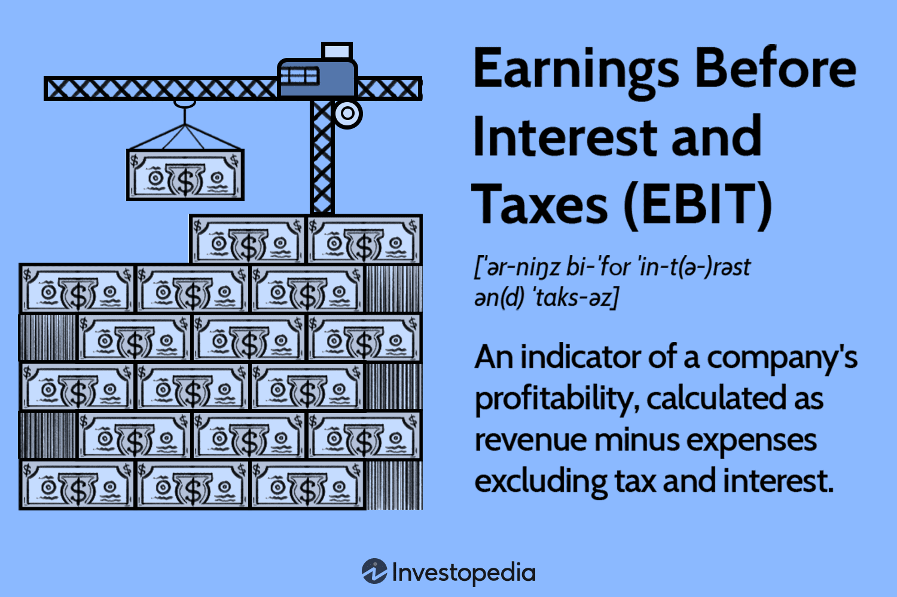

## Table of Contents

## What is Earnings Before Interest After Taxes (EBIAT)?

Earnings Before Interest After Taxes (EBIAT) is a measure of a company's financial performance that shows how much profit it makes from its operations after paying taxes, but before paying interest on any debts. It helps to understand how well a company is doing at making money from its main business activities, without considering how it is financed.

EBIAT is useful for comparing the performance of different companies because it removes the effects of different financing choices and tax situations. By looking at EBIAT, investors and analysts can see how profitable a company's core operations are, which can help them make better decisions about investing or lending money to the company.

## How is EBIAT different from EBIT and EBITDA?

EBIAT, or Earnings Before Interest After Taxes, is different from EBIT, or Earnings Before Interest and Taxes, because EBIAT takes out the taxes a company pays, but keeps the interest it pays in. EBIT, on the other hand, doesn't take out taxes or interest. So, EBIAT shows you how much money a company makes from its main work after paying taxes, but before paying interest. This helps to see how well a company is doing at its core business, without looking at how it borrows money or its tax situation.

EBITDA, or Earnings Before Interest, Taxes, Depreciation, and Amortization, is different from both EBIAT and EBIT because it also removes the costs of depreciation and amortization. Depreciation and amortization are ways to account for the wearing out of things like machines and buildings over time. By not counting these costs, EBITDA gives a picture of how much cash a company is making from its operations before any of these expenses are taken out. This can be useful for understanding a company's ability to generate cash from its main business activities, but it might not show the full cost of running the business over time.

## Why is EBIAT important for financial analysis?

EBIAT is important for financial analysis because it shows how much money a company makes from its main work after paying taxes, but before paying interest. This helps analysts and investors see how well a company is doing at its core business without the effects of how it borrows money or its tax situation. By looking at EBIAT, people can compare different companies more fairly, because it removes the differences caused by how each company is financed or taxed.

EBIAT also helps in understanding a company's true operating performance. Since it takes out taxes but keeps interest in, it gives a clear picture of the profits made from the company's main activities. This is useful for figuring out if a company is good at making money from what it does every day, which can help with decisions about investing or lending money to the company.

## What are the steps to calculate EBIAT?

To calculate EBIAT, you start with the company's earnings before interest and taxes, which is also called EBIT. You can find EBIT on the company's income statement. It's the money the company makes from its main work before it pays any interest on loans or any taxes. Once you have the EBIT, you need to subtract the taxes the company pays. You can find the tax amount on the income statement too. So, to get EBIAT, you take the EBIT and subtract the taxes.

After you subtract the taxes from the EBIT, what you have left is the EBIAT. This number shows how much money the company makes from its main work after paying taxes, but before paying any interest on loans. EBIAT is useful because it helps you see how well the company is doing at its core business, without looking at how it borrows money or its tax situation. By using EBIAT, you can compare different companies more fairly and understand their true operating performance.

## Can you provide a simple example of EBIAT calculation?

Let's say a company made $500,000 from its main work before paying any interest or taxes. This is the company's EBIT, which stands for Earnings Before Interest and Taxes. The company also had to pay $100,000 in taxes. To find out the EBIAT, which is Earnings Before Interest After Taxes, you take the EBIT and subtract the taxes. So, you take $500,000 and subtract $100,000, which gives you $400,000. This $400,000 is the EBIAT.

EBIAT is useful because it shows how much money the company makes from its main work after paying taxes, but before paying any interest on loans. This helps people see how well the company is doing at its core business, without looking at how it borrows money or its tax situation. By using EBIAT, you can compare different companies more fairly and understand their true operating performance.

## How does tax affect the calculation of EBIAT?

Tax affects the calculation of EBIAT because EBIAT is found by taking the company's earnings before interest and taxes (EBIT) and then subtracting the taxes it has to pay. So, if a company makes a lot of money from its main work but has to pay a lot in taxes, the EBIAT will be lower. This shows that taxes take away some of the money the company makes from its main work, which is important to know when looking at how well the company is doing.

EBIAT is useful because it helps people see how much money a company makes from its main work after paying taxes, but before paying any interest on loans. By looking at EBIAT, you can understand how well a company is doing at its core business without the effects of how it borrows money or its tax situation. This makes it easier to compare different companies fairly and see their true operating performance.

## What are common uses of EBIAT in business decision-making?

EBIAT is often used by businesses to help make decisions about how to run the company better. It shows how much money a company makes from its main work after paying taxes, but before paying any interest on loans. This helps business leaders see how well the company is doing at its core business, without looking at how it borrows money or its tax situation. By using EBIAT, they can compare their company to others more fairly and see if they are making enough money from what they do every day. This can help them decide if they need to change how they do things to make more money.

Another way EBIAT is used is in deciding whether to invest in new projects or buy other companies. If a company wants to start a new project or buy another business, they can look at the EBIAT to see if it will make enough money to be worth it. EBIAT helps them understand the true operating performance of the new project or the company they want to buy, without the effects of how it is financed or taxed. This makes it easier to decide if the investment will help the company make more money in the long run.

## How can EBIAT be used to assess a company's operating performance?

EBIAT helps to assess a company's operating performance by showing how much money it makes from its main work after paying taxes, but before paying any interest on loans. This is important because it lets people see how well the company is doing at its core business, without looking at how it borrows money or its tax situation. By looking at EBIAT, you can compare different companies more fairly and understand their true operating performance. If a company has a high EBIAT, it means it's good at making money from what it does every day, which is a good sign for its operating performance.

EBIAT also helps in figuring out if a company needs to change how it does things to make more money. If the EBIAT is low, it might mean the company isn't making enough money from its main work, and it might need to find new ways to improve. On the other hand, if the EBIAT is high, it shows that the company is doing well at its core business and might not need to make big changes. This helps business leaders make better decisions about how to run the company and keep improving its operating performance.

## What are the limitations of using EBIAT as a financial metric?

EBIAT is a useful way to see how much money a company makes from its main work after paying taxes, but it has some limits. One big limit is that it doesn't include the cost of borrowing money, which can be important for some companies. If a company has a lot of loans, the interest it pays can make a big difference in how much money it really has left. So, looking at EBIAT alone might make a company look better than it really is if it has a lot of debt.

Another limit of EBIAT is that it can be hard to compare between different countries because tax rates can be very different. What might look like good performance in one country might not be as good in another because of different tax rules. Also, EBIAT doesn't show how a company is spending money on things like new equipment or buildings, which can be important for understanding if the company is growing or just staying the same. So, while EBIAT can help see how well a company is doing at its core business, it's not the only thing to look at when trying to understand a company's full financial health.

## How does EBIAT relate to free cash flow?

EBIAT and free cash flow are both important numbers that help people see how much money a company has. EBIAT shows how much money a company makes from its main work after paying taxes, but before paying any interest on loans. Free cash flow, on the other hand, is the money a company has left after it pays for everything it needs to keep running and growing, like buying new equipment or paying back loans. So, EBIAT is a part of figuring out free cash flow because it shows the starting point of how much money the company has before other costs are taken out.

To find free cash flow, you start with EBIAT and then subtract the money the company needs to spend on things like new equipment or buildings, which is called capital expenditures. You also subtract any changes in working capital, which is the money tied up in day-to-day operations like inventory and accounts receivable. So, EBIAT is a key part of the free cash flow calculation because it helps show how much money is available before these other costs are taken out. By looking at both EBIAT and free cash flow, people can get a better idea of how much money a company really has to use or save.

## Can EBIAT be used for cross-industry comparisons? If so, how?

EBIAT can be used for cross-industry comparisons because it shows how much money a company makes from its main work after paying taxes, but before paying any interest on loans. This helps people see how well a company is doing at its core business, without looking at how it borrows money or its tax situation. By using EBIAT, you can compare companies in different industries more fairly because it takes out the effects of different financing choices and tax rates. This makes it easier to see which companies are good at making money from what they do every day, no matter what industry they are in.

However, there are some things to keep in mind when using EBIAT for cross-industry comparisons. Different industries might have different costs for things like new equipment or buildings, which EBIAT doesn't show. Also, some industries might have different tax rules or ways of making money that can affect how useful EBIAT is for comparing them. So, while EBIAT can help with cross-industry comparisons, it's important to look at other numbers too, like free cash flow, to get a full picture of how well a company is doing compared to others in different industries.

## What advanced adjustments might be needed when calculating EBIAT for complex businesses?

When calculating EBIAT for complex businesses, you might need to make some special adjustments to get a clear picture of how much money the company makes from its main work after paying taxes. One adjustment could be to account for any unusual or one-time costs that don't happen every year. These might include things like big legal fees or costs from closing down a part of the business. By taking these out, you can see what the company's normal operating performance looks like. Another adjustment could be to consider any special tax situations the company might have, like tax credits or different tax rates in different countries. This helps make sure the EBIAT number is fair and shows the real impact of taxes on the company's earnings.

Another important adjustment might be to account for any non-cash expenses, like stock-based compensation, which can affect the company's reported earnings but don't actually take money out of the company's pocket. By adjusting for these, you can get a better idea of the cash the company is making from its operations. Also, if the company has different business segments with different levels of profitability, you might need to calculate EBIAT for each segment separately and then add them up to get the total EBIAT. This helps to see how each part of the business is doing and makes the overall EBIAT number more accurate and useful for understanding the company's performance.

## What is EBIAT and why is it important?

EBIAT stands for Earnings Before Interest After Taxes and represents a key financial metric used to determine a company's operational profitability after accounting for tax expenses but before the effect of interest expenses. Unlike EBIT (Earnings Before Interest and Taxes), which does not consider the impact of taxes, EBIAT provides a more accurate depiction of a company's profitability by including the tax liabilities, thus offering a clearer representation of real earnings.

Calculating EBIAT involves adjusting the net income for interest and tax effects. The formula for EBIAT is as follows:

$$

\text{EBIAT} = \text{Net Income} + \text{Interest Expenses} \times (1 - \text{Tax Rate})
$$

The inclusion of the tax rate in calculating EBIAT is crucial as it allows the metric to reflect the actual financial condition of a business, independent of its capital structure and interest obligations. This adjustment for taxes makes EBIAT particularly useful for evaluating the operational efficiency of businesses, as it separates the performance of the company's core operations from its financing decisions.

For traders and financial professionals, incorporating EBIAT into [algorithmic trading](/wiki/algorithmic-trading) analysis can provide valuable insights into the viability and profitability of trading strategies. The metric helps traders evaluate a firm's efficiency after tax considerations, thereby enabling more informed decision-making when crafting trading strategies. By using EBIAT, traders can assess underlying operational performance without the distortion of financing and tax strategies, allowing for a clearer understanding of which strategies are truly beneficial from a profitability standpoint.

In financial assessments, EBIAT serves as an informative tool that complements other financial metrics by offering a post-tax perspective. While EBIT provides insights into operational income without considering taxes and interest, EBIAT’s key advantage lies in its attention to after-tax returns while excluding interest. This makes it particularly valuable for identifying operational efficiencies that may not be apparent when analyzing earnings through broader metrics like EBIT or EBITDA.

Ultimately, learning to calculate and apply EBIAT effectively can enhance the design of algorithmic trading systems. By implementing EBIAT in algorithmic models, traders can tailor their strategies to better accommodate real-world conditions, such as tax liabilities, leading to more robust risk management and a more accurate prediction of net returns from trading activities.

## References & Further Reading

[1]: ["Corporate Finance, Global Edition"](https://www.amazon.com/Corporate-Finance-Global-Edition/dp/1292446315) by Jonathan Berk and Peter DeMarzo

[2]: ["Quantitative Finance for Dummies"](https://www.amazon.com/Quantitative-Finance-Dummies-Steve-DPhil/dp/1118769465) by Steve Bell

[3]: ["Algorithmic Trading and DMA: An introduction to direct access trading strategies"](https://archive.org/details/algorithmictradi0000john) by Barry Johnson

[4]: ["Tax-Efficient Investing: A Guide to the Benefits and Limitations of Innovative Tax Savings Devices"](https://www.nerdwallet.com/article/investing/tax-efficient-investing) by James S. Kunen

[5]: ["Trading and Exchanges: Market Microstructure for Practitioners"](https://www.amazon.com/Trading-Exchanges-Market-Microstructure-Practitioners/dp/0195144708) by Larry Harris