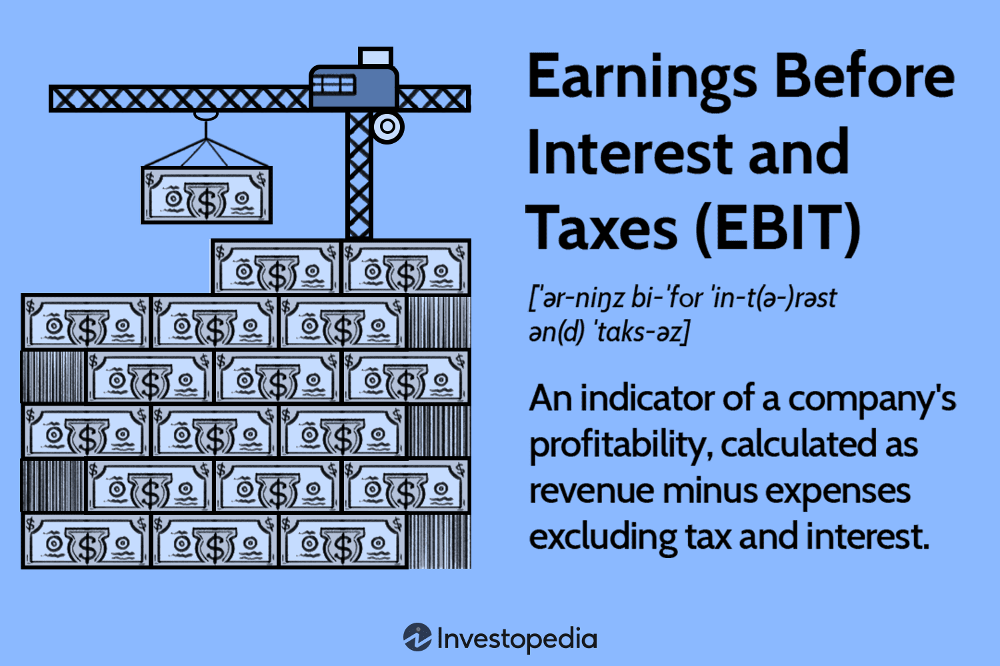

In today's fast-paced financial markets, understanding crucial financial metrics is essential for making informed investment decisions. Among these metrics, Earnings Before Interest and Taxes (EBIT) serves as a crucial indicator of a company's financial health, primarily focusing on its operational efficiency. By isolating earnings from the influences of capital costs and taxation, EBIT offers a clear perspective on how well a company performs in its core business activities. This clarity makes it indispensable for investors and traders alike, as they look to navigate the complex and rapidly changing market environments. 

Furthermore, the integration of EBIT into algorithmic trading strategies marks a significant development in financial analytics. Algorithmic trading, which employs complex mathematical models and high-speed computation to automate and optimize trade execution, benefits from the insights provided by EBIT. By using EBIT as a key input, these algorithms can identify trends and make trading decisions based on the operational performance of companies, which is often more stable and predictive than short-term market fluctuations. 



In this exploration, we'll assess how EBIT stands out as a fundamental metric in evaluating a company's core profitability, enabling a more refined analysis within trading algorithms. The convergence of traditional financial metrics with advanced algorithmic strategies signifies a new frontier in investment, combining time-tested analytical tools with innovative technological approaches to enhance decision-making and uncover new opportunities in financial markets.

## Table of Contents

## Understanding EBIT: Definition and Importance

EBIT stands for Earnings Before Interest and Taxes and represents a critical financial metric for assessing a company’s operational efficiency. By excluding the impacts of interest and taxes, EBIT focuses solely on the profitability generated from core business operations, offering a clearer view of managerial effectiveness in running day-to-day activities. This metric provides essential insights into a company’s capacity to generate profit through its fundamental operations, without being clouded by differences in capital structure or tax environments.

For investors and stakeholders, EBIT serves as a valuable indicator of financial health, abstracting away factors related to financing and taxation. This means that organizations are evaluated based on their operational performance rather than their ability to manage debt or tax liabilities. As such, EBIT is particularly beneficial when comparing companies within the same industry. It naturally follows that firms with higher EBIT values, all else being equal, are potentially more efficient and better at converting revenues into profitability through their core activities.

The calculation of EBIT is straightforward:
$$
\text{EBIT} = \text{Revenue} - \text{Cost of Goods Sold (COGS)} - \text{Operating Expenses}
$$
This formula highlights the focus on operational aspects, emphasizing revenues generated minus the direct and indirect costs associated with them.

Beyond simplifying profitability analysis, EBIT acts as a strong comparative tool. In sectors with companies having similar business models, EBIT offers an unvarnished measure of operational proficiency, uninfluenced by external financing decisions or differing fiscal strategies. For executives and financial analysts, understanding and applying EBIT can guide decisions around operational improvements, competitive benchmarking, and even mergers and acquisitions, providing a lens through which to assess potential synergies or operational bottlenecks.

## EBIT vs. EBITDA: A Comparison

While EBIT (Earnings Before Interest and Taxes) measures a company's profitability excluding interest and tax expenses, EBITDA (Earnings Before Interest, Taxes, Depreciation, and Amortization) goes a step further by also excluding depreciation and amortization. This distinction is vital for understanding the operational health of a business, as it highlights differences in how these metrics account for non-cash expenses associated with a company's tangible and intangible assets.

The exclusion of depreciation and amortization in EBITDA rendering it as a preferred metric in capital-intensive industries. In sectors like manufacturing, telecommunications, or energy, where significant investments in machinery and infrastructure are common, depreciation can profoundly impact net income. By focusing solely on operational profitability, EBITDA offers a clearer picture of a firm's ability to generate cash flow independent of its capital structure and investment activities. This makes EBITDA especially suitable for comparing companies with significant capital expenditures, offering insights into operational performance without the noise of accounting and financial policies.

When determining whether to employ EBIT or EBITDA in financial analysis, context is crucial. EBIT is often preferred when analyzing companies with significant interest expenses as it highlights the core earnings prior to financial obligations, allowing stakeholders to assess operational efficiency. In contrast, EBITDA is favored when analyzing companies with substantial fixed assets and concerns over operational cash flow take precedence over accounting strategies related to depreciation. The choice between these two depends on the specific financial aspects under scrutiny and the type of insights sought by investors or analysts.

Overall, EBIT and EBITDA offer varied perspectives on a company's financial standing. EBIT provides insight into operational efficiency by accounting for interest and taxes but can be affected by non-cash expenses that are relevant in many sectors. EBITDA, with its broader exclusions, emphasizes cash flow and operational profitability, especially useful in comparison across capital-intensive industries. They complement each other by presenting a comprehensive overview when used in conjunction with other financial metrics.

## EBIT in Algorithmic Trading

Algorithmic trading has revolutionized the financial markets, enabling traders to perform transactions at speeds and scales unimaginable for human operators. Central to this innovation is the application of quantitative metrics, such as Earnings Before Interest and Taxes (EBIT), which offer valuable insights into a company's operational health.

Incorporating EBIT into trading algorithms provides traders with a critical data point for evaluating the core performance of firms. EBIT, calculated as the difference between a company's total revenue and its cost of goods sold (COGS) and operating expenses, is instrumental in parsing a company's financial statements to determine its profitability before the impact of capital structure and tax considerations.

$$
\text{EBIT} = \text{Revenue} - \text{COGS} - \text{Operating Expenses}
$$

By integrating EBIT, algorithms are equipped to assess trends that signal shifts in a company's operational efficiency. For instance, a sustained increase in EBIT may indicate that a company is successfully enhancing its operational efficiency, potentially signaling a favorable time to purchase its stock. Conversely, a downward trend might suggest emerging operational challenges, prompting algorithms to adjust trading strategies accordingly.

Consider a Python-based framework where EBIT is utilized within a larger [algorithmic trading](/wiki/algorithmic-trading) model. The framework might involve analyzing historical EBIT data and forecasting future figures using a time-series model, such as ARIMA. Here is a simple illustration of how such an analysis might be structured:

```python
import pandas as pd
from statsmodels.tsa.arima.model import ARIMA

# Example dataset of historical EBIT values
data = {'Year': [2018, 2019, 2020, 2021],
        'EBIT': [500, 550, 580, 600]}
df = pd.DataFrame(data)

# Set the year as index
df.set_index('Year', inplace=True)

# Define the ARIMA model
model = ARIMA(df['EBIT'], order=(1, 1, 1))
model_fit = model.fit()

# Forecast the next period's EBIT
forecast = model_fit.forecast()
print(f"Forecasted EBIT for next period: {forecast[0]}")
```

This integration underscores a powerful synthesis of traditional financial metrics with advanced trading technology, allowing investors to identify and act upon market signals with precision and speed. Such frameworks enable efficient resource allocation, automatic risk management, and rapid adaptation to market dynamics, cementing EBIT's role as a valuable input in contemporary trading algorithms.

## Calculating EBIT for Algorithmic Models

Calculating EBIT, or Earnings Before Interest and Taxes, is pivotal in determining a company's operational profit. The formula for EBIT is:

$$
\text{EBIT} = \text{Revenue} - \text{Cost of Goods Sold} - \text{Operating Expenses}
$$

This metric helps in assessing a firm's performance by focusing purely on its operational capabilities, free from the distortions of its capital structure and tax obligations.

Incorporating EBIT into algorithmic trading models can significantly enhance the capability to identify undervalued stocks. By analyzing trends in a company's EBIT, algorithms can discern its ongoing operational performance and efficacy. Algorithmic models focus on leveraging such key financial metrics to make real-time decisions about when to buy or sell stocks. For example, a consistent upward trend in a company's EBIT might trigger buy orders due to an indication of robust operational health.

The integration of EBIT into algorithmic models requires a solid understanding of mathematical and statistical techniques. Quantitative trading strategies often utilize EBIT as a [factor](/wiki/factor-investing) in multi-variable models where its trend data can be weighted alongside other financial metrics. For instance, [machine learning](/wiki/machine-learning) algorithms can be trained to recognize patterns in EBIT and predict future movements, offering a substantial advantage in decision-making processes.

Enhanced decision-making is achieved through complex computational algorithms that manage large data sets. A simplified Python example for calculating EBIT might look as follows:

```python
def calculate_ebit(revenue, cogs, operating_expenses):
    """Calculate Earnings Before Interest and Taxes (EBIT)."""
    return revenue - cogs - operating_expenses

# Example usage
revenue = 1000000
cogs = 300000
operating_expenses = 200000

ebit = calculate_ebit(revenue, cogs, operating_expenses)
print(f"The calculated EBIT is ${ebit}")
```

By incorporating EBIT effectively, traders can better gauge a firm's operational status and market position, thus facilitating well-informed trading strategies that capitalize on identified inefficiencies and trends.

## Benefits and Risks of EBIT in Algo Trading

Utilizing Earnings Before Interest and Taxes (EBIT) in algorithmic trading models offers various advantages and challenges for predicting company profitability and market behaviors. EBIT serves as a reliable metric for assessing a company's core operational performance, enabling traders to forecast profitability trajectories based on historical and current data trends. This predictive capability is crucial in high-frequency trading environments, where rapid decision-making can lead to significant financial gains. However, reliance on EBIT alone has its limitations and risks.

One significant advantage of using EBIT in trading algorithms is its ability to provide insights into the operational efficiency of a company. By focusing on earnings generated through core business activities without accounting for financing and tax considerations, EBIT helps in distinguishing a company’s genuine operational performance. This allows trading models to identify potential growth opportunities and make informed investment decisions.

Despite its benefits, relying solely on EBIT introduces several risks. Primarily, EBIT does not account for non-operational financial factors, such as interest expenses, taxes, and one-time financial events, which can have substantial impacts on a company's overall financial health. Ignoring these elements may lead to an incomplete analysis of a company’s viability, thus influencing trading outcomes adversely.

A prudent approach involves integrating EBIT with additional financial indicators to achieve a comprehensive evaluation of a company's performance. For example, metrics like Net Income and Cash Flow can provide a fuller picture of a company's financial status by incorporating elements excluded from EBIT. Algorithmic models benefit from a diversified dataset that balances EBIT with other metrics, mitigating the risks associated with over-reliance on a single metric.

Implementing this balanced approach in algorithmic trading can be illustrated using Python, where EBIT is just one of multiple factors considered in the trading algorithm. For instance:

```python
def predict_stock_value(revenue, cogs, operating_expenses, interest_expense, taxes, cash_flow):
    ebit = revenue - cogs - operating_expenses
    net_income = ebit - interest_expense - taxes

    # Incorporating EBIT, Net Income, and Cash Flow into a hypothetical decision-making model
    decision_score = ebit * 0.4 + net_income * 0.3 + cash_flow * 0.3

    return decision_score > threshold_value  # where threshold_value is a predefined constant

# Example parameters
revenue = 1000000
cogs = 400000
operating_expenses = 300000
interest_expense = 50000
taxes = 60000
cash_flow = 250000
threshold_value = 500000

stock_decision = predict_stock_value(revenue, cogs, operating_expenses, interest_expense, taxes, cash_flow)
```

This code snippet demonstrates incorporating multiple metrics, blending EBIT with other indicators to make more robust trading decisions. In conclusion, while EBIT offers significant value in predicting company performance, a balanced integration with other financial metrics is crucial for comprehensive and effective algorithmic trading strategies.

## Conclusion

EBIT (Earnings Before Interest and Taxes) remains a critical tool for evaluating a company's fundamental profitability, serving as an essential component in crafting sophisticated trading strategies. By excluding the variables of interest and taxes, it provides a clearer picture of a company's core earnings capability. This streamlining allows for a more precise assessment of operational performance, which can be pivotal when making investment decisions.

When effectively integrated into algorithmic models, EBIT aids in forming a deeper analysis of stock valuation that transcends mere market trends. Algorithmic trading, by its nature, capitalizes on systematically identifying and acting upon subtle market signals more efficiently than traditional trading methods. By including EBIT as a core variable, these algorithms can tap into quantitative insights that reflect a firm's underlying operational health. Such integration facilitates targeted trading decisions, optimizing buy and sell triggers based on the refined understanding of a company's earnings potential.

The fusion of conventional financial analysis with contemporary technological advancements presents vast opportunities for identifying innovative investment prospects. As the financial landscape evolves, leveraging traditional metrics like EBIT in conjunction with sophisticated algorithmic frameworks offers a competitive edge in navigating market complexities. This approach not only enhances strategic stock evaluations but also underscores the importance of balancing classical financial scrutiny with cutting-edge technological methodologies, ultimately paving the way for discovering new avenues in investment markets.

## References & Further Reading

[1]: ["Advances in Financial Machine Learning"](https://www.amazon.com/Advances-Financial-Machine-Learning-Marcos/dp/1119482089) by Marcos Lopez de Prado

[2]: ["Evidence-Based Technical Analysis: Applying the Scientific Method and Statistical Inference to Trading Signals"](https://www.amazon.com/Evidence-Based-Technical-Analysis-Scientific-Statistical/dp/0470008741) by David Aronson

[3]: ["Machine Learning for Algorithmic Trading"](https://github.com/stefan-jansen/machine-learning-for-trading) by Stefan Jansen

[4]: ["Quantitative Trading: How to Build Your Own Algorithmic Trading Business"](https://www.amazon.com/Quantitative-Trading-Build-Algorithmic-Business/dp/1119800064) by Ernest P. Chan

[5]: ["Financial Statement Analysis and Security Valuation"](https://www.mheducation.com/highered/product/Financial-Statement-Analysis-and-Security-Valuation-Penman.html) by Stephen H. Penman