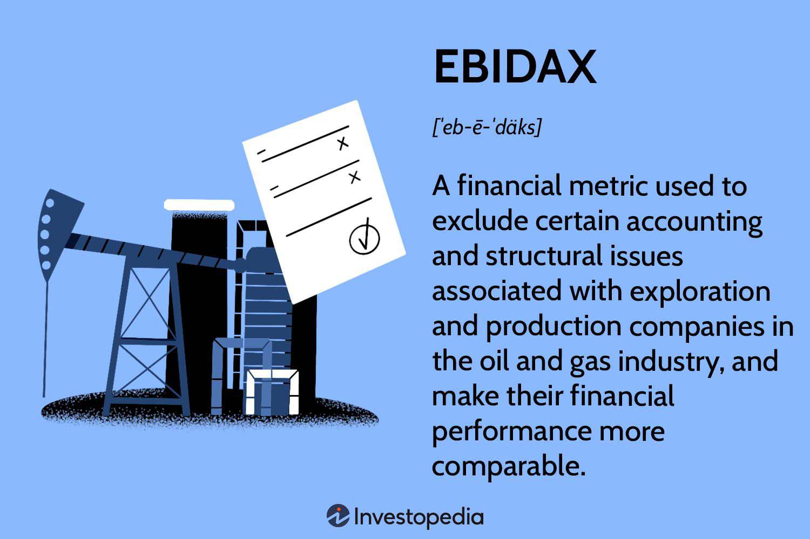

In the ever-evolving world of finance, non-GAAP measures have gained significant attention for providing insights beyond traditional accounting standards. These financial metrics, diverging from generally accepted accounting principles (GAAP), allow companies to tailor disclosures and offer a clearer view of their operational performance. Non-GAAP measures are particularly valuable in sectors where standard accounting practices may not adequately capture the nuanced financial picture.

Among these measures, EBIDAX stands out as a key metric used predominantly in the oil and gas sector. It builds upon the traditional Earnings Before Interest, Taxes, Depreciation, and Amortization (EBITDA) metric by excluding exploration expenses, providing a more refined insight into a company's operational efficiency. This exclusion is crucial in industries where exploration costs can significantly influence financial performance, offering a comparative advantage by depicting operational capabilities without the volatility of exploration expenditures.



This article explores the significance of EBIDAX, its role in financial metrics, and how it intersects with algorithmic trading. Non-GAAP measures like EBIDAX are instrumental in crafting financial strategies and models within algorithmic trading, where precise datasets are valuable for predictive accuracy. By understanding these metrics, traders and financial analysts can optimize strategies to better reflect operational efficacy, enhancing the robustness of predictive models and trading algorithms.

We'll examine the benefits and challenges of using non-GAAP measures like EBIDAX and consider its implications for data-driven trading strategies. While non-GAAP measures provide enriched perspectives on financial health, they also pose challenges including potential manipulation and lack of standardization. Therefore, a comprehensive understanding of these measures is essential for stakeholders aiming to leverage them effectively.

As financial markets become increasingly complex, understanding these metrics can offer substantial advantages. Financial professionals must adeptly navigate calculations like EBIDAX to recognize underlying trends and make informed decisions. This knowledge empowers them to capitalize on market opportunities, aligning investment strategies with intrinsic company performance. In the face of burgeoning financial complexities, non-GAAP measures like EBIDAX are poised to play a pivotal role in shaping the future landscape of financial analysis and trading.

## Table of Contents

## Understanding EBIDAX

EBIDAX, or Earnings Before Interest, Depreciation, Amortization, and Exploration, is a specialized financial metric used primarily by exploration and production companies within the oil and gas sector. This metric aims to provide a clearer picture of a company's financial performance by adjusting EBITDA (Earnings Before Interest, Taxes, Depreciation, and Amortization) to exclude exploration expenses. By subtracting these costs, EBIDAX offers a more consistent basis for comparing financial statements across companies operating in different geographic and operational contexts.

The rationale behind excluding exploration expenses lies in the inherent variability and unpredictability of exploration activities, which can distort the true operational performance of such companies. By focusing on core earnings without the drag effect of exploration costs, EBIDAX ostensibly allows for better comparability and benchmarking. 

```math
\text{EBIDAX} = \text{Net Income} + \text{Interest} + \text{Taxes} + \text{Depreciation} + \text{Amortization} + \text{Exploration Costs}
```

While EBIDAX can enhance transparency by isolating key operational performance indicators, it is not without its limitations. Like its counterpart EBITDA, EBIDAX may present challenges when applied to companies with significant capital expenditures or those operating in varied tax environments. For companies with intensive capital investments, such as in infrastructure or technology, the omission of exploration costs might obscure the long-term financial outlook by omitting expenses essential to sustained growth.

Furthermore, investors should exercise caution in evaluating EBIDAX figures. There is a risk that companies might use this metric to mask underlying inefficiencies or challenges in exploration efficiency. Without regulated standardization, the methodology for calculating EBIDAX might vary, complicating direct comparisons between companies and potentially leading to misinterpretations of a firm's financial health. As such, it is crucial for analysts to conduct diligent evaluations of how EBIDAX is presented and to incorporate additional financial metrics to achieve a comprehensive understanding of a company's performance.

## Non-GAAP Measures: A Broader Perspective

Non-GAAP measures, such as EBIDAX, are custom financial metrics designed to provide insights beyond what standard accounting practices capture. Unlike Generally Accepted Accounting Principles (GAAP) measures, which adhere to uniform guidelines, non-GAAP measures are not standardized. This lack of standardization can lead to inconsistencies in how these metrics are calculated and reported, potentially causing confusion among investors and stakeholders.

Non-GAAP measures aim to enhance transparency by isolating key operational activities, excluding items that do not reflect the core performance of a company. For instance, a company might exclude certain expenses, such as restructuring charges or exploration costs, to present an adjusted view that better reflects ongoing operational efficiency. While this can offer a clearer picture of operational effectiveness, the flexibility in defining which items to exclude introduces a risk. Companies may selectively exclude costs, potentially manipulating these metrics to present a more favorable financial picture.

Despite these risks, non-GAAP measures have become increasingly popular among investors and analysts. They provide a means to understand a company's financial health when GAAP metrics may be distorted by non-operational items. For instance, non-GAAP measures allow investors to compare companies across different industries or geographies, where accounting methodologies might vary significantly. This is particularly useful in industries with unique cost structures, such as technology or pharmaceuticals, where traditional accounting metrics may not fully capture the nuances of business performance.

It is essential for investors to approach non-GAAP measures with caution, critically evaluating the adjustments made by companies to ensure they are justified and consistent. The objective is to gain a comprehensive understanding of a company's operational performance without being misled by numbers that have been finely tuned to portray a particular narrative. By balancing non-GAAP measures with traditional GAAP metrics, investors can achieve a more informed perspective on a company's true financial condition.

## The Role of EBIDAX in Algorithmic Trading

In [algorithmic trading](/wiki/algorithmic-trading), EBIDAX can significantly enhance the efficiency and accuracy of trading algorithms by providing a clearer dataset for analysis. This non-GAAP measure offers the advantage of focusing on the core operational performance of companies in the oil and gas sector. By excluding exploration costs, EBIDAX allows algorithms to filter out non-recurring costs, presenting a purer view of financial health and performance.

Algorithmic trading systems often rely on historical data for [backtesting](/wiki/backtesting) trading strategies. The precision offered by EBIDAX ensures that these strategies are aligned with a company's consistent operational output, rather than being skewed by irregular expenses. This is crucial when constructing and validating predictive analytics models used in trading. Enhanced data precision means that algorithms can identify and exploit more genuine financial trends, potentially leading to more reliable and profitable trading decisions.

```python
# Example of backtesting strategy using EBIDAX

import pandas as pd
import numpy as np
from sklearn.linear_model import LinearRegression

# Sample EBIDAX data for a company (in millions)
data = {'Year': [2018, 2019, 2020, 2021],
        'EBIDAX': [500, 550, 580, 630],
        'Stock Price': [50, 55, 58, 63]}

df = pd.DataFrame(data)

# Backtesting linear relationship between EBIDAX and Stock Price
X = df[['EBIDAX']]
y = df['Stock Price']

# Fitting linear regression model
model = LinearRegression().fit(X, y)

# Coefficient represents sensitivity of stock price to changes in EBIDAX
stock_price_sensitivity = model.coef_[0]

# Predict future stock price based on EBIDAX forecast
future_ebidax = np.array([[700]])
predicted_stock_price = model.predict(future_ebidax)

print(f"Predicted Stock Price based on future EBIDAX: ${predicted_stock_price[0]:.2f}")
```

Furthermore, non-GAAP measures like EBIDAX can significantly contribute to portfolio optimization. Algorithms can utilize these metrics to select stocks that demonstrate more consistent and reliable underlying performance. By prioritizing companies with stable EBIDAX figures, portfolio managers can reduce [volatility](/wiki/volatility-trading-strategies), aligning their holdings with long-term investment strategies.

The use of EBIDAX in algorithmic trading provides a powerful tool to improve the tracking of company performance, detect genuine shifts in operational dynamics, and adjust trading strategies accordingly. However, it is critical for analysts to thoroughly understand the context and limitations of EBIDAX to avoid over-reliance on any single metric.

## Challenges of Using EBIDAX in Financial Analysis

Using EBIDAX presents several challenges for financial analysis, largely due to its lack of standardization across industries. Unlike standardized GAAP metrics, EBIDAX is a non-GAAP measure that can be adapted by companies to suit their specific operational contexts. This flexibility introduces the risk of manipulation, where companies might adjust this metric to display a more favorable financial picture. As a result, analysts and investors must apply careful scrutiny to the methodologies companies use to compute EBIDAX, ensuring that any adjustments are legitimate and reflect true operational costs.

Another challenge lies in the potential discrepancies in the calculation and reporting of EBIDAX. Different companies might include or exclude various components from their EBIDAX calculations, such as specific types of exploration costs, leading to inconsistencies. This lack of uniformity can cause misinterpretations, as stakeholders might not have a clear, comparable basis for evaluating multiple companies. Therefore, rigorous analysis is essential to ensure transparency and to understand the nuances of how each company derives its EBIDAX figure.

Moreover, traders and investors should exercise caution by balancing reliance on non-GAAP measures, like EBIDAX, with insights provided by traditional GAAP accounting. Non-GAAP measures can indeed offer a clearer picture of ongoing operational performance by excluding non-recurring costs. Yet, it is crucial not to overlook the comprehensive view that GAAP accounting provides, which includes all financial activities. A holistic financial analysis should consider both non-GAAP and GAAP measures to obtain a balanced and accurate understanding of a company's financial health. This approach ensures that financial decisions are well-informed and consider all aspects of financial performance.

## Conclusion

Non-GAAP measures, exemplified by EBIDAX, are crucial for analyzing a company's financial performance in ways that traditional GAAP measures cannot. These metrics provide traders and investors with detailed insights into operational efficiency, which aids in making well-informed financial decisions. However, when using non-GAAP indicators, caution is warranted to prevent misinterpretation or overreliance on potentially biased data representations.

Understanding the complexities of non-GAAP metrics, especially in their application to trading algorithms, offers financial professionals a competitive edge in navigating intricate market conditions. By incorporating detailed operational data, algorithms can enhance forecasting accuracy and optimize trading strategies. This precision becomes particularly valuable in isolating relevant financial information that is free from one-time or non-recurring costs, allowing for a more consistent performance analysis.

As financial reporting evolves alongside technological advancements, metrics like EBIDAX will likely become even more important in shaping strategic trading and investment. The integration of advanced data analysis techniques with non-GAAP metrics promises to enhance the landscape of financial decision-making, driving more sophisticated and efficient market participation. Hence, as the complexity of financial systems grows, a robust understanding and application of measures like EBIDAX will be essential for leveraging market opportunities effectively.

## References & Further Reading

[1]: ["Non-GAAP Financial Measures: A Guide for Audit Committees"](https://www.bdo.com/insights/assurance/non-gaap-measures-a-roadmap-for-audit-committees) by Deloitte

[2]: ["EBITDA: Earnings Before Interest, Taxes, Depreciation, and Amortization"](https://www.investopedia.com/terms/e/ebitda.asp) on Investopedia

[3]: ["Oil and Gas Exploration and Production Reserves"](https://en.wikipedia.org/wiki/Oil_and_gas_reserves_and_resource_quantification) by the U.S. Securities and Exchange Commission

[4]: ["Non-GAAP Reporting: Common Techniques and Risks"](https://accountinginsights.org/the-impact-of-non-gaap-measures-on-financial-reporting/) on Harvard Business Review by Robert C. Pozen

[5]: ["Algorithmic Trading: Winning Strategies and Their Rationale"](https://www.amazon.com/Algorithmic-Trading-Winning-Strategies-Rationale-ebook/dp/B00CY5HC0U) by Ernest P. Chan

[6]: ["Non-GAAP Measures: A Pathway to Unlocking Hidden Insights"](https://kpmg.com/kpmg-us/content/dam/kpmg/pdf/2023/issues-in-depth-ngfm.pdf) by PwC

[7]: ["The Role of Financial Reporting Quality in Mitigating the Constraint Effect of Dividend Policy on Investment Decisions"](https://www.jstor.org/stable/23526312) by Xueling Li