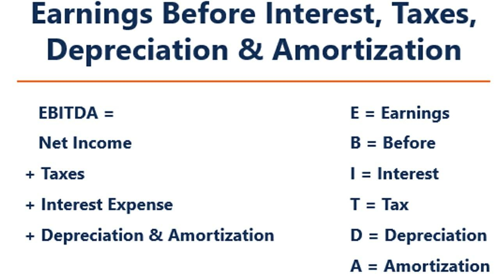

## Table of Contents

## What is Earnings Before Interest, Depreciation, and Amortization (EBITDA)?

Earnings Before Interest, Depreciation, and Amortization, or EBITDA, is a measure used to analyze a company's performance and profitability. It shows how much money a company makes from its operations before taking into account the costs of interest on loans, depreciation of assets like buildings and equipment, and amortization, which is the gradual write-off of intangible assets like patents.

EBITDA is useful because it gives a clearer picture of a company's operating performance by removing the effects of financing and accounting decisions. For example, two companies might have the same operational success, but one might have more debt and thus higher interest expenses. By looking at EBITDA, you can compare the core profitability of these companies more fairly. However, it's important to remember that EBITDA doesn't include all costs, so it should be used alongside other financial measures to get a complete view of a company's financial health.

## How is EBITDA calculated?

To calculate EBITDA, you start with a company's earnings, which is usually the net income found on the income statement. Then, you add back the expenses for interest, taxes, depreciation, and amortization. Interest is the cost of borrowing money, taxes are what the company pays to the government, depreciation is the reduction in value of physical assets over time, and amortization is similar but for intangible assets. So, you take the net income and add these four things back to it to get EBITDA.

For example, if a company's net income is $100,000, and it paid $20,000 in interest, $30,000 in taxes, $10,000 in depreciation, and $5,000 in amortization, you would calculate EBITDA like this: $100,000 (net income) + $20,000 (interest) + $30,000 (taxes) + $10,000 (depreciation) + $5,000 (amortization) = $165,000 (EBITDA). This gives you a clearer picture of the company's operating performance by showing how much money it made before these costs were taken out.

## Why is EBITDA important for businesses?

EBITDA is important for businesses because it helps them understand how well they are doing at making money from their main work. It shows the profit before paying interest, taxes, and the costs of things getting older or used up. This can be really helpful for comparing how different businesses are doing, even if they have different loans or own different kinds of things. By looking at EBITDA, a company can see if its main activities are making good money without the distractions of how it's financed or how old its equipment is.

Another reason EBITDA is important is that it's often used by people who want to invest in or buy a business. They look at EBITDA to see how much money the business is making that could be used to pay back loans if they bought it. It's like a quick way to check the health of the business's main operations. But, it's also important to remember that EBITDA doesn't show everything. It leaves out some costs, so it should be used with other numbers to get the full picture of how a business is doing.

## What are the limitations of using EBITDA as a financial metric?

One big problem with using EBITDA is that it doesn't show the full picture of a company's costs. It leaves out important expenses like interest, taxes, depreciation, and amortization. These costs can be really big for some businesses, especially if they have a lot of debt or own a lot of equipment that gets old over time. So, if you only look at EBITDA, you might think a company is doing better than it really is because it's not showing all the money going out.

Another limitation is that EBITDA can be used in a way that makes a company look better than it is. Because it's easy to change the numbers to make EBITDA look bigger, some people might use it to trick others into thinking the business is doing great. This can be a problem for investors or anyone trying to make smart decisions based on the company's financial health. It's important to look at other numbers too, like net income or cash flow, to really understand how a company is doing.

## How does EBITDA differ from net income?

EBITDA and net income are both ways to measure how much money a company makes, but they show different things. EBITDA stands for Earnings Before Interest, Taxes, Depreciation, and Amortization. It tells you how much money a company makes from its main work before it pays for things like loans, taxes, and the wear and tear on its equipment. It's like looking at the money coming in before some big costs are taken out.

Net income, on the other hand, is what's left after all the costs are subtracted from the money a company makes. This includes everything: the cost of loans (interest), taxes, the wear and tear on equipment (depreciation), and the gradual use of things like patents (amortization). So, net income gives you the final amount of money the company has made after paying for everything. It's a more complete picture of the company's profit but can be influenced by how the company is financed or the age of its equipment.

## Can EBITDA be used to compare companies in different industries?

EBITDA can be used to compare companies in different industries, but it has its limits. It helps because it takes away the costs of interest, taxes, depreciation, and amortization. This means you can see how much money companies make from their main work without these costs getting in the way. So, if you want to see how well a tech company and a manufacturing company are doing at their core business, EBITDA can give you a good starting point.

However, using EBITDA to compare companies across industries isn't perfect. Different industries have different costs and ways of making money. For example, a company that needs a lot of expensive equipment might have high depreciation costs, which aren't shown in EBITDA. Also, some industries might have more debt, which means higher interest costs that aren't included either. So, while EBITDA can give you a rough idea, you need to look at other numbers too to get the full picture.

## What are some common adjustments made to EBITDA?

When people look at EBITDA, they sometimes make changes to it to get a better idea of how a business is really doing. One common change is to add back any one-time costs or unusual expenses that don't happen every year. For example, if a company had to pay a big fine or had a big legal cost, they might add that back to EBITDA. This helps show what the company's normal earnings look like without these unusual costs.

Another change people might make is to take out any money the company made from things that aren't part of its main business. For instance, if a company sold some old equipment and made money from it, they might take that out of EBITDA. This helps focus on the money the company makes from its main work, not from selling things it doesn't need anymore. By making these changes, people can get a clearer picture of how well the company is doing at its core business.

## How is EBITDA used in valuation models like the EBITDA multiple?

EBITDA is often used in valuation models, like the EBITDA multiple, to figure out how much a company is worth. The EBITDA multiple is a number that shows how many times the company's EBITDA people are willing to pay to buy the company. For example, if a company's EBITDA is $1 million and the EBITDA multiple for its industry is 5, then the company might be valued at $5 million. This way of valuing a company is popular because it's simple and focuses on the money the company makes from its main work, without worrying about things like loans or how old its equipment is.

However, using the EBITDA multiple has its limits. Different industries have different typical multiples, so it's important to compare a company to others in the same industry. Also, the multiple can change based on how the economy is doing or how people feel about the future of the industry. So, while the EBITDA multiple can give a quick idea of what a company might be worth, it's best to use it along with other ways of valuing a company to get the full picture.

## What role does EBITDA play in debt covenants?

When companies borrow money, they often have to follow certain rules called debt covenants. These rules help the people who lent the money make sure the company is doing well enough to pay them back. One common rule is about EBITDA. Lenders might say that the company's EBITDA has to be a certain amount compared to its debt. This helps the lenders feel safe because it shows that the company is making enough money from its main work to cover its loans.

EBITDA is useful in debt covenants because it shows how much money a company makes before paying interest, taxes, and other costs. If a company's EBITDA is high, it means they are making good money from their business, which is a good sign for lenders. But if the company's EBITDA goes down, it might mean they are having trouble, and the lenders might worry about getting their money back. So, keeping an eye on EBITDA helps both the company and the lenders know if the company can keep up with its debt payments.

## How can changes in EBITDA impact a company's stock price?

Changes in a company's EBITDA can have a big impact on its stock price. When a company's EBITDA goes up, it usually means they are making more money from their main work. Investors like this because it shows the company is doing well and might keep making more money in the future. When investors see a higher EBITDA, they might want to buy more of the company's stock, which can make the stock price go up.

On the other hand, if a company's EBITDA goes down, it can make investors worried. A lower EBITDA might mean the company is not doing as well and might have trouble making money in the future. When investors see this, they might want to sell their stock, which can make the stock price go down. So, keeping an eye on changes in EBITDA can help investors decide if they want to buy or sell a company's stock.

## What are the tax implications of EBITDA?

EBITDA does not directly affect a company's taxes because it is not a measure used for tax calculations. Instead, EBITDA is a way to look at a company's earnings before taking out interest, taxes, depreciation, and amortization. So, when you see EBITDA, you are seeing how much money the company made before it paid any taxes. This means that while EBITDA can show how well a company is doing at making money, it doesn't change how much the company has to pay in taxes.

However, the numbers that make up EBITDA, like interest, depreciation, and amortization, can affect a company's taxes. For example, interest on loans and depreciation of equipment can be taken off a company's income before taxes are calculated, which can lower the amount of taxes the company has to pay. So, while EBITDA itself doesn't change taxes, the costs that are added back to get to EBITDA can have an impact on the company's tax bill.

## How do analysts forecast future EBITDA for a company?

Analysts forecast future EBITDA for a company by looking at a lot of things from the past and guessing what will happen in the future. They start by looking at the company's history, like how much money it made before and what costs it had. They also look at the economy and the industry the company is in to see if things are getting better or worse. If the economy is doing well, they might guess that the company will make more money. They also talk to the company's leaders to understand their plans and any new things they might do that could change how much money they make.

After gathering all this information, analysts use special math models to make their guesses. These models help them put all the information together and come up with a number for what the company's future EBITDA might be. They might change their guesses if something new happens, like a new law or a big change in what customers want. By doing this, analysts try to give the best guess they can about how much money the company will make in the future before paying for interest, taxes, and the costs of things getting older.

## What is EBIDA?

EBIDA stands for Earnings Before Interest, Depreciation, and Amortization, and is a financial metric used to assess a company's profitability by evaluating its core operating performance. By adding back interest, depreciation, and amortization expenses to net income while still accounting for tax expenses, EBIDA provides a conservative perspective on a company’s profitability. This approach contrasts with EBITDA, which excludes tax expenses and often presents an optimistic view of earnings.

The formula for calculating EBIDA is: 

$$
\text{EBIDA} = \text{Net Income} + \text{Interest} + \text{Depreciation} + \text{Amortization}
$$

This metric includes interest and non-cash expenses but differs by incorporating tax expenses into the equation, providing a more reserved estimation of a company's profitability. By considering taxes, EBIDA reflects the true cost-related impacts on earnings, allowing analysts to evaluate financial performance under less optimistic assumptions.

Understanding the components involved in EBIDA is essential for interpreting its significance:

1. **Net Income**: Represents the total earnings of a company after all expenses, including taxes and operating expenses, are deducted from total revenue. It's the baseline figure from which EBIDA is derived.

2. **Interest**: This refers to the cost incurred by a company for borrowed funds. It is added back to net income in EBIDA to isolate operational performance from financing activities.

3. **Depreciation and Amortization**: These are non-cash charges related to the wear and tear of tangible and intangible assets, respectively. Adding these back provides clarity on cash flow by focusing not on historical costs but current operations.

4. **Tax Expenses**: Unlike its counterpart EBITDA, EBIDA includes tax expenses in its assessment. This inclusion offers a glance at earnings under realistic tax scenarios.

EBIDA is often utilized in financial assessments to evaluate profitability with a cautious lens, ensuring stakeholders understand the operational efficiencies without being obscured by tax benefits or anomalies. Its inclusion of tax expenses makes it particularly useful for organizations looking for a stringent measure of true profitability based on current operational performance. Although EBIDA is not as widely recognized as EBITDA, it serves as an important measure for evaluating the financial health of a company in a tax-inclusive context.

## What is the process for understanding EBIDA calculations?

EBIDA is calculated using two primary methodologies, catering to the different aspects of financial data available for analysis. One approach begins from net income, adding back interest, depreciation, and amortization while retaining tax expenses to provide a more comprehensive understanding of a firm's operational efficiency. The alternative method derives EBIDA starting from earnings before interest and taxes (EBIT) and subsequently adjusting for tax expenses. 

The formula for EBIDA can be expressed as:

$$
\text{EBIDA} = \text{Net Income} + \text{Interest} + \text{Depreciation} + \text{Amortization}
$$

This calculation serves as a tool to benchmark companies within the same industry by eliminating distortions caused by differences in tax environments and financial structuring. By focusing on earnings free of interest, depreciation, and amortization, EBIDA offers insights into the core operational performance of a company, disregarding variable financial factors that could obscure genuine comparisons. 

Such analysis is instrumental in highlighting differences in operational efficiency among firms, where tax strategies might otherwise overshadow the underlying business performance. Investors and stakeholders can benefit from this clearer picture, particularly in markets with significant tax variability. This approach ensures that comparisons on a level playing field are possible, allowing more informed investment decisions.

## How does EBIDA compare with EBITDA?

The primary distinction between Earnings Before Interest, Depreciation, and Amortization (EBIDA) and Earnings Before Interest, Taxes, Depreciation, and Amortization (EBITDA) lies in their treatment of tax expenses. While both metrics aim to provide an understanding of a company's operational profitability, they do so by focusing on different aspects of financial statements.

EBIDA calculates a company's profitability by excluding the impacts of interest, depreciation, and amortization, while still considering taxes. This ensures that EBIDA reflects the operational cash flow by acknowledging tax liabilities and thus often provides a relatively conservative estimate of profitability. The formula for EBIDA can be expressed as:

$$
\text{EBIDA} = \text{Net Income} + \text{Interest} + \text{Depreciation} + \text{Amortization}
$$

Conversely, EBITDA excludes tax expenses entirely, providing a view of earnings that purely focuses on operational performance devoid of tax considerations. This means that EBITDA often presents a higher profitability measure compared to EBIDA, as it does not deduct tax expenses from calculated earnings. The formula for EBITDA is:

$$
\text{EBITDA} = \text{Net Income} + \text{Interest} + \text{Taxes} + \text{Depreciation} + \text{Amortization}
$$

Understanding these differences is crucial for evaluating the comprehensive financial health of a company. Those seeking to ascertain the operational efficiency of a business without the influence of its tax strategy might prioritize EBIDA. On the other hand, businesses that want to highlight their operational cash flows absent of all financial obligations, including taxes, may find EBITDA more informative. Thus, stakeholders must carefully choose which metric aligns with their analytical needs to gain accurate insights into a company's financial position.

## References & Further Reading

[1]: ["The Theory and Practice of Investment Management: Asset Allocation, Valuation, Portfolio Construction, and Strategies"](https://onlinelibrary.wiley.com/doi/book/10.1002/9781118267028) by Frank J. Fabozzi & Harry M. Markowitz

[2]: ["Advanced Financial Risk Management: Tools and Techniques for Integrated Credit Risk and Interest Rate Risk Management"](https://www.semanticscholar.org/paper/Advanced-Financial-Risk-Management%3A-Tools-and-for-Deventer-Imai/e498826ed934c31073b2de48e7fc697e61113bea) by Donald R. Van Deventer & Kenji Imai

[3]: ["Quantitative Value, + Web Site: A Practitioner's Guide to Automating Intelligent Investment and Eliminating Behavioral Errors"](https://www.amazon.com/Quantitative-Value-Web-Site-Practitioners/dp/1118328078) by Wesley R. Gray & Tobias E. Carlisle

[4]: ["Algorithmic Trading and DMA: An introduction to direct access trading strategies"](https://www.amazon.com/Algorithmic-Trading-DMA-introduction-strategies/dp/0956399207) by Barry Johnson

[5]: ["Financial Statement Analysis: A Practitioner's Guide"](https://www.wiley.com/en-us/Financial+Statement+Analysis%3A+A+Practitioner%27s+Guide%2C+5th+Edition-p-9781119457169) by Martin S. Fridson & Fernando Alvarez