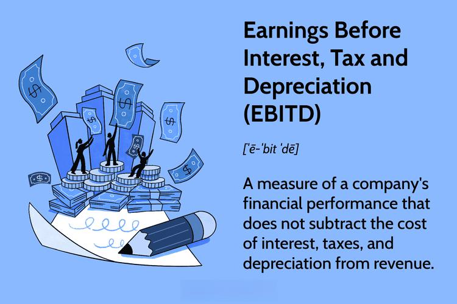

In the world of corporate finance, understanding various financial metrics is crucial for stakeholders and decision-makers. These metrics not only paint a picture of a company's fiscal health but also inform strategic planning and investment decisions. One metric that has garnered attention alongside its more commonly used counterpart, EBITDA, is Earnings Before Interest, Depreciation, and Amortization (EBIDA). EBIDA distinguishes itself by providing insightful data on a company’s operational efficiency through the lens of cash flows absent of interest and amortization impacts. This metric serves as a conservative measure, capturing tax expenses, which can offer a more nuanced perspective of profitability.

Though EBIDA is not as popular as EBITDA, its value lies in its ability to highlight operational cash flows while factoring in tax considerations. This makes it a useful indicator of a company's baseline financial performance devoid of certain capital and structural influences. Such evaluation can uncover the operational strengths and weaknesses that may be obscured in other profitability metrics.



In the dynamic environment of financial markets, algorithmic trading also capitalizes on financial metrics, including EBIDA, to make informed, data-driven trading decisions. Algorithmic traders use quantitative data sets and metrics analyses, like those provided by EBIDA, to gain insight into a company’s cash flow and operational health. With algorithms relying on precise and comprehensive data to predict market trends and set optimal trading strategies, metrics like EBIDA are invaluable to the process.

This article will explore the role of EBIDA within corporate finance, illustrating its application and importance. It will also address the use of EBIDA in algorithmic trading, highlighting how this metric contributes to making trading decisions more informed and strategic.

## Table of Contents

## What is EBIDA?

EBIDA stands for Earnings Before Interest, Depreciation, and Amortization, and is a financial metric used to assess a company's profitability by evaluating its core operating performance. By adding back interest, depreciation, and amortization expenses to net income while still accounting for tax expenses, EBIDA provides a conservative perspective on a company’s profitability. This approach contrasts with EBITDA, which excludes tax expenses and often presents an optimistic view of earnings.

The formula for calculating EBIDA is: 

$$
\text{EBIDA} = \text{Net Income} + \text{Interest} + \text{Depreciation} + \text{Amortization}
$$

This metric includes interest and non-cash expenses but differs by incorporating tax expenses into the equation, providing a more reserved estimation of a company's profitability. By considering taxes, EBIDA reflects the true cost-related impacts on earnings, allowing analysts to evaluate financial performance under less optimistic assumptions.

Understanding the components involved in EBIDA is essential for interpreting its significance:

1. **Net Income**: Represents the total earnings of a company after all expenses, including taxes and operating expenses, are deducted from total revenue. It's the baseline figure from which EBIDA is derived.

2. **Interest**: This refers to the cost incurred by a company for borrowed funds. It is added back to net income in EBIDA to isolate operational performance from financing activities.

3. **Depreciation and Amortization**: These are non-cash charges related to the wear and tear of tangible and intangible assets, respectively. Adding these back provides clarity on cash flow by focusing not on historical costs but current operations.

4. **Tax Expenses**: Unlike its counterpart EBITDA, EBIDA includes tax expenses in its assessment. This inclusion offers a glance at earnings under realistic tax scenarios.

EBIDA is often utilized in financial assessments to evaluate profitability with a cautious lens, ensuring stakeholders understand the operational efficiencies without being obscured by tax benefits or anomalies. Its inclusion of tax expenses makes it particularly useful for organizations looking for a stringent measure of true profitability based on current operational performance. Although EBIDA is not as widely recognized as EBITDA, it serves as an important measure for evaluating the financial health of a company in a tax-inclusive context.

## Understanding EBIDA Calculations

EBIDA is calculated using two primary methodologies, catering to the different aspects of financial data available for analysis. One approach begins from net income, adding back interest, depreciation, and amortization while retaining tax expenses to provide a more comprehensive understanding of a firm's operational efficiency. The alternative method derives EBIDA starting from earnings before interest and taxes (EBIT) and subsequently adjusting for tax expenses. 

The formula for EBIDA can be expressed as:

$$
\text{EBIDA} = \text{Net Income} + \text{Interest} + \text{Depreciation} + \text{Amortization}
$$

This calculation serves as a tool to benchmark companies within the same industry by eliminating distortions caused by differences in tax environments and financial structuring. By focusing on earnings free of interest, depreciation, and amortization, EBIDA offers insights into the core operational performance of a company, disregarding variable financial factors that could obscure genuine comparisons. 

Such analysis is instrumental in highlighting differences in operational efficiency among firms, where tax strategies might otherwise overshadow the underlying business performance. Investors and stakeholders can benefit from this clearer picture, particularly in markets with significant tax variability. This approach ensures that comparisons on a level playing field are possible, allowing more informed investment decisions.

## EBIDA in Corporate Finance

EBIDA, or Earnings Before Interest, Depreciation, and Amortization, is a financial metric used in corporate finance to assess a company's operational efficiency by evaluating its performance from a non-taxable perspective. This measurement is particularly significant for firms exempt from taxes, such as non-profit organizations, where tax-related financial activities are not a central concern. By leaving out tax expenses, EBIDA allows stakeholders to focus on operational results and resource management without the distortions introduced by tax considerations.

For investors and analysts, EBIDA serves as a critical indicator for measuring a company’s ability to utilize its resources efficiently. It provides insights into the cash flow generated purely from business operations before the effect of particular non-operational expenses. This makes EBIDA an effective parameter for comparing companies, as it helps eliminate the differences arising from tax obligations, allowing for a more accurate evaluation of relative performance within an industry.

EBIDA calculation begins with the net income and adjusts by adding back interest, depreciation, and amortization, while maintaining tax expenses in the equation. This creates a conservative view of profitability, potentially beneficial for stakeholders interested in understanding a company's operational health without the influence of tax manipulations. This approach is particularly relevant when evaluating non-profit entities or any corporation facing complex tax situations that might skew traditional profitability measures.

While EBIDA provides this valuable operational snapshot, it is essential to recognize that it should complement other financial metrics. The lack of regulation under accounting standards means interpretations can vary, thus using EBIDA alongside other measures ensures a more comprehensive understanding of a company's financial landscape. Therefore, in corporate finance, EBIDA is a useful tool for those looking to gain insights into operational productivity and resource efficiency, thereby assisting in making informed investment and management decisions.

## EBIDA in Algorithmic Trading

Algorithmic trading leverages sophisticated computational techniques to automate trading decisions, utilizing real-time financial data to identify and execute trades. In this context, Earnings Before Interest, Depreciation, and Amortization (EBIDA) emerges as a significant metric within [algorithmic trading](/wiki/algorithmic-trading) algorithms. Its role is particularly relevant in assessing a company's cash flow and overall operational health, providing an additional layer of financial insight beyond more commonly-used metrics such as EBITDA.

EBIDA, by excluding both interest and amortization yet incorporating tax effects, offers a unique perspective on a company's earnings capability. This measure acts as a critical input within qualitative data sets, often used in [machine learning](/wiki/machine-learning) algorithms designed for predictive financial modeling. These algorithms evaluate historical financial data to identify patterns and trends, utilizing EBIDA to highlight the operational efficiency of a company.

Traders and analysts incorporate EBIDA into their algorithmic models to bolster decision-making processes by assessing operational performance without the influence of financing and amortization decisions. This results in more nuanced and potentially more accurate predictions about a company's future profitability and, by extension, market movements.

In practice, the implementation of EBIDA within algorithmic trading strategies can be programmed using languages like Python. For instance, the process might include collecting EBIDA data for various companies, using libraries like Pandas for data manipulation, and then inputting this data into machine learning models from libraries such as scikit-learn or TensorFlow:

```python
import pandas as pd
from sklearn.model_selection import train_test_split
from sklearn.ensemble import RandomForestRegressor

# Assume df is a DataFrame with EBIDA and other financial metrics
df = pd.read_csv('financial_data.csv')

# Split the data into features and target
features = df.drop(['target'], axis=1)
target = df['target']

# Train-test split
X_train, X_test, y_train, y_test = train_test_split(features, target, test_size=0.2, random_state=42)

# Using a Random Forest Regressor as a machine learning model
model = RandomForestRegressor(n_estimators=100, random_state=42)
model.fit(X_train, y_train)

# Predicting on the test set
predictions = model.predict(X_test)
```

In algorithmic trading, financial metrics such as EBIDA become powerful tools to forecast market trends. By tuning algorithm parameters and incorporating supplementary data points, traders can set strategies that are responsive to minute financial subtleties. This enhances trading strategies, maximizing returns while managing the inherent risks of the financial markets. 

Though EBIDA is a valuable component of these strategies, it is essential to consider its limitations and integrate it within a broader framework of diverse financial indicators to achieve the most effective trading algorithms.

## Criticisms and Considerations of Using EBIDA

Earnings Before Interest, Depreciation, and Amortization (EBIDA) serves as a vital tool for assessing a company's operational efficiency, yet it brings with it certain criticisms and considerations. Unlike EBITDA, EBIDA includes tax expenses, making it a less commonly used metric within standard accounting practices. Since EBIDA is not regulated by Generally Accepted Accounting Principles (GAAP), companies have a degree of latitude in calculating this metric, potentially leading to inconsistent reporting and conclusions.

A primary criticism of EBIDA is its exclusion of tax impacts, which can obscure insights into a company's tax efficiency. Taxes are a significant part of a firm's financial obligations and can greatly affect net income. Therefore, ignoring this aspect might provide an incomplete picture of the company's actual profitability and economic health. Critics argue that focusing solely on EBIDA can paint a misleadingly positive view of financial performance, as it might inflate perceived profitability by not accounting for tax burdens.

Furthermore, EBIDA does not consider external financial conditions, which can significantly influence a company's fiscal health. This omission may lead to overlooking vital economic factors like fluctuations in interest rates and the broader economic environment that impacts all businesses.

Despite these criticisms, EBIDA’s usefulness as a financial metric remains significant. It can be advantageous for evaluating companies that operate in sectors with high depreciation and amortization costs, where these non-cash expenses can skew profitability analyses. By excluding such expenses alongside interest, EBIDA provides a raw look at operational efficiency free from capital financing and investment strategies.

Given its limitations, EBIDA should not be the sole metric for financial assessments. It is more insightful when used alongside other financial analysis tools such as EBITDA, EBIT, and net income. A comprehensive analysis utilizing multiple metrics can offer a well-rounded view of a company's finances, leading to more informed investment decisions. While EBIDA offers unique perspectives, its interpretations should be undertaken with caution, ensuring a balanced approach in financial evaluations.

## Comparing EBIDA with EBITDA

The primary distinction between Earnings Before Interest, Depreciation, and Amortization (EBIDA) and Earnings Before Interest, Taxes, Depreciation, and Amortization (EBITDA) lies in their treatment of tax expenses. While both metrics aim to provide an understanding of a company's operational profitability, they do so by focusing on different aspects of financial statements.

EBIDA calculates a company's profitability by excluding the impacts of interest, depreciation, and amortization, while still considering taxes. This ensures that EBIDA reflects the operational cash flow by acknowledging tax liabilities and thus often provides a relatively conservative estimate of profitability. The formula for EBIDA can be expressed as:

$$
\text{EBIDA} = \text{Net Income} + \text{Interest} + \text{Depreciation} + \text{Amortization}
$$

Conversely, EBITDA excludes tax expenses entirely, providing a view of earnings that purely focuses on operational performance devoid of tax considerations. This means that EBITDA often presents a higher profitability measure compared to EBIDA, as it does not deduct tax expenses from calculated earnings. The formula for EBITDA is:

$$
\text{EBITDA} = \text{Net Income} + \text{Interest} + \text{Taxes} + \text{Depreciation} + \text{Amortization}
$$

Understanding these differences is crucial for evaluating the comprehensive financial health of a company. Those seeking to ascertain the operational efficiency of a business without the influence of its tax strategy might prioritize EBIDA. On the other hand, businesses that want to highlight their operational cash flows absent of all financial obligations, including taxes, may find EBITDA more informative. Thus, stakeholders must carefully choose which metric aligns with their analytical needs to gain accurate insights into a company's financial position.

## Conclusion

EBIDA, or Earnings Before Interest, Depreciation, and Amortization, stands as a noteworthy financial metric due to its ability to elucidate cash flow and operational efficiency. Its primary advantage lies in offering a conservative perspective on profitability by incorporating tax expenses, distinguishing it from its more popular counterpart, EBITDA. This unique characteristic allows analysts and stakeholders to assess a company’s operational competency without the immediate influence of tax variations, thereby providing a clearer view of the intrinsic business performance.

Despite its advantages, EBIDA should not replace standard metrics like EBITDA. Each measure serves specific purposes, and EBIDA’s inclusion merely complements traditional metrics by adding another layer of analysis. In financial analysis, EBIDA can reveal hidden strengths or weaknesses in a company's operations that traditional metrics may mask, especially in environments where tax considerations significantly impact financial statements.

Incorporating EBIDA in financial analyses and algorithmic trading strategies offers the potential for more informed decision-making. By integrating EBIDA with advanced computational methods, traders can refine their strategies to predict market movements more accurately, potentially leading to enhanced returns. This adaptability makes EBIDA a valuable tool, aiding in the pursuit of optimized financial outcomes within various investment frameworks. As such, its role as an insightful adjunct to conventional financial assessments ensures that decision-makers can harness a more comprehensive understanding of a company’s financial health and strategic potential.

## References & Further Reading

[1]: ["The Theory and Practice of Investment Management: Asset Allocation, Valuation, Portfolio Construction, and Strategies"](https://onlinelibrary.wiley.com/doi/book/10.1002/9781118267028) by Frank J. Fabozzi & Harry M. Markowitz

[2]: ["Advanced Financial Risk Management: Tools and Techniques for Integrated Credit Risk and Interest Rate Risk Management"](https://www.semanticscholar.org/paper/Advanced-Financial-Risk-Management%3A-Tools-and-for-Deventer-Imai/e498826ed934c31073b2de48e7fc697e61113bea) by Donald R. Van Deventer & Kenji Imai

[3]: ["Quantitative Value, + Web Site: A Practitioner's Guide to Automating Intelligent Investment and Eliminating Behavioral Errors"](https://www.amazon.com/Quantitative-Value-Web-Site-Practitioners/dp/1118328078) by Wesley R. Gray & Tobias E. Carlisle

[4]: ["Algorithmic Trading and DMA: An introduction to direct access trading strategies"](https://www.amazon.com/Algorithmic-Trading-DMA-introduction-strategies/dp/0956399207) by Barry Johnson

[5]: ["Financial Statement Analysis: A Practitioner's Guide"](https://www.wiley.com/en-us/Financial+Statement+Analysis%3A+A+Practitioner%27s+Guide%2C+5th+Edition-p-9781119457169) by Martin S. Fridson & Fernando Alvarez