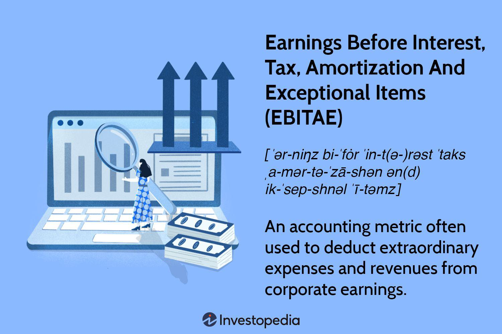

Incorporating financial metrics into algorithmic trading processes is crucial for making informed investment decisions. This article focuses on the interaction between EBITAE and algorithmic trading, underscoring its importance. EBITAE, or Earnings Before Interest, Taxes, Amortization, and Exceptional Items, serves as a vital financial metric that provides investors with deeper insights into a company's operational efficiency. By excluding certain non-operational factors, EBITAE allows for a clearer assessment of a company's core performance. This discussion seeks to bridge financial analysis with technology-driven trading strategies, offering a comprehensive understanding of how financial metrics influence modern trading systems. By exploring EBITAE's attributes, we aim to uncover its role and utility in corporate finance and its potential to enhance algorithmic trading strategies. This exploration ensures that investors and financial analysts can refine their decision-making processes by integrating precise financial metrics into their methodologies. Through the lens of EBITAE, the intricacies of financial analysis are merged with the technological advancements of algorithmic trading, illustrating a holistic approach to financial strategizing in today's data-driven, competitive markets.

## Table of Contents

## Understanding EBITAE

EBITAE, or Earnings Before Interest, Tax, Amortization, and Exceptional Items, is a financial metric modified from EBIT, specifically designed to evaluate a company's core business performance by excluding elements that are not directly related to its operational activities. This metric helps isolate the effects of day-to-day operational efficiency by filtering out items that could create a distorted perspective of a company's actual earning capabilities. 

The primary advantage of EBITAE is its ability to provide a clearer picture of a company's operational health by removing non-essential financial elements. Specifically, it excludes interest and tax expenses, which are often influenced by external factors like debt structures and varied tax environments. By also disregarding amortization and exceptional items, EBITAE focuses on ongoing operational performance without the influence of occasional or extraordinary financial events.

When compared with other traditional profitability metrics such as EBITDA (Earnings Before Interest, Taxes, Depreciation, and Amortization) and EBIT, EBITAE offers a nuanced understanding of fiscal health. While EBIT includes extraordinary items that can be inconsistent in nature and thus portrays a broader picture, EBITAE provides a more refined insight emphasizing repeatable operational activities. 

For investors, EBITAE aids in concentrating on a firm's operational capabilities, often offering a clearer picture of its potential to maintain profitability in varying accounting and financial conditions. The elimination of select cost components in the EBITAE calculation permits a closer evaluation of a company's earnings potential, independent of external financial influences. This approach provides critical insights into underlying operational strength and efficiency, which are pivotal for informed investment decisions.

## Calculating EBITAE

EBITAE, or Earnings Before Interest, Tax, Amortization, and Exceptional Items, is calculated by subtracting operational expenses from total revenue while systematically excluding certain financial components such as interest, taxes, amortization, and exceptional items. This calculation serves as an analytical tool to evaluate a company's core profitability, isolating operational performance from non-operational financial influences.

The formula for EBITAE can be represented as follows:

$$
\text{EBITAE} = \text{Revenue} - \text{Operating Expenses (excluding interest, taxes, amortization, and exceptional items)}
$$

This approach allows analysts to focus on the pure operational capabilities of a business, making it a valuable metric for comparing the core profitability across peer companies and different fiscal environments.

To gain insights into a company's performance consistency and efficiency, it is useful to examine EBITAE margins over time or against industry standards. The EBITAE margin is calculated by dividing EBITAE by total revenue, providing a percentage that illustrates how efficiently a company is turning its revenue into operational profit:

$$
\text{EBITAE Margin} = \left( \frac{\text{EBITAE}}{\text{Revenue}} \right) \times 100
$$

The EBITAE margin is particularly useful for benchmarking performance against industry standards or historical data, providing a clearer picture of operational effectiveness.

Accurate financial reporting and comprehensive disclosures are crucial for deriving precise EBITAE figures. Inconsistent application of accounting principles or subjective judgment in categorizing items as 'exceptional' can lead to comparable discrepancies. Thus, ensuring transparency and consistency in financial reporting is essential for the reliability of EBITAE as a metric. This highlights the importance of using consistently applied accounting principles and standardized reporting formats to achieve accurate and meaningful comparative analyses.

## Role of EBITAE in Algorithmic Trading

Algorithmic trading leverages financial metrics to execute swift and data-driven trading decisions. Financial metrics such as EBITAE (Earnings Before Interest, Tax, Amortization, and Exceptional Items) can serve as a crucial indicator within algorithms designed to evaluate company performance beyond traditional metrics. 

Incorporating EBITAE into trading algorithms provides a path to identifying undervalued stocks through detailed assessments of operational profitability. As EBITAE focuses on core operational efficiency, excluding financial elements like interest and exceptional items, it allows traders to concentrate on the true operational health of a company. This often uncovers opportunities in stocks that may remain hidden when only conventional metrics such as EBIT or EBITDA are considered.

By evaluating the fundamental financial health of companies through EBITAE, traders can pinpoint enterprises with robust operational metrics. For instance, a company with a strong EBITAE figure may be demonstrating significant operational efficiency, indicating potential for consistent future performance. This insight helps traders focus on businesses that align with profitability and efficiency criteria, distinct from broader market trends or non-operational financial factors.

Beyond operational assessment, the role of EBITAE extends into risk management within algorithmic strategies. By highlighting financially stable enterprises with solid EBITAE figures, algorithms can reduce exposure to financially volatile companies. This usage of EBITAE helps in constructing portfolios that emphasize financial robustness, minimizing potential risks associated with companies exhibiting weak operational metrics.

In conclusion, integrating EBITAE into [algorithmic trading](/wiki/algorithmic-trading) strategies enriches trading models, enhancing their ability to perform high-speed, informed decision-making based on an intrinsic understanding of a company's operational capacity. This fosters robust, data-driven strategies that are designed to identify value and manage risk efficiently within the financial markets.

## Comparison with Other Metrics

EBITAE, unlike other financial indicators, excludes exceptional items to furnish a clearer image of a company's core operational efficiency. This contrasts sharply with EBITDA, which incorporates depreciation into its calculations, thereby providing a broader view of a company's financial health. The differences among EBITAE, EBIT, and EBITDA are crucial for analysts choosing the right metric for specific evaluations.

EBITAE is particularly conservative; it focuses strictly on ongoing operational performance by stripping away exceptional items, a feature that may be particularly useful in assessing the performance consistency within an industry. EBITDA, on the other hand, includes depreciation and amortization, making it a popular choice for investors seeking to evaluate cash flows. This wider lens captures a more all-encompassing picture of financial health, as it accounts for non-cash expenses that can impact value assessments.

EBIT differs by focusing on earnings before interest and taxes, allowing analysts to measure the company’s operational efficiency without the influence of financing and tax environments. Each metric caters to specific analytical purposes: EBITAE for core operational profitability, EBIT for measuring basic operational efficiency, and EBITDA for understanding cash flow potential.

From a strategic standpoint, selecting the appropriate metric depends on the requirements of the financial analysis or investment strategy. EBITAE might be better suited for narrowly focused operational evaluations, while EBITDA's broader perspective could be more beneficial for assessing overall financial performance, especially when evaluating companies in capital-intensive industries. Consequently, choosing the metric involves recognizing the diverse angles each offers and aligning them with strategic objectives.

## Limitations of EBITAE

EBITAE, while offering valuable insights into a company's core operational performance, has several limitations that investors and analysts need to consider. Firstly, EBITAE overlooks certain non-operational effects, which can impact the comprehensive understanding of a company's financial health. Notably, by excluding interest and taxes, EBITAE might miss out on key financial dynamics crucial for assessing the overall viability of a business. These exclusions can lead to an incomplete picture, as interest payments reflect the cost of borrowing, and taxes can significantly affect net earnings.

In capital-intensive industries, EBITAE's limitation becomes more pronounced due to the omission of depreciation. Depreciation is crucial for these industries because it accounts for the wear and tear of large, expensive fixed assets over time. By discounting depreciation, EBITAE may understate the actual financial health, as it ignores the capital expenditures necessary to maintain and expand operations.

Furthermore, the variability in measurement practices across different companies and industries can complicate comparisons. The absence of standardized methods for calculating EBITAE means that similar companies might report significantly different EBITAE figures, depending on their unique accounting practices and interpretations of exceptional items. This variability necessitates meticulous examination to ensure that EBITAE comparisons are reliable and accurate.

To mitigate these limitations, it is advisable to incorporate a suite of financial metrics alongside EBITAE. Employing multiple metrics provides a more comprehensive, multi-dimensional view of a company's financial health. This approach allows investors to balance operational performance with other critical factors such as cash flow, asset management, and comprehensive profit evaluations, thereby enhancing the robustness and depth of financial analysis.

## Conclusion

EBITAE is a significant metric when evaluating a company's efficiency and operational performance, serving as a vital tool for investors and analysts who seek deeper, nuanced insights into profitability. By excluding elements such as interest, taxes, amortization, and exceptional items, EBITAE grants a clearer view of the core earnings generated by a company’s operations. This metric's focus on the fundamentals makes it particularly useful in recognizing operational efficiencies or inefficiencies that may not be apparent when considering broader financial metrics like EBITDA or EBIT.

Its integration into algorithmic trading strategies underscores the power and complexity of modern financial ecosystems. In the fast-paced, data-driven landscape of algorithmic trading, EBITAE emerges as a core indicator for evaluating operational robustness. Algorithms that incorporate this metric can effectively identify undervalued stocks by concentrating on operational profitability, thus facilitating informed trading decisions.

By examining EBITAE, investors can refine their strategies and adapt to an ever-evolving financial environment. This focus on operational performance enables more precise targeting of investment opportunities, enhancing strategic decision-making processes. Moreover, understanding EBITAE in conjunction with other metrics allows for a more comprehensive analysis of a company's financial health and potential. While no single metric can encapsulate all aspects of financial performance, balancing EBITAE with other measures ensures a well-rounded perspective, aiding in the identification of sustainable growth opportunities and more informed investment decisions.

## References & Further Reading

[1]: ["Valuation: Measuring and Managing the Value of Companies"](https://www.amazon.com/Valuation-Measuring-Managing-Companies-Finance/dp/1119610885) by McKinsey & Company Inc.

[2]: ["Advances in Financial Machine Learning"](https://www.amazon.com/Advances-Financial-Machine-Learning-Marcos/dp/1119482089) by Marcos Lopez de Prado

[3]: ["Machine Learning for Algorithmic Trading"](https://github.com/stefan-jansen/machine-learning-for-trading) by Stefan Jansen

[4]: ["Quantitative Trading: How to Build Your Own Algorithmic Trading Business"](https://www.amazon.com/Quantitative-Trading-Build-Algorithmic-Business/dp/1119800064) by Ernest P. Chan

[5]: Palepu, K. G., Healy, P. M., & Bernard, V. L. (2000). ["Business Analysis and Valuation Using Financial Statements: Text and Cases."](https://researchers.mq.edu.au/en/publications/business-analysis-and-valuation-using-financial-statements) Cengage Learning.