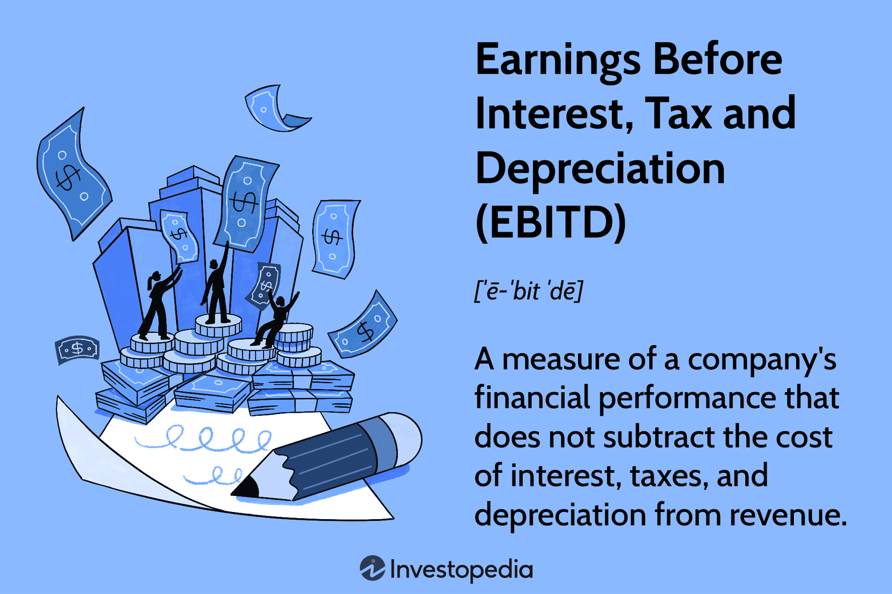

## Table of Contents

## What is Earnings Before Interest, Taxes, and Depreciation (EBITD)?

Earnings Before Interest, Taxes, and Depreciation (EBITD) is a financial measure that shows how much money a company makes before taking away the costs of interest, taxes, and depreciation. It helps people see how well a company's main business is doing without worrying about how it's financed or how much its equipment has worn down over time.

EBITD is useful for comparing companies in the same industry because it removes the effects of different financing choices and tax situations. For example, two companies might have the same EBITD but different profits after taxes because one has more debt or pays more in taxes. By looking at EBITD, you can get a clearer picture of which company is doing better at running its core business.

## Why is EBITD important for businesses?

EBITD is important for businesses because it shows how well the main part of the business is doing. It tells you how much money the company makes from its everyday work before paying for things like loans, taxes, and the wear and tear on equipment. This helps business owners and investors see if the company is good at making money from what it does every day, without the distractions of other costs.

It's also helpful for comparing different companies. Since EBITD doesn't include interest, taxes, and depreciation, it makes it easier to see which company is doing better at running its core business. This is useful when you want to compare companies that might have different amounts of debt or pay different taxes. By looking at EBITD, you get a clearer picture of which company is stronger at its main business activities.

## How is EBITD calculated?

To calculate EBITD, you start with the company's total revenue. From that, you subtract all the costs that are directly related to making and selling the products or services, like the cost of goods sold and operating expenses. This gives you the company's operating profit. Then, you add back any depreciation expenses that were subtracted when figuring out the operating profit. The result is the Earnings Before Interest, Taxes, and Depreciation, or EBITD.

EBITD is useful because it shows how much money the company is making from its main business activities before taking away the costs of interest on loans, taxes, and the wear and tear on equipment. By not including these costs, EBITD gives a clearer picture of how well the company's core business is doing. It's a good way to see if the company is good at making money from what it does every day, without the distractions of other costs.

## What is the difference between EBITD and EBITDA?

EBITD and EBITDA are similar but they have one key difference. EBITD stands for Earnings Before Interest, Taxes, and Depreciation. It shows how much money a company makes before paying for interest on loans, taxes, and the wear and tear on equipment. On the other hand, EBITDA stands for Earnings Before Interest, Taxes, Depreciation, and Amortization. The main difference is that EBITDA also adds back amortization, which is the gradual write-off of intangible assets like patents or trademarks.

Both measures help people see how well a company's main business is doing without worrying about how it's financed or how much its equipment has worn down over time. By looking at EBITD, you get a clearer picture of the company's operating profit without the impact of depreciation. EBITDA goes a step further by also removing the effect of amortization, which can be useful for companies with significant intangible assets. This makes EBITDA a bit more comprehensive, but both measures are useful for comparing companies and understanding their core business performance.

## Can you provide an example of how to calculate EBITD?

Let's say a company called ABC Widgets made $1 million in revenue last year. They spent $600,000 on the costs of making and selling their widgets, like raw materials and wages for workers. They also had $100,000 in other operating expenses, like rent for their factory and office supplies. After subtracting these costs from their revenue, they have an operating profit of $300,000. But they also had to account for $50,000 in depreciation, which is the wear and tear on their equipment over time. When they subtract this depreciation from their operating profit, they get a net profit of $250,000.

To find the EBITD, we start with the operating profit of $300,000 and add back the depreciation of $50,000. So, the EBITD for ABC Widgets is $350,000. This number shows how much money the company made from its main business activities before paying for interest on loans, taxes, and the wear and tear on equipment. It helps people see how well ABC Widgets is doing at making and selling widgets without worrying about other costs.

## How does EBITD help in comparing companies within the same industry?

EBITD helps in comparing companies within the same industry by showing how much money each company makes from its main business before paying for things like loans, taxes, and the wear and tear on equipment. This makes it easier to see which company is doing better at running its core business. Since EBITD doesn't include interest, taxes, and depreciation, it removes the effects of different financing choices and tax situations. For example, one company might have more debt than another, which means it pays more in interest. By looking at EBITD, you can compare the two companies without worrying about how they're financed.

This measure is especially useful when you want to see how well companies are doing at making money from what they do every day. It helps investors and business owners get a clearer picture of a company's operating performance. For instance, if two companies in the same industry have similar EBITD numbers, it suggests they're doing equally well at their core business activities, even if their profits after taxes are different. This way, EBITD gives a fair comparison that focuses on the main part of the business, making it easier to decide which company is stronger at running its core operations.

## What are the limitations of using EBITD as a financial metric?

While EBITD can be a helpful way to see how well a company's main business is doing, it has some limitations. One big problem is that it doesn't include the costs of interest, taxes, and depreciation. These costs are real and can affect how much money a company actually makes. For example, a company with a lot of debt might have a high EBITD but still struggle to pay its interest on loans. By not including these costs, EBITD can make a company look more profitable than it really is.

Another limitation is that EBITD can be used in different ways by different companies. Some might include certain expenses in their operating costs while others might not, which can make it hard to compare companies fairly. Also, EBITD doesn't show how much money a company is spending on new equipment or technology, which can be important for its future growth. So while EBITD can give a good snapshot of a company's core business performance, it's important to look at other financial measures too to get the full picture.

## How does EBITD affect investment decisions?

EBITD can help investors make better choices by showing how well a company is doing at its main business. When investors look at EBITD, they can see how much money a company makes before paying for things like loans, taxes, and the wear and tear on equipment. This helps them compare different companies in the same industry more easily. If one company has a higher EBITD than another, it might mean that the first company is better at making money from what it does every day. This can make it a more attractive investment.

However, investors need to be careful because EBITD doesn't tell the whole story. It leaves out important costs like interest on loans, taxes, and depreciation. These costs can have a big impact on how much money a company actually makes. So, while a high EBITD might look good, a company could still have problems paying its bills or growing in the future. Investors should use EBITD along with other financial measures to get a complete picture of a company's health before making investment decisions.

## In what scenarios is EBITD more useful than other profitability metrics?

EBITD is more useful than other profitability metrics when you want to compare companies in the same industry. It shows how much money a company makes from its main business before paying for things like loans, taxes, and the wear and tear on equipment. This helps you see which company is doing better at running its core business. For example, if two companies make cars, you can use EBITD to compare how well they're doing at making and selling cars, without worrying about how much they pay in taxes or how they finance their business.

EBITD is also helpful when you want to focus on a company's day-to-day operations. It gives you a clear picture of how much money the company is making from what it does every day, before other costs come into play. This can be useful for investors or business owners who want to understand if the company is good at making money from its main activities. However, it's important to remember that EBITD doesn't include all costs, so it should be used along with other measures to get a full understanding of a company's financial health.

## How do changes in depreciation policies impact EBITD?

Changes in depreciation policies can affect a company's EBITD. Depreciation is the cost of the wear and tear on a company's equipment over time. When a company changes how it calculates depreciation, like using a different method or changing the expected life of its equipment, it can change the amount of depreciation expense. Since EBITD adds back depreciation to the operating profit, a change in depreciation policy will directly impact the EBITD number. If a company decides to use a method that results in less depreciation expense, the EBITD will be higher because less depreciation is added back.

However, it's important to remember that while changes in depreciation policies can make EBITD look different, they don't change how much money the company is actually making from its main business. EBITD is useful for comparing companies and understanding their core business performance, but it's just one part of the bigger financial picture. Investors and business owners should look at other financial measures too, to get a complete understanding of a company's health, especially when depreciation policies change.

## What role does EBITD play in financial analysis and forecasting?

EBITD is a helpful tool in financial analysis and forecasting because it shows how much money a company makes from its main business before paying for things like loans, taxes, and the wear and tear on equipment. This makes it easier for people to see how well a company is doing at making and selling its products or services. When analysts and investors look at EBITD, they can compare different companies in the same industry more easily. For example, if two companies make cars, looking at their EBITD helps you see which one is better at making and selling cars, without worrying about how much they pay in taxes or how they finance their business.

In forecasting, EBITD can help predict how a company might do in the future by focusing on its core business performance. Since EBITD doesn't include costs like interest, taxes, and depreciation, it gives a clearer picture of the money the company is making from what it does every day. This can be useful for making guesses about future earnings and planning for growth. However, it's important to remember that EBITD is just one part of the bigger financial picture. To get a complete understanding of a company's health, analysts and investors should use EBITD along with other financial measures.

## How can EBITD be manipulated, and what are the ethical considerations involved?

Companies can sometimes make their EBITD look better than it really is by changing how they count their money. For example, they might decide to use a different way to figure out how much their equipment wears down over time, which can make their EBITD higher. They might also move some costs around, so they don't show up in the operating expenses that are used to calculate EBITD. This can make the company look like it's making more money from its main business than it really is. Doing this can fool investors and other people who look at the company's numbers.

It's not right to play around with numbers like this because it's not honest. When companies mess with their EBITD, they can make bad choices based on wrong information. This can hurt the company in the long run and make people lose trust in it. It's important for companies to be clear and honest about their numbers, so everyone can make good decisions. Being open and truthful helps keep the business world fair and trustworthy.

## What is EBITD and how can it be understood?

Earnings Before Interest, Tax, and Depreciation (EBITD) is a financial metric that offers a focused insight into a company's operational performance. This metric is obtained by stripping away the effects of taxes, interest expenses, and depreciation from total revenue, thereby highlighting the core operational profitability of the enterprise. The formula for EBITD can be expressed as:

$$
\text{EBITD} = \text{Revenue} - \text{Operating Expenses} + \text{Depreciation}
$$

By removing the non-cash depreciation expenses, EBITD presents a clearer picture of operational efficiency without the distortion caused by accounting practices. It facilitates a closer examination of how well a company performs its fundamental business operations. 

Although EBITD is similar to the more commonly known EBITDA (Earnings Before Interest, Taxes, Depreciation, and Amortization), it differs primarily in the exclusion of amortization expenses. This distinction can be crucial, as amortization pertains to intangible assets, which may not be as relevant in industries with fewer intangible assets. Thus, EBITD offers a perspective that is sometimes more pertinent for companies where depreciation is a significant [factor](/wiki/factor-investing) but amortization is not.

Understanding EBITD empowers stakeholders—including investors, analysts, and corporate managers—to assess a company’s financial health by concentrating on operational aspects before considering capital costs. This provides a clearer understanding of a company's capacity to generate profits purely from its operational activities, offering valuable insights that support strategic financial planning and analysis.

## What are the differences between EBITD and EBITDA?

EBITD (Earnings Before Interest, Tax, and Depreciation) and EBITDA (Earnings Before Interest, Taxes, Depreciation, and Amortization) are financial metrics that serve as indicators of a company's financial performance. Both metrics help in assessing a company's ability to generate earnings from its core business activities, but they differ primarily in the treatment of certain expenses, specifically amortization and taxes.

EBITDA is calculated by taking the operating income and adding back depreciation and amortization expenses, as well as excluding interest and tax expenses. This results in a metric that provides an optimistic view of a company’s financial performance by ignoring how the firm is taxed or capitalized. The formula is:

$$
\text{EBITDA} = \text{Net Income} + \text{Interest} + \text{Taxes} + \text{Depreciation} + \text{Amortization}
$$

EBITD, on the other hand, includes taxes within its calculation but excludes amortization. This makes EBITD a more conservative measure compared to EBITDA as it accounts for the tax expenses. Thus, it presents a less optimistic view, offering a perspective that can be closer to the actual financial health of the business by not ignoring tax obligations. The EBITD formula is:

$$
\text{EBITD} = \text{Net Income} + \text{Interest} + \text{Depreciation} + \text{Taxes}
$$

When deciding which of these metrics to use, one should consider the specific objectives of the financial analysis. For instance, if the focus is on operational efficiency without regard to capital structure or tax scenarios, EBITDA might be more appropriate. It can be particularly useful when comparing companies across different tax jurisdictions or capital structures, as it removes these variables from the analysis. In contrast, EBITD provides insights that are inclusive of tax expenses, giving a clearer picture of earnings available before the deduction of capital costs.

Choosing between EBITD and EBITDA depends heavily on the context of the analysis and the specific financial questions being addressed. Understanding these differences is critical for accurately assessing a company’s operational performance and deciding on the right metric for financial evaluation. By selecting the appropriate tool, stakeholders can gain actionable insights into a company's profitability and operational health.

## References & Further Reading

- **"The Theory and Practice of Investment Management: Asset Allocation, Valuation, Portfolio Construction, and Strategies" by Frank J. Fabozzi & Harry M. Markowitz**  
  This book offers comprehensive insights into the fundamental principles and sophisticated techniques involved in investment management. Covering asset allocation, valuation, and portfolio construction, it emphasizes strategic approaches to manage investment portfolios effectively, making it a valuable resource for finance professionals and academics alike.

- **"Advanced Financial Risk Management: Tools and Techniques for Integrated Credit Risk and Interest Rate Risk Management" by Donald R. Van Deventer & Kenji Imai**  
  This text provides an in-depth look at sophisticated methodologies for handling credit risk and [interest rate](/wiki/interest-rate-trading-strategies) risk. It explores quantitative tools and techniques necessary for effective risk management and offers guidance on integrating these strategies into overall financial management plans.

- **"Quantitative Value, + Web Site: A Practitioner's Guide to Automating Intelligent Investment and Eliminating Behavioral Errors" by Wesley R. Gray & Tobias E. Carlisle**  
  This resource illustrates how quantitative analysis can be employed to enhance investment decisions, offering a practitioner's guide to automate intelligent investment strategies while minimizing behavioral errors. It provides practical insights for applying quantitative methods to achieve value-driven investment objectives.

- **"Algorithmic Trading and DMA: An introduction to direct access trading strategies" by Barry Johnson**  
  Barry Johnson's book serves as an insightful introduction to the concepts of [algorithmic trading](/wiki/algorithmic-trading) and direct market access (DMA). It covers the essential strategies and tools that traders use to automate trading processes, incorporating data-driven decision-making to optimize trading performance and execution.

- **"Financial Statement Analysis: A Practitioner's Guide" by Martin S. Fridson & Fernando Alvarez**  
  This guide offers a practical approach to analyzing financial statements, delivering tools and techniques that practitioners can employ to evaluate financial health. It focuses on understanding the qualitative and quantitative aspects of financial disclosures to support strategic decision-making in corporate finance.

