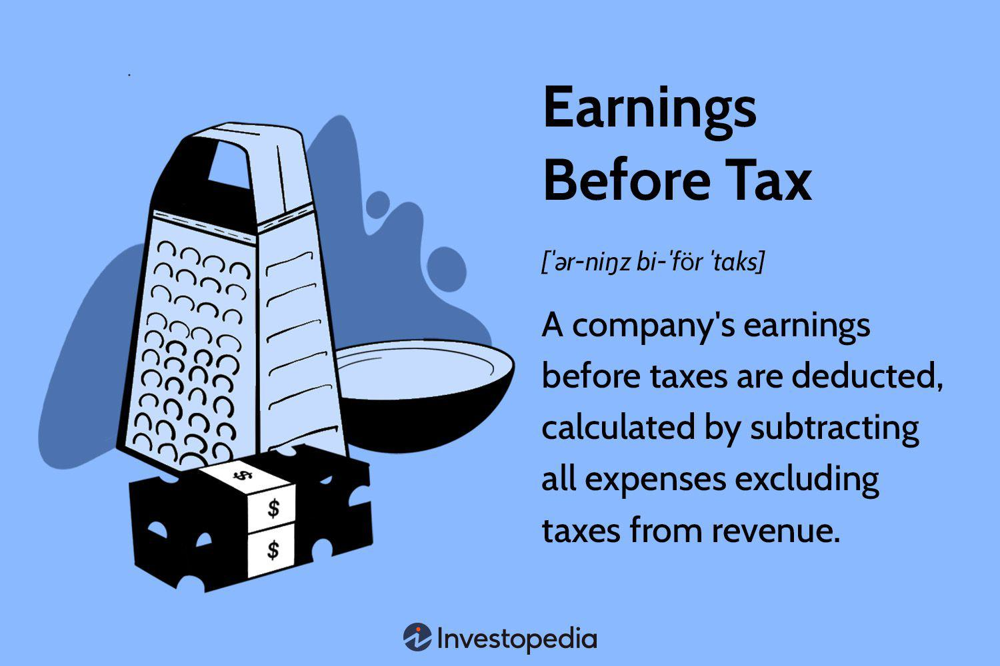

## Table of Contents

## What is Earnings Before Tax (EBT)?

Earnings Before Tax (EBT) is a measure of a company's financial performance. It shows how much profit a company makes before it pays any taxes. EBT is calculated by taking a company's revenue and subtracting all its expenses, except for taxes. This number helps investors and business owners see how well a company is doing without the effect of tax rates, which can vary a lot from one place to another.

EBT is useful because it gives a clearer picture of a company's operating performance. For example, two companies might have the same amount of profit after taxes, but if one of them pays a lot more in taxes, its EBT would be higher. This tells us that the company with the higher EBT is actually performing better in its core business activities. By looking at EBT, people can compare companies in different regions or countries more fairly, since they don't have to worry about different tax laws affecting the numbers.

## How is EBT calculated?

Earnings Before Tax (EBT) is figured out by starting with a company's total revenue and then taking away all the costs and expenses it has, except for taxes. This includes things like the cost of goods sold, operating expenses, interest on any loans, and any other expenses the company has to pay. By doing this, you get a number that shows how much profit the company made before any taxes were taken out.

EBT is a helpful number because it lets people see how well a company is doing at making money from its main business, without the ups and downs of tax rates messing with the numbers. For example, if two companies make the same profit after taxes but one pays a lot more in taxes, the one with the higher EBT is actually doing better in its business operations. This makes it easier to compare companies from different places or countries, since you don't have to worry about their different tax situations.

## Why is EBT important for businesses?

EBT is important for businesses because it shows how much money they make before they have to pay taxes. This number helps business owners and investors see how well the company is doing at its core business activities. When you look at EBT, you can tell if the company is good at making money from what it does every day, without the ups and downs of tax rates getting in the way.

Another reason EBT is important is that it makes it easier to compare businesses from different places. Since tax laws can be very different from one country to another, looking at profit after taxes can be confusing. But with EBT, you can see how well companies are doing without worrying about their different tax situations. This helps investors make better choices about where to put their money.

## How does EBT differ from net income?

EBT, or Earnings Before Tax, is how much money a company makes before it pays any taxes. It's like looking at the company's profit right before the tax part comes in. To find EBT, you take all the money the company makes and subtract all the costs and expenses, except for taxes. This number helps you see how well the company is doing at its main business, without tax rates changing the picture.

Net income, on the other hand, is the money left after a company has paid all its taxes. It's the final profit number that shows up at the bottom of the income statement. To get net income, you start with EBT and then subtract the taxes the company owes. Net income is important because it shows the actual profit the company keeps, which is what shareholders care about the most.

So, the main difference between EBT and net income is that EBT shows profit before taxes, while net income shows profit after taxes. EBT gives a clearer view of how well the business is doing without tax rates messing things up, while net income tells you the final amount of money the company has left to use or share with its owners.

## Can you provide an example of how to calculate EBT?

Let's say a company called ABC Corp made $1 million in sales last year. They spent $600,000 on the things they needed to make their products, like materials and labor. They also had to pay $100,000 for rent and utilities, $50,000 for salaries for their office workers, and $30,000 in interest on a loan they took out. 

To find out ABC Corp's EBT, we start with their total sales of $1 million. Then, we subtract all their expenses except for taxes. So, we take away the $600,000 they spent on making their products, the $100,000 for rent and utilities, the $50,000 for office salaries, and the $30,000 in interest. That leaves us with $1,000,000 - $600,000 - $100,000 - $50,000 - $30,000 = $220,000. This $220,000 is ABC Corp's EBT, which is the profit they made before paying any taxes.

## What are the common uses of EBT in financial analysis?

EBT is really useful in financial analysis because it shows how much money a company makes from its main business before any taxes are taken out. This helps people see how well the company is doing without the ups and downs of tax rates getting in the way. For example, if two companies make the same profit after taxes but one pays a lot more in taxes, the one with the higher EBT is actually doing better in its core business. This makes it easier for investors to compare companies from different places or countries, since they don't have to worry about different tax laws affecting the numbers.

Another way EBT is used in financial analysis is to help figure out how much a company might owe in taxes. By knowing the EBT, you can use the company's tax rate to guess how much they'll pay in taxes. This can help with planning and making sure the company has enough money set aside to cover its tax bill. EBT is also important for looking at a company's operating performance over time. If the EBT goes up, it usually means the company is getting better at making money from its main business activities.

## How does EBT impact a company's tax liability?

EBT, or Earnings Before Tax, is the amount of money a company makes before it pays any taxes. This number is important because it directly affects how much a company will have to pay in taxes. If a company has a high EBT, it means they made a lot of money before taxes, so they will likely have a higher tax bill. On the other hand, if a company has a low EBT, their tax bill will be smaller because they didn't make as much money before taxes.

Knowing the EBT helps a company plan for its taxes. For example, if a company knows its EBT and the tax rate it has to pay, it can figure out how much money it needs to set aside for taxes. This helps the company make sure it has enough money to cover its tax bill without any surprises. By keeping an eye on EBT, a company can better manage its finances and plan for the future.

## What factors can affect a company's EBT?

A company's EBT can change because of many things. One big thing is how much money the company makes from selling its products or services. If sales go up, EBT usually goes up too. But if sales go down, EBT will probably go down as well. Another thing that can affect EBT is the cost of making the products or providing the services. If it costs more to make things, like if the price of materials goes up, then EBT will be lower because the company has to spend more money before it can start making a profit.

Other things that can change EBT are the company's operating expenses, like rent, utilities, and salaries. If these costs go up, EBT will go down. Interest on loans can also make a difference. If a company has to pay more interest because it borrowed more money or because interest rates went up, that will lower its EBT. Sometimes, things like lawsuits or fines can also affect EBT if the company has to pay a lot of money for them. All these things together can make EBT go up or down, depending on how the company is doing and what's happening around it.

## How can EBT be used to compare the performance of different companies?

EBT is a great way to compare how well different companies are doing because it shows how much money they make before they have to pay taxes. Since tax rates can be very different from one place to another, looking at EBT helps you see how good a company is at making money from its main business without tax rates messing up the numbers. For example, if Company A and Company B both make $100,000 after taxes, but Company A pays a lot more in taxes, Company A's EBT would be higher. This tells us that Company A is actually doing better at its core business, even though their final profit after taxes looks the same.

Using EBT to compare companies from different countries or regions is especially useful. If you just look at net income, which is profit after taxes, it can be hard to tell if a company is doing well because of its business or just because it pays less in taxes. But with EBT, you can see how well companies are doing at making money from what they do every day, no matter where they are. This makes it easier for investors to decide which companies are performing better and where to put their money.

## What are the limitations of using EBT as a financial metric?

EBT, or Earnings Before Tax, is a good way to see how well a company is doing at making money from its main business, but it has some limitations. One big problem is that EBT doesn't tell you anything about how much a company has to pay in taxes. Taxes can be a big expense, and they can really change how much money a company keeps at the end of the day. So, while EBT can help you compare companies from different places, it doesn't give you the full picture of how much profit they actually have after taxes.

Another limitation is that EBT can be affected by things that don't have much to do with how well the company is doing at its core business. For example, if a company has a lot of debt, the interest they have to pay on that debt will lower their EBT. This can make it look like the company is doing worse than it really is, even if they're good at making money from what they do every day. Also, EBT doesn't take into account one-time expenses like lawsuits or fines, which can make the EBT number go up or down a lot and make it harder to compare companies over time.

## How do changes in tax laws affect EBT?

Changes in tax laws don't directly affect a company's EBT because EBT is calculated before any taxes are taken out. So, no matter what the tax laws say, EBT will stay the same as long as the company's sales and expenses stay the same. For example, if a company makes $1 million in sales and has $800,000 in expenses, their EBT will be $200,000, no matter what the tax rate is.

But, changes in tax laws can affect how much a company has to pay in taxes, which can make a big difference in how much profit they keep after taxes. If tax laws change and the tax rate goes up, the company will have to pay more in taxes, which means their profit after taxes, or net income, will be lower. On the other hand, if tax laws change and the tax rate goes down, the company will pay less in taxes, and their net income will be higher. So, while EBT itself doesn't change, the changes in tax laws can make a big difference in how much money the company actually gets to keep.

## What advanced strategies can companies use to optimize their EBT?

Companies can use different strategies to make their EBT higher. One way is to find ways to make more money from what they do every day. This could mean selling more products or services, or finding new ways to make money, like starting a new part of the business. Another way is to cut down on costs. This could mean finding cheaper ways to make their products, like using less expensive materials or making things more efficiently. It could also mean spending less on things like rent, utilities, or salaries. By making more money and spending less, a company can make its EBT go up.

Another strategy is to manage debt better. If a company has a lot of debt, it has to pay a lot of interest, which can lower its EBT. So, paying off debt faster or finding loans with lower interest rates can help. Also, companies can look at one-time expenses, like fines or lawsuits, and try to avoid them or plan for them better. By keeping these costs down, a company can keep its EBT higher. All these strategies together can help a company make more money before taxes, which is good for its overall financial health.

## What is Earnings Before Tax (EBT)?

Earnings Before Tax (EBT) represents a company's earnings before it has accounted for any tax liabilities. This financial metric is crucial for evaluating a firm's operational performance since it isolates earnings from the effects of varying tax strategies and rates.

### Calculation of EBT

The calculation of EBT involves subtracting all operating expenses, excluding taxes, from the company’s total revenue. Mathematically, it can be expressed as:

$$

\text{EBT} = \text{Total Revenue} - \text{Operating Expenses} 
$$

### Income Statement Context

EBT, also commonly referred to as pretax income, features prominently on a company's income statement. It is positioned above the tax expense and net income, offering a clear view of a company's earnings derived from its core operations before the impact of tax policies.

### Operational Efficiency

By focusing exclusively on earnings before taxes, EBT provides a clean insight into the operational efficiency of a business. It reflects how well a company manages its operations, independent of tax-related influences. This aspect makes it a valuable metric for comparing companies, particularly those operating in different tax jurisdictions. Understanding EBT helps stakeholders assess the pure profitability and performance of a company's core business activities, devoid of external tax adjustments.

## What is EBT and can you provide examples to help understand it?

To obtain a clearer understanding of Earnings Before Tax (EBT), let's break down a hypothetical example of a company's financials. Consider a business that has generated $30,000 in revenue over the [course](/wiki/best-algorithmic-trading-courses) of a month through the sale of its products. 

The calculation of EBT starts with determining the Gross Profit, which can be calculated as follows:

$$
\text{Gross Profit} = \text{Revenue} - \text{Cost of Goods Sold (COGS)}
$$

Assuming the Costs of Goods Sold amount to $3,000, the calculation would be:

$$
\text{Gross Profit} = \$30,000 - \$3,000 = \$27,000
$$

To progress towards EBT, we must account for various operating expenses. Suppose operational costs, including rent, employee salaries, and interest payments, total $12,000. These expenses are deducted from the Gross Profit to establish EBT:

$$
\text{EBT} = \text{Gross Profit} - \text{Operating Expenses}
$$

Applying the figures:

$$
\text{EBT} = \$27,000 - \$12,000 = \$15,000
$$

This example underscores the significance of EBT in evaluating a company's core profitability, abstracting from the impact of tax obligations. By focusing solely on revenues, the cost of goods, and operating expenses, EBT serves as a robust indicator of how efficiently a firm operates financially before tax implications.

## What are the differences between EBT, EBIT, and EBITDA?

Earnings Before Tax (EBT), Earnings Before Interest and Taxes (EBIT), and Earnings Before Interest, Taxes, Depreciation, and Amortization (EBITDA) are pivotal financial metrics each serving distinct analytical purposes. EBT is a measure of a company's earnings with tax expenses excluded, allowing for the assessment of operational efficiency across differing tax environments. In contrast, EBIT accounts for both taxes and interest expenses being excluded from earnings, providing insight into a company's operating income independent of its capital structure. This makes EBIT particularly useful when comparing firms with varying levels of debt.

EBIT equation is expressed as follows:

$$
\text{EBIT} = \text{Revenue} - \text{Operating Expenses}
$$

EBITDA takes a step further by excluding not only interest and tax but also depreciation and amortization. This makes EBITDA a comprehensive indicator of a company's operational profitability, stripping away the effects of non-cash expenses that can obscure cash flow visibility. It is especially advantageous for industries with substantial capital investments, as it provides a clearer evaluation of short-term operational vitality.

EBITDA can be calculated using:

$$
\text{EBITDA} = \text{Revenue} - \text{Operating Expenses} + \text{Depreciation} + \text{Amortization}
$$

Choosing among EBT, EBIT, and EBITDA often depends on the analysis objective. EBT offers a direct view of profit before tax impacts, EBIT provides a debt-neutral view of operational efficiency, and EBITDA gives insight into cash-generating capability by nullifying non-cash charges. Hence, for investors and analysts, understanding these metrics, and their distinctions is crucial to comprehend a company's financial health and to make informed decisions.

## References & Further Reading

[1]: ["Earnings Manipulation and Earnings Management"](https://www.investopedia.com/terms/e/earnings-management.asp) by David F. Larcker and Scott A. Richardson

[2]: Gao, P., & Liang, P. J. (2013). ["Earning Management and Real Activities Manipulation"](https://www.sciencedirect.com/science/article/pii/S0165410106000401) The Review of Financial Studies, 29(2), 585-626.

[3]: ["Algorithmic Trading and DMA: An introduction to direct access trading strategies"](https://www.semanticscholar.org/paper/Algorithmic-trading-%26-DMA-%3A-an-introduction-to-Johnson/aa5de1ab883d5e23b6651faa7c1807586d688e4b) by Barry Johnson

[4]: Damodaran, A. (2012). ["Investment Valuation: Tools and Techniques for Determining the Value of Any Asset"](https://books.google.com/books/about/Investment_Valuation.html?id=5SRHAAAAQBAJ)

[5]: ["International Financial Statement Analysis"](https://www.amazon.com/International-Financial-Statement-Institute-Investment/dp/1119628059) by Thomas R. Robinson, Paul Munter, and Hennie van Greuning