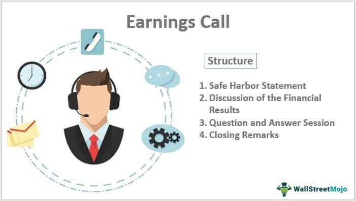

In today’s fast-paced financial markets, staying informed and making strategic investment decisions requires access to up-to-date information. Among the most influential sources of information is the earnings conference call, a critical event where companies disclose their financial performance and future expectations. These calls serve as a platform for key company executives to communicate with investors, analysts, and journalists, offering insights beyond the figures reported in financial statements. In an environment where market conditions can shift rapidly, the nuanced information conveyed in these calls can be invaluable for stakeholders looking to decipher a company's trajectory.

The earnings conference call is not just about numbers; it provides qualitative insights into a company's operational ethos and strategic direction. The tone and sentiment expressed by management during these calls can reveal levels of confidence or concern, thereby influencing investor perceptions and actions. For instance, a confident outlook on growth from a CEO might be interpreted positively, leading to a rise in stock prices, while an evasive response to a critical question could trigger uncertainty.



Integrating insights from conference calls with algorithmic trading further amplifies their utility. Algorithmic trading, the use of algorithms to automate trading processes, allows for executing high-speed trades based on predefined criteria. By incorporating data from earnings calls, these algorithms can be fine-tuned to respond instantaneously to new information, capturing opportunities before market reactions are fully realized. This synergy between qualitative insights and quantitative trading models can yield a significant competitive edge in financial markets.

This article explores the convergence of conference call insights, financial reports, and algorithmic trading strategies, highlighting how this amalgamation aids investors in navigating today’s complex financial landscape. Through understanding and leveraging these elements, investors can craft robust investment strategies that align with both immediate and long-term objectives.

## Table of Contents

## Understanding Earnings Conference Calls

An earnings conference call is a public event hosted by a company to discuss its financial results and future outlook. These calls serve as a crucial communication platform where management teams present quarterly or annual financial results to interested parties, primarily investors, analysts, and on occasion, journalists. Typically, these calls coincide with the release of the company's quarterly financial reports, allowing stakeholders to assess the company's performance in a timely manner.

The structure of these calls is straightforward. They begin with an introduction of the key company executives, who then deliver an overview of the financial performance. This overview includes a summary of key financial metrics such as earnings per share, revenue growth, operating margins, and other pertinent financial ratios. This presentation aims to convey not just numerical results but also qualitative insights into the company's strategic direction and operational challenges faced during the reporting period.

Toward the end of the call, there is a segment where executives outline the company's future prospects. This includes forward-looking statements about projected revenue, planned investments, and potential market expansions, providing a glimpse into the company's strategic road map.

The call concludes with a question and answer session. This interactive segment allows analysts to probe deeper into specific areas of interest or concern, providing further clarity and context beyond the financial statements. Analysts often scrutinize the tone and confidence of the executives' responses, gleaning insights that can influence investment decisions.

## The Structure of a Conference Call

Conference calls generally maintain a consistent structure designed to provide clarity and facilitate effective communication between a company's management and its stakeholders. These calls typically begin with introductions, wherein key members of the management team are presented. This component sets the stage for transparency and credibility, enabling investors and analysts to know who will be addressing them and from whom they can expect specific insights.

Following introductions, the company presents a report on its financial metrics. This includes detailed discussions of earnings, revenue, and profit margins. Earnings, which reflect the company's profitability, are contrasted against previous periods to highlight growth or decline. Revenue figures detail the company's sales performance, providing insights into market demand and operational success. Profit margins are also scrutinized, indicative of cost management and efficiency.

Subsequently, future forecasts and strategic plans are unveiled. This section focuses on the company's projections for upcoming periods, including expected revenue growth, market expansion strategies, and potential investments. This part of the conference call is critical for stakeholders aiming to understand the company’s future trajectory and management’s confidence in achieving its goals.

The conclusion of the call features a Q&A session, where analysts and sometimes investors can pose questions directly to the management team. This segment allows for the clarification of points made earlier in the call and offers the management an opportunity to address specific concerns or highlight overlooked areas. The Q&A segment is pivotal as it can reveal management’s preparedness, transparency, and adaptability to investor concerns, adding a qualitative layer to the quantitative data presented earlier.

## Leveraging Conference Calls for Investment Decisions

Earnings conference calls offer a wealth of qualitative data that can significantly influence investment decisions. While the quantitative metrics reported in financial statements are vital, the qualitative insights derived from these calls can provide additional layers of understanding. Management tone and sentiment during these discussions often reveal more than the raw figures, offering cues on the company's future trajectory and the executive's confidence in meeting business objectives.

Investors can evaluate the confidence level of a management team based on their responses to analyst inquiries and the overall demeanor observed throughout the call. For instance, a coherent and consistent explanation of business strategies alongside an optimistic tone might suggest the management's confidence in their forecasts. Conversely, vague or defensive responses and a pessimistic tone might indicate underlying challenges that are not immediately apparent in the financial reports.

Another critical aspect of conference calls is the analysis of any discrepancies between verbal communication and reported numbers. Such discrepancies may hint at areas that warrant closer examination. For example, if a company's earnings report indicates strong revenue growth, yet management's tone seems unusually cautious, it might suggest upcoming challenges or market conditions that could impact future performance.

By effectively interpreting the nuances in management's communication, investors can uncover hidden risks or opportunities, allowing for more informed decision-making. This qualitative analysis, combined with the quantitative data, provides a more comprehensive view of a company's potential, enabling the formulation of robust investment strategies.

## The Role of Financial Reports

Financial reports are indispensable tools in assessing a company's financial health, operational efficiency, and overall performance. These reports typically comprise three primary documents: the balance sheet, the income statement, and the cash flow statement. Each serves a specific purpose and, when analyzed together, provides a comprehensive picture of a company's financial state.

The **balance sheet** presents a snapshot of a company's assets, liabilities, and shareholders' equity at a specific point in time. It can be structured as follows:

$$
\text{Assets} = \text{Liabilities} + \text{Shareholders' Equity}
$$

This equation reflects the accounting identity and indicates how the company's resources (assets) are financed—either through borrowing (liabilities) or through investments from owners (equity).

The **income statement** furnishes insights into a company's profitability over a reporting period. It details revenues, expenses, and profits, ultimately leading to the calculation of net income. The fundamental structure is:

$$
\text{Net Income} = \text{Total Revenue} - \text{Total Expenses}
$$

This statement is crucial for evaluating a company's operational performance and efficiency in generating profits from its business activities.

Finally, the **cash flow statement** elucidates the inflows and outflows of cash within the company, segmented into operating, investing, and financing activities. This report is vital for assessing the [liquidity](/wiki/liquidity-risk-premium) and long-term solvency of a business, ensuring it has sufficient cash to meet obligations and invest in future growth.

When these financial reports are considered alongside insights gleaned from earnings conference calls, investors achieve a more rounded understanding of a company's current and future prospects. Conference call insights can reveal the management's strategic vision and address areas that might not be fully captured in financial statements, such as market challenges or future growth initiatives.

For instance, if a company's income statement shows strong revenue growth, but cash flow statements indicate limited cash reserves due to heavy investment expenses, insights from conference calls can clarify these investments' strategic intent and expected returns. Similarly, discrepancies between management's optimistic tone during conference calls and stagnant financial metrics can signal areas needing further investigation.

In conclusion, financial reports are crucial in providing a data-driven evaluation of a company's performance. When complemented by qualitative insights from conference calls, they offer a holistic view that better informs investment decisions.

## Algorithmic Trading in the Context of Financial Reports

Algorithmic trading leverages the power of computer algorithms to execute trades rapidly and efficiently based on predefined criteria. These algorithms are driven by vast amounts of financial data, including the critical insights derived from earnings conference calls and financial reports. The seamless integration of these data sources into trading algorithms enhances the ability to identify and act on profitable market opportunities.

Conference calls, as a source of real-time data, provide nuanced information that can significantly impact market sentiments and, consequently, share prices. For instance, the tone, emphasis, and financial projections shared by company executives during these calls can influence an algorithm's decision-making parameters. This real-time aspect of conference calls allows traders to adjust algorithms swiftly to capture immediate investment opportunities, providing an edge over conventional trading methods that might not react as quickly to new information.

Financial reports, with their structured presentation of a company’s financial health, supply the foundational data necessary for [algorithmic trading](/wiki/algorithmic-trading). Elements such as earnings, revenue, profit margins, and liquidity ratios offer clear metrics to formulate trading strategies. For example, an algorithm might consider a company’s price-to-earnings (P/E) ratio, calculated as:

$$
\text{P/E Ratio} = \frac{\text{Market Value per Share}}{\text{Earnings per Share (EPS)}}
$$

By combining formulas like the above with insights from financial reports, traders can develop algorithms that make informed buy or sell decisions based on the calculated intrinsic value of stocks.

Furthermore, natural language processing (NLP) techniques can be employed to analyze conference call transcripts. Python libraries such as `nltk` or `spaCy` can process the sentiment of these calls, further refining trading models. For example:

```python
import nltk
from nltk.sentiment import SentimentIntensityAnalyzer

# Analyze sentiment of a conference call transcript
sia = SentimentIntensityAnalyzer()
text = "We are pleased with this quarter's performance, projecting growth..."
sentiment = sia.polarity_scores(text)

print(sentiment)
```

The output from the sentiment analysis can be integrated into the algorithm, offering an additional dimension to trading decisions. It ensures that the subjective nuances from conference calls are quantified and utilized effectively.

Integrating real-time insights from conference calls with the quantitative rigor of financial reports allows for finely tuned algorithms that can navigate the complexities of modern financial markets. This synthesis of qualitative and quantitative data positions algorithmic trading as a formidable strategy for capturing and capitalizing on timely investment opportunities.

## Benefits and Challenges of Combining Conference Calls with Algo Trading

Integrating insights from earnings conference calls with algorithmic trading models presents various advantages and challenges in modern financial markets. The primary benefit lies in enhancing trading accuracy through the assimilation of qualitative data, such as management sentiment and strategic forecasts, which are often conveyed during these calls. This additional layer of information, when analyzed and interpreted correctly, can lead to more informed trading decisions and the identification of undervalued or overvalued assets that quantitative data alone might not reveal.

Algorithmic trading systems, characterized by their ability to process vast arrays of numerical data at high speeds, can be optimized by incorporating relevant insights from conference calls. These models can be adjusted to react to specific lexicons, tones, or even emotional cues demonstrated by company executives during their presentations. Natural Language Processing (NLP) and sentiment analysis techniques can be embedded within trading algorithms to process audio transcripts, thereby providing real-time insights that can trigger trades based on newly interpreted data.

However, the subjective nature of interpreting conference call insights poses significant challenges. The nuances in human communication—such as tone fluctuation or strategic ambiguity—can lead to varied interpretations, thus complicating the programming of algorithms that traditionally rely on concrete data points. Ensuring that an algorithm accurately captures the subtleties of human speech requires sophisticated NLP models that are continuously trained and validated against a range of scenarios.

For example, a Python-based approach might leverage libraries such as NLTK or spaCy for sentiment analysis:

```python
import spacy
from textblob import TextBlob

# Load NLP model
nlp = spacy.load('en_core_web_sm')

def analyze_sentiment(transcript):
    doc = nlp(transcript)
    sentiment_score = TextBlob(doc.text).sentiment.polarity
    return sentiment_score

# Sample usage with conference call text
transcript_text = "The company's performance this quarter surpassed expectations..."
sentiment_score = analyze_sentiment(transcript_text)
print('Sentiment Score:', sentiment_score)
```

Balancing human intuition with algorithmic precision is vital to maximize the effectiveness of trading strategies. Human analysts play a crucial role in interpreting the results—ensuring that algorithms do not misread or overreact to subtle cues. The collaboration between human expertise and machine efficiency can lead to the development of robust strategies capable of adapting to a dynamic market landscape.

In practice, successful execution requires constant updates and refinements to algorithms to reflect the latest linguistic trends and business contexts. Moreover, careful [backtesting](/wiki/backtesting) methods should be employed to ensure that the integrated model performs consistently under various market conditions, minimizing the risks associated with overfitting and erroneous data interpretation.

## Conclusion

Conference calls and financial reports remain foundational tools for investors. They offer indispensable insights into a company's financial health, operational efficiency, and strategic direction. These traditional methods of analysis have long served as the backbone of informed investment decisions, allowing stakeholders to interpret quantitative data and qualitative signals emanating from corporate management.

In parallel, algorithmic trading represents a modern evolution in market strategies, providing a degree of speed and precision that is unattainable for human traders. Algorithms execute trades based on pre-defined criteria, which can include a range of signals derived from financial statements and other data sources. By leveraging high-frequency data processing, algorithms enable investors to capitalize on market inefficiencies and react swiftly to new information.

The integration of conference call insights and financial reports with algorithmic trading constructs a formidable framework for investment strategies. This combination allows investors to effectively translate qualitative insights from management discussions into quantitative signals that can be acted upon immediately. For instance, an algorithm might be programmed to monitor sentiment indicators from conference calls and adjust trading strategies correspondingly.

The fusion of these approaches helps create robust investment strategies capable of navigating today’s complex financial markets. Through such integrated strategies, investors can enhance their decision-making processes, balancing the depth of traditional analysis with the agility offered by cutting-edge technology. This synergy not only maximizes potential returns but also fortifies strategies against the inherent [volatility](/wiki/volatility-trading-strategies) of financial markets, establishing a comprehensive approach to modern investing.

## References & Further Reading

[1]: Bergstra, J., Bardenet, R., Bengio, Y., & Kégl, B. (2011). ["Algorithms for Hyper-Parameter Optimization."](https://dl.acm.org/doi/10.5555/2986459.2986743) Advances in Neural Information Processing Systems 24.

[2]: ["Advances in Financial Machine Learning"](https://www.amazon.com/Advances-Financial-Machine-Learning-Marcos/dp/1119482089) by Marcos Lopez de Prado

[3]: ["Evidence-Based Technical Analysis: Applying the Scientific Method and Statistical Inference to Trading Signals"](https://www.amazon.com/Evidence-Based-Technical-Analysis-Scientific-Statistical/dp/0470008741) by David Aronson

[4]: ["Machine Learning for Algorithmic Trading"](https://github.com/stefan-jansen/machine-learning-for-trading) by Stefan Jansen

[5]: ["Quantitative Trading: How to Build Your Own Algorithmic Trading Business"](https://www.amazon.com/Quantitative-Trading-Build-Algorithmic-Business/dp/1119800064) by Ernest P. Chan