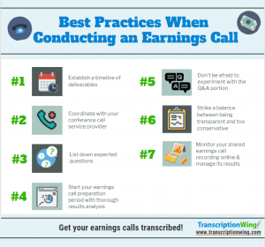

## Table of Contents

## What is an earnings conference call?

An earnings conference call is a meeting where a company talks about its financial results with investors and analysts. It usually happens after a company releases its quarterly or yearly earnings report. During the call, company leaders, like the CEO and CFO, explain the numbers in the report and discuss how the company is doing. They might also talk about future plans and answer questions from people on the call.

These calls are important because they give investors and analysts a chance to understand the company's performance better. They can ask questions directly to the company's leaders, which helps them make smarter decisions about buying or selling the company's stock. Earnings conference calls are often recorded and made available online, so people who couldn't join the live call can still listen later.

## Why are earnings conference calls important for companies?

Earnings conference calls are important for companies because they help keep investors and analysts informed about the company's financial health. When a company shares its earnings, it shows how well it's doing and whether it's making money or not. This information is crucial for investors who need to decide if they should buy, sell, or keep the company's stock. By having a call, the company can explain the numbers in a way that's easy to understand and answer any questions people might have.

These calls also help build trust between the company and its investors. When company leaders, like the CEO and CFO, talk openly about the business, it shows they are honest and care about keeping everyone updated. This can make investors feel more confident in the company and more likely to support it in the future. Plus, since the calls are often recorded and shared online, even people who couldn't join live can still learn about the company's performance.

## Who typically participates in an earnings conference call?

During an earnings conference call, the main people who participate are the company's leaders, like the CEO and CFO. They are the ones who talk about the company's financial results, explain the numbers, and share any news about the business. They also answer questions to help everyone understand the company better.

Investors and analysts are the other big group that joins these calls. They listen to what the company leaders say and ask questions to learn more about the company's performance. This helps them decide if they should buy or sell the company's stock. Sometimes, journalists and other interested people can also listen in to get the latest updates on the company.

## How often do companies hold earnings conference calls?

Companies usually hold earnings conference calls four times a year. This is because they want to share their financial results every three months, which is called a quarter. So, after each quarter, the company will have a call to talk about how they did and what's coming next.

Sometimes, a company might also have a special call if something big happens, like a merger or a big change in the business. But the regular calls, the ones that happen every quarter, are the most common. These calls help keep everyone up to date on the company's money matters and future plans.

## What is the typical structure of an earnings conference call?

An earnings conference call usually starts with a welcome and introductions by a host, often an investor relations officer. After that, the company's CEO gives a short speech about the big picture of how the company is doing. They might talk about what's been happening in the market and any important events for the company. Then, the CFO steps in to go over the numbers in the earnings report. They explain things like how much money the company made, how much they spent, and what their profits were. This part can have some charts or slides to help people understand better.

After the CEO and CFO finish their parts, the call moves to a question and answer session. This is when investors and analysts get to ask their questions. They might want to know more about the numbers, the company's plans for the future, or anything else that's on their minds. The company leaders answer these questions to give more details and clear up any confusion. The whole call usually lasts about an hour, but it can be shorter or longer depending on how many questions there are.

## How can investors access an earnings conference call?

Investors can access an earnings conference call in a few ways. The easiest way is to go to the company's website. Most companies have a special section for investors where they list all the upcoming calls and how to join them. Usually, you need to sign up with your name and email to get a phone number and a special code to call in. Sometimes, the company also offers a live webcast, which means you can listen to the call on your computer without calling in.

If an investor can't join the call live, they can still listen to a recording later. Companies usually post a replay of the call on their website for a few days or even weeks after the call happens. This way, anyone who missed it can still hear what was said. Some companies also share a written version of the call, called a transcript, which you can read instead of listening.

## What kind of information is usually disclosed during an earnings conference call?

During an earnings conference call, a company shares important information about its money matters. They talk about how much money they made and how much they spent during the last three months, which is called a quarter. The company's leaders, like the CEO and CFO, explain the numbers in the earnings report. They might also talk about any big changes or events that happened in the business, like new products or mergers. This helps everyone understand how the company is doing and what's going on.

The call also includes information about the company's plans for the future. The leaders might talk about what they expect to happen in the next few months or years, like new goals or strategies. Investors and analysts can ask questions during the call to learn more about these plans and get a better understanding of the company's direction. This helps them decide if they want to buy, sell, or keep the company's stock.

## How do companies prepare for an earnings conference call?

Companies start preparing for an earnings conference call weeks before it happens. They gather all the financial numbers from the last three months and put them into a report. The CEO and CFO work together to make sure everything in the report is correct and ready to share. They also practice what they're going to say during the call. They might even have a few meetings to go over their speeches and make sure they explain things clearly.

On the day of the call, the company makes sure everything is set up right. They check that the phone lines and webcast are working, and they have all the slides or charts ready to show. The investor relations team helps coordinate everything and makes sure everyone knows what to do. During the call, the CEO and CFO stick to their prepared speeches but also answer questions from investors and analysts. This helps everyone understand the company's performance and future plans.

## What are the legal and regulatory considerations for earnings conference calls?

Companies need to follow rules when they have earnings conference calls. One big rule is that they must be honest and not lie about their numbers or what's happening in the business. This is called being truthful or having "full disclosure." If a company doesn't tell the truth, they can get in big trouble with the law. They also need to make sure everyone can join the call, so they share the details on their website and let people know when it's happening. This way, all investors have a fair chance to learn about the company's performance.

Another important thing is that companies need to follow the rules set by groups like the Securities and Exchange Commission (SEC) in the U.S. The SEC has rules about what companies can say and when they can say it. For example, if a company shares important news during the call, they need to make sure they've told everyone at the same time, not just the people on the call. This is called "Regulation Fair Disclosure" or Reg FD. By following these rules, companies make sure they're treating everyone fairly and keeping their investors happy and informed.

## How do analysts and investors use the information from earnings conference calls?

Analysts and investors listen to earnings conference calls to learn about how a company is doing financially. They pay close attention to what the CEO and CFO say about the company's earnings, spending, and profits. By understanding these numbers, analysts can figure out if the company is doing well or if there are problems. They might also look at what the company leaders say about future plans and goals to see if the company has a good strategy moving forward. This helps them write reports and give advice to other investors about whether to buy, sell, or keep the company's stock.

Investors use the information from these calls to make smart choices about their money. If the company sounds like it's doing well and has good plans for the future, an investor might decide to buy more of the company's stock. But if the news is bad or the company seems unsure about what's next, an investor might want to sell their stock or not buy any more. Listening to the call and hearing the company leaders answer questions can give investors a better feel for the company's health and help them decide what to do with their investments.

## What are some common challenges or pitfalls during earnings conference calls?

One common challenge during earnings conference calls is that the company leaders might not explain things clearly. Sometimes, the CEO or CFO might use big words or talk too fast, which can make it hard for investors and analysts to understand what's going on. If the numbers or plans aren't explained well, people might get confused or even worried about the company's future. Another pitfall is that the call might run too long. If there are too many questions or if the leaders talk for too long, people might get bored or stop paying attention. This can mean they miss important information or feel frustrated with the call.

Another challenge is dealing with tough questions. Sometimes, analysts or investors ask hard questions that the company leaders might not want to answer. If the leaders seem unsure or give unclear answers, it can make people think the company is hiding something or not doing well. This can hurt the company's reputation and make investors less confident. Also, technical problems can be a big headache. If the phone lines or webcast don't work right, people might not be able to hear what's being said, which means they miss out on important updates about the company's performance.

## How has technology changed the way earnings conference calls are conducted and accessed?

Technology has made big changes to how companies do earnings conference calls. Now, instead of just calling in on the phone, people can join the call online through a webcast. This means they can watch the call on their computer or phone, which is easier and more convenient. Companies can also use slides or charts during the call to help explain the numbers and plans. This makes it easier for everyone to understand what's going on. Plus, technology lets companies record the call and put it on their website, so people who missed the live call can still listen later.

Another way technology has changed things is by making it easier for more people to join the call. Before, only a few people could call in because of limited phone lines. Now, with webcasts, lots of people can join at the same time without any problems. This means more investors and analysts can listen to what the company leaders say. Technology also helps with questions and answers. People can type their questions into a chat box during the call, and the company can answer them live. This makes the call more interactive and helps everyone get the information they need.

## What is the Role of Financial Reports?

Financial reports are indispensable tools in assessing a company's financial health, operational efficiency, and overall performance. These reports typically comprise three primary documents: the balance sheet, the income statement, and the cash flow statement. Each serves a specific purpose and, when analyzed together, provides a comprehensive picture of a company's financial state.

The **balance sheet** presents a snapshot of a company's assets, liabilities, and shareholders' equity at a specific point in time. It can be structured as follows:

$$
\text{Assets} = \text{Liabilities} + \text{Shareholders' Equity}
$$

This equation reflects the accounting identity and indicates how the company's resources (assets) are financed—either through borrowing (liabilities) or through investments from owners (equity).

The **income statement** furnishes insights into a company's profitability over a reporting period. It details revenues, expenses, and profits, ultimately leading to the calculation of net income. The fundamental structure is:

$$
\text{Net Income} = \text{Total Revenue} - \text{Total Expenses}
$$

This statement is crucial for evaluating a company's operational performance and efficiency in generating profits from its business activities.

Finally, the **cash flow statement** elucidates the inflows and outflows of cash within the company, segmented into operating, investing, and financing activities. This report is vital for assessing the [liquidity](/wiki/liquidity-risk-premium) and long-term solvency of a business, ensuring it has sufficient cash to meet obligations and invest in future growth.

When these financial reports are considered alongside insights gleaned from earnings conference calls, investors achieve a more rounded understanding of a company's current and future prospects. Conference call insights can reveal the management's strategic vision and address areas that might not be fully captured in financial statements, such as market challenges or future growth initiatives.

For instance, if a company's income statement shows strong revenue growth, but cash flow statements indicate limited cash reserves due to heavy investment expenses, insights from conference calls can clarify these investments' strategic intent and expected returns. Similarly, discrepancies between management's optimistic tone during conference calls and stagnant financial metrics can signal areas needing further investigation.

In conclusion, financial reports are crucial in providing a data-driven evaluation of a company's performance. When complemented by qualitative insights from conference calls, they offer a holistic view that better informs investment decisions.

## What is Algorithmic Trading in the Context of Financial Reports?

Algorithmic trading leverages the power of computer algorithms to execute trades rapidly and efficiently based on predefined criteria. These algorithms are driven by vast amounts of financial data, including the critical insights derived from earnings conference calls and financial reports. The seamless integration of these data sources into trading algorithms enhances the ability to identify and act on profitable market opportunities.

Conference calls, as a source of real-time data, provide nuanced information that can significantly impact market sentiments and, consequently, share prices. For instance, the tone, emphasis, and financial projections shared by company executives during these calls can influence an algorithm's decision-making parameters. This real-time aspect of conference calls allows traders to adjust algorithms swiftly to capture immediate investment opportunities, providing an edge over conventional trading methods that might not react as quickly to new information.

Financial reports, with their structured presentation of a company’s financial health, supply the foundational data necessary for [algorithmic trading](/wiki/algorithmic-trading). Elements such as earnings, revenue, profit margins, and liquidity ratios offer clear metrics to formulate trading strategies. For example, an algorithm might consider a company’s price-to-earnings (P/E) ratio, calculated as:

$$
\text{P/E Ratio} = \frac{\text{Market Value per Share}}{\text{Earnings per Share (EPS)}}
$$

By combining formulas like the above with insights from financial reports, traders can develop algorithms that make informed buy or sell decisions based on the calculated intrinsic value of stocks.

Furthermore, natural language processing (NLP) techniques can be employed to analyze conference call transcripts. Python libraries such as `nltk` or `spaCy` can process the sentiment of these calls, further refining trading models. For example:

```python
import nltk
from nltk.sentiment import SentimentIntensityAnalyzer

# Analyze sentiment of a conference call transcript
sia = SentimentIntensityAnalyzer()
text = "We are pleased with this quarter's performance, projecting growth..."
sentiment = sia.polarity_scores(text)

print(sentiment)
```

The output from the sentiment analysis can be integrated into the algorithm, offering an additional dimension to trading decisions. It ensures that the subjective nuances from conference calls are quantified and utilized effectively.

Integrating real-time insights from conference calls with the quantitative rigor of financial reports allows for finely tuned algorithms that can navigate the complexities of modern financial markets. This synthesis of qualitative and quantitative data positions algorithmic trading as a formidable strategy for capturing and capitalizing on timely investment opportunities.

## References & Further Reading

[1]: Bergstra, J., Bardenet, R., Bengio, Y., & Kégl, B. (2011). ["Algorithms for Hyper-Parameter Optimization."](https://dl.acm.org/doi/10.5555/2986459.2986743) Advances in Neural Information Processing Systems 24.

[2]: ["Advances in Financial Machine Learning"](https://www.amazon.com/Advances-Financial-Machine-Learning-Marcos/dp/1119482089) by Marcos Lopez de Prado

[3]: ["Evidence-Based Technical Analysis: Applying the Scientific Method and Statistical Inference to Trading Signals"](https://www.amazon.com/Evidence-Based-Technical-Analysis-Scientific-Statistical/dp/0470008741) by David Aronson

[4]: ["Machine Learning for Algorithmic Trading"](https://github.com/stefan-jansen/machine-learning-for-trading) by Stefan Jansen

[5]: ["Quantitative Trading: How to Build Your Own Algorithmic Trading Business"](https://www.amazon.com/Quantitative-Trading-Build-Algorithmic-Business/dp/1119800064) by Ernest P. Chan