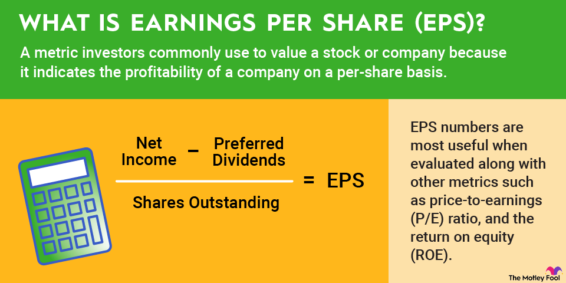

In the fast-paced world of trading and investing, understanding key financial metrics is crucial for making informed decisions. Among these metrics, Earnings Per Share (EPS) stands out as a pivotal indicator of corporate profitability, aiding investors and traders in assessing a company's financial health and value potential. EPS, defined as the portion of a company's profit allocated to each outstanding share of common stock, provides insights into the earnings generated by a company relative to its share base. Calculating EPS involves dividing the net income of a company by its total number of outstanding shares, thus offering a clear snapshot of earnings capability.

In parallel with the evolution of financial metrics like EPS, the landscape of trading is increasingly being shaped by algorithmic trading, or algo trading. This approach uses computer algorithms to execute trades based on pre-defined criteria, often incorporating metrics such as EPS to refine investment strategies and enhance market efficiency. By automating the trading process, algorithms can quickly adapt to changing market conditions and utilize real-time data, thereby providing a competitive edge.



This article explores the intersection of EPS, investor earnings, and algorithmic trading. Through this analysis, we aim to highlight how these factors collectively influence investment strategies, enabling more informed, data-driven decisions that can lead to better trading outcomes. By focusing on EPS as a cornerstone metric, traders and investors can align their strategies with modern algorithmic approaches to optimize their financial performance amidst dynamic market environments.

## Table of Contents

## Understanding Earnings Per Share (EPS)

Earnings Per Share (EPS) is a fundamental metric used by investors to assess a company's profitability on a per-share basis. It serves as an indicator of the portion of a company's profit allocated to each outstanding share of common stock, and is crucial for investors looking to evaluate a company's financial health and performance.

EPS is calculated using the formula:

$$
\text{EPS} = \frac{\text{Net Income} - \text{Dividends on Preferred Stock}}{\text{Average Outstanding Shares}}
$$

In this calculation, net income represents the profit of a company after all expenses and taxes have been deducted. Dividends on preferred stock are specifically deducted because they are paid out before any residual profits can be allocated to common shareholders. The denominator, average outstanding shares, refers to the weighted average of shares that were available during a given period.

There are two primary types of EPS: basic and diluted. Basic EPS is derived using the formula mentioned above and provides a straightforward measure of profitability per share. However, it does not account for potential dilution that might occur if securities, like stock options or convertible bonds, are exercised or converted into common stock.

Diluted EPS, on the other hand, offers a more conservative number by factoring in such potential dilution. It is calculated by assuming that all convertible securities, stock options, and other potential shares are converted into common stock, thus providing a lower, but more comprehensive measure of EPS. This is crucial for investors who need to understand the worst-case scenario of earnings per share should all dilutive securities be exercised.

EPS holds significant importance for investors as it offers a snapshot of a company's profitability. A higher EPS signifies greater profitability, which can make a stock more attractive to investors. Comparing EPS provides insights into how companies perform relative to their peers, helping investors identify market leaders. EPS also plays a key role in [fundamental analysis](/wiki/fundamental-analysis) and serves as a building block for other valuation metrics like the Price-to-Earnings (P/E) ratio. Consistent growth in EPS is often interpreted as a positive signal, indicating that a company is managing its resources well to produce increasing profits over time.

Consequently, understanding EPS helps investors make informed decisions regarding buying or selling stocks and contributes to a broader assessment of a company's financial health, guiding investment strategies in complex market environments.

## EPS in Financial Analysis

Earnings Per Share (EPS) is a central component in fundamental analysis and stock valuation, playing a crucial role in determining a company's financial performance and investment appeal. At its core, EPS reflects a company's profitability on a per-share basis, offering investors insight into how effectively a company generates profit relative to its equity.

EPS significantly influences valuation metrics such as the Price-to-Earnings (P/E) ratio and Earnings Yield, which are indispensable tools for assessing a company’s stock price and potential returns. The P/E ratio, defined as the market price per share divided by EPS, highlights how much investors are willing to pay for each dollar of earnings. A higher P/E ratio might suggest higher growth expectations, whereas a lower ratio could indicate undervaluation or potential risks. Earnings Yield, expressed as the inverse of the P/E ratio (EPS divided by the stock price), provides an alternative view, illustrating the earnings generated per dollar invested in the stock. Investors often use these metrics to compare companies and investment opportunities, seeking equities that offer attractive returns at reasonable valuations.

Consistent growth in EPS is generally perceived positively within financial markets. It signals robust management performance and operational efficiency, enhancing investor confidence. Companies that consistently report rising EPS are often considered financially healthy and potentially capable of delivering sustainable returns, leading to increased demand and potentially higher stock prices.

Comparative analysis of EPS across companies further aids investors in identifying market leaders. By evaluating EPS alongside other key financial indicators, investors can discern which companies are outperforming their peers, thereby guiding informed investment decisions. Such comparative studies often reveal competitive advantages and market positioning, enabling investors to discern leaders in various sectors.

Overall, EPS serves as a foundational metric in financial analysis, informing both the valuation of companies and potential investment strategies in the stock market.

## EPS in Algorithmic Trading

Earnings Per Share (EPS) data plays a crucial role in [algorithmic trading](/wiki/algorithmic-trading), offering significant insights into a company’s profitability and thereby informing real-time trading decisions. In algorithmic trading, large volumes of financial data are analyzed through computational algorithms to execute trades at optimal conditions. EPS, being a vital indicator of profitability, provides an immediate metric of corporate financial performance that can trigger algorithmic responses in the trading environment.

To leverage EPS effectively, algorithmic traders integrate this metric with other financial indicators to enhance predictive accuracy. EPS alone may not paint the complete picture of a company's financial status; hence, it is often combined with metrics like revenue growth, debt-to-equity ratio, and cash flow indicators. By creating composite indicators, such as combining EPS with Price-to-Earnings (P/E) ratios, traders can develop more refined models that enhance the predictability and execution quality of trades. This multi-metric approach can be implemented using programming languages like Python, where libraries such as Pandas can handle and analyze financial data efficiently.

```python
import pandas as pd

# Example: Calculating an adjusted metric incorporating EPS and P/E ratio for trading decisions
data = {'EPS': [3.5, 4.2, 3.8], 'Price': [210, 250, 230]}
df = pd.DataFrame(data)

# Calculate P/E Ratios
df['P/E Ratio'] = df['Price'] / df['EPS']

# Integrate EPS with other metrics
df['Composite Metric'] = df['EPS'] * df['P/E Ratio'] / df['EPS'].std()

print(df)
```

The integration of EPS in algorithmic trading also offers the advantage of efficient market analysis. Algorithms that incorporate EPS are capable of swiftly interpreting quarterly earnings reports and making trading decisions based on deviations from expected EPS values. This speed and efficiency are critical in both capturing profitable opportunities and mitigating risks from adverse market conditions.

However, the reliability of algorithms utilizing EPS depends significantly on the accuracy and timeliness of the data itself. While EPS provides a snapshot of a company’s past performance, integrating it with forward-looking indicators and macroeconomic data can improve the quality of predictions. By encompassing a broader range of data inputs, algorithmic traders can move beyond static analysis and enter dynamic, robust trading strategies that adapt to evolving market dynamics.

In summary, using EPS within algorithmic trading frameworks enables enhanced trading decision processes by offering a quantifiable measure of profitability. As such models become increasingly sophisticated, they underline the critical synergy between financial metrics for realizing efficient, profit-driven trading outcomes.

## Challenges and Considerations

Earnings Per Share (EPS) serves as an essential metric in assessing a company's financial performance, yet it is not without its complexities and potential pitfalls. One significant area of concern is the manipulation of EPS through financial strategies such as stock buybacks. Companies may engage in buybacks to reduce the number of shares outstanding, thereby artificially inflating the EPS without any corresponding improvement in actual profitability. This manipulation can mislead investors regarding the company's financial health. Investors must remain vigilant and discern the underlying motives behind such maneuvers to accurately gauge corporate performance.

In addition to understanding these financial maneuvers, analyzing adjusted EPS becomes crucial in financial analysis. Adjusted EPS takes into consideration non-recurring items, like one-time profits or losses, which can skew the regular EPS figures. By excluding these irregular items, adjusted EPS provides a clearer view of a company's sustainable [earning](/wiki/earning-announcement) power. Financial analysts often prefer this measure for a more accurate reflection of ongoing profitability.

Another considerable challenge is the quality and timeliness of data, particularly in algorithmic trading. Accurate and up-to-date data is vital for the algorithms to perform optimally. Delays or inaccuracies in EPS data can lead to erroneous trading decisions, ultimately impacting trading efficiency. Traders must ensure that their data sources are reliable and that their systems are equipped to handle real-time updates.

A holistic approach is necessary, integrating EPS with other financial indicators to obtain a comprehensive picture of a company's financial standing. Relying solely on EPS might ignore other critical areas such as debt levels, cash flow, and sales growth. Therefore, a diversified analysis incorporating multiple financial metrics enables investors and traders to make informed decisions.

Balancing EPS with other financial metrics and ensuring data integrity are key considerations in both manual and algorithmic trading strategies. This comprehensive approach helps safeguard against potential misrepresentations and equips investors with a broader understanding of a company's corporate health.

## Case Studies: EPS and Algo Trading

## Case Studies: EPS and Algo Trading

Earnings Per Share (EPS) has proven to be a valuable metric in algorithmic trading, driving stock selection and informed trading decisions. This section examines case studies showcasing the integration of EPS in algorithmic strategies, illustrating both the successes and challenges experienced in real-world trading environments.

### Case Study 1: EPS-Driven Stock Selection

One notable case involved a quantitative [hedge fund](/wiki/hedge-fund-trading-strategies) that integrated EPS into its stock selection algorithm. The fund employed a rule-based algorithm with the following Python code to identify stocks demonstrating high EPS growth:

```python
import pandas as pd

# Assume dataframe 'stock_data' contains columns: 'Ticker', 'EPS', 'EPS_growth'

def select_stocks(stock_data, growth_threshold):
    # Select stocks with EPS growth above the specified threshold
    selected_stocks = stock_data[stock_data['EPS_growth'] > growth_threshold]
    return selected_stocks

# Example usage: selecting stocks with EPS growth greater than 5%
selected_stocks = select_stocks(stock_data, 5)
```

By focusing on companies with significant EPS growth, the algorithm successfully identified stocks likely to outperform the market. Backtesting indicated that the portfolio of selected stocks outperformed major indices, primarily due to their robust financial performance. However, adaptability to market changes was crucial, as EPS growth alone did not always account for industry-wide events affecting stock prices.

### Case Study 2: EPS and Multi-Factor Models

Another case study involved a proprietary trading firm that incorporated EPS into a multi-[factor](/wiki/factor-investing) model. The model combined EPS with other financial indicators, such as the Price-to-Earnings (P/E) ratio and Return on Equity (ROE), to enhance trading accuracy. The algorithm was designed to execute trades automatically based on a weighted scoring system:

```python
def calculate_score(eps, pe_ratio, roe):
    # Assign weights to each factor
    eps_weight = 0.5
    pe_weight = 0.3
    roe_weight = 0.2
    score = (eps * eps_weight) - (pe_ratio * pe_weight) + (roe * roe_weight)
    return score

# Assuming 'stock_factors' contains columns: 'EPS', 'P/E', 'ROE'
stock_factors['Score'] = stock_factors.apply(lambda row: calculate_score(row['EPS'], row['P/E'], row['ROE']), axis=1)

# Select stocks based on the highest score
top_stocks = stock_factors.nlargest(10, 'Score')
```

The multi-factor approach allowed the firm to account for various elements affecting a stock’s performance, resulting in more informed trading decisions. The predictive capacity of EPS was significantly enhanced when combined with other metrics, demonstrating the importance of comprehensive analysis.

### Lessons Learned

From these case studies, several key lessons emerge. First, while EPS is a powerful indicator of profitability, its effectiveness is amplified when used in conjunction with multiple financial metrics. This multi-faceted perspective mitigates the risk of over-reliance on a single indicator, especially in volatile markets.

Second, the adaptability of algorithms is critical. Market conditions and external events can challenge even the most robust EPS-based strategies. Algorithms should be designed to incorporate real-time data and adapt dynamically to changing conditions.

Finally, while algorithmic trading can leverage EPS for strategic advantage, maintaining data integrity and ensuring timely updates are essential to avoid flawed decision-making. As the trading environment evolves, continuous assessment and adjustment of algorithms are paramount for sustained success.

## Conclusion

Earnings Per Share (EPS) serves as a fundamental metric for evaluating corporate profitability and guiding investment decisions. As a measure of the profit attributed to each outstanding share of common stock, EPS provides investors and analysts with insights into a company's financial health and performance. By highlighting profitability on a per-share basis, EPS allows stakeholders to assess whether a company is effectively utilizing its equity capital to generate earnings.

The integration of EPS with algorithmic trading represents a powerful synergy that enhances the efficiency and precision of trading strategies. Algorithmic trading systems capitalize on EPS data to drive data-driven decisions that improve market strategies. By incorporating EPS insights, algorithms can more accurately predict market movements, optimize timing in trade execution, and ultimately achieve better returns. This convergence of financial analysis and technology underscores the importance of EPS as a cornerstone in modern trading frameworks.

As market conditions evolve, it becomes essential for traders and investors to continuously refine their strategies to adapt to new dynamics. The use of EPS, when combined with algorithmic tools, allows for sophisticated analysis that elevates the caliber of decision-making. Through an integrated approach, EPS is not only a measure of past performance but also a predictive tool that, when used effectively, can lead to improved trading outcomes. 

In sum, EPS plays a pivotal role in assessing corporate profitability and devising strategic investments. Its application within algorithmic trading frameworks offers significant advantages, bridging traditional financial metrics with advanced trading technologies to foster more informed and efficient market participation.

## References & Further Reading

1. **Investopedia**: A comprehensive online resource for understanding financial concepts and trading strategies. It provides in-depth articles on Earnings Per Share (EPS), algorithmic trading, and various financial metrics. Available at: [Investopedia](https://www.investopedia.com).

2. **"Algorithmic Trading: Winning Strategies and Their Rationale" by Ernie Chan**: This book is an excellent resource for those interested in developing algorithmic trading systems. It covers practical strategies while integrating financial metrics like EPS for decision-making.

3. **"The Intelligent Investor" by Benjamin Graham**: A classic in financial literature, this book lays the foundation for understanding fundamental analysis, which includes the evaluation of EPS and other critical financial indicators.

4. **"Quantitative Trading: How to Build Your Own Algorithmic Trading Business" by Ernie Chan**: This guide offers insights into quantitative trading techniques and emphasizes the integration of various financial metrics, including EPS, to enhance trading strategies.

5. **"Valuation: Measuring and Managing the Value of Companies" by McKinsey & Company**: A valuable resource for understanding how financial metrics like EPS are used in stock valuation and corporate analysis.

6. **Financial Publications**: Journals such as "The Journal of Portfolio Management" and "Financial Analysts Journal" often publish articles on the latest research and trends in financial analysis and algorithmic trading practices.

7. **Online Courses**: Platforms like Coursera and edX offer online courses covering fundamental analysis, algorithmic trading techniques, and financial metric integration, which can be useful for both beginners and seasoned traders.

8. **GitHub**: This platform is an excellent resource for finding open-source algorithmic trading models. You can explore repositories that utilize Python to implement trading strategies based on EPS and other financial indicators.

