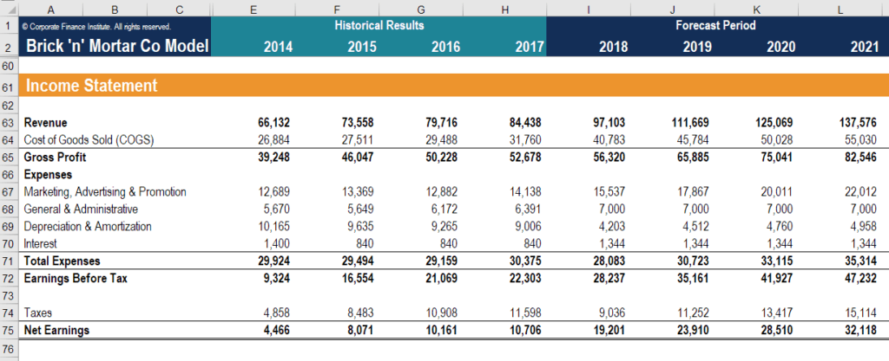

Earnings forecasting is a pivotal element of financial analysis and investment strategies, particularly in algorithmic trading. This practice involves predicting a company's future profitability by employing an array of data-driven models and methodologies. Accurate earnings forecasts are crucial, as they significantly influence investment decisions and market behaviors, ultimately guiding traders and investors in optimal resource allocation.

The reliability of earnings forecasts directly affects stock prices and investor sentiment. Therefore, financial analysts and algorithmic traders prioritize the development and refinement of forecasting models that can accurately predict future earnings. This task involves analyzing historical financial data and economic indicators to estimate a company's prospective financial performance.

A wide variety of models exist for earnings forecasting, ranging from traditional fundamental analysis to advanced machine learning algorithms. While fundamental analysis considers factors such as corporate financial health, industry conditions, and macroeconomic trends, contemporary methods increasingly incorporate machine learning to enhance precision. By leveraging large datasets, these models offer improved accuracy in predictions, providing valuable insights for traders.

This article outlines the importance of earnings forecasting in algorithmic trading, examining the methodologies utilized and the strategic advantages provided by accurate predictions. Furthermore, it addresses future trends and challenges faced within this dynamic field, emphasizing the ongoing advancement of AI and data analytics that continues to improve forecasting accuracy and efficiency in trading.

## Table of Contents

## Importance of Earnings Forecasting in Algo Trading

Earnings forecasts are critical in algorithmic trading due to their substantial influence on stock prices and investor behavior. Accurate forecasts of a company's earnings can lead to significant price movements as market participants adjust their expectations and strategies based on new information. These movements create opportunities for traders to generate returns by anticipating the direction and magnitude of price changes.

Algorithmic traders leverage earnings forecasts to devise strategies that capitalize on the volatility associated with earnings announcements. By integrating these forecasts into their trading algorithms, traders can preemptively adjust their positions to align with predicted market responses. This strategic positioning allows traders to maximize potential returns and minimize the risks associated with unexpected market movements.

Effective utilization of earnings forecasts in trading necessitates a comprehensive understanding of the underlying data and market drivers. Traders who possess a deep insight into the factors influencing earnings outcomes are better equipped to interpret forecast accuracy and incorporate this information into their decision-making processes. Robust risk management strategies are essential, as they enable traders to navigate the uncertainty inherent in financial markets.

The integration of earnings forecasts into trading algorithms involves analyzing historical data to identify patterns and correlations. Algorithms are often designed to react to specific signals or trends identified in the forecasts, adjusting trades and positions accordingly. This adaptive process enhances decision-making and improves the potential for profit in a highly competitive trading environment.

By exploiting the opportunities presented by earnings forecasts, algorithmic traders can achieve a more strategic and informed approach to trading, allowing them to maintain a competitive advantage in the financial markets.

## Methodologies in Earnings Forecasting

Earnings forecasting involves a comprehensive array of methodologies aimed at predicting a company's future profitability. These methodologies primarily include [fundamental analysis](/wiki/fundamental-analysis), technical analysis, statistical models, and [machine learning](/wiki/machine-learning) techniques. Each of these approaches offers distinct perspectives and tools for interpreting financial data and generating forecasts.

Fundamental analysis is a foundational approach that evaluates a company's intrinsic value through a detailed examination of its business model, financial statements, and broader economic indicators. This method involves assessing both qualitative and quantitative factors, such as revenue growth, profit margins, and market position. For instance, the analysis of a company's balance sheet reveals its asset-liability structure, while the income statement showcases earnings performance over a specific period. Economic indicators, such as interest rates and GDP growth, are also crucial in understanding macroeconomic factors influencing a company's business environment.

Statistical models offer another layer of sophistication in earnings forecasting. These models utilize historical earnings data to identify patterns and correlations, enabling the prediction of future earnings. Common techniques include time series analysis, such as ARIMA models, which account for trends and seasonal variations in earnings data. Regression analysis is also employed, building relationships between earnings and various independent variables to enhance prediction accuracy.

Machine learning techniques have advanced the field of earnings forecasting significantly, particularly through their ability to process large datasets and discern intricate patterns that traditional models might overlook. Machine learning models like neural networks, support vector machines, and ensemble methods such as random forests and gradient boosting are widely adopted. These models learn from historical data to make predictions about future outcomes. For example, neural networks, inspired by the structure of the human brain, consist of interconnected nodes (neurons) that process input data to make informed predictions. Python, a popular programming language, provides libraries such as TensorFlow and scikit-learn that are extensively used to implement these sophisticated algorithms.

The integration of these methodologies enables analysts to generate more robust and reliable earnings forecasts, which are crucial for informed decision-making in financial markets. The combination of traditional fundamental analysis with modern statistical and machine learning techniques facilitates a comprehensive approach to interpreting complex financial data, thereby enhancing forecast accuracy and investment outcomes.

## Implementation in Algorithmic Trading

Implementation of earnings forecasting in [algorithmic trading](/wiki/algorithmic-trading) encompasses several critical phases, namely data collection, model development, [backtesting](/wiki/backtesting), and real-time monitoring. Each component plays an integral role in the effectiveness and efficiency of trading strategies derived from earnings forecasts.

Data Collection:
The initial step involves sourcing and aggregating a comprehensive dataset, which serves as the foundation for all subsequent processes. Data types include historical financial statements, stock prices, macroeconomic indicators, and qualitative business information. Increasingly, [alternative data](/wiki/best-alternative-data) sources, such as social media sentiment and web traffic, are integrated to provide additional context and predictive value. To ensure the validity and reliability of forecasts, data cleaning and normalization processes are essential, addressing any issues with missing values, outliers, and inconsistencies.

Model Development:
In developing trading models, quantitative analysts employ a variety of statistical and machine learning techniques. Traditional statistical models, such as linear regression, persist in their relevance, but advanced machine learning methodologies, including neural networks and ensemble learning, are gaining prominence. These models are designed to identify and exploit patterns within data that may indicate future earnings performance. The iterative nature of model development requires continuous refinement, with parameter tuning and feature selection being crucial steps in optimizing model performance.

Backtesting:
Once models are developed, backtesting allows for simulation of trading strategies against historical data. This process assesses the potential profitability and risk of the strategies before live deployment. Backtesting involves the application of performance metrics such as Sharpe ratio, maximum drawdown, and the information ratio to evaluate the robustness of the models. Importantly, careful consideration is given to overfitting, ensuring models generalize well beyond the specific historical dataset they were trained on.

Real-Time Monitoring:
In the live market environment, real-time monitoring is essential to account for the dynamic nature of financial markets. Automated systems track model predictions and market conditions, enabling prompt adjustments to trading strategies. The integration of [artificial intelligence](/wiki/ai-artificial-intelligence) and machine learning empowers these systems to adapt quickly, optimizing decision-making processes as new data becomes available. The agility provided by AI-driven systems is particularly advantageous in exploiting transient opportunities and mitigating risks associated with sudden market shifts.

By adhering to these implementation phases, algorithmic traders can effectively harness earnings forecasts, improving the precision and responsiveness of their trading strategies. This structured approach not only maximizes potential returns but also enhances risk management and operational efficiency.

## Case Studies and Applications

Hedge funds and proprietary trading firms, such as Renaissance Technologies and Two Sigma, are at the forefront of utilizing earnings forecasting to enhance their quantitative strategies. These firms rely on sophisticated models to analyze vast datasets, aiming to generate accurate forecasts that inform their trading decisions. The ability to predict earnings with precision is crucial, as it enables these firms to identify undervalued or overvalued stocks, optimize portfolio allocations, and ultimately achieve superior returns. Such forecasting models often incorporate a blend of statistical techniques, machine learning algorithms, and real-time data analysis to remain adept in the fast-paced financial environment.

Retail investment platforms have democratized access to sophisticated forecasting tools, enabling individual investors to partake in data-driven decision-making. Platforms such as Robinhood and E*TRADE provide users with analytics and insights derived from earnings forecasts, assisting individual traders in refining their investment strategies. This access empowers retail investors to make more informed decisions, level the playing field, and potentially increase their trading success by aligning their strategies with those used by institutional investors.

Several case studies underscore the practical applications and strategic advantages of accurate earnings forecasting in varied trading scenarios. For instance, an analysis of Two Sigma's approach reveals the integration of machine learning models that enhance predictive accuracy and adaptability. By leveraging extensive historical data and alternative datasets, Two Sigma has been able to refine its forecasting capabilities, informing both its risk management processes and strategic investment moves.

Furthermore, the experiences of retail investors using platforms equipped with robust forecasting tools highlight the benefits across diverse trading contexts. Those who leverage predictive analytics can often identify market trends and opportunities earlier, allowing them to strategically enter or [exit](/wiki/exit-strategy) positions ahead of market-wide movements.

In summary, earnings forecasting is a critical element in modern trading strategies, benefiting both institutional and retail participants. As these methodologies continue to evolve, driven by advancements in machine learning and big data analytics, the potential for improved trading outcomes presents a compelling case for the continued investment in and development of accurate earnings forecasting capabilities.

## Challenges in Earnings Forecasting

Data quality and availability present significant challenges in earnings forecasting, impacting the accuracy of forecasts due to inconsistencies and gaps in the data. Reliable earnings prediction models require high-quality datasets, which can be difficult to obtain due to the varied nature of financial reporting across companies and jurisdictions. Discrepancies in accounting practices and the timeliness of financial disclosures further complicate the ability to gather consistent and comprehensive data. The accuracy of an earnings forecast is inherently linked to the quality of input data, as errors or omissions can lead to misleading conclusions and suboptimal trading decisions.

Market [volatility](/wiki/volatility-trading-strategies) represents another formidable challenge, as fluctuations in market conditions can affect the validity of strategies based on earnings forecasts. Rapid changes in market sentiment and external economic factors can lead to significant deviations from predicted earnings outcomes. Furthermore, such volatility can exacerbate the limitations of models that rely on historical data, as past trends may not accurately predict future performance in turbulent market conditions.

Regulatory concerns also play a critical role in shaping the landscape of earnings forecasting. Regulatory changes can introduce uncertainty and necessitate adjustments to forecasting models. Compliance with new regulations requires additional resources and adaptations to existing models, potentially leading to delays and increased complexity in the forecasting process.

Model overfitting is a pertinent issue that can hinder forecast reliability and trading performance. Overfitting occurs when a model learns the noise in the training data rather than the underlying pattern, resulting in a model that performs well on historical data but poorly on unseen data. To address this, practitioners employ techniques such as cross-validation, regularization, and pruning to ensure that models generalize well beyond the specific datasets used in training.

Ongoing advances in big data and AI technologies are central to overcoming these challenges and enhancing forecasting methodologies. The application of AI techniques, such as natural language processing and [deep learning](/wiki/deep-learning), enables the extraction of actionable insights from unstructured data, offering richer context for earnings forecasts. Furthermore, the integration of alternative data sources, such as social media sentiment and satellite imagery, can provide a more nuanced view of market conditions and contribute to more robust predictions.

As forecasting models become more sophisticated, the need for computational resources increases. Enhanced computational power facilitates the processing of voluminous datasets and the implementation of complex machine learning algorithms, further refining model accuracy and responsiveness to market changes. The ongoing evolution of AI and data analytics tools holds promise for improving the reliability of earnings forecasts, helping traders and analysts navigate the complexities of rapidly changing financial markets.

## Future Trends

The future of earnings forecasting in algorithmic trading is poised for transformative advancements driven by the integration of sophisticated artificial intelligence (AI) models and enhanced computational power. These innovations promise to refine the precision of earnings forecasts, capitalizing on the capabilities of machine learning algorithms, particularly deep learning models. By employing architectures such as recurrent neural networks (RNN) and [long short](/wiki/equity-long-short)-term memory networks (LSTM), traders can capture temporal dependencies and complex patterns within financial data, increasing the accuracy of predictions.

The expansion of datasets and the inclusion of alternative data sources, such as social media sentiment, satellite imagery, and web traffic analytics, are crucial in uncovering deeper insights and enhancing forecast reliability. These data sources provide non-traditional information streams that, when analyzed in conjunction with structured financial data, augment the predictive power of models. The use of natural language processing (NLP) techniques on news articles and earnings call transcripts can further refine sentiment analysis, offering real-time insights into market sentiment and potential price movements.

As computational technologies evolve, algorithmic trading strategies are expected to become more dynamic and responsive to market changes. Real-time data processing and high-frequency trading will benefit from increased computational speeds and reduced latency, enabling traders to react swiftly to new information. Quantum computing, though still in a nascent stage, holds the potential to revolutionize algorithmic trading by handling complex calculations and optimization problems at unprecedented speeds.

The rise of cloud computing and distributed systems also plays a significant role in this evolution, offering scalable solutions for processing vast amounts of data quickly and efficiently. This scalability allows for more robust backtesting and validation of trading models, ensuring that strategies can adapt to evolving market conditions.

In summary, the integration of advanced AI and computational technologies heralds a new era for earnings forecasting within algorithmic trading. By leveraging comprehensive data sources and cutting-edge computational methods, traders can gain a significant advantage, executing more informed and agile strategies in an ever-changing financial landscape.

## Conclusion

Earnings forecasting serves as a vital component in algorithmic trading, fundamentally shaping trading strategies and driving informed investment decisions. Its dynamic nature stems from the complex interplay of economic indicators, financial data, and evolving market conditions. As algorithmic trading becomes more prevalent, the demand for accurate and timely earnings forecasts continues to grow.

The advancement of artificial intelligence and data analytics tools plays a crucial role in enhancing the accuracy and efficiency of earnings forecasting. Machine learning algorithms and data mining techniques enable the processing of vast amounts of data, uncovering patterns and trends that may not be immediately apparent through conventional analysis. These technologies improve the precision of forecasts, allowing traders to optimize their strategies and capitalize on market opportunities.

Traders and analysts who effectively incorporate these advanced methodologies into their operations are positioned to gain a competitive advantage in the financial markets. By leveraging AI-driven insights and sophisticated analytical techniques, market participants can respond swiftly to changes, manage risks more effectively, and improve their decision-making processes. As computational capabilities continue to expand, the integration of advanced forecasting tools will likely become increasingly sophisticated, paving the way for more dynamic and responsive trading strategies.

In conclusion, the integration of earnings forecasting into algorithmic trading is both a challenge and an opportunity. As the tools and techniques continue to evolve, market participants who adapt and innovate will sustain their competitive edge, capitalizing on the transformative potential of enhanced forecasting methodologies.

## References & Further Reading

[1]: ["Advances in Financial Machine Learning"](https://www.amazon.com/Advances-Financial-Machine-Learning-Marcos/dp/1119482089) by Marcos Lopez de Prado

[2]: ["Machine Learning for Algorithmic Trading"](https://github.com/stefan-jansen/machine-learning-for-trading) by Stefan Jansen

[3]: ["Quantitative Trading: How to Build Your Own Algorithmic Trading Business"](https://www.amazon.com/Quantitative-Trading-Build-Algorithmic-Business/dp/1119800064) by Ernest P. Chan

[4]: Hyndman, R. J., & Athanasopoulos, G. (2018). ["Forecasting: Principles and Practice."](https://otexts.com/fpp2/) OTexts.

[5]: Tsay, R. S. (2010). ["Analysis of Financial Time Series."](https://onlinelibrary.wiley.com/doi/book/10.1002/9780470644560) John Wiley & Sons.

[6]: Bishop, C. M. (2006). ["Pattern Recognition and Machine Learning."](https://link.springer.com/book/9780387310732) Springer.