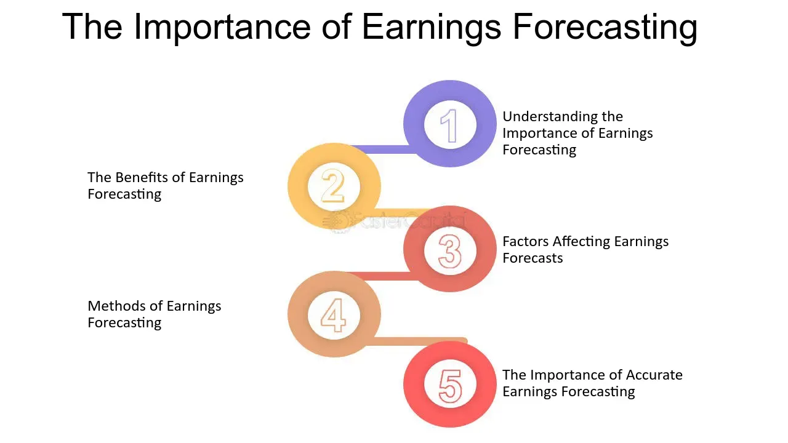

## Table of Contents

## What is earnings forecasting?

Earnings forecasting is when experts try to guess how much money a company will make in the future. They look at things like how the company has done in the past, what is happening in the economy, and what the company says it will do. This helps investors decide if they want to buy or sell the company's stock.

These forecasts are important because they help people make smart choices about where to put their money. If a forecast says a company will make a lot more money next year, more people might want to buy its stock, hoping to make a profit. But, forecasting is not always right because the future can be hard to predict. Things like new laws, natural disasters, or changes in what people want to buy can change a company's earnings.

## Why is earnings forecasting important for businesses?

Earnings forecasting is important for businesses because it helps them plan for the future. When a business knows how much money it might make, it can decide how much to spend on things like new projects, hiring more workers, or buying new equipment. This planning helps the business grow and stay healthy. If a business thinks it will make less money, it might decide to save money by not starting new projects or by cutting costs in other ways.

Forecasting also helps businesses talk to investors and lenders. When a business can show that it expects to make more money in the future, investors might want to buy its stock, hoping to make a profit. Lenders might also be more willing to give the business a loan if they believe the business will be able to pay it back. This can help the business get the money it needs to keep running and growing. But, if the forecasts are wrong, it can cause problems, so businesses need to be careful and use the best information they can get.

## What are the basic methods used in earnings forecasting?

One basic method for earnings forecasting is the qualitative approach. This method uses opinions and guesses from people who know a lot about the company and the market. They might talk to managers, customers, or industry experts to get a feel for what might happen. This approach is good when there isn't a lot of past data to look at, like with a new company. But it can be tricky because people's guesses can be wrong.

Another method is the quantitative approach, which uses numbers and math. This method looks at past earnings and other financial data to find patterns. It uses these patterns to predict what might happen in the future. Common tools in this approach are things like time series analysis, where you look at how earnings have changed over time, and regression analysis, which tries to see how different factors affect earnings. This method is good when there is a lot of data, but it can miss big changes that are hard to predict with numbers alone.

Sometimes, businesses use a mix of both qualitative and quantitative methods. This is called a combined approach. By using both opinions and numbers, businesses can get a fuller picture of what might happen. This can help make better forecasts because it takes into account both what the data says and what people think. But it can also be more complicated and take more time to do.

## How does historical data influence earnings forecasts?

Historical data is really important for making earnings forecasts. It gives us a record of how much money a company made in the past. By looking at this data, we can see patterns and trends. For example, if a company's earnings have been going up every year, we might guess they will keep going up. This helps us make smarter guesses about the future because we have something to base our predictions on.

But, historical data isn't perfect. It can't tell us everything about what will happen next. Sometimes big changes happen that no one saw coming, like a new law or a big storm. These things can change how much money a company makes. So, while historical data is a good starting point, we also need to think about other stuff that might affect the company's earnings in the future.

## What role do economic indicators play in earnings forecasting?

Economic indicators are important pieces of information that help us understand what's happening in the economy. They can tell us things like how many people have jobs, how much people are spending, and how fast the economy is growing. When we make earnings forecasts, these indicators help us guess how well a company might do. For example, if more people have jobs, they might spend more money, which could be good for companies that sell things to people.

But, economic indicators are not perfect. They give us a general idea of what's going on, but they can't predict everything. Sometimes the economy can change quickly because of things like new laws or big events around the world. So, while economic indicators are helpful, we also need to think about other things that might affect a company's earnings. This way, our forecasts can be as accurate as possible.

## How can qualitative factors affect earnings forecasts?

Qualitative factors are things that are not easy to measure with numbers, but they can still have a big impact on how much money a company makes. These can include things like how people feel about the company's products, changes in what people want to buy, or new laws that affect the business. For example, if people start to think that a company's products are not good anymore, they might stop buying them, which would hurt the company's earnings. Or, if a new law makes it harder for the company to do business, that could also lower its earnings.

Because qualitative factors are hard to measure, they can make earnings forecasts tricky. People who make these forecasts have to talk to experts, customers, and managers to get a good idea of what might happen. They need to listen to what people are saying and try to guess how these things might change the company's future. Even though it's hard to be exact with qualitative factors, they are important to think about because they can have a big effect on how well a company does.

## What are the common challenges faced when forecasting earnings?

Forecasting earnings is hard because the future is not easy to predict. One big problem is that things can change quickly. For example, a new law might come out that makes it harder for a company to make money. Or, something unexpected like a big storm could hurt a company's business. These surprises can make it tough to guess how much money a company will make.

Another challenge is that there are so many things to think about. You need to look at numbers like how much money the company made in the past and what's happening in the economy. But you also need to consider things that are harder to measure, like what people think about the company's products or what new trends might affect the business. Trying to put all these pieces together to make a good guess is really tricky.

Even with all these challenges, people still try to forecast earnings because it helps make important decisions. But it's important to remember that these forecasts are just guesses and they can be wrong. That's why it's good to keep checking and updating the forecasts as new information comes in.

## How do analysts use financial ratios in earnings forecasting?

Analysts use financial ratios to help them guess how much money a company might make in the future. These ratios are numbers that show different parts of a company's money situation, like how much debt it has or how well it makes money from what it sells. For example, the price-to-earnings ratio can tell analysts if a company's stock is a good deal compared to its earnings. By looking at these ratios over time, analysts can spot patterns and trends that help them predict future earnings.

But, financial ratios are just one piece of the puzzle. They need to be used along with other information, like what's happening in the economy or what people think about the company's products. Ratios can give a good starting point, but they don't tell the whole story. For example, a high debt-to-equity ratio might suggest a company is risky, but if the company has a strong plan to pay off its debts, the future might not be as bad as the ratio suggests. So, analysts combine financial ratios with other data to make their earnings forecasts as accurate as possible.

## What advanced statistical models are used for more accurate earnings predictions?

Advanced statistical models help make earnings predictions more accurate by using fancy math to look at lots of data. One popular model is called regression analysis. This model looks at how different things, like the economy or how much people are spending, affect a company's earnings. By understanding these relationships, the model can guess how much money the company might make in the future. Another model is time series analysis, which looks at how a company's earnings have changed over time. It uses this information to spot patterns and make predictions based on those patterns.

Another advanced model is [machine learning](/wiki/machine-learning). This model can learn from lots of data to find patterns that might be hard for people to see. For example, it can look at things like news articles or social media to guess how people feel about a company, which can affect its earnings. Machine learning models can keep getting better as they see more data, which makes their predictions more accurate over time. But, even with these advanced models, it's important to remember that the future can be hard to predict, and these models are just tools to help make better guesses.

## How does industry-specific knowledge impact the accuracy of earnings forecasts?

Industry-specific knowledge is really important for making accurate earnings forecasts. When someone knows a lot about a certain industry, they understand things like what the competition is doing, what new laws might affect the business, and what customers want. This kind of information helps them make better guesses about how much money a company in that industry might make. For example, if someone knows that a new technology is going to change how people buy things in the retail industry, they can predict how that might affect a retail company's earnings.

Even though industry-specific knowledge is helpful, it's not the only thing that matters. It needs to be used along with other information, like what's happening in the economy or what the company's past earnings look like. Sometimes, knowing a lot about an industry can make someone too focused on certain details and miss bigger changes that could affect earnings. So, while industry-specific knowledge can make forecasts more accurate, it's important to look at the whole picture and not just one part of it.

## What are the implications of inaccurate earnings forecasts for a company?

When a company's earnings forecasts are wrong, it can cause big problems. If the forecast says the company will make more money than it actually does, investors might get upset. They might sell their stocks, which can make the stock price go down. This can make it harder for the company to get money it needs to grow or even to keep running. Also, if the forecast is too high, the company might spend too much money on new projects or hiring, thinking they will have more money than they actually do. This can lead to financial trouble if they can't pay for everything.

On the other hand, if the forecast says the company will make less money than it actually does, it can miss out on chances to grow. The company might not start new projects or hire more people because it thinks it won't have enough money. This can slow down the company's growth and make it fall behind its competitors. Plus, if investors see that the company is being too careful with its forecasts, they might think the company isn't doing well and decide to invest their money somewhere else. So, getting earnings forecasts right is really important for a company's future.

## How can machine learning and AI enhance the process of earnings forecasting?

Machine learning and AI can make earnings forecasting better by looking at a lot of data really quickly. They can find patterns and trends that people might miss. For example, AI can look at things like news articles, social media posts, and even the weather to guess how people feel about a company. This can help predict how much money the company might make because people's feelings can affect what they buy. Machine learning models can also learn from past mistakes and get better over time, making their guesses more accurate as they see more data.

But, even though machine learning and AI are powerful tools, they're not perfect. They still need people to help them understand what's important and what's not. For example, if there's a big change in the economy or a new law that affects a company, AI might not know right away how big of a deal that is. That's why it's important for people to work with AI, using their knowledge of the company and the industry to make the best guesses about future earnings. By combining the strengths of AI with human understanding, companies can make their earnings forecasts as good as possible.

## References & Further Reading

[1]: ["Advances in Financial Machine Learning"](https://www.amazon.com/Advances-Financial-Machine-Learning-Marcos/dp/1119482089) by Marcos Lopez de Prado

[2]: ["Machine Learning for Algorithmic Trading"](https://github.com/stefan-jansen/machine-learning-for-trading) by Stefan Jansen

[3]: ["Quantitative Trading: How to Build Your Own Algorithmic Trading Business"](https://www.amazon.com/Quantitative-Trading-Build-Algorithmic-Business/dp/1119800064) by Ernest P. Chan

[4]: Hyndman, R. J., & Athanasopoulos, G. (2018). ["Forecasting: Principles and Practice."](https://otexts.com/fpp2/) OTexts.

[5]: Tsay, R. S. (2010). ["Analysis of Financial Time Series."](https://onlinelibrary.wiley.com/doi/book/10.1002/9780470644560) John Wiley & Sons.

[6]: Bishop, C. M. (2006). ["Pattern Recognition and Machine Learning."](https://link.springer.com/book/9780387310732) Springer.