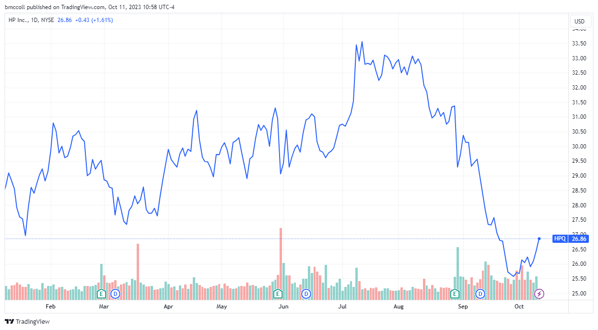

Earnings guidance and its predictive accuracy are pivotal in financial forecasting and algorithmic trading. This guidance comprises projections made by companies regarding their anticipated financial performance, including parameters like expected revenue, profit margins, and earnings per share. These insights are integral for market participants, providing them with a framework to anticipate future company performance and adjust their investment strategies accordingly.

In recent years, advancements in technology and data analysis have intensified the incorporation of earnings guidance into algorithmic trading. Algorithms, equipped with sophisticated data processing capabilities, leverage guidance data to identify patterns and make informed trading decisions. This integration creates opportunities for enhanced trading strategies, but also introduces challenges, such as ensuring data accuracy and managing market volatility.

Investors and analysts rely heavily on earnings guidance to shape their expectations and adjust their market strategies. Effective use of this information can lead to optimized decision-making, impacting stock market dynamics and influencing investor behavior. However, the predictive accuracy of earnings guidance must be scrutinized, as discrepancies between projections and actual performance can affect investor confidence and result in significant market fluctuations.

Understanding earnings guidance's nuances and the factors affecting its predictive accuracy is crucial for both traditional investors and those engaged in algorithmic trading. This understanding enables market participants to better navigate the complexities of modern financial markets and adapt to the evolving landscape of investment strategies and trading technologies.

## Table of Contents

## Earnings Guidance and Its Role in Financial Markets

Earnings guidance consists of companies' forward-looking statements about their anticipated financial performance, typically released alongside quarterly earnings reports. These projections serve as essential tools for investors and analysts, offering valuable insights into a company's expected revenue streams, profit margins, and general business vitality. By providing a financial forecast, companies create a roadmap that can influence investment decisions and strategy formulations.

In the framework of financial markets, regulatory mandates such as the Fair Disclosure (Regulation FD) play a critical role in the dissemination of earnings guidance. Regulation FD obligates publicly traded companies in the United States to disclose material information broadly, ensuring all investors have equal access to guidance releases. This regulation aims to eliminate informational asymmetries, supporting market efficiency by disseminating earnings projections in a transparent manner.

The influence of earnings guidance on market dynamics is profound. By directly shaping investor expectations, guidance announcements can trigger significant market movements. A projection that aligns with or exceeds investor expectations typically results in favorable market reactions, often characterized by stock price appreciations. Conversely, guidance that falls short of expectations can lead to negative reactions and result in sharp declines in stock prices. Within this context, earnings guidance helps to temper market speculations, providing a structured framework around which market participants can adjust their expectations and make informed decisions.

In summary, earnings guidance is a crucial element in financial markets, underpinning investor strategies and impacting stock prices. Its regulatory-backed transparency ensures that the information disseminated is equitable, allowing for an informed investment landscape where market movements are influenced by the anticipative signals provided in earnings projections. As such, earnings guidance remains integral to market operations and investor decision-making processes.

## Predictive Accuracy of Earnings Guidance

The predictive accuracy of earnings guidance is a fundamental concern for investors, significantly affecting investor confidence and market [volatility](/wiki/volatility-trading-strategies). Accurate forecasts from companies tend to foster positive market sentiment, attracting investors and stabilizing stock prices. Conversely, when there is a discrepancy between projected earnings and actual performance, it can lead to abrupt market corrections, often resulting in sharp declines in stock prices and heightened volatility.

There are several factors influencing the predictive accuracy of earnings guidance. Firstly, the management's comprehension of market conditions plays a crucial role. A robust understanding helps in making informed predictions that align closely with actual future performance. Additionally, strategic business decisions, such as mergers, acquisitions, and product launches, can also affect the accuracy of earnings guidance. These decisions often [carry](/wiki/carry-trading) inherent uncertainties, and their outcomes may deviate from initial expectations, impacting the reliability of the guidance provided.

External economic factors, such as changes in interest rates, inflation, and geopolitical events, add another layer of complexity. These factors can be unpredictable and may not be fully incorporated into earnings forecasts. As a result, even well-considered projections can be thrown off [course](/wiki/best-algorithmic-trading-courses) by external economic shifts, leading to inaccuracies.

Furthermore, there is an ongoing challenge in distinguishing between genuine optimistic forecasts and those crafted to manipulate market perceptions. Companies may, at times, present an overly positive outlook to boost stock prices, knowing that such strategies might artificially inflate investor confidence. This makes it critical for investors and analysts to critically analyze the provided guidance, considering both qualitative and quantitative assessments to determine its veracity.

In summary, while earnings guidance is a valuable tool for investors, the accuracy of these projections is contingent upon various internal and external factors that require careful scrutiny and thoughtful interpretation.

## Algorithmic Trading: Leveraging Earnings Guidance

Algorithmic trading employs automated systems to evaluate earnings guidance, integrating this information with historical data and real-time events. These systems rely on complex algorithms capable of processing vast datasets, enabling the prediction of market trends through varying analysis techniques such as fundamental, quantitative, and sentiment analysis.

Fundamental analysis involves examining financial statements and economic indicators to assess a company's fair value. By incorporating earnings guidance, these algorithms can adjust their models to reflect anticipated changes in a company's performance metrics. Quantitative analysis uses statistical models and historical data to predict market behavior, where algorithms can identify patterns and correlations that may not be immediately apparent to human traders.

Sentiment analysis, on the other hand, interprets and quantifies market sentiment by analyzing news articles, social media mentions, and other text-based data. This type of analysis can provide insights into the prevailing attitudes of investors, potentially affecting how earnings guidance might be received.

Machine learning and AI techniques further enhance the ability to interpret earnings guidance data. These technologies employ self-improving algorithms that learn from historical data to recognize complex patterns and predict market reactions more accurately. Common [machine learning](/wiki/machine-learning) models used in this context include regression analysis, decision trees, and neural networks.

Trading strategies often involve pre-emptive actions based on predicted earnings outcomes. For instance, if an algorithm anticipates a positive earnings report leading to an increase in stock price, it might execute buy orders ahead of the official announcement. Conversely, if a negative outcome is predicted, the algorithms might sell the stock before the price decline intensifies. This strategy aims to find optimal entry and [exit](/wiki/exit-strategy) points within the market, maximizing gains and minimizing losses.

In summary, the synergy between earnings guidance and [algorithmic trading](/wiki/algorithmic-trading) models can significantly leverage automated systems’ capacity to predict and capitalize on market movements, providing traders with a competitive edge in financial markets.

## Challenges and Opportunities in Integrating Guidance with Algo Trading

Integrating earnings guidance into algorithmic trading offers significant opportunities but also presents several challenges. The primary challenge is data quality and availability. Accurate and timely data are crucial for the effectiveness of trading algorithms and prediction accuracy. Earnings guidance data often come from diverse sources, such as company filings, press releases, and financial reports, each with varying degrees of reliability and timeliness. Discrepancies in data can lead to flawed algorithmic interpretations, resulting in suboptimal trading decisions.

Regulatory concerns also pose substantial challenges. Regulations such as the Fair Disclosure requirement ensure that all investors have equal access to a company’s financial disclosures, including earnings guidance. This regulation aims to prevent insider trading and maintains market fairness. However, the evolving regulatory landscape can impose constraints on the use of earnings guidance within algorithmic trading strategies. Compliance with these regulations often necessitates robust risk management frameworks to ensure trading activities remain within legal boundaries.

Market volatility further complicates the integration of earnings guidance into algorithmic trading. During periods of high volatility, markets tend to react more intensely to earnings guidance updates, leading to rapid price fluctuations. This increased unpredictability can hinder the performance of trading algorithms if they are not equipped to handle such rapid changes.

Despite these challenges, advances in big data analytics and computing power continue to enhance what is achievable in predictive trading. With the development of machine learning and [artificial intelligence](/wiki/ai-artificial-intelligence), algorithms can now process and analyze vast datasets more efficiently. They can incorporate a wide array of data inputs, including historical data, sentiment analysis, and real-time news, to improve the accuracy of predictions based on earnings guidance.

For example, machine learning models can be trained to recognize patterns and correlations that may not be immediately apparent through traditional analysis methods. The use of neural networks and [deep learning](/wiki/deep-learning) algorithms allows for the processing of complex, nonlinear relationships within financial data, potentially leading to more accurate predictions. Python libraries such as TensorFlow and PyTorch offer tools for building and training such models.

Incorporating [alternative data](/wiki/best-alternative-data) sources, such as social media sentiment and consumer behavior trends, further enhances the robustness of these predictive models. While challenges remain, the continuous evolution of technology provides a promising outlook for the integration of earnings guidance into algorithmic trading, pushing the boundaries of what can be achieved in terms of prediction accuracy and trading efficiency.

## Future Trends and Implications

As technological advancements continue to reshape the financial landscape, the role of artificial intelligence (AI) and deep learning in earnings forecasting is anticipated to significantly expand. These technologies enhance predictive capabilities, allowing for more nuanced analysis of market trends and company performance. AI-driven models can process and learn from vast datasets, improving the accuracy of earnings forecasts and enabling traders to make more informed decisions.

The integration of alternative data sources complements traditional datasets, providing richer insights into market behaviors. Sources such as social media sentiment, satellite imagery, and consumer purchasing patterns offer valuable inputs that can help traders refine their understanding of market dynamics. The utilization of these diverse data types allows for a more holistic view of market sentiment and economic indicators, which can be crucial in predicting earnings outcomes and market shifts.

Innovation in algorithmic trading is likely to center around improving model accuracy and adapting to dynamic market conditions. Machine learning algorithms, particularly those employing neural networks, are expected to evolve to better handle the complexities of real-time market data. Continuous learning frameworks and adaptive algorithms will enable trading systems to adjust strategies rapidly in response to changing market parameters, potentially leading to more robust trading outcomes.

Understanding the interplay between earnings guidance, financial forecasting, and algorithmic trading is essential for anticipating market shifts and maximizing returns. As AI technologies and data analytics become more sophisticated, market participants who effectively leverage these tools will be better positioned to capitalize on market opportunities and mitigate risks. The ability to predict market trends with higher precision and respond strategically will be key to success in this ever-evolving financial environment.

## Conclusion

Earnings guidance continues to be a cornerstone of financial forecasting, influencing both investor strategies and market movements. Its significance is amplified when integrated with algorithmic trading, offering considerable potential for optimizing trading performance and managing risks. By leveraging earnings guidance, algorithmic systems can effectively interpret market signals and execute trades that align with predicted outcomes, enhancing both speed and accuracy in decision-making.

For investors and traders, staying informed about technological advancements and methodological improvements is essential. The continuous evolution of artificial intelligence and machine learning techniques presents unprecedented opportunities to refine the analysis and interpretation of earnings guidance. These technological advancements improve the capability to process vast datasets and enhance the precision of predictive algorithms, making it crucial for market participants to adapt to these innovations.

Ultimately, the ability to predict market trends and respond promptly is the key determinant of success in the evolving landscape of financial trading. As financial markets become more dynamic and complex, the integration of earnings guidance with advanced trading algorithms will remain a critical component of effective trading strategies, ensuring that investors can navigate market fluctuations and capitalize on emerging opportunities. Embracing these tools and techniques will not only improve the accuracy of forecasts but also provide a strategic advantage in achieving sustainable returns.

## References & Further Reading

[1]: ["Advances in Financial Machine Learning"](https://www.amazon.com/Advances-Financial-Machine-Learning-Marcos/dp/1119482089) by Marcos Lopez de Prado

[2]: ["Machine Learning for Algorithmic Trading"](https://www.amazon.com/Machine-Learning-Algorithmic-Trading-alternative/dp/1839217715) by Stefan Jansen

[3]: ["Quantitative Trading: How to Build Your Own Algorithmic Trading Business"](https://www.amazon.com/Quantitative-Trading-Build-Algorithmic-Business/dp/1119800064) by Ernest P. Chan

[4]: ["Evidence-Based Technical Analysis: Applying the Scientific Method and Statistical Inference to Trading Signals"](https://www.amazon.com/Evidence-Based-Technical-Analysis-Scientific-Statistical/dp/0470008741) by David Aronson

[5]: Bergstra, J., Bardenet, R., Bengio, Y., & Kégl, B. (2011). ["Algorithms for Hyper-Parameter Optimization."](https://dl.acm.org/doi/10.5555/2986459.2986743) Advances in Neural Information Processing Systems 24.