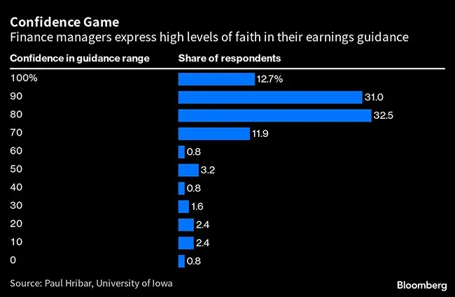

## Table of Contents

## What is earnings guidance?

Earnings guidance is when a company tells investors how much money they think they will make in the future. This helps investors decide if they want to buy or sell the company's stock. Companies usually give this information for the next quarter or the whole year. It's like a prediction, but it's based on what the company knows about its business right now.

Sometimes, earnings guidance can change. If something unexpected happens, like a new law or a big event, the company might update its guidance. This can make the stock price go up or down, depending on if the new guidance is better or worse than before. Investors pay close attention to these updates because they want to know if their investment is doing well.

## Why do companies provide earnings guidance?

Companies provide earnings guidance to help investors understand how much money they expect to make in the future. This information helps investors decide if they want to buy, hold, or sell the company's stock. By sharing their predictions, companies can make their stock more attractive to investors. If investors think the company will do well, they might want to invest more money in it.

Earnings guidance also helps companies manage expectations. If a company thinks it will make less money than before, it can warn investors ahead of time. This can prevent big drops in the stock price when the actual earnings come out. On the other hand, if a company expects to do better than expected, it can boost investor confidence and possibly increase the stock price. Overall, earnings guidance is a way for companies to communicate with investors and keep them informed about the business's future.

## How is earnings guidance typically communicated?

Companies usually share their earnings guidance in a few common ways. One way is through press releases. They write up a simple message and send it out to the public and news outlets. Another way is during earnings calls, where company leaders talk to investors and analysts on the phone. They might say, "We expect to make this much money next quarter," and then answer questions.

Sometimes, companies also put their earnings guidance in official reports called SEC filings. These are documents that companies have to send to the government, and investors can read them online. No matter how it's shared, the goal is to make sure everyone gets the same information at the same time. This helps keep things fair for all investors.

## What are the different types of earnings guidance?

There are a few different types of earnings guidance that companies might give. One type is revenue guidance, where a company tells investors how much money they expect to make from sales. Another type is earnings per share guidance, which is how much profit the company expects to make for each share of stock. Some companies also give EBITDA guidance, which stands for earnings before interest, taxes, depreciation, and amortization. This type of guidance looks at the company's profit before taking out certain expenses.

Companies can also give qualitative guidance, which is more about words than numbers. They might say things like, "We expect sales to grow a little bit," or "We think our costs will stay the same." This type of guidance gives a general idea of what the company thinks will happen, but it's not as specific as the numbers in revenue or earnings per share guidance. Each type of guidance helps investors understand different parts of the company's future performance.

## How does earnings guidance affect stock prices?

Earnings guidance can have a big impact on stock prices. When a company says it expects to make more money than people thought, investors get excited. They think the stock is a good investment, so they buy more of it. This demand makes the stock price go up. On the other hand, if a company says it will make less money than expected, investors might get worried. They might sell their shares, which can make the stock price go down.

Sometimes, the effect of earnings guidance on stock prices can be even bigger if it's a surprise. If a company has been doing well and suddenly says it won't make as much money as before, the stock price might drop a lot. But if a company has been struggling and then gives good guidance, the stock price might jump up a lot. Investors are always trying to guess what will happen next, so any new information can change what they think and how they act.

## What is predictive accuracy in the context of earnings guidance?

Predictive accuracy in earnings guidance means how close a company's predictions about its future earnings are to the actual results. When a company says it expects to make a certain amount of money, investors want to know if that guess is going to be right. If the company's prediction is very close to what actually happens, then the predictive accuracy is high. If the prediction is way off, then the predictive accuracy is low.

Companies work hard to make their earnings guidance as accurate as possible because it helps build trust with investors. If a company is always right about its future earnings, investors feel more confident about putting their money into the company's stock. But if a company keeps getting it wrong, investors might start to doubt the company's predictions and might not want to invest as much. So, having high predictive accuracy is really important for a company's relationship with its investors.

## How can the accuracy of earnings guidance be measured?

The accuracy of earnings guidance can be measured by comparing the company's predictions to what actually happens. For example, if a company says it will make $100 million next quarter and it ends up making $101 million, the prediction was pretty accurate. To figure out how accurate the guidance was, people often use something called the "error rate." This is the difference between the predicted earnings and the actual earnings, divided by the actual earnings. The smaller the error rate, the more accurate the guidance.

Another way to measure accuracy is to look at how often the company's predictions are close to the real numbers over time. If a company's guidance is usually within a small range of the actual earnings, it shows that their predictions are reliable. This is important because investors want to trust that the company knows what it's talking about. By keeping track of these predictions and comparing them to the real results, people can see if the company is getting better or worse at making accurate forecasts.

## What factors influence the predictive accuracy of earnings guidance?

Several things can affect how good a company is at predicting its future earnings. One big [factor](/wiki/factor-investing) is the company's business itself. If a company sells things that people always need, like food or medicine, it's easier to guess how much money they will make. But if a company sells things that go in and out of style, like clothes or gadgets, it's harder to predict because people's tastes can change quickly. Also, the company's experience matters. Companies that have been around for a long time and have good data and smart people working for them usually make better guesses about the future.

Another thing that can influence the accuracy of earnings guidance is what's happening in the world. Big events like new laws, natural disasters, or changes in the economy can mess up a company's plans. For example, if a new law makes it harder for a company to do business, it might not make as much money as it thought. Or if there's a big storm that stops people from buying things, that can hurt a company's earnings too. Companies try to think about these things when they make their predictions, but it's hard to guess everything that might happen. So, even the best companies can sometimes get their earnings guidance wrong because the world is always changing.

## How do analysts use earnings guidance in their forecasts?

Analysts use earnings guidance to help them make their own predictions about a company's future. When a company gives its earnings guidance, it's like a starting point for analysts. They look at the company's predictions and then add their own thoughts based on other information they know. This might include things like how the whole industry is doing, what the economy is like, and any new news or events that could affect the company. By mixing the company's guidance with their own research, analysts can come up with a forecast that they think is more accurate.

Sometimes, analysts might think a company's guidance is too high or too low. If they think the company is being too hopeful, they might predict lower earnings. If they think the company is being too careful, they might predict higher earnings. Analysts share their forecasts with investors, who then use this information to decide if they want to buy, sell, or keep the company's stock. So, earnings guidance is a big part of how analysts do their job and help investors make choices.

## What are the challenges companies face in providing accurate earnings guidance?

Companies face many challenges when trying to give accurate earnings guidance. One big challenge is that the future is hard to predict. Even with a lot of data and smart people, unexpected things can happen. For example, a new law might change how a company can do business, or a big storm might stop people from buying things. These surprises can make a company's predictions wrong, even if they did their best to guess right.

Another challenge is that companies have to balance being honest with keeping investors happy. If a company says it will make less money than expected, the stock price might go down, and investors might get upset. But if the company says it will make more money than it really can, and then misses its target, investors might lose trust. So, companies have to be careful about what they say and make sure their guidance is as accurate as possible, even though it's really hard to get it exactly right.

## How has the practice of providing earnings guidance evolved over time?

The practice of providing earnings guidance has changed a lot over the years. In the past, companies didn't always share their predictions with investors. But as more people started investing in stocks, companies realized that giving guidance could help keep investors happy and make their stock more attractive. So, more and more companies started to share their earnings predictions, especially in the late 20th century. This became a common practice, and companies would give guidance for the next quarter or the whole year.

Over time, though, some companies started to think that giving guidance was too hard and could cause problems. If their predictions were wrong, it could make investors upset and hurt the stock price. So, some big companies, like General Electric, stopped giving guidance altogether. Others started to give less specific guidance, like saying they expect sales to grow a little bit instead of giving exact numbers. Today, some companies still give detailed guidance, while others focus more on long-term goals and less on short-term predictions. This shows that the practice of giving earnings guidance is still changing as companies try to find the best way to communicate with investors.

## What are the best practices for improving the predictive accuracy of earnings guidance?

To improve the predictive accuracy of earnings guidance, companies need to use good data and smart analysis. They should look at past numbers and see what happened before. This helps them guess what might happen next. Companies should also keep an eye on what's going on in the world, like new laws or big events, because these can change their business. By using all this information, companies can make better predictions about their future earnings.

Another important thing is to be honest and careful with the numbers they share. Companies should not try to make their guidance too high just to make investors happy, because if they miss their target, it can hurt trust. Instead, they should be realistic and explain their predictions clearly. Talking to investors often and updating them if something changes can also help. By being open and using good data, companies can make their earnings guidance more accurate and keep investors confident.

## References & Further Reading

[1]: ["Advances in Financial Machine Learning"](https://www.amazon.com/Advances-Financial-Machine-Learning-Marcos/dp/1119482089) by Marcos Lopez de Prado

[2]: ["Machine Learning for Algorithmic Trading"](https://www.amazon.com/Machine-Learning-Algorithmic-Trading-alternative/dp/1839217715) by Stefan Jansen

[3]: ["Quantitative Trading: How to Build Your Own Algorithmic Trading Business"](https://www.amazon.com/Quantitative-Trading-Build-Algorithmic-Business/dp/1119800064) by Ernest P. Chan

[4]: ["Evidence-Based Technical Analysis: Applying the Scientific Method and Statistical Inference to Trading Signals"](https://www.amazon.com/Evidence-Based-Technical-Analysis-Scientific-Statistical/dp/0470008741) by David Aronson

[5]: Bergstra, J., Bardenet, R., Bengio, Y., & Kégl, B. (2011). ["Algorithms for Hyper-Parameter Optimization."](https://dl.acm.org/doi/10.5555/2986459.2986743) Advances in Neural Information Processing Systems 24.