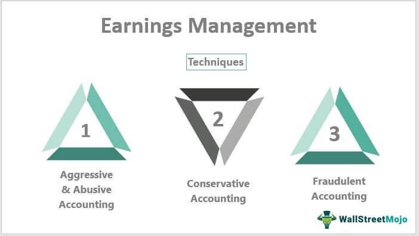

## Table of Contents

## What is earnings management?

Earnings management is when a company's leaders try to make their financial reports look better or worse than they really are. They do this by choosing certain ways to report their earnings that can make the numbers look different. This is often done to meet certain targets or to make the company look more successful to investors and others who look at the financial reports.

Sometimes, earnings management can be okay if it follows the rules and is done in a clear way. But other times, it can be a problem if it's used to trick people or hide the truth about how the company is doing. When it's done in a bad way, it can lead to big problems like scandals or even legal trouble for the company and its leaders.

## Why do companies engage in earnings management?

Companies engage in earnings management mainly to make their financial performance look better to people like investors, analysts, and the public. If a company can show higher profits or meet certain financial goals, it might make its stock price go up. This can make the company seem more successful and attract more investment. Sometimes, managers also do this to get bonuses or keep their jobs, because their pay or job security might depend on hitting certain financial targets.

But not all earnings management is about making things look good. Sometimes, companies might want to make their earnings look worse on purpose. This can be a strategy to lower people's expectations for the future, so it's easier to beat those expectations later. It can also help them save on taxes, because if they report lower earnings, they might have to pay less in taxes. Even though these reasons might seem smart, doing this too much or in a dishonest way can lead to trouble, like getting in trouble with the law or losing trust from investors.

## What are the different types of earnings management?

There are two main types of earnings management: real earnings management and accrual-based earnings management. Real earnings management is when a company changes what it does in its day-to-day business to affect its earnings. For example, a company might decide to spend less on research and development or cut back on advertising to make its earnings look better right now, even if it might hurt the company in the long run.

Accrual-based earnings management is different. It's when a company changes how it reports its earnings without changing what it does in its business. They do this by making choices about when to count money coming in or going out. For instance, a company might decide to count sales earlier than they should or delay counting some expenses until later. This can make their earnings look better in the short term, but it's all about how they report things, not about changing what they actually do.

## Can you explain the difference between real earnings management and accrual-based earnings management?

Real earnings management is when a company changes what it does every day to make its earnings look different. For example, a company might decide to spend less money on things like research or ads. This can make their earnings look better right now, but it might not be good for the company in the long run. It's like choosing to save money today by not buying new things, even if those things could help the business grow later.

Accrual-based earnings management is different because it's all about how a company reports its earnings, not about changing what it does. A company might choose to count its sales earlier or wait to count some costs until later. This can make their earnings look better in the short term, but it's all just about how they write things down. It's like moving numbers around on a piece of paper to make the total look better, without actually doing anything different in the business.

## What are some common techniques used in earnings management?

Companies use different ways to manage their earnings. One way is called "cookie jar accounting," where they save up some earnings during good times and use them to make bad times look better. For example, if a company does really well one year, it might count less of that money as earnings and save some for later. Then, if the next year is not so good, they can use that saved-up money to make the earnings look better. Another way is "big bath" accounting, where a company takes all the bad news at once. If they have a bad year, they might count all the bad things happening at the same time, so the next year looks better by comparison.

Another technique is "revenue recognition," where a company decides when to count the money it makes from sales. They might count sales earlier than they should to make earnings look better now, or they might wait to count sales until later to make future earnings look better. "Expense timing" is also common, where a company decides when to count its costs. They might delay counting some costs until a later time to make current earnings look better. These ways of managing earnings can help a company meet certain goals or make it look more successful, but they can also be risky if they're not done honestly.

## How can earnings management affect a company's financial statements?

Earnings management can change a company's financial statements a lot. When a company manages its earnings, it can make its income statement look better or worse than it really is. For example, if a company uses techniques like counting sales earlier or waiting to count expenses, it can show higher profits on the income statement. This makes the company look more successful to people who read the financial statements, like investors or analysts. But, if the company is not honest about what it's doing, it can lead to problems later when the real numbers come out.

It can also affect the balance sheet and the cash flow statement. On the balance sheet, earnings management might change how much money the company says it has in assets or how much it owes in liabilities. For instance, if a company delays counting some expenses, it might show more cash on hand than it really has. On the cash flow statement, the way a company manages its earnings can make it look like it has more or less cash coming in or going out. This can be confusing and might make people trust the company less if they find out the truth.

## What are the ethical implications of earnings management?

Earnings management can be a big ethical problem. It's like playing tricks with numbers to make a company look better or worse than it really is. If a company does this in a way that's not honest, it can hurt a lot of people. Investors might lose money if they believe the company is doing better than it really is. Employees might lose their jobs if the company gets in trouble for lying. And everyone who trusts the company, like customers and the public, might feel cheated when they find out the truth.

On the other hand, some people think that a little bit of earnings management can be okay if it's done the right way. If a company follows all the rules and is clear about what it's doing, it might not be a big problem. But it's a fine line to walk. Even if it's legal, it can still feel wrong to some people. The big question is about honesty and trust. Companies should always try to be as honest as they can, because trust is really important for a business to do well in the long run.

## How do regulatory bodies view earnings management?

Regulatory bodies, like the Securities and Exchange Commission (SEC) in the United States, usually don't like earnings management if it's done to trick people. They want companies to be honest in their financial reports. If a company is caught lying about its earnings, it can get into big trouble. The regulatory bodies can fine the company, make the leaders leave their jobs, or even take the company to court. This is because lying about earnings can hurt investors and make it hard for people to trust the market.

But not all earnings management is seen as bad by regulators. If a company follows the rules and is clear about what it's doing, some types of earnings management might be okay. For example, if a company makes choices about when to count its sales or expenses but still follows the accounting rules, it might not get in trouble. The key is that the company needs to be honest and follow the law. Regulators want to make sure that everyone plays fair and that the financial information companies share is true and helpful.

## What are the potential long-term effects of earnings management on a company?

Earnings management can hurt a company a lot in the long run if it's not done the right way. If a company tricks people with its earnings, it can lose the trust of investors, customers, and the public. When people find out the truth, they might stop buying the company's products or investing in its stock. This can make the company's stock price go down and make it hard to get money from investors in the future. It can also lead to big fines and legal trouble, which can cost the company a lot of money and damage its reputation.

On the other hand, if a company does earnings management the right way, following all the rules and being clear about what it's doing, it might not face these big problems. But even then, there can be some risks. If the company focuses too much on making its earnings look good right now, it might not spend enough on things that are important for the future, like research or new projects. This can make it hard for the company to grow and stay successful over time. So, even if earnings management is done carefully, it's important for a company to think about the long-term effects and try to be as honest as possible.

## How can investors detect signs of earnings management?

Investors can spot signs of earnings management by looking closely at a company's financial statements and how the numbers change over time. If a company's earnings seem to be just meeting or beating what people expected a lot, it might be a sign that something is off. Another thing to watch for is big changes in how the company counts its sales or costs. If the company starts counting sales earlier than before or delays counting costs, it could be trying to make its earnings look better.

It's also helpful to compare a company's numbers with other companies in the same industry. If one company's numbers look a lot different, it might be managing its earnings. Investors should also pay attention to what the company says in its reports and during meetings with investors. If the company's explanations for its earnings don't make sense or seem too good to be true, it might be a red flag. By being careful and looking at all these things, investors can better tell if a company is playing fair with its earnings.

## What role does corporate governance play in preventing earnings management?

Corporate governance is like the rules and people who make sure a company does things the right way. It's really important in stopping earnings management because it helps make sure everyone in the company is honest and follows the rules. Good corporate governance means having a board of directors that watches over what the company does and makes sure the leaders are not trying to trick anyone with the numbers. They do this by setting up rules for how the company should report its earnings and making sure those rules are followed. If the board is doing its job well, it can stop the company from playing tricks with its earnings.

Another way corporate governance helps is by making sure the company is clear about what it's doing. This means the company has to tell everyone how it makes its money and spends it, so people can see if anything looks fishy. If a company knows it has to be open about its earnings, it's less likely to try to change the numbers to make them look better. Good corporate governance also means having people inside the company, like auditors, who check the numbers to make sure they're right. All these things together help stop earnings management and keep the company honest.

## Can you discuss any major cases of earnings management in corporate history?

One big case of earnings management was with Enron, a company that used to be really famous but then got into huge trouble. Enron's leaders made the company's earnings look a lot better than they really were. They did this by using tricky ways to count their money and hide their debts. When people found out what was going on, Enron's stock price crashed, and the company went bankrupt. A lot of people lost their jobs and their money because of this. The leaders of Enron even went to jail for what they did.

Another case was with WorldCom, another big company that got caught lying about its earnings. WorldCom's leaders made the company's profits look bigger by saying they had spent less money than they really had. They did this by moving money around in their financial reports to make things look better. When the truth came out, WorldCom also went bankrupt, and its leaders faced big fines and jail time. These cases showed everyone how dangerous earnings management can be and led to new rules to try to stop it from happening again.

## References & Further Reading

[1]: Dechow, P., Ge, W., & Schrand, C. (2010). ["Understanding earnings quality: A review of the proxies, their determinants and their consequences."](https://www.sciencedirect.com/science/article/pii/S0165410110000339) Journal of Accounting and Economics, 50(2-3), 344-401.

[2]: Healy, P. M., & Wahlen, J. M. (1999). ["A review of the earnings management literature and its implications for standard setting."](https://publications.aaahq.org/accounting-horizons/article/13/4/365/1634/A-Review-of-the-Earnings-Management-Literature-and) Accounting Horizons, 13(4), 365-383.

[3]: Laux, C., & Leuz, C. (2009). ["The crisis of fair-value accounting: making sense of the recent debate."](https://www.sciencedirect.com/science/article/pii/S0361368209000439) Accounting, Organizations and Society, 34(6-7), 826-834.

[4]: Nuti, G., Miretti, R., Treleaven, P., & Beling, P. A. (2011). ["Algorithmic trading."](https://www.semanticscholar.org/paper/Algorithmic-Trading-Nuti-Mirghaemi/dec841dd0f1fce55ba930b26f3fb945e330dfcbb) The Computer Journal, 55(7), 818-823.

[5]: Kahn, R. N., & Weisman, A. G. (2017). ["The Handbook of Financial Data and Risk Information: Volume I: Principles for the Effective Management of Risk."](https://link.springer.com/article/10.1007/s12274-024-6984-8) Cambridge University Press.

[6]: Carney, M. (2014). ["The Future of Financial Reform."](https://www.bankofengland.co.uk/speech/2014/the-future-of-financial-reform) Speech at the Monetary Authority of Singapore Lecture, Singapore.

[7]: Zhang, L. (2009). ["Information technology capability, absorptive capacity, and corporate performance: An empirical test."](https://www.semanticscholar.org/paper/IT-Capability-and-Digital-Transformation%3A-A-Firm-Nwankpa-Roumani/3bc37421a7c95fff66d0e4a55dda4dcbd0c33240) MIS Quarterly, 33(1), 155-170.