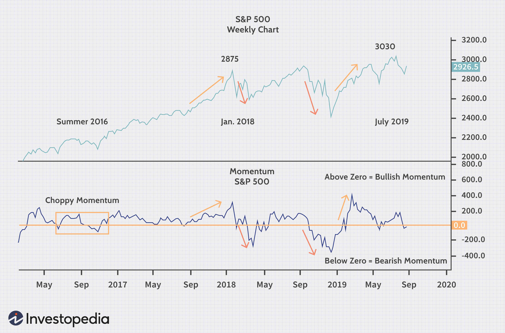

Earnings momentum is an influential investment strategy that has gained significant traction in financial analysis and algorithmic trading. It focuses on the upward trajectory of a company's earnings and uses this momentum as a signal for potential investment opportunities. The strategy predominantly relies on patterns in earnings data, with investors seeking to identify stocks poised for growth based on past and projected corporate earnings performance. Earnings momentum reflects the underlying financial health of a company, serving as a key indicator of potential stock price movements.

Fundamental analysis and technical trading strategies are traditionally distinct approaches within investment. However, this article aims to highlight their integration through earnings momentum strategies. Fundamental analysis investigates into the financial statements of a company, evaluating its earnings, assets, liabilities, and cash flow. In contrast, technical trading leverages past stock price movements and volume data to predict future trends. By combining these methodologies, investors can enhance the precision of their analysis and decision-making processes.

Earnings data is an invaluable predictive tool in identifying investment opportunities. Consistent earnings growth often suggests improved company performance, which can translate into increased stock prices. Investors who leverage this information can position themselves to capitalize on the market's reaction to earnings announcements. The correlation between earnings growth and stock price appreciation underscores the strategy's effectiveness and relevance in financial markets. Additionally, the integration of earnings momentum into investment strategies can streamline the process of stock selection and portfolio management.

Algorithmic trading plays a pivotal role in enhancing the efficiency and execution of earnings momentum strategies. Algorithms can quickly process vast amounts of financial data, including earnings announcements, to execute trades with speed and accuracy that surpass human capabilities. This allows for real-time reaction to earnings data, minimizing the delay between announcement and action. The use of algorithmic models enables investors to systematically incorporate earnings momentum indicators, facilitating informed and timely trading decisions.

This article is structured to provide a comprehensive understanding of the earnings momentum investment strategy. It begins with an exploration of the concept of earnings momentum and its fundamental components. Following this, the strategic application of earnings momentum in stock selection is discussed. The role of algorithmic trading in augmenting these strategies is examined, with case studies and practical examples provided to illustrate successful implementations. The article concludes with an examination of implications and future trends, offering insights into the evolving landscape of earnings momentum investing and its intersection with technology and regulation. Through this structured approach, the reader will gain a thorough appreciation of the synergies between fundamental analysis, technical strategies, and technological advancements in the pursuit of investment opportunities.

## Table of Contents

## Understanding Earnings Momentum

Earnings momentum is a financial concept that focuses on the progressive growth of a company's earnings over time, often quantified through metrics such as Earnings Per Share (EPS) growth and revenue acceleration. This concept plays a vital role in investment analysis as it can provide insights into a company’s potential for future growth and its overall financial health. 

EPS growth is a fundamental element of earnings [momentum](/wiki/momentum). It measures the rate at which a company's earnings per outstanding share of common stock grow over a specified period. A consistent increase in EPS indicates that the company is generating more profit relative to its number of shares, often signaling robust financial health and the potential for upward stock price movement. Revenue acceleration, another critical component, looks at how quickly a company's revenue is increasing from one period to the next. This metric provides insight into the company’s capability to enhance its top-line growth, which can subsequently influence profits and earnings momentum.

Earnings momentum serves as an indicator of a company’s financial health and its stock’s future performance. Investors often regard a company with strong earnings momentum as having better future growth prospects, with a higher likelihood of appreciating in stock value. Conversely, decelerating earnings may suggest financial hurdles or an adverse business environment, potentially leading to a decline in stock prices.

Investors track earnings trends through regular analysis of quarterly and annual financial reports. These documents provide crucial data, such as revenue figures, net income, and EPS, which investors use to monitor whether a company is consistently achieving positive earnings momentum. By scrutinizing these reports, investors gain an understanding of both historical performance and future potential.

In earnings analysis, common financial metrics like the Price-to-Earnings (P/E) ratio are often used. The P/E ratio is calculated as:

$$
\text{P/E Ratio} = \frac{\text{Market Value per Share}}{\text{Earnings per Share (EPS)}}
$$

A high P/E ratio may indicate that investors expect higher earnings growth in the future compared to companies with lower P/E ratios, thus reflecting momentum expectations. However, it might also suggest that a stock is overvalued if earnings do not materialize as anticipated.

Accelerating earnings generally lead to enhanced stock valuations as investor confidence grows, often resulting in increased demand and higher prices. In contrast, decelerating earnings can trigger a reevaluation of stock prices as investor sentiment may turn negative, potentially resulting in a sell-off or downward price adjustments. Investors and analysts need to be vigilant about shifts in earnings momentum, as any changes can substantially impact stock valuations and investment decisions.

## Earnings Momentum as an Investment Strategy

Earnings momentum as an investment strategy involves strategically selecting stocks based on their earnings growth patterns, capitalizing on the relationship between corporate earnings and stock prices. Investors seek to identify companies exhibiting strong earnings momentum, suggesting a propensity for future growth. This strategy revolves around the premise that stocks with accelerating earnings will likely see corresponding stock price increases, enhancing investment returns.

### Methods for Identifying Stocks

Identifying stocks with robust earnings momentum entails analyzing financial reports to detect trends in earnings per share (EPS) and revenue growth. Key indicators include a consistent increase in EPS over consecutive quarters or noticeable revenue acceleration. Investors may also examine forward-looking statements by companies predicting continued or enhanced financial performance.

Quantitative screens are often utilized, filtering stocks based on specific criteria such as a high EPS growth rate or low price-to-earnings relative to growth (PEG) ratio. Additionally, monitoring earnings surprise—when actual earnings exceed analysts' expectations—is a valuable technique, as such surprises typically lead to swift stock price adjustments.

### Advantages of Correlating Earnings Growth with Stock Prices

The primary advantage of earnings momentum investing lies in its potential for high returns. Stocks demonstrating strong earnings growth tend to attract more investors, driving up demand and, consequently, stock prices. This correlation provides a logical basis for investors seeking to exploit short-term market inefficiencies for gains.

Investors benefit from timely reactions to earnings announcements, positioning themselves advantageously in rapidly moving markets. Furthermore, tracking earnings momentum aids in mitigating the risks associated with investing in stagnant or declining sectors by focusing on growth-oriented companies.

### Potential Risks

Despite its advantages, earnings momentum investing is subject to inherent risks. A key risk involves the potential for earnings momentum to decelerate or reverse, resulting in stock price depreciation. Changes in macroeconomic conditions, shifts in industry dynamics, or company-specific challenges can impede earnings growth, affecting stock performance.

Furthermore, there is a risk of overreacting to earnings reports, leading to "noise trading," where decisions are based on short-term fluctuations rather than fundamental factors. Investors may also encounter increased [volatility](/wiki/volatility-trading-strategies), as stocks with high earnings momentum are often more sensitive to market sentiment and external shocks.

### Example

A notable example of a company exhibiting earnings momentum is Apple Inc., which has consistently demonstrated strong earnings growth, contributing to substantial stock performance improvements. Apple's ability to innovate and expand its product line has resulted in sustained revenue increases, positively influencing its stock price. During periods of significant product launches, such as the introduction of new iPhone models, Apple's earnings growth often accelerated, aligning with notable stock price appreciations. 

By strategically incorporating earnings momentum analysis, investors can better position themselves to capitalize on growth opportunities and enhance return potential. However, it is vital to remain cognizant of the potential risks and exercise due diligence in interpreting earnings data within the broader market context.

## The Role of Algorithmic Trading in Earnings Momentum Strategy

Algorithmic trading, a facet of financial technology, leverages advanced mathematical models and computing power to execute trades at speeds unmatched by human traders. This paradigm is instrumental in enhancing various investment strategies, including the earnings momentum strategy. It capitalizes on systematic algorithms to analyze financial data rapidly and make informed trading decisions.

Algorithms excel at processing earnings announcements and related financial data with precision. These models can ingest vast datasets, such as quarterly reports, analyst recommendations, and market sentiment, and transform them into actionable insights. For instance, when a company releases earnings data, algorithms can quickly assess key metrics like earnings per share (EPS) and revenue growth, detecting any deviations from expected values. The system then uses these insights to predict potential market reactions, making swift trading decisions before human traders can respond.

Integrating earnings momentum indicators into algorithmic models facilitates real-time decision-making, critical for momentum-based strategies. These indicators, which often include metrics like EPS growth rates and price-to-earnings (P/E) ratios, help determine whether a stock's upward or downward earnings trend justifies a buy or sell decision. Algorithmic models use statistical techniques and historical data to refine these indicators, enhancing prediction accuracy. By continuously analyzing evolving financial data, algorithms can adjust their strategies dynamically, maintaining their edge in the market.

Automated systems also play a crucial role in risk mitigation and efficient trade execution. By incorporating risk management protocols, such as stop-loss and take-profit orders, algorithms minimize potential losses. They also optimize execution by identifying the most favorable conditions for entering or exiting trades, reducing transaction costs and slippage. This efficiency not only enhances profitability but also ensures adherence to the pre-defined strategy without succumbing to emotional biases.

Several [algorithmic trading](/wiki/algorithmic-trading) platforms and tools are popular in the market for implementing earnings-based strategies. Examples include TradeStation, QuantConnect, and MetaTrader 5. These platforms offer a suite of tools for developing, testing, and deploying algorithmic strategies. They provide access to historical and real-time data, sophisticated [backtesting](/wiki/backtesting) environments, and integration capabilities with various brokerage services. Using such platforms, traders and financial institutions can automate their earnings momentum strategies, ensuring precision and speed in execution while continuously refining their models based on market feedback.

In summary, algorithmic trading amplifies the efficacy of earnings momentum strategies by employing sophisticated models to process financial data swiftly and execute trades efficiently. This synergy offers a significant advantage in competitive markets, enabling traders to harness earnings data trends proactively.

## Case Studies and Practical Examples

Case studies of earnings momentum strategies provide practical insights into the application and efficiency of this investment approach. A notable example is the tech company, Apple Inc., which has demonstrated substantial earnings growth over several quarters. This consistent growth in earnings per share (EPS) and revenue acceleration corresponded with significant stock price appreciation, affirming the relevance of earnings momentum as a predictive tool.

Another example is Tesla Inc., where earnings momentum strategies have successfully identified upward trends. Early recognition of Tesla's improving fundamentals, such as rising revenues and expanding profit margins, allowed investors to capitalize on corresponding stock price increments. By applying earnings momentum analysis, investors assessed the company's quarterly reports, highlighting positive surprises in earnings that contributed to bullish market sentiment and a subsequent rise in stock valuation.

Algorithmic trading has played a crucial role in exploiting earnings momentum by processing large datasets to identify patterns indicative of financial performance improvements. For instance, hedge funds have implemented algorithms that integrate earnings announcement analysis with market reaction metrics to make real-time investment decisions. These algorithms use [machine learning](/wiki/machine-learning) models to predict the impact of earnings reports on stock prices effectively. Python-based frameworks like Pandas and Scikit-learn are often employed to build predictive models that can execute trades following an earnings surprise, maximizing profit potential.

An instructive lesson from both successful and failed implementations is the critical nature of context and timing. While positive earnings momentum often leads to stock gains, any disruption in anticipated growth trends, such as unexpected market events or shifts in consumer demand, can lead to a sharp decrease in stock value. A case in point is Netflix, which after sustained earnings momentum experienced a downturn when subscriber growth stalled, negatively impacting its stock performance.

Investors aiming to integrate earnings momentum strategies should consider the importance of diversifying investments to manage risks associated with abrupt momentum shifts. Additionally, they should employ forward-looking analyses, using historical data as a foundation but acknowledging that past performance does not always predict future results. Utilizing algorithmic tools can allow investors to better navigate earnings announcements and adjust their portfolios dynamically.

Overall, the confluence of robust earnings reports, astute analysis, and algorithmic precision underscores the potential success of earnings momentum strategies in contemporary financial markets. Continuous monitoring of earnings data, combined with algorithmic enhancements, can support investors in executing informed and timely trades.

## Implications and Future Trends

Earnings momentum investing is poised for significant evolution as market dynamics shift and technology advances. The integration of cutting-edge tools such as [artificial intelligence](/wiki/ai-artificial-intelligence) (AI) and machine learning is transforming data processing and trend prediction capabilities. These technologies enable financial analysts and traders to more accurately forecast stock movements, by sifting through vast datasets to identify patterns that may not be immediately apparent to human reviewers. For example, AI algorithms can analyze historical earnings reports, market sentiment data, and macroeconomic indicators to predict future earnings trends and potential investment opportunities.

These technological advancements are accompanied by potential regulatory changes that could impact the deployment of algorithmic trading strategies. As financial markets progressively rely on algorithms, regulators are becoming more vigilant in considering the implications for market stability and fairness. There is growing concern about algorithmic trading contributing to market volatility, known as "flash crashes," and the potential for systemic risk. It is likely that future regulations will impose stricter compliance requirements, transparency mandates, and risk management protocols for algorithmic trading platforms to ensure orderly market operations.

The incorporation of AI and machine learning into financial strategies is becoming increasingly significant. These technologies automate complex decision-making processes and enhance the efficiency of earnings momentum strategies by enabling real-time data analysis and rapid trade execution. Machine learning models can continuously adapt and improve their predictions based on new data, thereby fine-tuning trading strategies to optimize returns.

However, the adoption of algorithmic approaches raises several ethical and practical challenges. One ethical concern is the potential for algorithms to perpetuate or even exacerbate biases present in the input data, leading to unfair trading practices. It is crucial to ensure that models are trained on diverse and representative datasets to mitigate this risk. Additionally, there is the practical challenge of ensuring that algorithmic systems remain robust and secure against cyber threats, as increased connectivity and reliance on technology heighten the risk of unauthorized access and data breaches.

Overall, the future of earnings momentum investing will likely be characterized by enhanced precision and efficiency due to technological innovations, balanced by a cautious approach to regulation and ethics. Investors and financial analysts should remain attentive to these developments, as they will shape the strategic landscape of financial markets and trading.

## Conclusion

Earnings momentum investment strategies present a blend of opportunities and constraints for investors and financial analysts. By focusing on a company's earnings growth, these strategies provide a clear path for identifying potential investment opportunities that align with stock price appreciation. The primary advantage of earnings momentum lies in its capability to leverage quantitative data such as earnings per share growth and revenue acceleration, which serve as reliable indicators of a company's financial health and future prospects. This focus on tangible financial metrics makes earnings momentum an attractive option for investors seeking to maximize returns based on objective data.

However, challenges abound in the practical application of earnings momentum strategies. Market volatility and unpredictable corporate earnings can swiftly alter the trajectory of expected outcomes, leading to potential risks. Furthermore, the strategy's success heavily relies on the availability and accuracy of financial data, which may be influenced by external factors and unexpected market shifts.

Algorithmic trading offers instrumental possibilities in harnessing these opportunities while addressing inherent challenges. It enables the rapid analyses of large volumes of earnings data and facilitates timely execution of trades, thereby mitigating the risks associated with human error and delayed reactions. Algorithms can be designed to integrate multiple financial indicators into cohesive models that make real-time investment decisions, providing a competitive edge in fast-moving markets.

The evolving financial landscape necessitates continuous research and adaptability to keep pace with technological advancements and regulatory changes affecting algorithmic strategies. Investors and analysts are encouraged to remain agile, updating their approaches and systems to manage complexities and seize emerging opportunities effectively.

Essential takeaways for market participants include the critical assessment of earnings momentum metrics, the consideration of technological tools to enhance precision in decision-making, and the vigilance in monitoring regulatory developments that might impact trading strategies. The synergy between [fundamental analysis](/wiki/fundamental-analysis) and technological innovation in trading exemplifies a compelling paradigm, where data-driven insights and automated systems collectively advance the efficiency and efficacy of investment endeavors.

In conclusion, the intersection of earnings momentum strategies with algorithmic trading offers significant potential to capitalize on earnings-based opportunities. As the financial industry continues to evolve, stakeholders must embrace technological progress while remaining grounded in fundamental analysis to thrive in an ever-dynamic market environment.

## References & Further Reading

[1]: Bergstra, J., Bardenet, R., Bengio, Y., & Kégl, B. (2011). ["Algorithms for Hyper-Parameter Optimization."](https://dl.acm.org/doi/10.5555/2986459.2986743) Advances in Neural Information Processing Systems 24.

[2]: ["Advances in Financial Machine Learning"](https://www.amazon.com/Advances-Financial-Machine-Learning-Marcos/dp/1119482089) by Marcos Lopez de Prado

[3]: ["Evidence-Based Technical Analysis: Applying the Scientific Method and Statistical Inference to Trading Signals"](https://www.amazon.com/Evidence-Based-Technical-Analysis-Scientific-Statistical/dp/0470008741) by David Aronson

[4]: ["Machine Learning for Algorithmic Trading"](https://github.com/stefan-jansen/machine-learning-for-trading) by Stefan Jansen

[5]: ["Quantitative Trading: How to Build Your Own Algorithmic Trading Business"](https://www.amazon.com/Quantitative-Trading-Build-Algorithmic-Business/dp/1119800064) by Ernest P. Chan