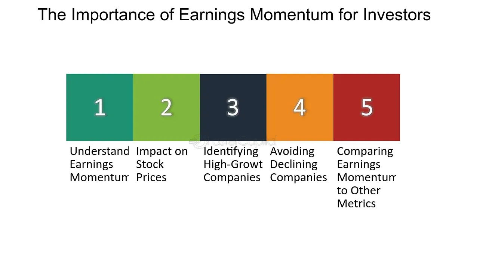

## Table of Contents

## What is earnings momentum?

Earnings momentum is when a company's earnings keep growing over time. It shows that the company is doing well and making more money than before. Investors like to see this because it means the company might keep doing well in the future.

When a company has good earnings momentum, it can make its stock price go up. This is because more people want to buy the stock, thinking the company will keep growing. But, if the earnings start to slow down or go down, it can make the stock price drop because people might think the company won't do as well in the future.

## How is earnings momentum measured?

Earnings momentum is measured by looking at a company's earnings over different periods of time, like quarters or years. Analysts compare the earnings from one period to the next to see if they are going up, staying the same, or going down. If the earnings are higher than they were in the last period, the company has positive earnings momentum. If the earnings are lower, it has negative earnings momentum.

To get a better idea of earnings momentum, analysts often look at the percentage change in earnings. For example, if a company's earnings went from $100 million last quarter to $110 million this quarter, that's a 10% increase. This percentage helps show how fast the earnings are growing or shrinking. By tracking these changes over time, investors can see if the company's earnings are consistently moving in one direction, which helps them decide if the company is a good investment.

## Why is earnings momentum important for investors?

Earnings momentum is important for investors because it shows if a company is doing better or worse over time. When a company's earnings keep going up, it means the company is making more money. This can make investors feel good about the company's future. They might think the company will keep growing and making more money, so they want to buy its stock. This can make the stock price go up.

On the other hand, if a company's earnings start to go down, it can worry investors. They might think the company is not doing as well and might not make as much money in the future. This can make them want to sell the stock, which can make the stock price go down. So, by looking at earnings momentum, investors can make better choices about which stocks to buy or sell.

## What are the key indicators of earnings momentum?

The main way to see if a company has earnings momentum is by looking at how its earnings change over time. If a company's earnings are higher this quarter than they were last quarter, that's a good sign. It means the company is making more money than before. Investors like to see this because it shows the company is doing well and might keep doing well in the future. They can find this information in the company's financial reports, which come out every three months.

Another important thing to look at is the percentage change in earnings. If a company's earnings went up by 10% from last quarter, that's a big jump. This percentage helps investors see how fast the company is growing. If the company keeps having big jumps in earnings, it has strong earnings momentum. But if the percentage starts to get smaller or turns negative, it might mean the company's earnings momentum is slowing down or turning bad.

Lastly, it's good to look at how the company's earnings compare to what people expected. If a company's earnings are better than what analysts thought they would be, that's a good sign. It shows the company is doing better than people thought. This can make investors feel more confident about the company's future and can help push the stock price up. But if the earnings are worse than expected, it can make investors worried and might make the stock price go down.

## How does earnings momentum affect stock prices?

Earnings momentum can have a big impact on a company's stock price. When a company's earnings keep going up, it shows that the company is doing well and making more money than before. Investors like to see this because it means the company might keep growing in the future. When investors think a company will do well, they want to buy its stock. This demand can push the stock price higher. For example, if a company's earnings go up by 10% from last quarter, it can make people feel good about the company, and they might be willing to pay more for the stock.

On the other hand, if a company's earnings start to go down, it can make the stock price fall. When earnings drop, it can worry investors because they might think the company won't make as much money in the future. This can make them want to sell their stock, which can lower the stock price. For instance, if a company's earnings are lower than what people expected, it can make investors lose confidence, and they might sell their shares, causing the stock price to drop. So, earnings momentum is really important for investors because it can help them decide whether to buy or sell a stock.

## Can earnings momentum be predicted? If so, how?

Yes, earnings momentum can be predicted by looking at different things about a company. Analysts often look at past earnings to see if they keep going up. They also look at things like how much the company is selling, how much money it's making from those sales, and what people think about the company's future. If a company keeps making more money and selling more stuff, it's a good sign that its earnings might keep going up.

Another way to predict earnings momentum is by looking at what people expect. Analysts make guesses about a company's future earnings, and if a company keeps doing better than these guesses, it can mean the company's earnings momentum will stay strong. Also, big news like new products or changes in the market can help predict if a company's earnings will keep growing. By putting all these pieces together, investors can make good guesses about a company's earnings momentum.

## What are the common pitfalls in relying on earnings momentum?

One big problem with using earnings momentum to decide about stocks is that past earnings don't always tell us what will happen next. Just because a company made more money last quarter doesn't mean it will keep doing that. Things like changes in the market, new competitors, or problems with the company can make earnings go down even if they were going up before. So, if investors only look at past earnings, they might be surprised if the company doesn't keep growing.

Another issue is that earnings can be affected by one-time events that don't happen again. For example, a company might have a big sale or get a special tax break that makes its earnings look better for one quarter. If investors think this will keep happening, they might be disappointed when the earnings go back to normal. It's important to look at the whole picture and not just focus on one or two good quarters to avoid being tricked by these one-time boosts.

## How do different sectors respond to earnings momentum?

Different sectors can react differently to earnings momentum because each sector has its own way of making money and its own challenges. For example, in the tech sector, earnings momentum can really make stock prices jump. Tech companies often grow fast, and when they keep making more money, investors get excited and want to buy their stocks. This can make the stock prices go up a lot. But, if a tech company's earnings start to slow down, the stock price can drop fast because people might think the company won't keep growing as much.

In the energy sector, earnings momentum can be more up and down because it depends a lot on things like oil prices. When oil prices are high, energy companies can make a lot more money, and their stock prices can go up. But if oil prices drop, their earnings can go down even if they were doing well before. So, earnings momentum in the energy sector can be less predictable than in other sectors. Investors need to keep an eye on things like oil prices and not just the company's past earnings.

In the consumer goods sector, earnings momentum can be more steady but slower. Companies that make things like food or clothes usually don't grow as fast as tech companies, but they can be more reliable. If a consumer goods company keeps making more money, it can make investors feel good about buying its stock. But, if the company's earnings start to go down, it might not be as big of a shock to the stock price as in the tech sector. Still, investors need to watch for changes in what people are buying and how much they're spending.

## What role does earnings momentum play in portfolio management?

Earnings momentum is really important for people who manage portfolios because it helps them decide which stocks to buy or sell. When a company's earnings keep going up, it means the company is doing well and might keep growing. Portfolio managers like to see this because it can make the stock price go up. So, they might want to buy more of that stock to make their portfolio grow. But if a company's earnings start to go down, it can worry portfolio managers. They might think the company won't do as well in the future, so they might want to sell that stock to avoid losing money.

Portfolio managers also need to think about how earnings momentum fits with their overall plan. If they want to take more risks, they might focus on stocks with strong earnings momentum, like tech companies that can grow fast. But if they want to be safer, they might pick stocks with steady but slower earnings momentum, like companies in the consumer goods sector. By looking at earnings momentum, portfolio managers can make better choices about which stocks to keep, buy, or sell to meet their goals.

## How can earnings momentum be integrated into a trading strategy?

Earnings momentum can be a big help in making a trading strategy. Traders can look at how a company's earnings are changing over time to decide when to buy or sell its stock. If a company's earnings keep going up, it's a good sign that the company is doing well and might keep growing. Traders might want to buy the stock when they see this, hoping the stock price will go up as more people want to buy it. But if the earnings start to go down, it can be a warning sign. Traders might want to sell the stock before the price drops because other people might start selling too if they see the earnings going down.

Using earnings momentum in a trading strategy also means looking at other things that can affect a company's earnings. Traders need to think about what people expect the company's earnings to be and how the company is doing compared to those expectations. If a company does better than people thought, it can make the stock price go up even more. Traders can also look at news about the company, like new products or changes in the market, to guess if the earnings momentum will keep going. By putting all these pieces together, traders can make smarter choices about when to buy or sell stocks based on earnings momentum.

## What are the advanced statistical models used to analyze earnings momentum?

Advanced statistical models help traders and analysts understand earnings momentum better. One common model is the autoregressive integrated moving average (ARIMA) model. This model looks at past earnings to predict future earnings. It takes into account trends and patterns in the data, which can help traders see if a company's earnings are likely to keep going up or start going down. By using ARIMA, traders can make more informed guesses about whether to buy or sell a stock based on its earnings momentum.

Another useful model is the regression model. This model looks at how different things, like a company's sales or what people expect its earnings to be, affect its earnings momentum. For example, if a company's sales go up, the regression model can show how much that might make its earnings go up too. By understanding these relationships, traders can predict earnings momentum more accurately. They can use this information to decide which stocks to buy or sell, making their trading strategy more successful.

## How does global economic environment influence earnings momentum?

The global economic environment can have a big impact on a company's earnings momentum. When the world economy is doing well, people and businesses have more money to spend. This can make companies sell more stuff and make more money, which can boost their earnings momentum. For example, if countries around the world are growing fast, companies that sell things in those countries might see their earnings go up. But if the global economy slows down or goes into a recession, it can hurt earnings momentum. People and businesses might not spend as much money, so companies might sell less and their earnings could go down.

Different parts of the world can also affect earnings momentum in different ways. For instance, if there's a big problem in one country, like a financial crisis or a natural disaster, it can make companies that do business there struggle. This can slow down their earnings momentum. On the other hand, if a country is doing really well, companies that sell things there might see their earnings go up faster. So, traders and investors need to keep an eye on what's happening around the world to guess how it might change a company's earnings momentum.

## What is Understanding Earnings Momentum?

Earnings momentum is a financial concept that focuses on the progressive growth of a company's earnings over time, often quantified through metrics such as Earnings Per Share (EPS) growth and revenue acceleration. This concept plays a vital role in investment analysis as it can provide insights into a company’s potential for future growth and its overall financial health. 

EPS growth is a fundamental element of earnings [momentum](/wiki/momentum). It measures the rate at which a company's earnings per outstanding share of common stock grow over a specified period. A consistent increase in EPS indicates that the company is generating more profit relative to its number of shares, often signaling robust financial health and the potential for upward stock price movement. Revenue acceleration, another critical component, looks at how quickly a company's revenue is increasing from one period to the next. This metric provides insight into the company’s capability to enhance its top-line growth, which can subsequently influence profits and earnings momentum.

Earnings momentum serves as an indicator of a company’s financial health and its stock’s future performance. Investors often regard a company with strong earnings momentum as having better future growth prospects, with a higher likelihood of appreciating in stock value. Conversely, decelerating earnings may suggest financial hurdles or an adverse business environment, potentially leading to a decline in stock prices.

Investors track earnings trends through regular analysis of quarterly and annual financial reports. These documents provide crucial data, such as revenue figures, net income, and EPS, which investors use to monitor whether a company is consistently achieving positive earnings momentum. By scrutinizing these reports, investors gain an understanding of both historical performance and future potential.

In earnings analysis, common financial metrics like the Price-to-Earnings (P/E) ratio are often used. The P/E ratio is calculated as:

$$
\text{P/E Ratio} = \frac{\text{Market Value per Share}}{\text{Earnings per Share (EPS)}}
$$

A high P/E ratio may indicate that investors expect higher earnings growth in the future compared to companies with lower P/E ratios, thus reflecting momentum expectations. However, it might also suggest that a stock is overvalued if earnings do not materialize as anticipated.

Accelerating earnings generally lead to enhanced stock valuations as investor confidence grows, often resulting in increased demand and higher prices. In contrast, decelerating earnings can trigger a reevaluation of stock prices as investor sentiment may turn negative, potentially resulting in a sell-off or downward price adjustments. Investors and analysts need to be vigilant about shifts in earnings momentum, as any changes can substantially impact stock valuations and investment decisions.

## References & Further Reading

[1]: Bergstra, J., Bardenet, R., Bengio, Y., & Kégl, B. (2011). ["Algorithms for Hyper-Parameter Optimization."](https://dl.acm.org/doi/10.5555/2986459.2986743) Advances in Neural Information Processing Systems 24.

[2]: ["Advances in Financial Machine Learning"](https://www.amazon.com/Advances-Financial-Machine-Learning-Marcos/dp/1119482089) by Marcos Lopez de Prado

[3]: ["Evidence-Based Technical Analysis: Applying the Scientific Method and Statistical Inference to Trading Signals"](https://www.amazon.com/Evidence-Based-Technical-Analysis-Scientific-Statistical/dp/0470008741) by David Aronson

[4]: ["Machine Learning for Algorithmic Trading"](https://github.com/stefan-jansen/machine-learning-for-trading) by Stefan Jansen

[5]: ["Quantitative Trading: How to Build Your Own Algorithmic Trading Business"](https://www.amazon.com/Quantitative-Trading-Build-Algorithmic-Business/dp/1119800064) by Ernest P. Chan