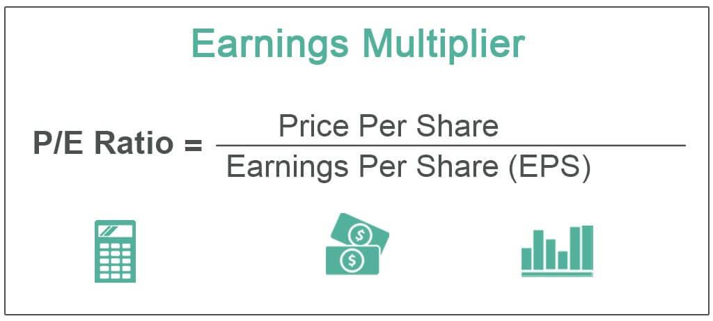

## Table of Contents

## What is an earnings multiplier?

An earnings multiplier, also known as a price-to-earnings (P/E) ratio, is a way to figure out how much investors are willing to pay for a company's earnings. It's calculated by dividing the current market price of a company's stock by its earnings per share (EPS). This number tells you how many years it would take for the company to earn back the amount you paid for the stock, based on its current earnings.

The earnings multiplier is useful for comparing the value of different companies. If one company has a lower P/E ratio than another, it might mean that the first company is a better value, or that investors expect it to grow more slowly. However, the P/E ratio should not be the only thing you look at when deciding to invest in a company. Other factors, like the company's growth potential, industry trends, and overall financial health, are also important to consider.

## How is the earnings multiplier calculated?

The earnings multiplier is calculated by dividing the current market price of a company's stock by its earnings per share (EPS). The market price is how much one share of the company's stock costs right now. Earnings per share is the company's total profit divided by the number of shares it has. So, if a stock costs $50 and the company's earnings per share is $5, the earnings multiplier would be $50 divided by $5, which equals 10.

This number, the earnings multiplier, tells you how many years it would take for the company to earn back the amount you paid for the stock, based on its current earnings. If the earnings multiplier is 10, it means it would take 10 years for the company to earn an amount equal to the stock's price. This helps investors see if a stock is a good value compared to other stocks. A lower earnings multiplier might mean the stock is cheaper, but it's important to look at other things too, like how fast the company is growing and how healthy its finances are.

## Why is the earnings multiplier important for investors?

The earnings multiplier is important for investors because it helps them figure out if a stock is a good deal or not. It tells you how much you are paying for each dollar of the company's earnings. If the earnings multiplier is low, it might mean the stock is cheap compared to how much money the company is making. But if it's high, you might be paying a lot for the company's earnings, which could mean the stock is expensive.

Investors use the earnings multiplier to compare different companies. If one company has a lower earnings multiplier than another, it might be a better value. But it's not the only thing to look at. You also need to think about how fast the company is growing, how much debt it has, and what's happening in its industry. The earnings multiplier gives you a quick way to see if a stock might be worth looking into more closely.

## Can you explain the difference between the price-to-earnings (P/E) ratio and the earnings multiplier?

The price-to-earnings (P/E) ratio and the earnings multiplier are actually the same thing. They both measure how much investors are willing to pay for a company's earnings. You calculate them by dividing the current market price of a stock by the company's earnings per share (EPS). So if a stock costs $50 and the company's EPS is $5, both the P/E ratio and the earnings multiplier would be 10. This number tells you how many years it would take for the company to earn back the amount you paid for the stock, based on its current earnings.

The terms "P/E ratio" and "earnings multiplier" are used differently in different places, but they mean the same thing. Some people might say "P/E ratio" more often when talking about how to value a stock, while others might use "earnings multiplier" to explain how long it takes to earn back the investment. But no matter what you call it, it's a useful way to compare the value of different stocks and see if a stock might be a good deal.

## What factors influence the earnings multiplier?

Several things can affect a company's earnings multiplier. One big thing is how fast the company is growing. If people think a company will grow a lot and make more money in the future, they might be willing to pay more for its stock right now. This makes the earnings multiplier go up. Another thing that can change the earnings multiplier is what's happening in the economy and the company's industry. If the economy is doing well and the industry is growing, the earnings multiplier might be higher because people feel good about investing in that company.

Another [factor](/wiki/factor-investing) is how risky it is to invest in the company. If a company has a lot of debt or if its earnings go up and down a lot, people might not want to pay as much for its stock. This can make the earnings multiplier lower. Also, what other investors are doing can affect the earnings multiplier. If a lot of people want to buy the stock, the price goes up, and so does the earnings multiplier. On the other hand, if people are selling the stock, the price goes down, and the earnings multiplier goes down too.

## How does the earnings multiplier vary across different industries?

The earnings multiplier can be different for companies in different industries. Some industries, like technology, often have higher earnings multipliers. This is because people think these companies will grow a lot and make more money in the future. They are willing to pay more for the stock now, hoping to make more money later. For example, a tech company might have an earnings multiplier of 30 or more because people believe it will keep growing quickly.

On the other hand, industries like utilities or manufacturing might have lower earnings multipliers. These companies are often seen as more stable but with less chance for big growth. People might not be as excited about their future earnings, so they are not willing to pay as much for their stocks. A utility company might have an earnings multiplier around 15 or less because its growth is expected to be slower and more predictable.

It's important to compare companies within the same industry when looking at earnings multipliers. What might be a high earnings multiplier in one industry could be normal or even low in another. This helps investors understand if a stock is priced fairly compared to others in its field.

## What are the limitations of using the earnings multiplier as an investment tool?

The earnings multiplier is a good tool to help investors understand if a stock is priced well, but it has some problems. One big problem is that it looks at the past, not the future. The earnings per share used to calculate the earnings multiplier is usually based on what the company has already earned. This might not tell you much about how the company will do in the future. If a company is going to grow a lot, its earnings multiplier might seem high now, but it could be a good deal if you think about the future.

Another problem is that the earnings multiplier doesn't tell the whole story about a company. It doesn't show you things like how much debt the company has, how it's doing compared to other companies in its industry, or if it's making money from its main business. Also, different industries have different normal earnings multipliers. What might be a high earnings multiplier in one industry could be normal in another. So, it's important to look at other things too, like how fast the company is growing and what's happening in its industry, before deciding if a stock is a good investment.

## How can the earnings multiplier be used to compare companies within the same sector?

The earnings multiplier, or P/E ratio, is a useful tool for comparing companies within the same sector because it shows how much investors are willing to pay for each dollar of earnings. If you're looking at two companies in the same industry, like two tech companies, you can see which one might be a better value by comparing their earnings multipliers. If one company has a lower earnings multiplier than the other, it might mean that its stock is cheaper compared to how much money it's making. This could make it a more attractive investment if other things about the companies are similar.

However, it's important to remember that the earnings multiplier is just one piece of the puzzle. Other factors, like how fast the companies are growing, how much debt they have, and what's happening in their industry, are also important to consider. For example, if one tech company has a higher earnings multiplier but is growing much faster than another, the higher multiplier might be justified. So, while the earnings multiplier can help you compare companies, it should be used along with other information to get a full picture of which company might be a better investment.

## What historical trends can be observed in the earnings multiplier?

Over time, the earnings multiplier has shown some interesting patterns. One big trend is that the earnings multiplier for the whole stock market, like the S&P 500, goes up and down with the economy. When the economy is doing well and people feel good about the future, the earnings multiplier tends to be higher. This is because people are willing to pay more for stocks, hoping to make money as companies grow. On the other hand, when the economy is not doing so well, or if there's a lot of uncertainty, the earnings multiplier goes down. People are less willing to pay a lot for stocks because they're worried about the future.

Another trend is that certain industries have had higher earnings multipliers over time. For example, technology companies often have higher earnings multipliers than utility companies. This is because people think tech companies will grow a lot and make more money in the future. They are willing to pay more for these stocks now, hoping for big gains later. On the other hand, utility companies are seen as more stable but with less chance for big growth, so their earnings multipliers are usually lower. These patterns can help investors understand what's normal for different industries and make better decisions about where to put their money.

## How do macroeconomic conditions affect the earnings multiplier?

Macroeconomic conditions, like how the whole economy is doing, can really change the earnings multiplier. When the economy is growing and people feel good about the future, they are more willing to pay a lot for stocks. This makes the earnings multiplier go up. For example, if people think companies will make more money in the future, they might pay more for the stock right now, even if the company's current earnings aren't that high. On the other hand, if the economy is doing badly or if there's a lot of uncertainty, people get worried. They don't want to pay as much for stocks, so the earnings multiplier goes down. This is because they are not sure if companies will keep making money in the future.

Another way macroeconomic conditions affect the earnings multiplier is through interest rates. When interest rates are low, borrowing money is cheaper, and people might be more willing to invest in stocks. This can push the earnings multiplier higher because more people want to buy stocks, driving up their prices. But if interest rates go up, borrowing money becomes more expensive, and people might move their money to safer investments like bonds. This can make the earnings multiplier go down because fewer people want to buy stocks, and their prices go down. So, the overall health of the economy and interest rates play a big role in how much people are willing to pay for a company's earnings.

## Can you provide a real-world example of how the earnings multiplier has been used to make investment decisions?

Imagine you're an investor looking at two companies in the same industry, like two car makers, Ford and General Motors (GM). You see that Ford has an earnings multiplier of 8, while GM has an earnings multiplier of 12. This means that for every dollar of earnings, you're paying $8 for Ford's stock and $12 for GM's stock. You might think Ford looks like a better deal because its earnings multiplier is lower. But before you decide, you'd want to look at other things too, like how fast each company is growing and how much debt they have.

Let's say you find out that GM is growing faster than Ford and has less debt. Even though GM's earnings multiplier is higher, it might still be a better investment because it's doing better in other ways. So, you decide to buy GM's stock, even though it has a higher earnings multiplier. This example shows how the earnings multiplier can help you compare companies, but it's not the only thing you should look at when making investment decisions.

## What advanced techniques can be applied to refine the use of the earnings multiplier in investment analysis?

One advanced way to use the earnings multiplier better is by looking at something called the forward P/E ratio. Instead of using past earnings, the forward P/E ratio uses what people think the company's earnings will be in the future. This can give you a better idea of if a stock is a good deal or not. You can find these future earnings guesses from financial experts or from what the company says it expects. Using the forward P/E ratio can help you see if a high earnings multiplier now might be worth it because the company is expected to grow a lot in the future.

Another way to make the earnings multiplier more useful is by comparing it with other numbers, like the PEG ratio. The PEG ratio takes the earnings multiplier and divides it by the company's expected growth rate. This helps you see if a stock's price is fair when you think about how fast the company is growing. A lower PEG ratio might mean the stock is a better value, even if its earnings multiplier is high. By using the PEG ratio along with the earnings multiplier, you can get a fuller picture of if a stock is priced right for its growth potential.

## What is the process of understanding valuation in financial analysis?

Valuation is a fundamental process in financial analysis that determines the worth of a company or asset, forming the basis for informed investment and financing decisions. This is crucial for investors, analysts, and financial managers as they seek to understand an asset's intrinsic value relative to current market prices.

Several established valuation methods are widely used in financial analysis. These include:

1. **Market Capitalization**: This is the simplest form of valuation, calculated by multiplying the current share price by the total number of outstanding shares. It provides a quick estimate of a company's total market value but does not account for any underlying economic fundamentals.

2. **Discounted Cash Flow (DCF) Analysis**: DCF is a comprehensive valuation approach that estimates the present value of an asset based on its projected future cash flows. This method considers the time value of money, providing a more detailed view of potential earning power over time. The formula involves forecasting the future free cash flows and discounting them back to their present value using a discount rate (typically the weighted average cost of capital, WACC).
$$
   \text{DCF} = \sum \frac{CF_t}{(1 + r)^t}

$$

   Where $CF_t$ represents the cash flows in each period, $r$ is the discount rate, and $t$ is the time period.

3. **Earnings Multiplier (Price-to-Earnings or P/E Ratio)**: Focusing on the P/E ratio, this method frames a company’s stock price relative to its earnings per share (EPS). It is a popular tool due to its simplicity and straightforward interpretation. The P/E ratio is calculated as:
$$
   \text{P/E Ratio} = \frac{\text{Price per Share}}{\text{Earnings per Share}}

$$

   This ratio allows investors to assess how much they are willing to pay for a dollar of earnings, providing insights into market expectations regarding growth, risk, and profitability.

Each of these methods offers distinct insights and their application depends on the specific context and objectives of the analysis. Market capitalization offers a surface-level snapshot, the DCF method provides a deeper understanding of an asset's value based on future performance, and the P/E ratio quickly signals how the market values a company’s earnings prospects.

The selection of valuation techniques is critical, as it influences investment choices and financial strategies. Accurate valuation helps market participants identify undervalued or overvalued assets, contributing to more strategic and profitable decision-making in the financial landscape.

## What is the Earnings Multiplier: Its Definition and Application?

The earnings multiplier, commonly known as the price-to-earnings (P/E) ratio, serves as a pivotal metric in financial analysis by associating a company's stock price with its earnings per share (EPS). It is calculated using a straightforward formula:

$$
\text{P/E Ratio} = \frac{\text{Price per Share}}{\text{Earnings per Share}}
$$

This ratio is instrumental for investors as it provides a lens through which the market valuation of different companies can be compared, or the valuation of the same company can be assessed over different time periods. The earnings multiplier acts as a comparative tool allowing these assessments to suggest whether a stock is potentially overvalued, fairly valued, or undervalued. 

For practical applications, a high P/E ratio might indicate that a stock's price is high relative to its earnings and possibly overvalued, whereas a low P/E ratio might suggest the opposite. However, while this metric assists in initial evaluations, it should be supplemented with other analyses for comprehensive investment decisions. Various factors like industry standards, company growth rate, and economic conditions can influence what constitutes a "high" or "low" P/E ratio, emphasizing the importance of broader contextual understanding alongside the raw figures provided by the earnings multiplier.

## References & Further Reading

[1]: ["Advances in Financial Machine Learning"](https://www.amazon.com/Advances-Financial-Machine-Learning-Marcos/dp/1119482089) by Marcos Lopez de Prado

[2]: ["Evidence-Based Technical Analysis: Applying the Scientific Method and Statistical Inference to Trading Signals"](https://www.amazon.com/Evidence-Based-Technical-Analysis-Scientific-Statistical/dp/0470008741) by David Aronson

[3]: ["Machine Learning for Algorithmic Trading"](https://github.com/stefan-jansen/machine-learning-for-trading) by Stefan Jansen

[4]: ["Quantitative Trading: How to Build Your Own Algorithmic Trading Business"](https://www.amazon.com/Quantitative-Trading-Build-Algorithmic-Business/dp/1119800064) by Ernest P. Chan

[5]: ["Trading and Exchanges: Market Microstructure for Practitioners"](https://www.amazon.com/Trading-Exchanges-Market-Microstructure-Practitioners/dp/0195144708) by Larry Harris

[6]: Bodie, Z., Kane, A., & Marcus, A. J. (2014). "Investments." McGraw-Hill Education.

[7]: Damodaran, A. (2012). "Investment Valuation: Tools and Techniques for Determining the Value of Any Asset." John Wiley & Sons.