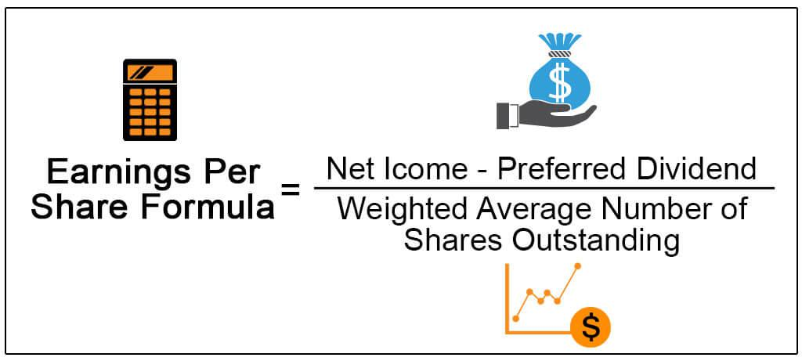

Understanding key metrics in financial markets is essential for making informed investment decisions. One such critical metric that investors frequently analyze is Earnings Per Share (EPS). EPS measures a company's profitability by indicating how much money a company makes for each share of its stock. In recent years, the integration of technology into trading has significantly transformed the landscape, leading to the rise of algorithmic trading, commonly known as algo trading.

Algo trading involves using computer algorithms to automate trading strategies, enabling trades to be executed at speeds and frequencies that are impossible for a human trader. This technological advancement has created a dynamic interplay between financial metrics like EPS and trading strategies. By leveraging EPS in conjunction with advanced algorithms, traders can gain a more comprehensive understanding of market movements and optimize their trading performance.



In this article, we will examine the intersection of EPS, its financial formula, and its application in algorithmic trading strategies. Whether you're an experienced investor or a newcomer to the financial markets, grasping these concepts can greatly enhance your trading expertise.

## Table of Contents

## Understanding Earnings Per Share (EPS)

Earnings Per Share (EPS) is an essential financial metric that measures a company's profitability on a per-share basis. It is derived by dividing a company's net earnings by the number of its outstanding shares. The formula is expressed as:

$$
\text{EPS} = \frac{\text{Net Income} - \text{Preferred Dividends}}{\text{Average Outstanding Shares}}
$$

Understanding EPS is crucial for both investors and traders as it serves as a barometer of a company's financial health. An increasing EPS indicates that a company is improving its ability to generate profit from its operations, which can be an attractive signal for potential investors. Conversely, a declining EPS might suggest potential challenges within the company, possibly deterring investment.

EPS is particularly useful when comparing companies within the same industry. Since it provides a standardized measure of profitability, it allows investors to assess which companies are performing better relative to their peers. For example, an investor might prefer a company with a higher EPS over another with lower EPS, assuming other factors such as market conditions and industry position are similar.

Furthermore, EPS is not just a raw profitability measure but also influences stock valuations. Investors often use EPS in conjunction with other indicators, such as the Price-to-Earnings (P/E) ratio, to evaluate a stock's market value. A company with a strong, consistently rising EPS is typically viewed as a better investment, often leading to a higher stock price.

For traders, EPS provides insights that can influence trading decisions. Understanding how EPS is calculated and the factors that affect it, such as net income and the issuance of additional shares, is vital for analyzing company reports and making informed trading decisions. Monitoring EPS trends can help in predicting the future financial performance of a company, thereby assisting in strategizing entry and [exit](/wiki/exit-strategy) points in trading activities.

In summary, EPS is a pivotal metric for analyzing a company's profitability and market potential. Its significance in assessing financial health makes it a critical tool for both investors conducting [fundamental analysis](/wiki/fundamental-analysis) and traders seeking to make data-driven decisions.

## The EPS Financial Formula Explained

Earnings Per Share (EPS) is a fundamental measure of a company's profitability, central to investor analysis. The basic EPS formula is:

$$
\text{EPS} = \frac{\text{Net Income} - \text{Preferred Dividends}}{\text{Average Outstanding Shares}}
$$

Understanding each component of this formula is essential for accurate financial analysis. Let's explore each element in detail:

1. **Net Income**: This is the total profit of a company after all expenses, taxes, and costs have been deducted from total revenue. It represents the actual profit available to shareholders and is a key indicator of a company’s financial health. Net income can fluctuate with changes in operations, market conditions, or management effectiveness.

2. **Preferred Dividends**: These are dividends that a company must pay to its preferred shareholders before any dividends can be paid to common shareholders. Preferred dividends are subtracted from net income because they are obligations that reduce the income available to common shareholders. 

3. **Average Outstanding Shares**: These represent the number of shares that are currently owned by shareholders, including restricted shares held by the company's officers and insiders. Instead of using just the current number of outstanding shares at the end of the period, the average over the reporting period is considered, to account for any variations caused by stock issuance or buybacks during that time frame.

### Impact of Each Component:

- **Net Income**: A higher net income typically increases EPS, signaling higher profitability and possibly leading to a rise in stock prices. Conversely, a drop in net income can decrease EPS and might indicate financial challenges.

- **Preferred Dividends**: An increase in preferred dividends reduces EPS available to common shareholders. Companies with large preferred stock issuances might find their EPS dampened, impacting investor perception negatively.

- **Average Outstanding Shares**: A company that issues more shares can dilute EPS, as the profit is spread over a larger number of shares. Conversely, share buybacks can reduce the number of outstanding shares, potentially increasing EPS.

### Real-World Example:

Consider a hypothetical company, ABC Corp, with a reported net income of $2,000,000, preferred dividends amounting to $200,000, and average outstanding shares of 500,000.

$$
\text{EPS} = \frac{2,000,000 - 200,000}{500,000} = \frac{1,800,000}{500,000} = 3.60
$$

In this example, ABC Corp’s EPS is $3.60. This figure provides investors with an understanding of the profit attributable to each share of common stock.

### Python Calculation Example:

For automated calculations, a simple Python script might be utilized:

```python
def calculate_eps(net_income, preferred_dividends, avg_outstanding_shares):
    return (net_income - preferred_dividends) / avg_outstanding_shares

# Example for ABC Corp
net_income = 2000000
preferred_dividends = 200000
avg_outstanding_shares = 500000

eps = calculate_eps(net_income, preferred_dividends, avg_outstanding_shares)
print(f"EPS: {eps:.2f}")
```

Understanding and calculating EPS is crucial for assessing company performance and making sound trading decisions. Its analysis helps investors compare profitability across companies and make informed choices based on the financial health and market position of a business.

## Algorithmic Trading and EPS

Algorithmic trading, or algo trading, involves utilizing computer algorithms to execute trades rapidly and in large volumes. The integration of Earnings Per Share (EPS) into [algorithmic trading](/wiki/algorithmic-trading) strategies is common due to its role as a key indicator of a company's stock value. EPS represents a company's profitability and is calculated as the net income available to common shareholders divided by the average number of outstanding shares. Given its importance, EPS data is frequently integrated into trading algorithms to inform precise trading decisions.

Traders often incorporate EPS data into their algorithms as part of broader financial models to drive decision-making processes. These algorithms can process large datasets to identify patterns and trends that might not be immediately apparent through manual analysis. For instance, by analyzing historical EPS data, traders can develop predictive models to anticipate potential market movements. These models may include patterns related to seasonal earnings changes, industry-specific economic factors, or even broader macroeconomic indicators.

The use of EPS in algorithmic trading strategies offers several benefits. It enhances decision-making by providing a more comprehensive view of a company's performance over time, allowing traders to make more informed predictions about future stock movements. Additionally, by automating the trading process, algorithms can react to EPS changes faster than human traders, potentially capitalizing on opportunities that arise immediately after earnings announcements.

However, there are also certain risks associated with utilizing EPS in algorithmic trading. The quality and timeliness of the EPS data are crucial as errors or delays can lead to misinformed trading decisions. Furthermore, market [volatility](/wiki/volatility-trading-strategies) around earnings announcements can introduce additional risks, as rapid short-term price movements can deviate from the long-term patterns identified by predictive models. Therefore, traders must balance their reliance on EPS data with other indicators and continuously refine their algorithms to adapt to changing market conditions.

In summary, EPS is a vital component of many algorithmic trading strategies, enabling traders to harness historical data and predictive modeling to make more precise and informed trading decisions. While offering considerable advantages, the effective use of EPS in algorithmic trading requires careful management of data quality and a well-rounded approach to strategy development.

## Building an EPS-Based Trading Algorithm

Creating an algorithmic trading strategy based on Earnings Per Share (EPS) involves several critical steps, each contributing to the development and effectiveness of the trading system. Here is an outline of the core components in constructing an EPS-driven trading algorithm.

### Data Gathering

The first step in building an EPS-based trading algorithm is to gather comprehensive and high-quality EPS data. This data usually comes from financial statements released by public companies and can be obtained through financial data providers, APIs, or directly from company filings. The data should include both historical and current EPS figures to allow for accurate analysis and model development.

### Selecting Appropriate EPS Data

Choosing the right EPS data is crucial. Traders should consider not just the absolute EPS figures but also trends over time, such as quarterly EPS growth rates, year-over-year comparisons, and forward EPS estimates. These metrics help in gauging a company's future earnings potential. Additionally, it is important to consider the context around EPS figures, such as industry standards and economic conditions, as these factors can impact how EPS data is interpreted.

### Strategy Development and Coding

Once the data is gathered, the next step is coding the trading logic. This involves developing algorithms that can interpret EPS data to make buy, sell, or hold decisions. A simple example in Python might involve setting a threshold for EPS growth; for instance, if a company's EPS has grown by more than 10% compared to the previous quarter, the algorithm might suggest buying stock.

```python
# Basic example of an EPS-based trading algorithm
def assess_eps_growth(current_eps, previous_eps):
    growth_rate = (current_eps - previous_eps) / previous_eps * 100
    if growth_rate > 10:
        return "buy"
    elif growth_rate < -10:
        return "sell"
    else:
        return "hold"
```

This code snippet provides a basic logic flow where decisions are made based on defined EPS growth rates. In practice, trading algorithms would incorporate more sophisticated statistical models and [machine learning](/wiki/machine-learning) techniques to predict stock movements.

### Backtesting the Algorithm

Backtesting is a vital process where the algorithm is evaluated against historical market data to assess its performance. This involves running the algorithm over past EPS data to see how it would have performed in different market conditions. The goal is to ensure the strategy is not only profitable in theory but also robust across various scenarios.

```python
# Pseudocode for backtesting
for each in historical_data:
    decision = assess_eps_growth(current_eps, previous_eps)
    simulate_trade(decision, market_data)
```

### Regular Updates and Maintenance

Financial markets are dynamic; hence, an EPS-based trading algorithm must be regularly updated to reflect the latest data and trends. This involves consistently feeding the algorithm with new EPS figures and market information and recalibrating its parameters to adapt to any changes. Automation tools can be implemented to streamline these updates, ensuring the trading strategy remains pertinent over time.

### Examples of Simple Strategies

One example of a simple algorithmic strategy might involve creating a portfolio of stocks from companies with consistent EPS growth over several quarters. Another strategy could involve shorting stocks of companies that have announced declining EPS due to adverse factors, anticipating further decline.

Developing a trading algorithm that responds to EPS data requires technical skills, financial knowledge, and strategic thinking. By systematically addressing data selection, strategy coding, [backtesting](/wiki/backtesting), and regular maintenance, traders can create efficient and potentially profitable EPS-based trading systems tailored to their investment goals.

## Benefits and Challenges of Using EPS in Algo Trading

Utilizing Earnings Per Share (EPS) in algorithmic trading offers several distinct advantages and challenges. One of the primary benefits of incorporating EPS into trading algorithms is the enhanced decision-making and efficiency it brings. By integrating EPS data, traders can gain deeper insights into a company's stock performance. As EPS is a direct reflection of a company's profitability, it becomes a critical component in evaluating stock value and making informed trading decisions. Traders can utilize historical EPS data to identify trends and develop predictive models that anticipate future market movements, leading to better and faster decision-making.

Additionally, the automation involved in algorithmic trading allows for executing large volumes of trades at high speed, which leverages the EPS data to act on market opportunities much quicker than manual trading. This capability can lead to improved returns on investment as algorithms optimize entry and exit points based on real-time data.

Despite these advantages, several challenges are inherent in using EPS for algorithmic trading. One of the main challenges is ensuring the quality and accuracy of EPS data. Financial reports can vary in their reporting practices, potentially leading to discrepancies or misinterpretation of the EPS figures. Market volatility further complicates the use of EPS data, as rapid changes in stock prices can undermine the assumptions made in trading algorithms.

To address these challenges, traders should implement rigorous data validation processes and use robust data sources to ensure EPS figures are accurate and reliable. Regular adjustment and backtesting of algorithms are crucial to account for market changes and new data. Strategies should be flexible enough to adapt to varying market conditions, incorporating advanced risk management techniques to withstand adverse movements.

Moreover, it is essential for traders to continuously refine their algorithms. This can involve the use of machine learning techniques to dynamically adjust strategies based on incoming data, improving the algorithm's response to unexpected market conditions. By employing a combination of historical and real-time EPS data, traders can more effectively calibrate their algorithms to maximize performance while minimizing risks.

In summary, while EPS provides valuable insights into stock performance, the challenges of data quality and market volatility require careful consideration. Traders must stay vigilant and proactive, constantly refining their algorithms to successfully incorporate EPS data into their trading strategies. With these best practices, the potential of EPS-based algorithmic trading can be fully realized, leading to more informed and efficient trading outcomes.

## Conclusion

Earnings Per Share (EPS) is an essential metric for assessing a company's financial performance, and it has significant implications in the financial market. As a measure of profitability, EPS serves as a key variable in evaluating stock value, guiding investors in making more informed decisions. By integrating EPS with algorithmic trading, traders can leverage the metric's predictive capacity to enhance their trading strategies, executing high-speed trades with precision.

Incorporating EPS into algorithmic trading combines fundamental financial analysis with advanced technological capabilities, allowing for optimized performance. Understanding both the calculation of EPS and its role in trading algorithms is crucial for achieving success. This dual knowledge helps traders devise more effective strategies by using real-time data and backtesting models to refine their approach continually.

Throughout this article, we have explored the central concepts, advantages, and potential challenges associated with using EPS in algorithmic trading. EPS, when harnessed effectively, can serve as a powerful tool for navigating the complexities of modern financial markets. By staying informed and adapting to new financial data, traders can better position themselves to capitalize on market opportunities and mitigate risks. Armed with insights into EPS and its application in trading algorithms, traders are better equipped to thrive amid the uncertainties and dynamics of today's financial landscape.

## References & Further Reading

[1]: ["Algorithmic Trading and DMA: An Introduction to Direct Access Trading Strategies"](https://archive.org/details/algorithmictradi0000john) by Barry Johnson

[2]: ["Advances in Financial Machine Learning"](https://www.amazon.com/Advances-Financial-Machine-Learning-Marcos/dp/1119482089) by Marcos Lopez de Prado

[3]: ["Evidence-Based Technical Analysis: Applying the Scientific Method and Statistical Inference to Trading Signals"](https://www.amazon.com/Evidence-Based-Technical-Analysis-Scientific-Statistical/dp/0470008741) by David Aronson

[4]: ["Machine Learning for Algorithmic Trading"](https://github.com/stefan-jansen/machine-learning-for-trading) by Stefan Jansen

[5]: ["Quantitative Trading: How to Build Your Own Algorithmic Trading Business"](https://www.amazon.com/Quantitative-Trading-Build-Algorithmic-Business/dp/1119800064) by Ernest P. Chan

[6]: ["The Intelligent Investor: The Definitive Book on Value Investing"](https://www.amazon.com/Intelligent-Investor-Definitive-Investing-Essentials/dp/0060555661) by Benjamin Graham

[7]: ["Financial Statement Analysis and Security Valuation"](https://www.mhprofessional.com/financial-statement-analysis-and-security-valuation-9780078025310-usa) by Stephen H. Penman