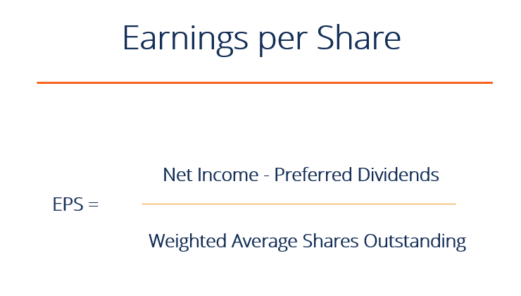

## Table of Contents

## What is Earnings Per Share (EPS)?

Earnings Per Share (EPS) is a number that shows how much money a company made for each share of its stock. It is calculated by taking the company's total earnings and dividing it by the number of shares that people own. This number is important because it helps investors understand how well a company is doing. If the EPS is high, it means the company is making a lot of money for each share, which is good for shareholders.

EPS can be used in different ways. For example, investors often compare the EPS of a company from one year to the next to see if the company is growing. They might also compare the EPS of different companies to decide which one is a better investment. Sometimes, companies might have a high EPS because they have fewer shares, not because they are making more money. So, it's important to look at other information too, not just the EPS.

## Why is EPS important for investors?

EPS is important for investors because it tells them how much money a company is making for each share of its stock. This helps investors see if the company is doing well. If the EPS is high, it means the company is making a lot of money for each share, which is good for people who own the stock. Investors can use EPS to compare how a company is doing from one year to the next. If the EPS goes up, it might mean the company is growing and making more money.

Investors also use EPS to compare different companies. They might look at the EPS of two companies to decide which one is a better investment. But, it's important to remember that a high EPS can sometimes be because a company has fewer shares, not because it's making more money. So, investors need to look at other information too, not just the EPS. This helps them make smarter choices about where to put their money.

## What is the basic formula for calculating EPS?

The basic formula for calculating EPS is to take the company's total earnings and divide it by the number of shares that people own. Total earnings are the money the company made after paying all its bills and taxes. The number of shares is how many pieces of the company people can buy. So, if a company made $100 and there are 10 shares, the EPS would be $100 divided by 10, which equals $10 per share.

There are two types of EPS: basic and diluted. Basic EPS uses the number of shares that are currently out there. Diluted EPS takes into account other things that could turn into shares, like stock options or convertible bonds. This gives a more complete picture of what the EPS might be if all those other things turned into shares. Both types of EPS help investors understand how much money the company is making for each piece of the company they own.

## How do you calculate the net income for EPS?

To calculate the net income for EPS, you start with the company's total revenue. Revenue is all the money the company makes from selling its products or services. From this total revenue, you subtract all the costs and expenses the company has. These include things like the cost of making the products, paying employees, rent, and other bills. After subtracting all these costs, you are left with the company's earnings before taxes. Then, you subtract the taxes the company owes, and what you have left is the net income. This net income is the money the company made after paying for everything.

Once you have the net income, you can use it to calculate the EPS. You do this by dividing the net income by the total number of shares the company has. For example, if a company's net income is $1 million and it has 100,000 shares, the EPS would be $1 million divided by 100,000, which equals $10 per share. This number tells investors how much money the company made for each share of its stock. It's a simple way to see if the company is doing well and making money for its shareholders.

## What is the difference between basic EPS and diluted EPS?

Basic EPS and diluted EPS are two ways to figure out how much money a company makes for each share of its stock. Basic EPS is the simpler of the two. To find it, you take the company's net income and divide it by the number of shares that are currently out there. This gives you a straightforward idea of how much money the company made for each share that people own right now.

Diluted EPS, on the other hand, looks at what might happen if certain things turned into more shares. These things can be stock options, convertible bonds, or other things that could become shares. So, to calculate diluted EPS, you start with the net income and divide it by a bigger number of shares. This bigger number includes not just the shares that are out there now, but also the shares that could be out there if those other things turned into shares. Diluted EPS gives a more complete picture of what the EPS might be in the future, which can be helpful for investors trying to understand the company's potential.

## How does the number of outstanding shares affect EPS?

The number of outstanding shares is really important when figuring out EPS. If a company has fewer shares, the EPS will be higher because you're dividing the net income by a smaller number. For example, if a company makes $100 and has 10 shares, the EPS is $10. But if the same company had 20 shares, the EPS would be $5. So, fewer shares mean a higher EPS, which can make the company look more profitable to investors.

On the other hand, if a company has more shares, the EPS will be lower. This is because you're spreading the same amount of net income over more shares. For example, if a company makes $100 but has 50 shares, the EPS is only $2. A lower EPS might make the company seem less profitable, even if the total net income hasn't changed. This is why companies sometimes buy back their own shares to reduce the number of outstanding shares and boost the EPS.

## Can you explain the impact of stock dividends and splits on EPS?

When a company gives out stock dividends, it gives more shares to its shareholders. This means the total number of shares goes up. If the company's net income stays the same, but there are more shares, the EPS goes down. For example, if a company makes $100 and has 10 shares, the EPS is $10. But if it gives out a stock dividend and now has 15 shares, the EPS drops to about $6.67. So, stock dividends can make the EPS look lower, even if the company is making the same amount of money.

Stock splits work in a similar way. A stock split means the company is dividing its existing shares into more, smaller pieces. If a company does a 2-for-1 split, each share turns into two shares. This doubles the number of shares, but the net income stays the same. So, if a company had 10 shares and made $100, the EPS was $10. After a 2-for-1 split, there are 20 shares, and the EPS drops to $5. Stock splits don't change the total value of the company, but they do make the EPS lower because there are more shares to divide the net income by.

## What adjustments are needed for preferred dividends in the EPS calculation?

When calculating EPS, you need to make an adjustment for preferred dividends. Preferred dividends are payments that a company makes to people who own preferred stock. These dividends are different from the dividends paid to people who own common stock. To find the EPS, you start with the company's net income. But before you divide that by the number of shares, you need to subtract the preferred dividends from the net income. This is because the preferred dividends are money that the company has to pay out, so it's not part of the earnings that go to common shareholders.

After you subtract the preferred dividends from the net income, you divide what's left by the number of common shares. This gives you the EPS for common shareholders. For example, if a company's net income is $100 and it pays $10 in preferred dividends, you subtract $10 from $100 to get $90. If the company has 10 common shares, the EPS would be $90 divided by 10, which equals $9 per share. This adjustment makes sure that the EPS reflects the earnings that are actually available to common shareholders.

## How do you account for complex capital structures in EPS calculations?

When a company has a complex capital structure, it means they have more than just common stock. They might have things like stock options, convertible bonds, or other securities that could turn into more common shares. To figure out the EPS for these companies, you need to look at both the basic EPS and the diluted EPS. Basic EPS is simple: it's the net income minus preferred dividends, divided by the number of common shares out there right now. But for diluted EPS, you have to think about what would happen if all those other securities turned into more shares.

To calculate diluted EPS, you start with the same net income minus preferred dividends. Then, you figure out how many more shares would be out there if all those other securities turned into common stock. This might mean adding in the shares that would come from stock options or convertible bonds. You divide the net income by this bigger number of shares. Diluted EPS gives a more complete picture of what the earnings per share could be if all those other things turned into shares. This helps investors understand the potential impact of the company's complex capital structure on its EPS.

## What are the common pitfalls to avoid when calculating EPS?

One common mistake when calculating EPS is forgetting to adjust for preferred dividends. Preferred dividends are money the company pays to people who own a special kind of stock. You need to subtract these dividends from the net income before dividing by the number of shares. If you don't do this, your EPS will be too high because it won't show the real earnings available to common shareholders.

Another pitfall is not considering the effect of a company's complex capital structure. Companies might have things like stock options or convertible bonds that could turn into more shares. If you only calculate basic EPS and ignore these, you miss out on the diluted EPS, which shows what the EPS would be if all those other things turned into shares. This can give investors a false idea of the company's earnings per share.

## How can EPS be manipulated and what are the implications?

Companies can sometimes try to make their EPS look better than it really is. One way they might do this is by buying back their own shares. When a company buys back its shares, it reduces the number of shares that are out there. This means the same amount of net income is divided by fewer shares, so the EPS goes up. Another way is by changing how they count their earnings. For example, a company might decide to include some income that they usually wouldn't count, or they might delay counting some expenses. This makes the net income look higher, which also makes the EPS look better.

When companies manipulate their EPS, it can be bad for investors. If investors think the EPS is higher than it really is, they might decide to buy the company's stock thinking it's doing better than it actually is. This can lead to people making bad investment choices. Also, if a company gets caught trying to make its EPS look better, it can lose the trust of investors and might even get in trouble with the law. So, it's important for investors to look at other information too, not just the EPS, to get a full picture of how a company is doing.

## What advanced metrics can be used alongside EPS for deeper financial analysis?

When looking at a company's financial health, EPS is a good start, but there are other advanced metrics that can give you a deeper understanding. One useful metric is the Price-to-Earnings (P/E) Ratio. This tells you how much you're paying for each dollar of the company's earnings. You find it by taking the stock's price and dividing it by the EPS. A high P/E ratio might mean people think the company will grow a lot in the future, while a low P/E ratio might mean the company is undervalued or not expected to grow much. Another important metric is Return on Equity (ROE), which shows how well a company is using the money that shareholders have put into it. You calculate ROE by dividing the net income by the shareholders' equity. A high ROE means the company is good at turning shareholder money into profits.

Another helpful metric is the Debt-to-Equity Ratio, which shows how much debt a company is using compared to the money from shareholders. You find it by dividing the company's total debt by its total equity. A high debt-to-equity ratio might mean the company is taking on a lot of risk, while a low ratio might mean it's being more careful. Additionally, the Free Cash Flow (FCF) metric can tell you how much cash a company has left after paying for everything it needs to run the business. This is important because it shows how much money the company has to grow, pay dividends, or buy back shares. You calculate FCF by taking the operating cash flow and subtracting capital expenditures. Using these metrics alongside EPS gives you a fuller picture of a company's financial health and helps you make smarter investment decisions.

## What is Understanding Earnings Per Share (EPS)?

Earnings Per Share (EPS) is an essential financial metric that measures a company's profitability on a per-share basis. It is derived by dividing a company's net earnings by the number of its outstanding shares. The formula is expressed as:

$$
\text{EPS} = \frac{\text{Net Income} - \text{Preferred Dividends}}{\text{Average Outstanding Shares}}
$$

Understanding EPS is crucial for both investors and traders as it serves as a barometer of a company's financial health. An increasing EPS indicates that a company is improving its ability to generate profit from its operations, which can be an attractive signal for potential investors. Conversely, a declining EPS might suggest potential challenges within the company, possibly deterring investment.

EPS is particularly useful when comparing companies within the same industry. Since it provides a standardized measure of profitability, it allows investors to assess which companies are performing better relative to their peers. For example, an investor might prefer a company with a higher EPS over another with lower EPS, assuming other factors such as market conditions and industry position are similar.

Furthermore, EPS is not just a raw profitability measure but also influences stock valuations. Investors often use EPS in conjunction with other indicators, such as the Price-to-Earnings (P/E) ratio, to evaluate a stock's market value. A company with a strong, consistently rising EPS is typically viewed as a better investment, often leading to a higher stock price.

For traders, EPS provides insights that can influence trading decisions. Understanding how EPS is calculated and the factors that affect it, such as net income and the issuance of additional shares, is vital for analyzing company reports and making informed trading decisions. Monitoring EPS trends can help in predicting the future financial performance of a company, thereby assisting in strategizing entry and [exit](/wiki/exit-strategy) points in trading activities.

In summary, EPS is a pivotal metric for analyzing a company's profitability and market potential. Its significance in assessing financial health makes it a critical tool for both investors conducting [fundamental analysis](/wiki/fundamental-analysis) and traders seeking to make data-driven decisions.

## What is the EPS Financial Formula and How is it Explained?

Earnings Per Share (EPS) is a fundamental measure of a company's profitability, central to investor analysis. The basic EPS formula is:

$$
\text{EPS} = \frac{\text{Net Income} - \text{Preferred Dividends}}{\text{Average Outstanding Shares}}
$$

Understanding each component of this formula is essential for accurate financial analysis. Let's explore each element in detail:

1. **Net Income**: This is the total profit of a company after all expenses, taxes, and costs have been deducted from total revenue. It represents the actual profit available to shareholders and is a key indicator of a company’s financial health. Net income can fluctuate with changes in operations, market conditions, or management effectiveness.

2. **Preferred Dividends**: These are dividends that a company must pay to its preferred shareholders before any dividends can be paid to common shareholders. Preferred dividends are subtracted from net income because they are obligations that reduce the income available to common shareholders. 

3. **Average Outstanding Shares**: These represent the number of shares that are currently owned by shareholders, including restricted shares held by the company's officers and insiders. Instead of using just the current number of outstanding shares at the end of the period, the average over the reporting period is considered, to account for any variations caused by stock issuance or buybacks during that time frame.

### Impact of Each Component:

- **Net Income**: A higher net income typically increases EPS, signaling higher profitability and possibly leading to a rise in stock prices. Conversely, a drop in net income can decrease EPS and might indicate financial challenges.

- **Preferred Dividends**: An increase in preferred dividends reduces EPS available to common shareholders. Companies with large preferred stock issuances might find their EPS dampened, impacting investor perception negatively.

- **Average Outstanding Shares**: A company that issues more shares can dilute EPS, as the profit is spread over a larger number of shares. Conversely, share buybacks can reduce the number of outstanding shares, potentially increasing EPS.

### Real-World Example:

Consider a hypothetical company, ABC Corp, with a reported net income of $2,000,000, preferred dividends amounting to $200,000, and average outstanding shares of 500,000.

$$
\text{EPS} = \frac{2,000,000 - 200,000}{500,000} = \frac{1,800,000}{500,000} = 3.60
$$

In this example, ABC Corp’s EPS is $3.60. This figure provides investors with an understanding of the profit attributable to each share of common stock.

### Python Calculation Example:

For automated calculations, a simple Python script might be utilized:

```python
def calculate_eps(net_income, preferred_dividends, avg_outstanding_shares):
    return (net_income - preferred_dividends) / avg_outstanding_shares

# Example for ABC Corp
net_income = 2000000
preferred_dividends = 200000
avg_outstanding_shares = 500000

eps = calculate_eps(net_income, preferred_dividends, avg_outstanding_shares)
print(f"EPS: {eps:.2f}")
```

Understanding and calculating EPS is crucial for assessing company performance and making sound trading decisions. Its analysis helps investors compare profitability across companies and make informed choices based on the financial health and market position of a business.

## References & Further Reading

[1]: ["Algorithmic Trading and DMA: An Introduction to Direct Access Trading Strategies"](https://archive.org/details/algorithmictradi0000john) by Barry Johnson

[2]: ["Advances in Financial Machine Learning"](https://www.amazon.com/Advances-Financial-Machine-Learning-Marcos/dp/1119482089) by Marcos Lopez de Prado

[3]: ["Evidence-Based Technical Analysis: Applying the Scientific Method and Statistical Inference to Trading Signals"](https://www.amazon.com/Evidence-Based-Technical-Analysis-Scientific-Statistical/dp/0470008741) by David Aronson

[4]: ["Machine Learning for Algorithmic Trading"](https://github.com/stefan-jansen/machine-learning-for-trading) by Stefan Jansen

[5]: ["Quantitative Trading: How to Build Your Own Algorithmic Trading Business"](https://www.amazon.com/Quantitative-Trading-Build-Algorithmic-Business/dp/1119800064) by Ernest P. Chan

[6]: ["The Intelligent Investor: The Definitive Book on Value Investing"](https://www.amazon.com/Intelligent-Investor-Definitive-Investing-Essentials/dp/0060555661) by Benjamin Graham

[7]: ["Financial Statement Analysis and Security Valuation"](https://www.mhprofessional.com/financial-statement-analysis-and-security-valuation-9780078025310-usa) by Stephen H. Penman