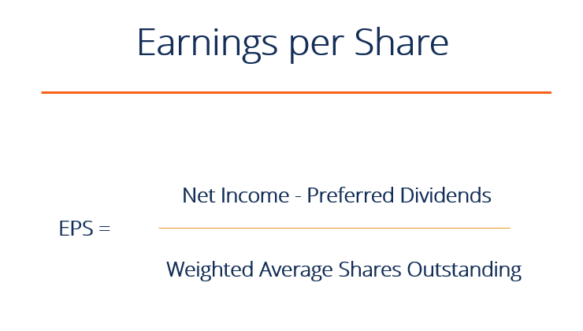

## Table of Contents

## What is Earnings per Share (EPS)?

Earnings per Share (EPS) is a number that shows how much money a company made for each share of its stock. It is calculated by taking the company's total earnings and dividing it by the number of shares that are out there. This number is important because it helps investors see how well the company is doing and how much profit they might get for each share they own.

People often use EPS to compare different companies or to see how a company is doing over time. If the EPS is going up, it usually means the company is making more money and doing better. But if the EPS is going down, it might mean the company is not doing as well. Investors look at EPS to help them decide if they should buy, sell, or keep their shares in a company.

## How is basic EPS calculated?

Basic EPS is a way to figure out how much money a company made for each share of its stock. You calculate it by taking the company's total earnings, which is the money left after paying all the bills and taxes, and then dividing that number by the total number of shares that people own. This gives you the basic EPS.

For example, if a company made $1 million in profit and there are 1 million shares of stock, the basic EPS would be $1 per share. It's a simple calculation but very important because it shows investors how much profit they are getting for each share they own.

## What is the difference between basic EPS and diluted EPS?

Basic EPS and diluted EPS are two ways to measure how much money a company makes for each share of its stock. Basic EPS is calculated by taking the company's total earnings and dividing it by the number of shares that are currently out there. It's a simple way to see how much profit each share is making right now.

Diluted EPS, on the other hand, takes into account not just the shares that are currently out there, but also any other shares that could be created in the future. This includes things like stock options, convertible bonds, and other securities that could turn into more shares. So, diluted EPS gives a more conservative estimate because it assumes that all these potential shares might be created, which would spread the earnings over more shares and lower the EPS. This helps investors get a fuller picture of what the earnings per share might look like if all possible shares were included.

## Why is EPS important for investors?

EPS is important for investors because it tells them how much money a company is making for each share of its stock. This number helps investors see if a company is doing well or not. If the EPS is going up, it usually means the company is making more money, which can be good news for investors. They might decide to buy more shares or keep the ones they have because they think the company will keep doing well.

On the other hand, if the EPS is going down, it might mean the company is not doing as well. This can be a warning sign for investors. They might decide to sell their shares or not buy any more because they worry the company might not make as much money in the future. By looking at EPS, investors can make better choices about buying, selling, or holding onto their shares.

## How can EPS be used to compare companies within the same industry?

EPS can be used to compare companies within the same industry by showing how much profit each company makes for each share of its stock. If two companies in the same industry have different EPS numbers, it can tell investors which company is making more money per share. For example, if Company A has an EPS of $2 and Company B has an EPS of $1, it means that Company A is making more money for each share of its stock. This can help investors decide which company might be a better investment.

However, it's important to look at more than just EPS when comparing companies. Other things like the size of the company, how fast it's growing, and what its future plans are can also matter. Sometimes a company with a lower EPS might still be a good investment if it's growing quickly or if it's in a part of the industry that's doing well. So, while EPS is a helpful number, it's just one piece of the puzzle when deciding which company to invest in.

## What are the limitations of using EPS as a financial metric?

While EPS is a helpful way to see how much money a company makes for each share of its stock, it has some limitations. One big problem is that EPS doesn't tell the whole story about a company's financial health. It only shows earnings, but doesn't say anything about the company's debts, how much it spends on things like new equipment, or how much money it has coming in from sales. So, if a company has a high EPS but also a lot of debt, it might not be as healthy as it seems.

Another limitation is that EPS can be affected by things that don't really show how well a company is doing. For example, a company might sell off a part of its business and use that money to boost its earnings for one year, making the EPS look better. But this doesn't mean the company is doing better in the long run. Also, EPS can be different from one company to another because of things like how many shares they have or how they count their earnings. This makes it hard to compare EPS numbers across different companies without looking at other information too.

## How does stock repurchasing affect EPS?

When a company buys back its own stock, it's called stock repurchasing. This can make the EPS go up. Here's how it works: when a company buys back its shares, the total number of shares out there goes down. Since EPS is calculated by dividing the company's total earnings by the number of shares, fewer shares mean the earnings are spread over a smaller number of shares. So, even if the total earnings stay the same, the EPS will be higher because the earnings are divided by a smaller number.

However, stock repurchasing doesn't always mean the company is doing better. Sometimes, a company might buy back its shares just to make the EPS look better, even if the company's overall health hasn't improved. It's important for investors to look at other things too, like how much money the company is making from its main business and how much debt it has. That way, they can see if the higher EPS from stock repurchasing really means the company is doing well.

## Can EPS be manipulated by companies, and if so, how?

Yes, companies can manipulate EPS in different ways. One way is by changing how they count their earnings. For example, a company might decide to sell off a part of its business and use that money to make its earnings look better for one year. This can make the EPS go up, but it doesn't mean the company is doing better in the long run. Another way is by playing with the number of shares. If a company buys back its own shares, it reduces the total number of shares out there. This makes the EPS go up because the same amount of earnings is now spread over fewer shares.

Companies can also use accounting tricks to change their EPS. They might move expenses around to different time periods or use different ways to count their earnings that make the numbers look better. For example, a company might decide to take a big expense in one year to make the next year's earnings look better. This can make the EPS go up in the next year, but it's not a real improvement in the company's performance. It's important for investors to look at more than just EPS to see if a company is really doing well.

## What is the significance of negative EPS?

When a company has a negative EPS, it means the company lost money instead of making a profit. Instead of [earning](/wiki/earning-announcement) money for each share of its stock, the company is losing money for each share. This can be a warning sign for investors because it shows that the company is not doing well financially. If a company keeps having a negative EPS, it might mean it's struggling to make money and could be in trouble.

However, a negative EPS doesn't always mean a company is doomed. Sometimes, companies might have a negative EPS because they are spending a lot of money on new projects or expanding their business. If these investments pay off in the future, the company might start making money again. So, while a negative EPS is something to watch out for, it's important for investors to look at the whole picture and see why the company is losing money before deciding what to do with their shares.

## How do analysts forecast future EPS?

Analysts forecast future EPS by looking at a lot of different things about a company. They start by looking at the company's past earnings to see if there are any patterns or trends. Then, they look at things like how much money the company is making from selling its products or services, how much it's spending, and what its plans are for the future. They also think about what's happening in the economy and in the company's industry, because these can affect how much money the company will make. By putting all this information together, analysts can make a guess about how much money the company will make in the future, and then they can figure out what the EPS might be.

Sometimes, analysts use special math formulas to help them forecast EPS. These formulas take into account things like how fast the company is growing, how much money it's making now, and what it might make in the future. Analysts might also talk to the people who run the company to get more information about their plans and what they think will happen. By using all these different pieces of information, analysts can come up with a number for what they think the future EPS will be. This helps investors decide if they want to buy, sell, or keep their shares in the company.

## What role does EPS play in the price-to-earnings (P/E) ratio?

EPS is a key part of the price-to-earnings (P/E) ratio, which is a number that investors use to see if a company's stock is a good buy. The P/E ratio is calculated by taking the price of one share of the company's stock and dividing it by the EPS. So, if a stock costs $50 and the EPS is $5, the P/E ratio would be 10. This number helps investors understand how much they are paying for each dollar of the company's earnings. If the P/E ratio is low, it might mean the stock is a good deal because you're paying less for each dollar of earnings.

The P/E ratio can be used to compare different companies or to see how a company's stock price is doing over time. If a company's P/E ratio is higher than others in its industry, it might mean that investors think the company will grow a lot in the future. But if the P/E ratio is lower, it could mean that investors are worried about the company's future. By looking at the P/E ratio, which depends on EPS, investors can make better decisions about whether to buy, sell, or keep their shares in a company.

## How do international accounting standards impact the calculation of EPS?

International accounting standards can affect how companies calculate their EPS because these standards set rules on how to count earnings and shares. Different countries might use different accounting rules, but many follow standards like the International Financial Reporting Standards (IFRS) or the Generally Accepted Accounting Principles (GAAP) used in the United States. These standards make sure that companies count their earnings and shares in a fair and consistent way, so investors can trust the EPS numbers. For example, IFRS and GAAP might have different rules about what counts as earnings or how to handle things like stock options, which can change the EPS.

Even though these standards help make EPS calculations more consistent, there can still be differences between companies in different countries. For instance, a company following IFRS might count some expenses differently than a company using GAAP, which can lead to different EPS numbers. This means that when investors compare EPS across different countries, they need to think about these differences and maybe look at other information too. Understanding these standards can help investors get a clearer picture of a company's earnings and make better decisions about their investments.

## What is Understanding Earnings Per Share (EPS)?

Earnings Per Share (EPS) is a key indicator of a company's profitability on a per-share basis, providing insights into the company's financial performance and overall investment appeal. EPS is calculated using the formula:

$$
\text{EPS} = \frac{\text{Net Income} - \text{Dividends on Preferred Stock}}{\text{Average Outstanding Shares}}
$$

This metric allows investors to understand how much profit a company generates for each share of its stock, thereby evaluating the company's profitability and growth potential.

EPS is essential for investors looking to assess the financial health of a company. A higher EPS indicates greater profitability and is often viewed as a signal of good financial health, potentially making the company's stock a more attractive investment. Conversely, a declining EPS might be a red flag for investors, indicating potential financial challenges.

There are different types of EPS, each providing various perspectives on a company's financial status. Basic EPS is the simplest form of this metric, calculated using the net income and the weighted average number of common shares outstanding. It does not account for any potential dilution from securities like stock options or convertible bonds.

Diluted EPS, on the other hand, provides a more conservative view by assuming that all convertible securities have been exercised and additional shares have been issued. This figure typically results in a lower EPS because it accounts for the potential increase in the number of shares and the corresponding impact on earnings per share. Diluted EPS is crucial for investors who want to understand the potential decrease in earnings per share if all convertible instruments were exercised.

By analyzing both basic and diluted EPS, investors gain a comprehensive picture of a company's profitability, taking into account both current performance and potential future changes in share composition. This dual analysis helps investors make informed decisions by weighing the company's present financial standing against possible shifts due to stock dilution.

## What is EPS in Financial Analysis?

Earnings Per Share (EPS) is a fundamental metric in financial analysis, primarily used to evaluate a company’s profitability on a per-share basis. It provides investors and analysts with insights into how effective a company is at generating profits from its equity base. The basic formula for calculating EPS is:

$$
\text{EPS} = \frac{\text{Net Income} - \text{Dividends on Preferred Stock}}{\text{Average Outstanding Shares}}
$$

This formula highlights EPS as a measure of profitability because it divides net income by the number of shares outstanding, thus attributing earnings to each share owned by investors. In this way, EPS can serve as a barometer for assessing a company's financial health.

One key application of EPS in financial analysis is its role in comparing profitability across companies within the same industry. By examining EPS figures, analysts can gauge how well companies are converting sales into profits relative to their peers. This comparative analysis can highlight industry leaders and laggards, aiding in investment decision-making.

EPS is also instrumental in deriving the Price-to-Earnings (P/E) ratio, which is a critical indicator of a stock's market value in relation to its earnings. The P/E ratio is calculated as:

$$
\text{P/E Ratio} = \frac{\text{Market Price per Share}}{\text{EPS}}
$$

This ratio allows investors to assess whether a stock is relatively overvalued or undervalued by comparing the market price with the company's earnings. A high P/E might indicate that a stock's price is high relative to earnings and possibly overvalued, while a low P/E may suggest undervaluation.

Moreover, a consistent increase in EPS over time is generally seen as a positive signal by the market, indicating potential growth and improved profitability. Such upward trends may reflect successful business strategies, effective cost management, or expansion in revenue streams. Consequently, companies demonstrating steady EPS growth often attract investors looking for prospective gains.

While EPS is a powerful metric, analysts must consider it in the context of the broader financial landscape. Factors such as economic conditions, industry dynamics, and company-specific events can all influence EPS, making it crucial to interpret EPS alongside other financial metrics for a comprehensive analysis.

## References & Further Reading

[1]: "Earnings Per Share: A Fundamental Analysis Indicator." Investopedia. [https://www.investopedia.com/terms/e/eps.asp](https://www.investopedia.com/terms/e/eps.asp)

[2]: ["Quantitative Equity Portfolio Management: An Active Approach to Portfolio Construction and Management"](https://www.mhprofessional.com/quantitative-equity-portfolio-management-second-edition-an-active-approach-to-portfolio-9781264268924-usa) by Ludwig B. Chincarini and Daehwan Kim

[3]: Sweeney, R.J. (1988). ["Some New Filter Rule Tests: Methods and Results"](https://www.jstor.org/stable/2331068). The Journal of Financial and Quantitative Analysis.

[4]: Fama, E.F., & French, K.R. (1993). ["Common Risk Factors in the Returns on Stocks and Bonds."](https://www.sciencedirect.com/science/article/pii/0304405X93900235) Journal of Financial Economics.

[5]: Lehmann, B.N. (1990). ["Fads, Martingales, and Market Efficiency."](https://www.nber.org/papers/w2533) Journal of Business Economics and Statistics.