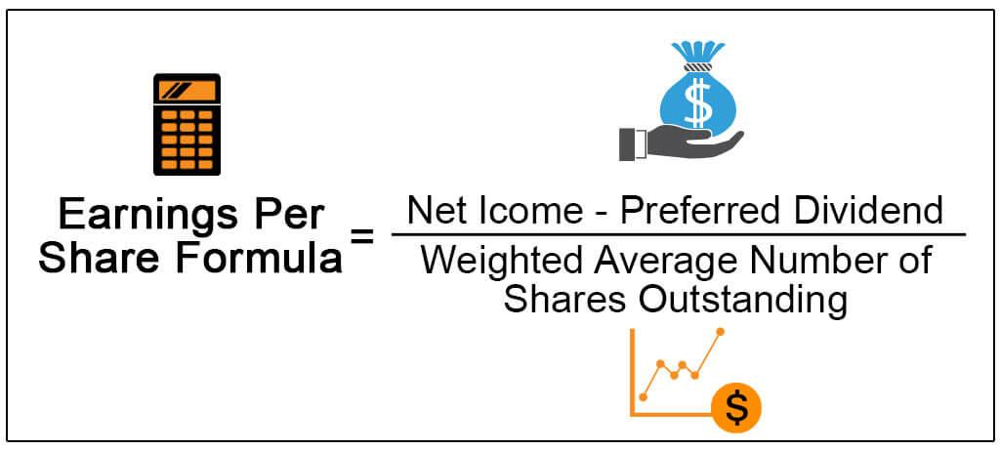

Earnings Per Share (EPS) serves as a pivotal metric in the assessment of company performance within the evolving sphere of financial trading. As a measure of the profitability associated with each outstanding share of a company’s stock, EPS offers a lens through which investors can evaluate a firm's financial health. This article illuminates the significant role EPS plays in both financial analysis and algorithmic trading, known as algo trading. In financial analysis, EPS provides insight into a company's profitability, which investors and analysts use to compare companies within the same industry. Meanwhile, in algorithmic trading, EPS is utilized within automated strategies to inform and refine trading strategies, identifying stocks with potential for growth and adjusting trading positions based on earnings announcements.

By integrating EPS into trading algorithms, traders can enhance their strategies, making them more data-driven. This understanding equips investors to make more informed decisions, potentially leading to improved trading outcomes. In a landscape where precision and informed decision-making are paramount, grasping the intricacies of EPS positions investors and algorithmic traders to capitalize on financial opportunities effectively.



## Table of Contents

## Understanding Earnings Per Share (EPS)

Earnings Per Share (EPS) is a key indicator of a company's profitability on a per-share basis, providing insights into the company's financial performance and overall investment appeal. EPS is calculated using the formula:

$$
\text{EPS} = \frac{\text{Net Income} - \text{Dividends on Preferred Stock}}{\text{Average Outstanding Shares}}
$$

This metric allows investors to understand how much profit a company generates for each share of its stock, thereby evaluating the company's profitability and growth potential.

EPS is essential for investors looking to assess the financial health of a company. A higher EPS indicates greater profitability and is often viewed as a signal of good financial health, potentially making the company's stock a more attractive investment. Conversely, a declining EPS might be a red flag for investors, indicating potential financial challenges.

There are different types of EPS, each providing various perspectives on a company's financial status. Basic EPS is the simplest form of this metric, calculated using the net income and the weighted average number of common shares outstanding. It does not account for any potential dilution from securities like stock options or convertible bonds.

Diluted EPS, on the other hand, provides a more conservative view by assuming that all convertible securities have been exercised and additional shares have been issued. This figure typically results in a lower EPS because it accounts for the potential increase in the number of shares and the corresponding impact on earnings per share. Diluted EPS is crucial for investors who want to understand the potential decrease in earnings per share if all convertible instruments were exercised.

By analyzing both basic and diluted EPS, investors gain a comprehensive picture of a company's profitability, taking into account both current performance and potential future changes in share composition. This dual analysis helps investors make informed decisions by weighing the company's present financial standing against possible shifts due to stock dilution.

## EPS in Financial Analysis

Earnings Per Share (EPS) is a fundamental metric in financial analysis, primarily used to evaluate a company’s profitability on a per-share basis. It provides investors and analysts with insights into how effective a company is at generating profits from its equity base. The basic formula for calculating EPS is:

$$
\text{EPS} = \frac{\text{Net Income} - \text{Dividends on Preferred Stock}}{\text{Average Outstanding Shares}}
$$

This formula highlights EPS as a measure of profitability because it divides net income by the number of shares outstanding, thus attributing earnings to each share owned by investors. In this way, EPS can serve as a barometer for assessing a company's financial health.

One key application of EPS in financial analysis is its role in comparing profitability across companies within the same industry. By examining EPS figures, analysts can gauge how well companies are converting sales into profits relative to their peers. This comparative analysis can highlight industry leaders and laggards, aiding in investment decision-making.

EPS is also instrumental in deriving the Price-to-Earnings (P/E) ratio, which is a critical indicator of a stock's market value in relation to its earnings. The P/E ratio is calculated as:

$$
\text{P/E Ratio} = \frac{\text{Market Price per Share}}{\text{EPS}}
$$

This ratio allows investors to assess whether a stock is relatively overvalued or undervalued by comparing the market price with the company's earnings. A high P/E might indicate that a stock's price is high relative to earnings and possibly overvalued, while a low P/E may suggest undervaluation.

Moreover, a consistent increase in EPS over time is generally seen as a positive signal by the market, indicating potential growth and improved profitability. Such upward trends may reflect successful business strategies, effective cost management, or expansion in revenue streams. Consequently, companies demonstrating steady EPS growth often attract investors looking for prospective gains.

While EPS is a powerful metric, analysts must consider it in the context of the broader financial landscape. Factors such as economic conditions, industry dynamics, and company-specific events can all influence EPS, making it crucial to interpret EPS alongside other financial metrics for a comprehensive analysis.

## EPS in Algorithmic Trading

Algorithmic trading leverages automated strategies that use vast amounts of financial data to execute trades efficiently and accurately. Earnings Per Share (EPS) can serve as a critical component in these algorithms, underpinning strategies that rely on [fundamental analysis](/wiki/fundamental-analysis). With EPS providing a clear measure of a company's profitability on a per-share basis, it offers a valuable metric to identify stocks with growth potential and adjust trading strategies accordingly.

Incorporating EPS into [algorithmic trading](/wiki/algorithmic-trading) systems involves integrating financial software with databases that update EPS data in real-time. This allows for rapid response to earnings announcements, which can significantly impact stock prices. Algorithms can be programmed to evaluate EPS trends, identifying companies that demonstrate consistent or accelerating earnings growth as preferable investment opportunities. By doing so, these systems can execute trades that capitalize on the anticipated positive performance of stocks exhibiting favorable EPS metrics.

For instance, a basic algorithm might include the following steps:

1. **Data Retrieval**: Continuously update EPS data through API connections with financial databases.

2. **Analysis Function**: Write a function to calculate and track the growth of EPS over specific periods.
   ```python
   def eps_growth(eps_current, eps_previous):
       return ((eps_current - eps_previous) / eps_previous) * 100
   ```

3. **Decision-Making Process**: Determine buy or sell signals based on EPS growth thresholds or patterns.
   ```python
   if eps_growth > threshold:
       execute_trade('buy')
   else:
       execute_trade('sell')
   ```

Integrating EPS into algorithmic trading refines strategies to become more data-driven, consequently enhancing their potential for profitability. By basing decisions on fundamental analysis enriched with timely EPS insights, traders can better predict which stocks are likely to perform well in the future.

The effectiveness of EPS in algorithmic systems is further amplified when combined with other financial indicators and metrics. A multifaceted approach provides a more holistic view, allowing traders to make informed decisions that account for a broader range of market variables.

Overall, the use of EPS in algorithmic trading offers a structured way to harness this financial metric, aligning with the goal of optimizing trading strategies and outcomes.

## Case Studies: EPS and Algo Trading

In examining the integration of Earnings Per Share (EPS) within algorithmic trading, several real-world case studies highlight the measurable impact and strategic advantages of leveraging EPS metrics. These case studies provide empirical evidence of how EPS-driven trading strategies can lead to significant financial outcomes, both positive and negative.

One notable example is the algorithm developed by a [hedge fund](/wiki/hedge-fund-trading-strategies) that prioritized investments in companies with consistently rising EPS over multiple quarters. The rationale was that a steady increase in EPS often indicates robust financial health and growth potential, surpassing peers with stagnant or declining EPS. As a result, the trading algorithm triggered buy signals for stocks demonstrating strong EPS performance, which subsequently led to a portfolio that outperformed the market index by a substantial margin. This illustrates how high EPS growth can serve as an effective indicator for selecting superior stocks in algorithmic trading.

Furthermore, there are documented cases where companies with high or increasing EPS influenced trading algorithms to adjust positions ahead of earnings announcements. For example, during quarterly earnings seasons, algorithms designed to consider both historical EPS records and analysts' forecasts have strategically reallocated resources to stocks expected to report EPS above market expectations. The subsequent stock price surges post-announcement, driven by positive EPS surprises, validated the profitability of these algorithm-driven decisions.

Integrating EPS as a core component of algorithmic trading has also enhanced decision-making and trading efficiency. A study by a [quantitative trading](/wiki/quantitative-trading) firm explored the use of EPS in combination with other financial metrics, such as revenue growth and profit margins, within a multifactor model. The deployment of this model improved the accuracy of predicted stock movements, resulting in a more balanced and informed portfolio management strategy. This multifactor approach underscores EPS's role as a crucial variable in refining trading algorithms towards more sophisticated and high-performing outcomes.

Insights from market experts further emphasize leveraging EPS effectively. Experts advocate that while EPS is a powerful indicator, its integration should be balanced with other elements such as market sentiment and macroeconomic conditions. The temporal component of EPS—timing trades around expected earnings releases—requires nimble algorithmic frameworks capable of responding rapidly to new information. By constantly refining and validating EPS-based algorithms through [backtesting](/wiki/backtesting) and [machine learning](/wiki/machine-learning) techniques, traders can enhance predictive accuracy and optimize trading performance.

In summary, these case studies demonstrate the substantial impact and strategic value of incorporating EPS within algorithmic trading. While the potential for high financial gains exists, the effectiveness of EPS-driven strategies hinges on the careful and sophisticated design of trading algorithms that account for broader market dynamics.

## Challenges and Considerations

Earnings Per Share (EPS) is a widely regarded metric in financial analysis, offering insights into a company's profitability on a per-share basis. However, there are notable challenges and considerations when relying on EPS for investment and algorithmic trading decisions.

One critical issue with EPS is its susceptibility to manipulation through corporate actions such as share buybacks. When a company repurchases its own shares, the number of outstanding shares decreases, artificially increasing the EPS even if the company's net income remains unchanged. This can create a misleading impression of enhanced profitability without any fundamental improvement in business performance. Investors must remain vigilant to such strategies, as the resulting EPS may not accurately reflect the company's economic reality.

Another challenge arises from changes in EPS caused by extraordinary items or one-off events. For example, asset sales, legal settlements, or restructuring charges can significantly impact net income in the short term, thereby distorting EPS calculations. These events are typically non-recurring and may not provide a clear picture of the company's ongoing operational health. Therefore, it is crucial for traders and analysts to consider adjusted or normalized EPS, which excludes these atypical items for a more precise assessment.

Incorporating EPS into trading algorithms presents its own set of challenges. Data quality and timing are paramount; inaccurate or outdated EPS data can lead to suboptimal trading decisions. Algorithms rely on precise input to execute trades effectively, and any delay in earnings announcements or errors in data processing can significantly impact the strategy's success. Implementing rigorous data validation and real-time data feeds can help alleviate this issue, ensuring that EPS-based decisions are informed by the most reliable data available.

Lastly, while EPS is a valuable piece of the financial analysis puzzle, it should not be used in isolation. Traders must balance EPS data with other financial metrics and indicators, such as revenue growth, cash flow, and debt levels, to develop a comprehensive trading strategy. By considering a broader range of financial information, investors can attain a more nuanced view of a company's performance and market potential, reducing the risk of relying solely on one metric.

These considerations highlight the complexity of using EPS in trading strategies, emphasizing the need for a thorough and balanced approach to financial analysis.

## Conclusion

Earnings Per Share (EPS) remains a cornerstone of financial analysis and a valuable component in algorithmic trading. A solid understanding of EPS can enhance investment strategies and improve trading algorithms' effectiveness. Traders often use EPS data to gauge a company's financial health, forecast future performance, and make informed trading decisions. By analyzing EPS trends, investors can identify firms with strong growth potential or flag possible financial instability.

While EPS provides valuable insights, it should not be the sole metric used in trading strategies. To form a comprehensive view of a company's performance, traders should complement EPS with other financial metrics such as revenue growth, cash flow, debt levels, and market conditions. This multidimensional approach ensures a more accurate assessment of a company's overall market position and reduces the risks associated with relying on a single metric.

Algorithmic traders and investors are encouraged to continually refine their use of EPS to adapt to changing market conditions. The dynamic nature of financial markets means that the significance of EPS can shift as companies' operating environments evolve. By integrating machine learning or advanced analytics with EPS data, traders can enhance the precision and adaptability of their algorithms. In Python, for instance, libraries such as pandas can be utilized to analyze time-series EPS data efficiently:

```python
import pandas as pd

# Load EPS data
eps_data = pd.read_csv('eps_data.csv')
# Analyze EPS trends
eps_trends = eps_data.groupby('year').mean()
print(eps_trends)
```

This iterative refinement process assists traders in maintaining a competitive edge, optimizing returns, and mitigating risks in a fluctuating market landscape.

## References & Further Reading

[1]: "Earnings Per Share: A Fundamental Analysis Indicator." Investopedia. [https://www.investopedia.com/terms/e/eps.asp](https://www.investopedia.com/terms/e/eps.asp)

[2]: ["Quantitative Equity Portfolio Management: An Active Approach to Portfolio Construction and Management"](https://www.mhprofessional.com/quantitative-equity-portfolio-management-second-edition-an-active-approach-to-portfolio-9781264268924-usa) by Ludwig B. Chincarini and Daehwan Kim

[3]: Sweeney, R.J. (1988). ["Some New Filter Rule Tests: Methods and Results"](https://www.jstor.org/stable/2331068). The Journal of Financial and Quantitative Analysis.

[4]: Fama, E.F., & French, K.R. (1993). ["Common Risk Factors in the Returns on Stocks and Bonds."](https://www.sciencedirect.com/science/article/pii/0304405X93900235) Journal of Financial Economics.

[5]: Lehmann, B.N. (1990). ["Fads, Martingales, and Market Efficiency."](https://www.nber.org/papers/w2533) Journal of Business Economics and Statistics.