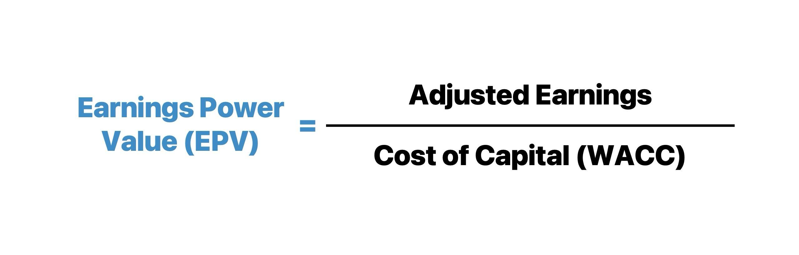

## Table of Contents

## What is Earnings Power Value (EPV) and why is it important?

Earnings Power Value (EPV) is a way to figure out how much a company is worth by looking at how much money it makes right now. Instead of guessing about the future, EPV focuses on the company's current earnings. To find the EPV, you take the company's current earnings and divide them by what's called the "cost of capital." This cost of capital is like the interest rate the company has to pay to get money to run its business.

EPV is important because it gives investors a clear picture of a company's value based on what it is doing today, not what it might do in the future. This can be really helpful for investors who want to know if a company is a good buy right now. By using EPV, investors can compare different companies and see which ones are making good use of their money and which ones might be overvalued. This makes EPV a useful tool for making smart investment choices.

## How do you calculate the Earnings Power Value of a company?

To calculate the Earnings Power Value (EPV) of a company, you start with the company's current earnings. These are the profits the company is making right now. You then need to know the company's cost of capital, which is the rate of return the company needs to pay to its investors for using their money. Once you have these two numbers, you divide the current earnings by the cost of capital. The formula looks like this: EPV = Current Earnings / Cost of Capital. This gives you the value of the company based on its current earning power.

EPV is useful because it helps investors see what a company is worth today, without guessing about the future. If a company's EPV is higher than its current market price, it might be a good investment because it's undervalued. On the other hand, if the EPV is lower than the market price, the company might be overvalued. By using EPV, investors can make better decisions about where to put their money, focusing on companies that are making good use of their resources right now.

## What are the key components needed to perform an EPV calculation?

To figure out a company's Earnings Power Value (EPV), you need to know two main things: the company's current earnings and its cost of capital. The current earnings are how much profit the company is making right now. This is usually found in the company's financial statements. The cost of capital is the rate of return the company needs to pay to its investors for using their money. This can be a bit trickier to find, but it's often estimated using the company's debt and equity costs.

Once you have these two pieces of information, you can calculate the EPV by dividing the current earnings by the cost of capital. This simple calculation gives you an idea of how much the company is worth based on its current performance. EPV is helpful because it focuses on what the company is doing right now, instead of trying to predict the future. This can make it easier for investors to decide if a company is a good buy at its current price.

## Can you explain the formula used in EPV calculations?

The formula for calculating Earnings Power Value (EPV) is pretty straightforward. You take the company's current earnings and divide them by the cost of capital. Current earnings are the profits the company is making right now. The cost of capital is the rate of return the company needs to pay to its investors for using their money. So, the formula looks like this: EPV = Current Earnings / Cost of Capital. This gives you the value of the company based on how much money it's making today.

Using this formula helps investors understand if a company is a good buy right now. If the EPV is higher than the company's current market price, it might be undervalued, meaning it could be a good investment. On the other hand, if the EPV is lower than the market price, the company might be overvalued. By focusing on the current earnings instead of guessing about the future, EPV gives a clear picture of a company's worth today, making it easier for investors to make smart choices.

## How does EPV differ from other valuation methods like DCF or P/E ratios?

Earnings Power Value (EPV) is different from other valuation methods like Discounted Cash Flow (DCF) and Price-to-Earnings (P/E) ratios because it focuses on the company's current earnings instead of future projections or comparisons with other companies. EPV calculates a company's value by dividing its current earnings by its cost of capital. This means EPV gives you a snapshot of the company's worth based on what it's doing right now, without trying to guess what might happen in the future. This makes EPV simpler and more straightforward for investors who want to know if a company is a good buy at its current price.

On the other hand, DCF and P/E ratios look at different things. DCF tries to predict the future by estimating how much money a company will make over time and then figuring out what those future earnings are worth today. This can be useful but also tricky because it relies on a lot of guesses about the future. P/E ratios compare a company's stock price to its earnings per share, which helps investors see how a company's price stacks up against its profits and against other companies. While DCF and P/E ratios are great for understanding a company's potential and how it compares to others, EPV gives a clear picture of a company's current value, making it a valuable tool for certain investment decisions.

## What are the assumptions made when calculating EPV?

When calculating Earnings Power Value (EPV), one key assumption is that the company's current earnings will stay the same forever. This means we don't guess about the future; we just focus on what the company is making right now. Another assumption is that the cost of capital, which is the rate the company pays to use money from investors, stays the same too. This makes the calculation simpler because we don't have to worry about changes in interest rates or other costs.

These assumptions can make EPV a bit different from other ways to value a company. For example, methods like Discounted Cash Flow (DCF) try to predict how earnings might grow or shrink in the future, which can be tricky. EPV, on the other hand, is easier to figure out because it only looks at today's numbers. But it's important to remember that in real life, a company's earnings and cost of capital can change, so EPV gives us a snapshot of value at a specific moment, not a long-term prediction.

## How can EPV be used to assess the intrinsic value of a company?

Earnings Power Value (EPV) is a way to figure out how much a company is really worth by looking at its current earnings. To find the EPV, you take the company's current earnings and divide them by the cost of capital. This gives you an idea of the company's value right now, without trying to guess about the future. If the EPV is higher than the company's current stock price, it might mean the company is a good buy because it's undervalued. On the other hand, if the EPV is lower than the stock price, the company might be overvalued.

EPV is useful because it focuses on what the company is doing today, not what it might do later. This can be helpful for investors who want to make decisions based on solid numbers instead of predictions. By using EPV, investors can compare different companies and see which ones are making good use of their money right now. This makes EPV a simple and clear tool for figuring out a company's true value based on its current performance.

## What are the limitations and potential pitfalls of using EPV for valuation?

Using Earnings Power Value (EPV) to figure out how much a company is worth has some limitations. One big one is that EPV assumes the company's current earnings will stay the same forever. In real life, a company's earnings can go up or down because of things like new competition, changes in the economy, or new products. This means EPV might not be very accurate if the company's future is going to be different from its present. Also, EPV assumes the cost of capital, which is the rate the company pays to use money from investors, stays the same. But this can change too, making the EPV calculation less reliable over time.

Another potential pitfall is that EPV doesn't take into account growth. Some companies might be worth more because they're expected to grow a lot in the future. EPV ignores this, so it might undervalue companies that have big growth potential. Also, EPV is a simple method that only looks at current earnings and cost of capital, so it might miss other important things like the company's debts, assets, or how it's managed. These things can affect a company's real value, so relying only on EPV could lead to mistakes in deciding if a company is a good investment.

## How does the choice of cost of capital affect EPV calculations?

The cost of capital is really important when you're figuring out a company's Earnings Power Value (EPV). It's the rate the company has to pay to use money from investors. If the cost of capital is high, it means the company has to pay more to get money, so the EPV will be lower. On the other hand, if the cost of capital is low, the company pays less to use money, and the EPV will be higher. So, choosing the right cost of capital is key because it can make a big difference in how much you think the company is worth.

Picking the cost of capital can be tricky because it's not always easy to know what the right number should be. It can change based on things like interest rates, how risky the company is, and what's going on in the economy. If you use a cost of capital that's too high or too low, your EPV calculation might not be very accurate. This means you could end up thinking a company is worth more or less than it really is, which can lead to bad investment decisions. So, it's important to be careful and use the best information you can when choosing the cost of capital for EPV calculations.

## Can you provide a real-world example of EPV calculation for a well-known company?

Let's look at a simple example of calculating the Earnings Power Value (EPV) for Coca-Cola. First, we need to know Coca-Cola's current earnings. In 2022, Coca-Cola reported earnings of about $9.5 billion. Next, we need to find out their cost of capital. For Coca-Cola, let's say the cost of capital is around 7%. This is a bit of a guess, but it's a common number used for big, stable companies like Coca-Cola. Now, we can use the EPV formula: EPV = Current Earnings / Cost of Capital. So, for Coca-Cola, that would be $9.5 billion divided by 7%, which comes out to about $135.7 billion.

Using EPV, we can see that Coca-Cola's value based on its current earnings and a 7% cost of capital is around $135.7 billion. If Coca-Cola's market value is lower than this number, it might be a good buy because it could be undervalued. On the other hand, if the market value is higher, it might be overvalued. This simple calculation helps investors get a quick idea of whether Coca-Cola is a good investment right now, based on what it's earning today. Keep in mind, though, that EPV doesn't look at future growth or other factors, so it's just one tool among many that investors might use.

## How can adjustments be made to the EPV model to account for industry-specific factors?

To make the Earnings Power Value (EPV) model fit better with what's going on in a specific industry, you can adjust the current earnings and the cost of capital to reflect things that are special about that industry. For example, if you're looking at a tech company, you might need to think about how fast the industry is growing or changing. You could add to the current earnings to account for expected growth or take away some if the industry is facing challenges. The cost of capital might also be different in tech because it's often seen as riskier, so you might use a higher rate to reflect that.

Another way to adjust EPV for industry-specific factors is by considering how different industries handle their money. For instance, in industries like utilities, which need a lot of big investments in things like power plants, the cost of capital might be lower because these companies are seen as more stable. You could use a lower cost of capital in the EPV formula for a utility company. By making these kinds of adjustments, you can get a better idea of a company's value that takes into account the unique things about its industry, making the EPV calculation more useful for investors.

## What advanced techniques can be applied to refine EPV calculations for more accurate valuations?

To make Earnings Power Value (EPV) calculations more accurate, you can use something called "normalized earnings." This means looking at a company's earnings over several years instead of just one year. By doing this, you can smooth out any unusual ups or downs in the company's profits. For example, if a company had a really good year because of a one-time event, you wouldn't want to use that year's earnings alone because it might make the company look more valuable than it really is. By averaging earnings over time, you get a better idea of what the company usually earns, which can make your EPV calculation more reliable.

Another way to refine EPV calculations is by adjusting the cost of capital to better fit the company's situation. This can be done by breaking down the cost of capital into its parts, like the cost of debt and the cost of equity, and then adjusting these parts based on how risky the company is or what's going on in the economy. For example, if interest rates are going up, the cost of debt might be higher, so you'd use a higher cost of capital in your EPV formula. By making these adjustments, you can get a more accurate picture of what the company is really worth based on its current earnings and the real cost of using money.

## What is Understanding Earnings Power Value (EPV)?

Earnings Power Value (EPV) is a [fundamental analysis](/wiki/fundamental-analysis) tool employed to assess a company's intrinsic value derived from its current earnings capability. Unlike valuation methods that incorporate future growth projections, EPV provides a snapshot of the present operational efficiency and profitability, assuming steady-state operations without significant growth or decline. This method is rooted in the notion that a company's earnings power is a reliable indicator of its value, particularly in stable and mature markets.

The formula for calculating EPV involves dividing the adjusted earnings by the company's Weighted Average Cost of Capital (WACC). Mathematically, it is expressed as:

$$
\text{EPV} = \frac{\text{Adjusted Earnings}}{\text{WACC}}
$$

To determine adjusted earnings, typically, the operating earnings or Earnings Before Interest and Taxes (EBIT) are considered. These earnings are then adjusted for any one-time, non-recurring items that might distort the company's ongoing [earning](/wiki/earning-announcement) potential. Such adjustments ensure that only sustainable, repeatable earnings form the basis for the EPV calculation.

The WACC represents the average rate of return a company is expected to pay its security holders to finance its assets. It serves to discount the adjusted earnings, thus ensuring the EPV reflects the risk associated with the company's specific capital structure. The lower the WACC, considering consistent earnings, the higher the EPV, indicating stronger intrinsic value.

This method emphasizes the current earning ability of a company without considering future growth projections or industry developments, thus providing a conservative estimate of value. EPV assumes zero growth, aligning closely with financial principles that prioritize stability and risk-aversion, making it particularly appealing in environments where earnings predictability is high and growth speculation is minimized.

## How do you calculate EPV: What is the formula and what are the steps?

To calculate Earnings Power Value (EPV) effectively, begin with the company's operating earnings, commonly represented as Earnings Before Interest and Taxes (EBIT). The first step involves adjusting the EBIT for any one-time charges, which ensures that the earnings accurately reflect the ongoing operational performance of the business.

Next, normalize the EBIT over a complete business cycle. This step accounts for the variability in earnings due to economic fluctuations, providing a stable earnings measure. Adjust this normalized EBIT for the average tax rate to reflect the company's after-tax operating earnings. It's essential to also account for excess depreciation, which adjusts the earnings to exclude any depreciation charges that surpass the standard required for maintaining the company's operational capacity. This can be expressed mathematically as:

$$
\text{Normalized EBIT} = \left(\frac{\text{EBIT (over cycle)}}{\text{Average Tax Rate}}\right) + \text{Excess Depreciation}
$$

Following this, add back any excess net assets which exceed the operational needs of the business. Excess net assets might include cash reserves or any other assets that do not contribute directly to the core operations but are available to the company. After accounting for these, subtract any liabilities to determine the EPV equity. The calculation for EPV equity can be formulated as:

$$
\text{EPV Equity} = \text{Normalized EBIT} + \text{Excess Net Assets} - \text{Liabilities}
$$

Finally, compare the EPV equity to the company's current market capitalization. If the EPV equity is higher than the market capitalization, the stock may be undervalued, indicating a potential investment opportunity. Conversely, if the EPV equity is lower, the stock could be considered overvalued.

Incorporating these steps allows for a comprehensive evaluation of a company’s intrinsic value based on its existing earnings capacity, offering investors a foundational approach to stock valuation without speculating on future growth prospects.

## References & Further Reading

[1]: ["The Intelligent Investor"](https://en.wikipedia.org/wiki/The_Intelligent_Investor) by Benjamin Graham

[2]: Damodaran, A. (2002). ["Investment Valuation: Tools and Techniques for Determining the Value of Any Asset."](https://archive.org/details/investmentvaluat0000damo_n6k9) John Wiley & Sons.

[3]: ["Security Analysis"](https://www.wallstreetmojo.com/security-analysis/) by Benjamin Graham and David Dodd

[4]: ["Valuation: Measuring and Managing the Value of Companies"](https://www.amazon.com/Valuation-Measuring-Managing-Companies-Finance/dp/1119610885) by McKinsey & Company Inc.

[5]: Damodaran, A. (2014). ["Applied Corporate Finance, 4th Edition."](https://www.amazon.com/Applied-Corporate-Finance-Aswath-Damodaran/dp/1118808932) Wiley.

[6]: Montier, J. (2009). ["Value Investing: Tools and Techniques for Intelligent Investment"](https://books.google.com/books/about/Value_Investing.html?id=6TmGEAAAQBAJ) Wiley.