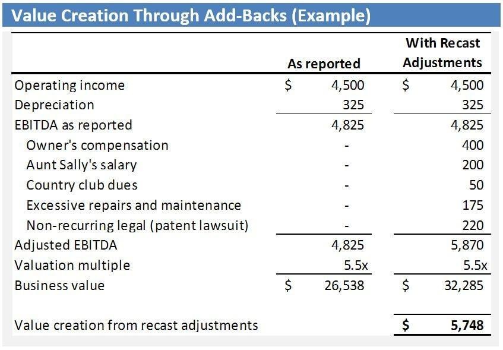

In today's dynamic financial landscape, the intersection of accounting, financial reporting, earnings recast, and algorithmic trading has become increasingly significant. These components play a critical role in shaping the dynamics of modern financial markets, influencing everything from share prices to investor confidence. Accounting provides the backbone for all financial activities, ensuring that financial data is systematically recorded and reported. Financial reporting, guided by standards like Generally Accepted Accounting Principles (GAAP) and International Financial Reporting Standards (IFRS), aims to present a fair and accurate view of a company's financial position, essential for informed decision-making by stakeholders.

Earnings recast refers to the adjustment of previously reported financial outcomes, often due to non-recurring events or changes in operations. While it can improve transparency by providing a more accurate depiction of financial health, it also has the potential to impact investor perceptions and stock valuations significantly.



Algorithmic trading represents the technological advancement of financial markets, utilizing complex algorithms to execute trades at high speeds and volumes. This form of trading enhances market efficiency by tightening bid-ask spreads and reducing transaction costs. However, it may also introduce challenges like increased market volatility and susceptibility to systemic errors.

Understanding how these elements interact is crucial for financial professionals, investors, and regulators as they navigate the complex financial ecosystem. This article explores how the confluence of these factors contributes to market efficiency and transparency. It provides insights into their benefits and challenges, offering a holistic view that is essential for informed financial decision-making. By understanding these interconnected fields, stakeholders can better anticipate and respond to the evolving demands of financial markets, ensuring sustainable market practices and fostering an environment of trust and integrity.

## Table of Contents

## Understanding Earnings Management

Earnings management refers to the deliberate alteration of financial statements by firms to present a desired image of financial performance. This practice is largely employed to meet specific financial benchmarks or to influence stakeholders' perceptions, such as investors, creditors, and analysts. Firms often engage in earnings management to smooth out earnings over time, show more consistent performance, or meet market expectations. While some earnings management techniques are within legal accounting practices, others can lead to unethical financial misrepresentation.

One common technique involves the timing of revenue recognition. Revenue recognition is governed by generally accepted accounting principles (GAAP), which provide guidelines on when and how revenue should be recognized. Firms may accelerate or delay revenue recognition to manage earnings in a specific reporting period. For instance, a company might recognize revenue prematurely to inflate earnings, thereby boosting its stock price or meeting analysts’ projections.

Accrual management is another prevalent technique, which involves altering the timing and amount of accrued expenses and income. Through discretionary accruals, companies can adjust financial statements to achieve targeted profit figures. The flexibility within accounting standards allows for management discretion in accrual estimation, which can be exploited to manipulate earnings. For example, a company might underestimate bad debt expenses or overestimate provisions for warranty claims to positively affect reported income.

Despite the legality of some techniques under specific circumstances, earnings management can border on unethical practices, which misrepresent the true economic performance of a firm. Such manipulation can result in a distorted view of the company's financial health, leading to misguided investor decisions and potential loss of market confidence. The difference between earnings management and financial fraud lies primarily in the intent and magnitude of the adjustments made. When earnings management crosses ethical lines, it can escalate into fraudulent financial reporting, carrying significant legal repercussions.

The impact of earnings management on financial reporting is profound. It undermines the reliability and comparability of financial statements, thereby affecting the decisions of stakeholders who rely on these reports for investment and credit evaluations. Regulatory bodies continuously strive to balance flexibility in accounting practices with the need to curb manipulative behaviors that can mislead stakeholders.

Overall, understanding earnings management is essential for financial professionals and regulators to maintain corporate accountability and transparency in financial reporting. This knowledge helps in distinguishing between acceptable accounting practices and manipulative financial reporting that could harm market integrity.

## Financial Reporting and Accounting Practices

Accurate financial reporting serves as the foundation of investor trust and market efficiency, providing stakeholders with a clear view of a company's financial health and performance. It is governed by established standards such as Generally Accepted Accounting Principles (GAAP) and International Financial Reporting Standards (IFRS), which aim to establish consistency and transparency across financial statements.

GAAP, primarily used in the United States, encompasses a comprehensive set of accounting rules that companies must follow when preparing their financial statements. On the other hand, IFRS is a globally recognized set of standards that facilitates comparability and understanding of financial information across international borders. The adoption of these standards is crucial as they help stakeholders make informed decisions by providing a standardized framework for financial reporting.

Financial reports are not only about compliance; they must also be verified to ensure their accuracy. Audits play a pivotal role in this verification process. Independent auditors examine an organization's financial statements and related disclosures to ascertain their truthfulness and conformity with the governing standards. An audit provides an unbiased opinion on whether the financial records are free from material misstatement, either due to fraud or error.

However, maintaining transparency while adhering to the complex and sometimes rigid accounting principles poses several challenges. These challenges include the interpretation and application of standards to unique transactions, maintaining an appropriate balance between relevance and comparability, and managing the judgment required in areas such as asset valuation and revenue recognition. For instance, differing revenue recognition policies across industries, or even within the same industry, can lead to variations in financial results that may not accurately reflect the underlying economic realities.

Additionally, the advent of new financial products and technologies continuously tests the flexibility and relevance of existing standards. Organizations must navigate these complexities without compromising the integrity of their financial statements.

Overall, financial reporting and accounting practices are indispensable to the preparation of reliable financial statements. They provide the necessary structure that underpins market confidence and facilitates efficient capital allocation. As such, both the adoption and adaptation of these practices play a critical role in ensuring that financial reporting remains a trusted source of information in a constantly evolving financial landscape.

## Earnings Recast and Its Implications

Earnings recast is a financial practice involving the revision of previously reported financial statements. Such adjustments are typically undertaken to account for non-recurring events, such as extraordinary gains or losses, which do not form part of the company's ongoing operations. Earnings recast is crucial in enhancing the representational faithfulness of financial reporting, thereby aligning reported earnings more closely with the company's actual economic performance.

Adjustments made through earnings recast often address items such as litigation settlements, asset impairments, or discontinued operations. For example, a company might exclude the financial impact of a one-time lawsuit settlement from its earnings to provide a clearer picture of its operational profitability. This recalibration of earnings helps investors and analysts obtain a more accurate view of the firm's sustainable [earning](/wiki/earning-announcement) power, leading to more informed decision-making.

Despite its utility, earnings recast can significantly impact investor perceptions and stock prices. When a company announces a recast, stakeholders might interpret it either positively or negatively depending on the nature of the adjustments and their implications for future earnings potential. A recast that sharply reduces past earnings could signal underlying issues, prompting a negative market reaction. Conversely, a recast revealing consistent underlying earnings growth might bolster investor confidence.

A critical aspect of earnings recast is its influence on financial transparency and market stability. Transparent recast practices contribute to the credibility of financial statements, fostering trust among investors. However, opacity or frequent recasting can erode trust, leading to increased market [volatility](/wiki/volatility-trading-strategies). Therefore, companies are encouraged to adhere to established accounting standards and provide comprehensive disclosures explaining the rationale behind any recast actions.

In summary, while earnings recast serves as a valuable tool for adjusting financial statements to reflect a company's genuine financial health, its implications for investor perceptions, stock prices, and market stability highlight the importance of transparency and prudent practice in its execution.

## The Role of Algo Trading in Financial Markets

Algorithmic trading uses computer algorithms to execute trading instructions at speeds and frequencies that humans cannot achieve. This technological advancement has revolutionized financial markets by enhancing market efficiency and significantly reducing transaction costs. Algorithmic trading systems can process large volumes of data, perform complex calculations, and execute trades within milliseconds, allowing investors to capitalize on market opportunities with precision and speed.

One of the primary benefits of [algorithmic trading](/wiki/algorithmic-trading) is its ability to increase market efficiency. By automating trading processes, algorithms reduce the impact of human error and emotional decision-making, often resulting in more consistent trading outcomes. Additionally, algorithmic trading facilitates market [liquidity](/wiki/liquidity-risk-premium) by enabling high-frequency trades and [arbitrage](/wiki/arbitrage) opportunities. This liquidity allows for tighter bid-ask spreads, theoretically leading to more competitive pricing and benefits for investors.

Moreover, algorithmic trading reduces transaction costs by minimizing the market impact of trades. Traders can employ strategies such as order slicing, where a large order is divided into smaller parts and executed across different times or venues, thereby reducing its visibility and price impact on the market. This can help achieve more favorable pricing and cost efficiency.

Despite these advantages, algorithmic trading introduces several risks. System errors, such as software bugs or failure of the trading infrastructure, can lead to unintended trades and significant financial losses. Market volatility can also be exacerbated by algorithmic trading, especially during periods of market stress when rapid selling or buying can amplify price swings and cause flash crashes.

Algorithmic trading has reshaped traditional trading processes by integrating sophisticated data analysis and risk management tools. For example, quantitative models assess historical data patterns to predict future price movements, which serve as inputs for trading strategies. The following is a simple Python example demonstrating a basic moving average crossover strategy:

```python
import pandas as pd

def moving_average_strategy(prices, short_window, long_window):
    signals = pd.DataFrame(index=prices.index)
    signals['price'] = prices
    signals['short_mavg'] = prices.rolling(window=short_window, min_periods=1, center=False).mean()
    signals['long_mavg'] = prices.rolling(window=long_window, min_periods=1, center=False).mean()
    signals['signal'] = 0.0
    signals['signal'][short_window:] = np.where(signals['short_mavg'][short_window:] > signals['long_mavg'][short_window:], 1.0, 0.0)   
    signals['positions'] = signals['signal'].diff()
    return signals
```

This code calculates short and long moving averages and generates buy signals when the short moving average crosses above the long moving average, and sells when it crosses below.

Algorithmic trading has become an integral part of financial markets, reshaping trading methodologies and ensuring that decision-making is increasingly driven by data and technological advancements. Understanding the dual role of benefits and risks involved is crucial for financial professionals aiming to leverage this powerful tool in modern trading strategies.

## The Interplay Between Earnings Management, Financial Reporting, and Algo Trading

Earnings reports are an indispensable component of the financial landscape, providing essential insights into a company's financial health. Algorithmic trading systems heavily rely on these reports to make informed trading decisions. These systems deploy advanced algorithms to parse financial reports, assessing metrics such as earnings per share (EPS), revenue growth, and profit margins. The intricate nature of these reports means that any sign of earnings manipulation, intentional or not, can significantly influence trading strategies.

Algorithmic trading employs techniques such as natural language processing (NLP) and [machine learning](/wiki/machine-learning) to scan and interpret large volumes of financial data swiftly. For instance, an algorithm may detect inconsistencies in revenue recognition timing or unusual fluctuations in accruals, which could hint at earnings manipulation—a practice where financial outcomes are modified to meet certain benchmarks.

A notable case study involves the examination of quarterly earnings announcements. When a company reports earnings that deviate substantially from forecasts, algorithms might interpret this as a sign of potential earnings management. Algorithms can be programmed to flag companies that consistently beat forecasts by a narrow margin—a potential sign of earnings smoothing. In these scenarios, the algorithms may trigger either buying or selling actions, depending on whether the manipulation is perceived to create an overvaluation or undervaluation of the stock.

Pseudo-code for detecting potential earnings manipulation might look like this:

```python
def detect_earnings_manipulation(financial_data):
    """Detects potential earnings manipulation based on financial metrics"""

    manipulation_signals = []

    for report in financial_data:
        eps_variation = (report['actual_eps'] - report['forecasted_eps']) / report['forecasted_eps']

        # Flag if EPS variation is consistently close to zero
        if -0.01 < eps_variation < 0.01:
            manipulation_signals.append(report['company'])

        # Additional checks can include testing revenue recognition patterns
        if report['revenue_growth_rate'] < 0 and report['profit_margin'] > 0.1:
            manipulation_signals.append(report['company'])

    return manipulation_signals
```

Understanding this interplay between earnings management, financial reporting, and algorithmic trading is crucial. While earnings management might tarnish financial transparency, well-designed algorithms can help detect such practices, thereby maintaining market integrity. However, the challenge remains in ensuring that algorithms are sophisticated enough to interpret nuanced data without triggering false alarms.

Moreover, the interaction among these elements can create opportunities for astute investors who leverage algorithmic insights to anticipate market movements. Conversely, it necessitates a cautionary approach for investors aiming to avoid potential pitfalls stemming from manipulated earnings data.

As regulatory frameworks continue to develop alongside technological advances, the task for financial professionals is to refine these systems. The ultimate goal is to enhance the synergy between accurate financial reporting and algorithmic trading, thereby promoting a fair and transparent financial market.

## Regulatory and Ethical Considerations

Regulations in earnings management and algorithmic trading serve as pivotal mechanisms to uphold market integrity. Regulatory bodies, such as the Securities and Exchange Commission (SEC) in the United States and the Financial Conduct Authority (FCA) in the United Kingdom, have established frameworks aimed at preventing fraudulent practices and ensuring transparent financial disclosures. Earnings management practices, while sometimes permissible within accounting standards, can border on manipulative if used to distort financial results. Consequently, regulators impose strict guidelines to deter such conduct, focusing on principles like the accurate representation of financial health and the disclosure of pertinent financial information.

Algorithmic trading, due to its technology-driven nature, presents unique regulatory and ethical challenges. High-frequency trading ([HFT](/wiki/high-frequency-trading-strategies)), a subset of algorithmic trading, is often scrutinized for potentially creating unfair market advantages and contributing to market volatility. Regulations aim to balance the efficiency benefits of algorithmic trading with the need to prevent market manipulation. Rules such as the European Union's Markets in Financial Instruments Directive II (MiFID II) enforce transparency and impose rigorous pre- and post-trade reporting requirements. These measures are designed to monitor and mitigate risks associated with algorithmic trading, such as the potential for triggering flash crashes and creating liquidity issues.

Ethical considerations in both earnings management and algo trading revolve around fair trading practices and transparency. Financial professionals are expected to adhere to ethical standards that promote honesty and integrity in reporting and trading activities. This involves avoiding tactics that mislead investors or obscure the true financial position of a company. The increasing complexity and speed of financial markets, driven by technological advancements, consistently challenge these ethical paradigms.

Technological progress continues to outpace existing regulatory frameworks, necessitating an adaptive approach to regulation and ethics. As new trading strategies and financial products emerge, regulators must evolve their oversight mechanisms to effectively address these innovations. This includes embracing data analytics and machine learning tools to enhance regulatory capabilities and detect irregular patterns indicative of malpractice. Ethical codes and regulations must be revisited regularly to ensure they remain relevant and effective.

In conclusion, addressing the regulatory and ethical considerations in earnings management and algorithmic trading is critical for maintaining trust and stability in financial markets. Stakeholders, including regulators, financial institutions, and investors, must collaborate to develop robust strategies that align technological advancements with the core principles of market integrity and ethical conduct.

## Conclusion

The convergence of accounting, financial reporting, earnings recast, and algorithmic trading underscores the growing complexity of financial markets. This confluence introduces both challenges and opportunities, particularly concerning transparency, efficiency, and ethical standards. As financial instruments and trading technologies become increasingly sophisticated, the pressure mounts for industry stakeholders to maintain clarity and trust in market operations.

Transparency remains a cornerstone of market integrity. Accurate accounting and reliable financial reports are essential for investors to make informed decisions. However, the dynamics of earnings management and recasts can obscure the true financial health of companies, potentially misleading stakeholders and destabilizing markets. Investors and regulators must thus remain vigilant in assessing the authenticity of financial data.

Efficiency is another critical [factor](/wiki/factor-investing) shaped by technological advancements, especially in the area of algorithmic trading. Algorithms enhance market efficiency through fast trade execution and reduced transaction costs. However, they also necessitate robust systems to handle potential errors and prevent market volatility. As algorithms become more prevalent, ensuring they operate within ethical and regulatory boundaries becomes increasingly important.

Technology's rapid evolution challenges existing regulatory frameworks, demanding adaptive oversight mechanisms. Regulatory bodies must keep pace with innovations to protect market integrity while fostering innovation. As such, there's a crucial need for dialogue between regulators, technologists, and market participants to strike a balance that protects stakeholders without stifling technological progress.

In conclusion, a comprehensive understanding of how accounting, financial reporting, earnings recast, and algorithmic trading interact is essential for navigating modern financial markets sustainably. This understanding will empower stakeholders to harness opportunities presented by new technologies while mitigating associated risks, thereby contributing to the development of robust, ethical, and transparent financial systems.

## References & Further Reading

1. **Schipper, K. (1989).** "Earnings Management." *Accounting Horizons*, 3(4), 91-102.
   - This paper examines the motivations and mechanisms behind earnings management, providing a comprehensive understanding of its impact on financial reporting. It is a seminal work that outlines key concepts and methodologies used in detecting earnings manipulations.

2. **Lev, B. (2003).** "Corporate Earnings: Facts and Fiction." *Journal of Economic Perspectives*, 17(2), 27-50.
   - An insightful exploration of the factors influencing corporate earnings, discussing both the realities and misconceptions of financial statements. It also addresses the implications of earnings recasts on investor perceptions and market stability.

3. **Dechow, P. M., Ge, W., & Schrand, C. (2010).** "Understanding Earnings Quality: A Review of the Proxies, their Determinants and their Consequences." *Journal of Accounting and Economics*, 50(2-3), 344-401.
   - This comprehensive review covers the various proxies for earnings quality, shedding light on the determinants of high-quality earnings and their economic consequences. It is a pivotal resource for understanding the nuances of financial reporting.

4. **International Financial Reporting Standards (IFRS).** "IFRS Standards for Financial Reporting."
   - The official IFRS website, providing essential resources and updates on international financial reporting standards that guide the preparation of transparent and comparable financial statements globally.

5. **U.S. Securities and Exchange Commission (SEC).** "Guide to Financial Statement Analysis."
   - A vital resource from the SEC offering guidelines on the analysis of financial statements, highlighting the importance of transparency and consistency in financial reporting under regulatory frameworks.

6. **Hendershott, T., Jones, C. M., & Menkveld, A. J. (2011).** "Does Algorithmic Trading Improve Liquidity?" *Journal of Finance*, 66(1), 1-33.
   - This paper investigates the effects of algorithmic trading on market liquidity, efficiency, and volatility, providing empirical evidence on the benefits and challenges posed by automated trading systems.

7. **Gomber, P., Arndt, B., Lutat, M., & Uhle, T. (2011).** "High-Frequency Trading." *Deutsche Börse White Paper*.
   - A comprehensive overview of high-frequency trading, discussing its technological infrastructure and implications for market operations, focusing on the associated risks and benefits of this trading practice.

8. **Cumming, D., Johan, S., & Li, D. (2011).** "Exchange Trading Rules and Stock Market Liquidity." *Journal of Financial Economics*, 99(3), 651-671.
   - Examines how different trading rules affect stock market liquidity, shedding light on the interaction between trades regulations and algorithmic trading practices.

9. **Regulating Financial Markets in the Era of Advanced Algorithms (2021).** *The World Bank Report*.
   - A critical analysis by the World Bank that discusses the evolving regulatory landscape for financial markets, emphasizing the need for updated policies to manage the complexities introduced by modern algorithmic trading.

10. **Ethics in Algorithmic Trading: Impacts and Regulation (2022).** *Financial Ethics Journal*.
    - This journal article addresses the ethical considerations in algorithmic trading, detailing the potential impacts on market fairness and exploring the regulatory approaches necessary to maintain integrity in financial markets.

These references offer valuable insights and foundational knowledge across the topics of earnings management, financial reporting, earnings recast, and algorithmic trading. They are essential for anyone seeking to develop a comprehensive understanding of these complex and interrelated financial subjects.